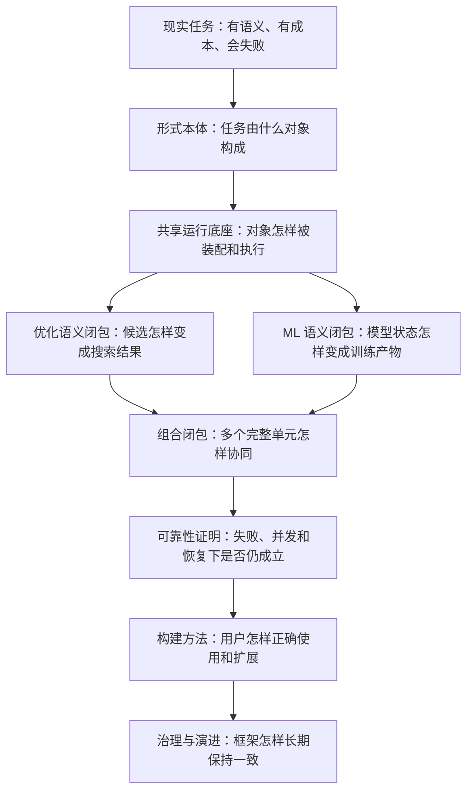
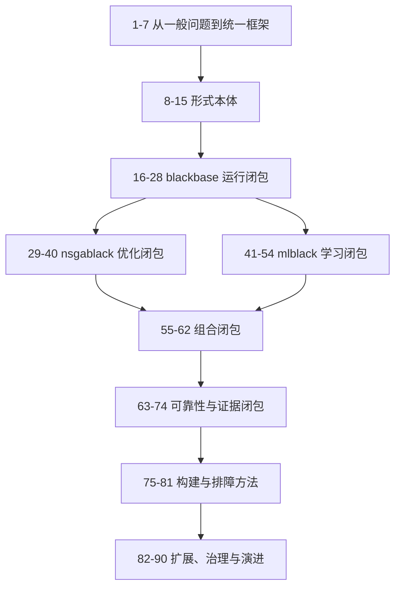

# Black Framework Stack 中文白皮书 V5：论证式总目录与写作蓝图

> 本文件不是普通目录，而是整本白皮书的论证架构。它规定为什么先讲某件事、每章必须证明什么、需要什么证据，以及该结论怎样成为下一章的前提。

## 一、全书不再围绕“一个案例”，而围绕“一个中心命题”

这本书要证明的中心命题是：

> 一个复杂计算框架的价值，不在于收集了多少算法、模型、插件或页面，而在于它能否把一个具有语义、状态、资源和失败可能性的任务，稳定地转化为可组合、可控制、可恢复、可审计的运行结果。

这个命题不能靠一个成功案例证明。单一案例只能证明“某条路径跑通过”，不能证明框架在不同问题类型、不同状态结构、不同资源约束和不同失败方式下仍然成立。因此，全书以五种闭包作为真正主线。

1. **语义闭包**：问题、状态、候选、反馈、更新和结果之间没有语义断裂。
2. **运行闭包**：声明、装配、授权、执行、提交、控制、结束和清理形成完整生命周期。
3. **状态闭包**：任一时刻都能指出权威状态、状态版本、身份关系和一致性提交点。
4. **组合闭包**：一个独立 Case 被嵌套、并行或编排后，仍然保持原来的资源、错误、状态和结果契约。
5. **证据闭包**：最终 Result 能追溯到 Manifest、Event、Snapshot、Artifact、资源授权和运行决策，并能解释失败或恢复。

算法、模型、Pipeline、Plugin、Redis、Worker、Dashboard 和 Catalog 都只能放在这五种闭包中理解。它们不是平行罗列的功能，也是不同闭包中的构件或投影。



## 二、两条纵向逻辑与一条横向逻辑

### 2.1 纵向逻辑一：概念依赖

先定义任务和运行单元，才能定义组件；先定义组件，才能定义合同；先定义合同，才能定义装配；先有装配和授权，才能讨论执行；单个执行闭合以后，才有资格讨论嵌套与并行；组合出现以后，可靠性问题才具有完整语境。

### 2.2 纵向逻辑二：运行因果

全书反复回到同一条因果链：

```text
需求建模
→ Project 声明
→ Case 装配
→ L0 授权
→ 生命周期启动
→ propose / transform / evaluate / update
→ 权威状态提交
→ controller 决策
→ Result / Artifact / Manifest
→ teardown
→ resume 或 replay
```

任何组件章节都必须回答：它在这条链上的输入是什么、输出是什么、谁拥有它、它在哪个时间点生效、失败由谁处理、证据落在哪里。

### 2.3 横向逻辑：同一不变量在不同层的实现

“身份”“时间”“资源”“预算”“错误”“取消”“证据”不是某一章讲完就消失的主题。它们会横穿 blackbase、nsgablack、mlblack 和组合层。正文第一次出现时定义抽象，进入各语义层时说明具体化方式，进入可靠性部分时集中证明边界条件。

## 三、正文证据口径

每个重要结论必须标记证据等级，防止把设计愿景写成当前能力。

- **I：不变量**。由框架职责和正式合同定义，后续实现不得违背。
- **S：源码事实**。当前源码存在对应路径，但尚不表示经过运行验证。
- **T：测试证据**。有聚焦测试覆盖具体合同。
- **R：运行证据**。由正式 Case、Project、Redis 或 Worker 实际运行得到。
- **D：设计建议**。尚未成为稳定实现，应进入缺口或路线图，不得使用“框架已经支持”的语气。

每章至少包含一种源码证据和一种反例；涉及运行能力时，还应明确需要什么测试或运行证据。文档、Catalog、README 和 Dashboard 只能作为声明或投影，不能单独作为实现证据。

## 四、案例的角色：证据矩阵，而不是故事主线

案例分为四个层级。

1. **最小反例**：十几行到几十行，专门暴露一种静默错误，例如 stale context、重复 `on_error`、错误的 TypeError 回退。
2. **机制样例**：只证明一个合同，例如 batch cardinality、ResourceContext 单调派生、Pipeline parallel merge。
3. **语义案例**：证明某种问题语义，例如生产调度证明目标—约束—repair—Pareto 的关系，ETF 证明时序 DataView—walk-forward—Artifact。
4. **综合工程案例**：证明多个闭包同时成立，例如符号正交嵌套、外部 Worker、恢复与 replay。

同一个案例可以在多章被引用，但每次只承担一个明确证据角色。正文不得为了维持故事连续性而提前引入尚未定义的概念，也不得让一个案例冒充框架全部能力。

## 五、每章统一写作结构

每章正文采用以下结构，避免再次退化成 API 清单。

1. **入口问题**：读者此时已经知道什么，又遇到了什么无法回答的问题。
2. **本章命题**：本章最终要建立的一个可判断结论。
3. **失败驱动**：如果缺少该抽象，会出现什么真实错误或架构分叉。
4. **概念推导**：从问题逐步推出抽象，而不是先展示类名。
5. **协议与时序**：给出对象、状态机、时序图、字段或接口。
6. **源码锚点**：区分权威实现、适配层、兼容 forwarder 和设计缺口。
7. **最小正确示例**：展示可执行的最小路径。
8. **反例与诊断**：展示看似可用但违反不变量的写法。
9. **验证方法**：说明单元、合同、集成或 live backend 应验证什么。
10. **出口结论**：把本章结论交给下一章使用。

---

# 卷首　为什么需要这样一套框架

## 本卷的逻辑任务

本卷不介绍任何主要类。它要先证明：问题的难点不是“缺少一个更强算法”，而是计算语义、运行语义和工程证据经常彼此脱节。只有这个判断成立，后面的抽象才不是过度设计。

### 第一章　从“得到答案”到“运行一个可信的计算过程”

- **本章命题**：复杂任务的交付物不是一个数值，而是结果及其产生条件。
- **推导顺序**：一次函数调用 → 有状态迭代 → 有成本评估 → 多阶段依赖 → 可恢复运行。
- **拟设小节**：结果正确与过程可信；算法正确、实现正确、运行正确；为什么 notebook 成功不等于工程闭合；为什么优化、训练、仿真和外部服务会共享同一运行问题；框架明确不替代的业务建模与后端能力。
- **证据安排**：一个成功但不可恢复的最小优化脚本；一个指标很好但数据血缘丢失的训练脚本；一个超时后仍写入状态的并发任务。
- **出口结论**：必须同时描述“算什么”和“怎样运行”。

### 第二章　六类复杂性怎样相互放大

- **本章命题**：真实复杂性来自语义、状态、组合、资源、失败和证据六条轴，而不是组件数量本身。
- **拟设小节**：目标与指标的语义复杂性；评估前后和更新前后的时间复杂性；Stage、Lane、外层和内层的组合复杂性；线程、设备、预算、租约的资源复杂性；部分失败、重试、取消、晚到写的失败复杂性；日志、Snapshot、Artifact、Result 不一致的证据复杂性。
- **组织方法**：每一种复杂性先给最小反例，再展示它如何与另外两种复杂性交叉，而不是分别列完即止。
- **出口结论**：框架需要一组跨领域不变量，而不是为每个场景增加私有脚本。

### 第三章　五种闭包：全书要证明什么

- **本章命题**：语义、运行、状态、组合和证据五种闭包共同构成“可用”的最低定义。
- **拟设小节**：每种闭包的输入、输出与失败判据；闭包之间的依赖关系；局部闭包与系统闭包；为什么单元测试不能独自证明组合闭包；为什么 Dashboard 只能投影证据闭包。
- **关键产物**：一张“五闭包判定清单”和一张反例映射图。
- **出口结论**：后续每一部都必须关闭一种或多种未闭合关系。

### 第四章　十条架构不变量

- **本章命题**：框架设计可以由一组能被测试和审计的不变量约束。
- **拟设小节**：语义归属唯一；全局授权唯一；权威状态唯一；Context 轻量；Case 独立闭合；组合保持局部合同；已发生成本不可抹除；取消能力必须显式；声明不等于执行；结果必须携带因果证据。
- **写法要求**：每条不变量包含正例、反例、可自动检查部分、必须靠运行证据确认的部分。
- **出口结论**：获得把一般复杂计算问题带回具体领域、再推导框架结构的判断标准。

### 第五章　从一般复杂计算回到优化与学习

- **入口问题**：前四章讨论的是复杂软件的一般问题；为什么本书接下来选择运筹优化与机器学习，而不是直接进入某个框架、算法或仓库？
- **本章命题**：运筹优化与机器学习不是因为都使用数值计算才可以统一，而是因为它们都以未知状态为对象，通过表示、评价、反馈和更新逐步形成答案；它们共享运行骨架，却拥有不同的事实来源与结果语义。
- **推导顺序**：一般复杂计算 → 有成本的迭代决策 → 运筹优化在解决什么 → 机器学习在解决什么 → 二者的共同计算语法 → 二者怎样互为内外层 → 统一性的边界。
- **概念纪律**：先用普通语言说明“待决定的状态、可观察反馈、下一步变化和最终产物”，再引入 OR、ML、目标、约束、数据、模型、反馈等词；本章不提前介绍仓库名、Project、Case、Solver、Trainer、Adapter 等实现概念。
- **案例分工**：生产调度用于说明显式决策、目标和约束；回归或分类用于说明数据、模型与泛化；超参数搜索、代理辅助优化和符号学习只用于证明两类任务能够嵌套，不承担全章故事主线。
- **关键辨析**：统一不等于把 ML 解释为普通优化的一个小分支，也不等于把 OR 解释为模型训练；共同点位于计算与运行结构，差异位于语义闭包。
- **出口结论**：已经证明 OR 与 ML 值得进入同一套框架讨论，但尚未决定这套框架如何分层。

### 第六章　统一而不混同：一套框架为什么需要两种语义

- **入口问题**：既然 OR 与 ML 共享状态—评价—反馈—更新骨架，为什么不直接合并成一种组件体系；既然它们语义不同，为什么又不各自建设完整运行时？
- **本章命题**：统一框架应共享运行闭包、状态闭包、组合闭包和证据闭包所需的机制，同时让优化与学习分别关闭自己的语义链。
- **推导顺序**：共同计算语法 → 可共享的生命周期、状态、资源与证据 → 不能共享的目标/约束/Pareto 与数据/模型/输出语义 → 一个大包的耦合 → 两套运行时的重复 → 完全中立工作流的语义空洞 → “共享 substrate + 两种语义层 + 外部执行边界”的结构回答。
- **概念引入**：只在需要描述独立运行、跨任务组合和资源发放时，逐步引入运行单元、上层协调者、标准装配形状、轻量控制信息和权威大状态；正式术语留到第一部继续定义。
- **关键反例**：共享层理解 Pareto；训练层私建全局 GPU 池；优化层读取模型内部字段；通用工作流只传裸数组；两个独立框架各自保存不兼容的快照。
- **出口结论**：得到统一框架的抽象层次，但尚未把这些层次绑定到具体仓库。

### 第七章　三仓一边界：统一框架如何落到工程

- **入口问题**：抽象上已经得到共享运行底座、优化语义、机器学习语义和外部执行边界；工程上为什么落成三个仓库，而不是继续留在一个包内？
- **本章命题**：blackbase、nsgablack、mlblack 与外部 Provider/Bridge 不是先验分类，而是前两章论证得到的四种语义所有权在工程中的权威落点。
- **推导顺序**：先说明仓库作为版本、依赖和兼容边界的意义；再分别从需要出发引出 blackbase、nsgablack 与 mlblack；最后说明外部系统、跨仓合同和迁移 forwarder。
- **blackbase 线索**：先解释为什么共同任务需要唯一的上层协调、资源授权、轻量控制信息、权威状态、并发内核与跨任务信封，再给出 Project、Case、Scaffold、ResourceContext、Context、Snapshot、Pipeline kernel 等名称。
- **nsgablack 线索**：先还原一条完整搜索因果链，再逐步引出 Problem、Representation、Solver、Adapter、Controller、Bias、Plugin 与 Pareto；每个名称都回答一个不能由其他角色代替的决定。
- **mlblack 线索**：先还原数据怎样成为模型产物，再逐步引出 DataView、UnknownState、Representation/Codec、Head、LearningProblem、Trainer、Provider 与 Artifact；同时解释哪些共享类型只负责运输，哪些含义仍归 ML。
- **外部与迁移**：数据库、仿真器、数值求解器、对象存储、设备驱动和云运行时为什么只能通过正式边界接入；权威实现、领域适配、兼容 forwarder 和历史目录怎样区分。
- **判断练习**：预算 authority、模型缓存、GPU session、symbolic grammar、outer search、Redis serializer、Catalog entry 等能力怎样按决策权拆分，而不是整体判给一个仓库。
- **证据纪律**：仓库 README 和源码只能证明当前声明与静态实现；测试和真实运行证据仍在后文逐层补充。
- **出口结论**：读者已经知道框架为何统一、为何分层以及三仓为何存在，可以进入形式本体，而不会把突然出现的类名或历史目录误当成架构起点。

---

# 第一部　形式本体：框架究竟在操作哪些对象

## 本部的入口与出口

- **入口**：已经知道 OR 与 ML 为什么可以统一讨论、统一框架为什么仍需保留两种语义，以及三仓一边界怎样承载这些责任。
- **出口**：获得一套不依赖具体算法或模型的正式词汇，足以描述一次运行。
- **证明对象**：语义闭包和状态闭包的共同语言。

### 第八章　工作尺度：Project、Stage、Case、Scaffold 与 Pipeline

- **本章命题**：这些概念不是不同大小的“文件夹”，而是具有不同闭合责任的运行尺度。
- **拟设小节**：Project 的跨 Case 授权与编排；Stage 的依赖和并行边界；Case 作为最小独立运行闭包；Scaffold 作为标准装配形状；Pipeline 作为 Case 内值流；Group/Lane 与上述尺度的关系；何时从 Pipeline 升级为 Case；Solver 与 Trainer 为什么同处 Case 层。
- **判定方法**：是否可独立构建、运行、失败、恢复、审计；是否需要独立资源与结果；是否仅是内部值变换。
- **出口结论**：得到后续合同和生命周期的承载单位。

### 第九章　角色本体：Problem、Representation、Adapter、Controller、Plugin 与 Backend

- **本章命题**：框架组件首先由“拥有哪种决策权”区分，而不是由方法名区分。
- **拟设小节**：Problem 拥有事实语义；Representation 拥有状态到领域对象的映射；Adapter 拥有策略；Solver/Trainer 拥有控制平面；Controller 拥有运行决策；Plugin 拥有横切能力；Backend/Provider 拥有外部执行能力；Artifact builder 拥有可复现产物封装。
- **反例**：Adapter 读取业务数据、repair 承担搜索、Plugin 改写 Pareto 语义、Trainer 私自分配全局 GPU、Provider 决定业务目标。
- **出口结论**：组件合同可以建立在决策权边界上。

### 第十章　合同本体：类型、能力、上下文、资源与 I/O

- **本章命题**：一个组件可运行，需要同时满足多类正交合同，单一 Python 类型注解不够。
- **拟设小节**：输入输出类型合同；Context `requires/provides/mutates/cache`；Backend capability；ResourceRequirement；Prediction/Data/Artifact I/O；生命周期合同；错误与取消合同；版本与兼容合同；注册、装配、运行三个检查时点。
- **重点辨析**：optional 与 required；缺失能力与运行失败；配置存在与能力 resolved；合同冲突和默认值掩盖。
- **出口结论**：为标准协议对象和 build-check 建立条件。

### 第十一章　状态与反馈：UnknownState、Candidate、Feedback 和 Result

- **本章命题**：状态、领域候选、评估反馈和最终结果是四个不同阶段的对象，不能用一个 ndarray 代替全部语义。
- **拟设小节**：UnknownState 的 `values + metadata`；candidate 的 decode 语义；Feedback 的 objectives、constraints、metrics、gradients、residuals；Result 的最终状态、报告和引用；值相同但 metadata 不等价；candidate identity 与 feedback identity；批量 cardinality；schema version。
- **反例**：Redis safe serializer 把未知对象退化成字符串；只比较 values 导致反馈绑定到错误模型；把运行中 population 直接当最终 Result。
- **出口结论**：状态身份和时间必须成为独立主题。

### 第十二章　身份、时间与版本：同一个“值”为什么不是同一个状态

- **本章命题**：框架中的正确性不仅取决于值，还取决于对象身份、逻辑时间、版本和 lineage。
- **拟设小节**：run/case/stage/generation/step/candidate/task identity；proposed、evaluated、updated、selected、committed 的时间点；fingerprint 与 equivalent；逻辑版本和存储版本；父子 lineage；缓存键；随机种子派生；stale handle 的形成。
- **关键时序**：propose 前 Context、evaluate 后 Context、adapter update 后权威状态、snapshot commit 后可见状态。
- **出口结论**：可以准确区分 Context、Snapshot、Artifact、Event 和 Manifest。

### 第十三章　五类信息载体：Context、Snapshot、Artifact、Event 与 Manifest

- **本章命题**：五类载体分别回答“现在需要什么”“当前状态是什么”“长期产物是什么”“发生过什么”“整次运行怎样结束”。
- **拟设小节**：生命周期、写频率、所有权、可变性和序列化；Context 轻量与规范 key；Snapshot envelope/record/handle；ArtifactRef/DataRef；Event 的不可变事实；Manifest 的 Project/Stage/Case 状态；Result 与五类载体的引用关系；大对象治理；通用 payload envelope。
- **对象归类练习**：种群、Pareto front、模型对象、DataView、history、trace、配置、错误、资源 grant、报告分别放在哪里。
- **出口结论**：为一致性提交、恢复和证据闭包建立材料。

### 第十四章　控制对象：资源、预算、截止时间、取消与错误

- **本章命题**：这些不是散落的配置字段，而是沿父子运行传播、具有所有权和状态机的控制对象。
- **拟设小节**：ResourceRequirement/Grant/Resolved；evaluation/cost/time/token budget；deadline 与 timeout；cancellation token；error phase 与 owner；retry policy；namespace 和 fence token；父子派生的单调性；审计字段。
- **重点辨析**：预算和计数器；timeout 和强制终止；异常捕获和错误所有权；资源声明和 backend 实际使用。
- **出口结论**：可以定义统一生命周期和执行边界。

### 第十五章　生命周期代数：一次运行允许发生哪些事件

- **本章命题**：Solver、Trainer、Plugin、Stage 和 Worker 虽有不同细节，但可以映射到共同的启动—执行—提交—结束—清理结构。
- **拟设小节**：setup/init/start；generation/step；evaluate hooks；update/commit；finish/result；error boundary；teardown/finally；Plugin 统一 hook；Capability 映射；生命周期事件的幂等性；直接公共 API 调用与 `run()` 的一致性。
- **关键反例**：基类 `run = fit` 的静态绑定；标准 Case 覆盖 `fit()` 却未覆盖 `run()`；公共 evaluate 绕过 `on_error`；失败路径没有 teardown。
- **出口结论**：形式本体完备，可以进入共享运行底座。

---

# 第二部　blackbase 运行闭包：声明怎样成为一次受控执行

## 本部的入口与出口

- **入口**：已有运行单位、组件角色、协议对象、控制对象和生命周期。
- **出口**：从 Project 声明到 Case Result 的共享因果链完整闭合。
- **源码主轴**：`blackbase.project`、`blackbase.resources`、`blackbase.kernel`、`blackbase.context`、`blackbase.plugin`、`blackbase.types`。

### 第十六章　声明层：Project 配置表达什么，不表达什么

- **本章命题**：Project 配置声明依赖、策略和需求，但不直接拥有运行对象或机器资源。
- **拟设小节**：CaseSpec、StageSpec、依赖 DAG；serial/parallel/external policy；failure policy；resource requests；component overrides；input/output artifacts；配置规范化与指纹；环境覆盖；声明期可检查内容与不可检查内容。
- **反例**：在配置中塞已构造 Trainer；在 Case 中私改设备；用 Catalog 名称代替真实 builder。
- **出口结论**：声明必须经过规范装配才能变成可执行对象。

### 第十七章　装配层：canonical builder 与 build-check

- **本章命题**：唯一 canonical builder 是配置语义、依赖注入和运行审计汇合的边界。
- **拟设小节**：`build_solver.py` 的规范地位；trainer alias；builder target 解析；ResourceContext 与 overrides 注入；组件 registry；Case kind 只改变默认执行语义；build 与 CLI 的差异；build-check 的证据强度；装配报告；兼容入口的期限。
- **最小证据**：纯 Solver、纯 Trainer、外层/内层 Case 各一个装配路径。
- **出口结论**：获得真实 Case 对象，但尚未取得执行权。

### 第十八章　授权层：Project L0、ResourceContext 与单调派生

- **本章命题**：资源不是由组件“发现后自行使用”，而是由 Project L0 授权并由 Case 消费。
- **拟设小节**：requirement、offer、grant、resolved、fallback；threads/workers/device token/memory/namespace；`derive_child()` 单调收窄；独占和共享；资源不足的排队与失败；requested/granted/resolved 审计；Backend Session 同步；嵌套 Case 继承。
- **反例**：审计显示 GPU 但 Session 仍是 CPU；每个并行分支私建线程池；子 Trainer 扩大父级授权。
- **出口结论**：Case 获得有边界的执行能力。

### 第十九章　Project DAG：Stage、依赖、跳过与失败传播

- **本章命题**：Project 编排的对象是完整 Case 的依赖和资源关系，而不是任意函数调用顺序。
- **拟设小节**：DAG 合法性；Stage 内独立性；serial/parallel/external；artifact dependency；fail-fast/continue；skipped/cancelled/failed 状态；fanout 和波次；resume 对已完成 Case 的处理；源码/配置指纹变化；父子 Manifest。
- **出口结论**：形成 Case 启动顺序和每个 Case 的输入边界。

### 第二十章　Case execution boundary：加载、调用、标准化与清理

- **本章命题**：Case execution boundary 负责把任意合法 Solver/Trainer 约束成一致的生命周期和结果语义。
- **拟设小节**：模块加载与 import context；builder invocation；setup/init；`run()`/`fit()` 选择；参数注入；结果标准化；错误 phase；Plugin finish/error；teardown in finally；effective runtime report；嵌套调用与独立运行的一致性。
- **反例**：子 Case `run()` 空转；子阶段成功但父 Result 为空；构建失败未进入 Manifest。
- **出口结论**：单个 Case 可以被可靠地执行，但内部值流仍需统一内核。

### 第二十一章　Pipeline Slot Kernel：Case 内的值流语言

- **本章命题**：Pipeline 是共享的值流与分支编排内核，不等同于优化 Representation，也不等同于 ML 特征流水线。
- **拟设小节**：PipelineSpec/SlotSpec；operator registry；slot-method mapping；serial 值传递；router 条件；parallel branch；merge policy；自定义 merge；Context projection；operator 签名绑定；branch report；nsgablack/mlblack 适配。
- **重点反例**：捕获函数体 TypeError 后重复执行算子；parallel 声明 merge 但未合并；分支共享可变 ndarray/context；无视 ResourceContext 的默认线程池。
- **出口结论**：内部组合获得统一执行语义。

### 第二十二章　共享预算 Authority：从 reservation 到真实消耗

- **本章命题**：硬预算必须记录已授权、已发起、已完成和可退还额度，不能只在整批成功后增加计数。
- **拟设小节**：预算种类；Project authority 与 Case view；reserve/start/complete/fail/release 状态机；批量 reservation；部分失败；并发防超卖；内层 Case 共享预算；Controller 读取；consumed/successful/failed 报告；付费 Provider 与训练 step 的推广。
- **核心反例**：预留三个评估，前两个已调用 Provider，第三个异常后退还全部额度。
- **出口结论**：任务可以在严格成本边界内进入并行执行。

### 第二十三章　Pool 与 Lease：并发不是线程数量，而是执行权

- **本章命题**：并发执行必须绑定经过授权的 Pool 和有生命周期的 Lease。
- **拟设小节**：PoolScheduler；线程、进程、设备和外部 Worker；lease acquire/renew/release/expire；heartbeat；fence token；嵌套并行与 oversubscription；device token 独占；公平性和波次；泄漏诊断；late holder。
- **出口结论**：获得可追踪的执行主体，为 Transport 奠定基础。

### 第二十四章　Task Transport：跨进程和外部 Worker 的任务语义

- **本章命题**：远程执行传递的是有身份、期限、幂等和结果合同的 TaskEnvelope，而不是序列化一个闭包就结束。
- **拟设小节**：TaskEnvelope/TaskResult/WorkerDescriptor；publish/claim/ack/nack；visibility timeout；task lease 与 resource lease；idempotency key；retry/dead letter；deadline/cancel；late result fence；namespace；SQLite/Redis 适用范围；标准 Case loader；Worker 恢复。
- **出口结论**：共享运行时可以跨越进程边界，同时保留 Case 合同。

### 第二十五章　共享 Plugin 生命周期：横切能力怎样进入运行链

- **本章命题**：Plugin 通过稳定事件点增强能力，而不取得 Problem、Adapter 或 Project 的语义所有权。
- **拟设小节**：PluginBase/Manager；优先级和 strict/soft；统一 hooks；`on_context_build` 链式变换；evaluate hooks 与 evaluation provider；checkpoint/trace/report；side effect 幂等；Plugin state；error observer 与 recovery owner；CapabilityPluginAdapter。
- **出口结论**：可观测、持久化和评估增强能够复用同一生命周期。

### 第二十六章　一致性提交：Context、Snapshot、Artifact 和 Event 怎样协同

- **本章命题**：运行中的一次“提交”必须同时确定权威状态版本、轻量引用、事件记录和可见范围。
- **拟设小节**：commit boundary；Snapshot write 与 handle；Context ref 更新；Event append；Artifact 何时生成；原子性与补偿；generic payload envelope；schema/version；namespace fence；失败在各阶段的可见性；恢复读取优先级。
- **反例**：只在第一次写 snapshot ref；update 后仍保存评估前状态；通用 snapshot 多包一层；超时分支持旧 handle 晚到写入。
- **出口结论**：状态闭包拥有共享运行时实现。

### 第二十七章　Manifest 与 Result：一次运行怎样正式结束

- **本章命题**：Result 表达语义结果，Manifest 表达运行事实；二者相互引用但不可互相替代。
- **拟设小节**：Project/Stage/Case 状态机；effective components/resources；source/config fingerprints；Artifact registry；错误、跳过、降级、取消；Result 标准化；run summary；check/build-check/run 的证据强度；teardown 结果；resume-from 判定。
- **出口结论**：完成从声明到受控结果的共享运行闭包。

### 第二十八章　共享运行全链路：用一次因果追踪检查闭包

- **本章命题**：只有把前十二章放在同一次运行中，才能发现局部接口正确但全链路断裂的问题。
- **展开顺序**：加载 Project → 规范 Stage → 授权 L0 → 装配 Case → 启动生命周期 → Pipeline/评估 → 预算提交 → Snapshot → Controller → Result → Manifest → teardown。
- **证据形式**：一张完整时序图、一份最小 Manifest、一组关键 Event、一条恢复路径和十个可注入故障点。
- **出口结论**：共享底座已闭合，接下来只需分别填入优化和 ML 的领域语义。

---

# 第三部　nsgablack 语义闭包：未知候选怎样成为可信的优化结果

## 本部的入口与出口

- **入口**：blackbase 已经提供 Case、生命周期、状态、资源和执行合同，但尚不知道什么是优化问题。
- **出口**：一次完整的优化代从 Problem 定义到 Adapter 权威状态提交全部闭合。
- **核心因果**：`Problem → Representation → Solver → Adapter.propose → evaluate → Adapter.update → authoritative population → snapshot → control`。

### 第二十九章　Optimization Problem：先定义决策事实，再选择算法

- **本章命题**：优化问题由决策空间、目标和约束定义，不由 Adapter 名称定义。
- **拟设小节**：连续、整数、二元、排列、图与混合变量；目标数量和方向；硬约束、软约束、penalty objective；feasibility 与 violation；bounds/dimension；确定性与随机性；动态问题；尺度和归一化；无标签运筹与监督学习的区别；Problem 的性质测试。
- **案例证据**：生产调度用于多目标约束，TSP 用于排列空间，投资组合用于风险权衡，仿真优化用于外部昂贵评估。
- **出口结论**：得到不依赖算法的优化事实，Representation 才能决定候选怎样表达。

### 第三十章　Representation：搜索状态怎样获得领域含义

- **本章命题**：Representation 是候选进入和离开搜索空间的唯一语义边界。
- **拟设小节**：init/mutate/repair/encode/decode；shape/dtype/cardinality；连续、离散、排列、图、矩阵、条件结构；批量操作；随机性来源；fingerprint；可序列化 metadata；Context contract；不可变/复制语义；RepresentationPipeline 与 Slot Kernel。
- **重点辨析**：repair 修复可行性，不代替业务策略；decode 产生领域对象，不计算目标；Adapter 不应绕开 Representation 私自解释向量。
- **出口结论**：Solver 可以处理统一状态，同时 Problem 获得正确领域候选。

### 第三十一章　Solver：优化运行的控制平面

- **本章命题**：Solver 决定生命周期、评估入口、状态提交和插件调度，但不决定具体搜索策略。
- **拟设小节**：SolverBase/ComposableSolver/EvolutionSolver 责任链；setup/initialize/run/finish/teardown；generation/evaluation_count/best/stop；RNG；public evaluate；Context build；Plugin dispatch；Controller boundary；Result 构造；继承和组合的选择。
- **关键时间点**：generation start、propose 前、evaluation 后、update 后、snapshot 后、generation end。
- **出口结论**：控制平面已经明确，需要把候选产生和选择交给 Adapter。

### 第三十二章　Adapter：搜索策略如何被压缩为统一合同

- **本章命题**：不同算法可以共享 `propose/update`，但必须显式暴露状态、population 和反馈需求。
- **拟设小节**：propose/update；get/set state；get/set population；runtime context projection；batch size；阶段状态；stateless、trajectory、population-based；同步与异步；Representation 协作；Problem 隔离；checkpoint；权威 population 判定。
- **比较案例**：随机搜索、NSGA-II、MOEA/D、VNS、模拟退火、DE、信赖域、A*，只比较合同差异，不在这里写算法百科。
- **出口结论**：候选可以被提出和更新，但评估必须建立可信反馈。

### 第三十三章　评估链：从候选到可交付 Feedback

- **本章命题**：评估是带验证、预算、身份、生命周期和错误边界的协议，不是简单调用 `problem(candidate)`。
- **拟设小节**：单点评估；population/batch；Problem、Provider、Plugin short-circuit 的解析顺序；candidate dimension；objectives/violations shape；N×M cardinality；`None` 未处理语义；evaluate start/end hooks；evaluation identity；顺序保持；evaluation snapshot；公开 API error boundary。
- **关键反例**：batch provider 直接返回错位矩阵；批量路径不增加 evaluation_count；provider 绕过逐候选 hooks；单点评估和外层循环重复触发 `on_error`。
- **出口结论**：每个候选都有身份对齐且经过验证的反馈，可以进入策略更新。

### 第三十四章　预算与评估计数：搜索成本怎样被真实记录

- **本章命题**：优化层只能消费共享 Budget Authority，不能用本地 `evaluation_count` 冒充全局硬预算。
- **拟设小节**：proposed、reserved、started、completed、successful、failed；批量 provider 计数；部分失败退款；并发评估；缓存命中；重试；嵌套评估；evaluation_count 与 consumed 的关系；Controller 的预算投影。
- **核心时序**：在真正调用 Problem/Provider 前记 started，在得到合法 Feedback 后记 completed/successful，异常只释放未开始额度。
- **出口结论**：优化迭代受到真实成本约束，可以讨论约束和选择语义。

### 第三十五章　约束、Repair、Penalty 与 Bias：四种作用不能混淆

- **本章命题**：Problem 描述约束事实，Repair 改变候选，Adapter 决定可行性策略，Bias 只提供软引导。
- **拟设小节**：constraint/violation；repair 前后 identity；strict feasible/allow infeasible；feasibility-first；epsilon constraint；stochastic ranking；penalty objective；algorithmic/domain/surrogate bias；动态 bias；审计；`ignore_constraint_violation_when_bias` 风险。
- **案例证据**：生产排程、图着色、数值边界、风险偏好和代理不确定性分别承担不同机制。
- **出口结论**：候选的事实、变换、选择和偏好被分离，Pareto 语义才不会被污染。

### 第三十六章　多目标与 Pareto：环境选择以后谁是权威种群

- **本章命题**：评估得到的候选集合不等于更新后的权威种群，Snapshot 必须提交 Adapter 完成环境选择后的状态。
- **拟设小节**：dominance；non-dominated sorting；crowding/reference direction/decomposition；Pareto front/archive；约束支配；NSGA-II/III、SPEA2、MOEA/D 对比；环境选择；external archive；业务决策；多目标报告。
- **核心反例**：`adapter.update()` 后仍对刚评估 candidates 写快照；第一次 handle 后后续代继续引用旧快照。
- **出口结论**：定义了优化状态提交的权威来源。

### 第三十七章　Context 的时间语义：propose 和 update 为什么不能共享旧视图

- **本章命题**：Context 是某个逻辑时间点的投影，不能跨越评估和状态更新被无条件复用。
- **拟设小节**：propose_context；evaluation_context；update_context；generation_end context；latest best；evaluation snapshot ref；Adapter projection；ContextStore 清洗；`setdefault()` 造成的 stale 值；大对象注入防护。
- **核心反例**：评估前 count=90，本批完成20次后 StrategyChain 仍读90，导致阶段晚一代切换。
- **出口结论**：Adapter.update 和 Controller 可以读取当前事实，而不是过期投影。

### 第三十八章　Controller：把运行事实转化为停止、切换和治理动作

- **本章命题**：Controller 是控制决策器，必须从最新 Context 收集信号，并把 resolved action 显式映射到 Solver 行为。
- **拟设小节**：collect/resolve；budget/stopping/strategy/resources 域；BudgetController；PatienceController；信号优先级；冲突解决；`request_stop()`；策略切换；checkpoint；audit；Controller 未进入 run loop 的静默失效。
- **反例**：helper 只调用不存在的 `apply_slot/run_slot`；读取 `total_evaluations` 而 Context 提供 `evaluation_count`；`budget: {stop:1}` 未映射 stopping。
- **出口结论**：优化运行可以根据真实状态及时改变自身行为。

### 第三十九章　多策略、异步与嵌套 Solver

- **本章命题**：搜索组合只有在候选身份、反馈路由、共享预算和权威状态规则明确时才成立。
- **拟设小节**：StrategyChain；phase schedule；router；多 Adapter propose；role-based/multi-agent；async event-driven；inner solver evaluator；NestedSolver；共享 Budget Authority；population merge；错误和取消传播；何时拆成 Project Case。
- **出口结论**：nsgablack 不只容纳单一算法，也能保持复杂搜索结构的语义闭包。

### 第四十章　一代优化的完整证明

- **本章命题**：一代运行应能逐项证明候选、反馈、成本、权威状态、控制动作和证据全部对齐。
- **完整时序**：generation start → build propose_context → adapter.propose → representation/repair → reserve/start evaluate → validate Feedback → rebuild update_context → adapter.update → resolve authoritative population → commit snapshot/ref/event → controller resolve/apply → plugin generation end。
- **验证矩阵**：单点、批量、provider 短路、parallel、部分失败、budget stop、snapshot restore、public evaluate、Adapter 环境选择。
- **出口结论**：优化语义闭包完成，下面用同样方法建立 ML 语义闭包。

---

# 第四部　mlblack 语义闭包：模型状态怎样成为可复现的学习产物

## 本部的入口与出口

- **入口**：共享运行时已经闭合，但 ML 的数据、模型、输出和训练反馈尚未定义。
- **出口**：一次 Trainer step 和完整 fit 都能产出身份对齐、资源真实、可恢复且可复现的模型 Artifact。
- **核心因果**：`DataView → Data Pipeline → UnknownState/Representation/Codec → Head → LearningProblem → Feedback → nsgablack AlgorithmAdapter → authoritative state → TrainerResult/Artifact`。

### 第四十一章　DataView 与 Spec：先固定数据语义，再讨论模型

- **本章命题**：ML 任务的稳定输入不是任意 DataFrame，而是带 schema、split、角色和 lineage 的 DataView。
- **拟设小节**：numeric/sequence/time-series/image/graph/contrastive；feature/target/metadata；supervised/unsupervised；train/valid/test；walk-forward；缺失值/dtype；DataRef；数据 lineage；DataView 怎样进入 Problem 而不进入 Adapter。
- **案例证据**：线性回归、ETF 时序、图学习、对比学习、无监督降维分别说明不同数据语义。
- **出口结论**：数据边界稳定，Pipeline 才能安全变换。

### 第四十二章　Data Pipeline：变换状态、泄漏边界与可复现性

- **本章命题**：数据变换既有值流，也有 fit state 和 split 边界，不能只看 transform 输出。
- **拟设小节**：fit/transform；train-only fit；numericizer；target codec；feature space；条件组件；model-conditioned transform；Slot Kernel；parallel feature branch；router/merge；Pipeline Artifact；数据泄漏诊断。
- **重点辨析**：Data Pipeline 与 ModelRepresentation；临时 cache 与可复现 Artifact；同 shape 不同 feature semantics。
- **出口结论**：获得稳定的模型输入和可追踪的变换状态。

### 第四十三章　UnknownState、ModelRepresentation 与 Codec

- **本章命题**：可优化的数值状态、模型结构和后端对象必须通过 Representation/Codec 显式转换。
- **拟设小节**：values/metadata；init/encode/decode/repair/mutate；ParameterLayout；线性、树、神经图、符号表达式；条件和可变长度结构；fingerprint/equivalent；safe codec；Backend capability；模型对象不直接进入 Context。
- **核心反例**：UnknownState 在 Redis safe serializer 中只保留 repr；数值相同但结构 metadata 不同却被判等。
- **出口结论**：模型状态拥有可恢复身份，Head 才能解释输出。

### 第四十四章　Head：输出数组怎样获得预测语义

- **本章命题**：输出 shape 不能独自说明点预测、区间、概率、分布、分段函数或符号表达式的含义。
- **拟设小节**：point/interval/probability/distribution/piecewise/symbolic；prediction spec；校准；置信与不确定性；多输出/多任务；条件 Head；Head 与 loss/metric；组合模型 I/O；错误的 shape-compatible 连接。
- **出口结论**：模型输出可以被 LearningProblem 按明确语义评估。

### 第四十五章　LearningProblem：训练目标、约束和报告指标

- **本章命题**：LearningProblem 消费模型、DataView 和 Context，产生 Feedback，但不决定优化步骤或全局资源。
- **拟设小节**：regression/classification/interval/time-series/symbolic；objectives/constraints/metrics/gradients/residuals；训练目标与报告指标；多目标学习；随机反馈；重复评估；数据 split；Feedback identity；Problem bridge/proxy；外部评估。
- **出口结论**：ML 反馈具有统一合同，可以交给不同 nsgablack AlgorithmAdapter。

### 第四十六章　LearningSolver：ML 语义怎样投影到唯一控制平面

- **本章命题**：ML 不再拥有第二套 Trainer 控制类；LearningSolver 把模型状态、学习反馈和 Artifact 语义投影到 nsgablack Solver 生命周期。
- **拟设小节**：LearningSolver；setup/fit/run/evaluate/teardown；step 生命周期；population/current state/best state/model/feedback；Plugin/Capability 映射；Context/Snapshot；ResourceContext；Backend Session；TrainerResult；直接 API 错误边界。
- **核心反例**：ML 私建第二套 step 循环；更新后快照仍保存旧 population；Provider 绕过 L0 自选设备。
- **出口结论**：训练词汇保留，但运行时只有一个控制平面，策略统一交给 nsgablack Adapter。

### 第四十七章　AlgorithmAdapter：梯度、黑盒与混合训练策略

- **本章命题**：梯度下降、反向传播、随机搜索和估计器搜索可以共享状态更新合同，但依赖的 Feedback capability 不同。
- **拟设小节**：nsgablack Adapter API；gradients/residuals；gradient descent；functional/torch provider；neural graph；estimator fit Problem；black-box；学习率与阶段；权威 state；checkpoint；feedback alignment；Adapter 不读取业务数据。
- **出口结论**：模型更新策略和数据/问题语义保持正交。

### 第四十八章　Provider、ComputeBackend 与 Session：声明设备不等于使用设备

- **本章命题**：Provider 是能力表面，Backend Session 是资源解析后的实际执行上下文，两者都必须服从 Project grant。
- **拟设小节**：Provider/Backend/Session 区别；numpy/torch/jax/tensorflow capability；required/preferred；requested/resolved/fallback；device token；Session 生命周期；ResourceContext setter 同步；batch；timeout/cancel；远程服务；Backend report；性能证据。
- **核心反例**：LearningSolver 构造时建立 CPU Session，之后 setter 注入 GPU ResourceContext 却未重建 Session。
- **出口结论**：声明资源与实际计算后端能够对齐。

### 第四十九章　反馈身份与权威模型状态

- **本章命题**：Feedback 只有在候选身份仍对应权威状态时才能被绑定到最终模型。
- **拟设小节**：evaluated state 与 updated state；values+metadata fingerprint；Representation.equivalent；best state；stochastic feedback；cache identity；Adapter authoritative state；snapshot after update；model decode；结果采用策略。
- **核心反例**：仅用 `np.array_equal` 比较 values，把旧 Feedback 错绑到 metadata 不同的新状态。
- **出口结论**：Trainer 可以安全生成最终模型和报告。

### 第五十章　模型组合与 I/O Contract

- **本章命题**：多个模型能够组合，不是因为张量形状碰巧匹配，而是输入输出语义和训练边界兼容。
- **拟设小节**：PredictionInputSpec/OutputSpec；主模型+残差；stacking；boosting-like；late fusion；expert/router；中间 Artifact；分阶段训练；联合与独立评估；部署边界；组合模型 lineage。
- **出口结论**：单 Trainer 内的模型组合边界明确，可以进一步讨论复合 Trainer。

### 第五十一章　CaseStageRunner：复合运行必须仍由标准 Case 构成

- **本章命题**：复合 Trainer 只有完整复用生命周期、资源继承、错误语义和结果采用规则，才满足组合闭包。
- **拟设小节**：StageSpec/CompletionPolicy；子 Case setup/init/run/finish/error/teardown；父 ResourceContext 派生；Artifact 注入；final output stage；aggregation；best state/model/feedback；失败时 finally；何时升级为多 Case Project。
- **核心反例**：用进程内私有 Trainer 阶段代替完整子 Case；子阶段成功但父级 best/result 为空；子阶段失败泄漏资源。
- **出口结论**：复合 ML 运行通过标准 Case 组合闭合，不再建立私有 Trainer 编排层。

### 第五十二章　Artifact 与 TrainerResult：模型产物怎样可复现

- **本章命题**：一个 ML 结果必须包含模型语义、状态、数据血缘、变换、后端和指标，而不只是序列化模型对象。
- **拟设小节**：ModelArtifact/TypedModelArtifact；TrainerStateArtifact；RunReport；ArtifactBundle；Spec、参数和环境；Data lineage；Snapshot 与 Artifact；save/load；schema migration；对象存储；安全加载；viewer 的投影边界。
- **出口结论**：ML 语义可以跨运行保存和被外层 Case 消费。

### 第五十三章　模型族不是特殊通道：神经、时序与符号语义的落位

- **本章命题**：新模型族应复用 DataView、Representation、Codec、Head、Problem、Trainer、Provider 和 Artifact，而不是建立私有运行栈。
- **拟设小节**：NeuralGraphRepresentation/ParameterLayout；Transformer/CNN/GNN；temporal DataView/walk-forward/head；symbolic grammar/function pool/expression codec；symbolic gradients；graph cache/path memory；搜索何时交给 nsgablack；外部 backend 何时用 Bridge。
- **出口结论**：复杂模型族仍属于统一 ML 语义闭包。

### 第五十四章　一次训练 step 和完整 fit 的证明

- **本章命题**：训练闭包必须同时证明数据、状态、反馈、资源、快照、结果和 Artifact 对齐。
- **完整时序**：DataView resolve → Pipeline fit/transform → build propose_context → Adapter propose → Representation decode → Provider/Problem evaluate → validate Feedback identity → rebuild update_context → Adapter update → resolve authoritative state → snapshot → best/result → Artifact → finish/teardown。
- **验证矩阵**：单状态、批量、gradient、provider short-circuit、safe Redis、ResourceContext 更新、CaseStageRunner、run/fit、checkpoint、Artifact round-trip。
- **出口结论**：mlblack 语义闭包完成，两个语义层可以通过标准 Case surface 组合。

---

# 第五部　组合闭包：完整运行单元怎样构成更大的系统

## 本部的入口与出口

- **入口**：共享运行、优化语义和 ML 语义分别独立闭合。
- **出口**：串行、并行、嵌套和多 Lane 组合不会破坏子 Case 的资源、状态、预算、错误和证据合同。
- **核心原则**：先证明局部完整，再讨论整体组合；组合只通过正式 surface，不穿透私有实现。

### 第五十五章　Case 作为组合单元：独立运行与被调用为何是同一件事

- **本章命题**：标准 Case 不因成为内层而失去完整生命周期，也不应为了嵌套另外发明一套私有入口。
- **拟设小节**：request/result payload；builder reuse；component overrides；ResourceContext child grant；Artifact/Snapshot refs；inner error；nested lineage；full Case 与轻量 evaluate surface；短路调用的合法条件；父子 teardown。
- **判断标准**：如果内层需要独立资源、状态、恢复或 Artifact，应执行完整 Case；纯函数且无独立运行语义时才可使用轻量 surface。
- **出口结论**：组合有了稳定边界，可讨论方向和模式。

### 第五十六章　外层优化、内层 ML：搜索怎样消费训练语义

- **本章命题**：外层 Solver 只看到结构化内层结果，不知道 Trainer/Provider 私有细节。
- **拟设小节**：超参数搜索；结构搜索；特征/Head/预算搜索；inner TrainerResult 到 objectives/violations；训练 Artifact 缓存；数据 split 公平；共享 budget；设备 grant；并行 trial；失败 trial；warm start；禁止 nsgablack import mlblack core internals。
- **案例池**：AutoML、神经结构搜索、ETF lane search、模型辅助决策优化。
- **出口结论**：优化可以把完整学习任务视为昂贵评估而不破坏 ML 闭包。

### 第五十七章　外层 ML、内层优化：学习怎样消费求解语义

- **本章命题**：ML Problem 可以通过正式 Bridge/Case 请求数值或组合优化结果，但 Trainer 不应私建 Project 和资源池。
- **拟设小节**：结构化预测中的 inner solve；决策聚焦学习；differentiable/black-box inner optimization；近似解误差；warm start；缓存；budget；梯度是否可传播；inner infeasible；结果到 Feedback 的映射；外部数值求解器边界。
- **出口结论**：组合方向不局限于“优化包住训练”。

### 第五十八章　交替、双层与循环依赖系统

- **本章命题**：交替系统不是在 DAG 中偷偷制造循环，而是把每轮循环显式化为具有收敛、预算和提交点的运行协议。
- **拟设小节**：bilevel objective；alternating train/optimize；fixed-point；外层近似与内层误差；iteration artifact；收敛 Controller；状态交换；缓存失效；resume；何时使用单 Case 内循环，何时由 Project 展开阶段。
- **出口结论**：动态组合的时间语义和停止条件明确。

### 第五十九章　多 Solver、多 Trainer 与多 Lane：协作和独立并行的区别

- **本章命题**：并行 benchmark、ensemble、cooperative search 和 multi-lane 具有不同的信息共享规则，不能共用一个“parallel=true”。
- **拟设小节**：独立 trial；共享只读 Artifact；协作候选交换；ensemble training；lane identity；fair resource grants；shared budget；consensus/selection/aggregation；禁止共享的可变状态；lane failure；最终 Result 聚合。
- **出口结论**：多执行单元组合获得明确的协作语义。

### 第六十章　跨边界继承：状态、资源、预算、身份与取消

- **本章命题**：组合闭包是否成立，取决于五类控制信息能否沿父子关系正确派生并在返回时正确汇总。
- **拟设小节**：Ref 传状态；ResourceContext 单调收窄；Budget Authority 共享而非复制；deadline/cancellation 传播；seed/namespace/run token 派生；error/retry owner；parent-child lineage；result aggregation；late child write fence。
- **关键产物**：父子 Case 协议字段表和嵌套运行时序图。
- **出口结论**：获得通用组合规则，综合案例只需实例化这些规则。

### 第六十一章　符号正交嵌套：用综合案例验证组合闭包

- **本章命题**：综合案例的任务不是引出全部概念，而是在概念已经定义后验证多个闭包能否同时成立。
- **展开顺序**：Stage 1 basis search；mlblack inner parameter fitting；orthogonality/stability/complexity/rank Feedback；basis Artifact；Stage 2 conditioned task expression；graph cache/path memory；资源与预算继承；结果 lineage；checkpoint/replay。
- **证据边界**：逐项标出哪些是源码结构、哪些有测试、哪些有正式运行、哪些仍是设计路线。
- **出口结论**：至少一种高复杂度跨框架结构可被完整解释，但它仍不代表全部使用模式。

### 第六十二章　组合反模式：为什么“能调用”不等于“可组合”

- **本章命题**：组合错误往往不会立即报错，而会表现为预算重复、状态污染、资源越权和结果失真。
- **拟设小节**：外层直接 import 内层私有类；Trainer 私建 Pool；共享 ndarray/context；复制预算计数器；嵌套后跳过 lifecycle；Artifact 传裸对象；异常被多层恢复；同一 Case 有 build/run 两套装配；示例胶水成为事实标准。
- **出口结论**：组合闭包的失效模式明确，可以进入系统可靠性证明。

---

# 第六部　可靠性与证据闭包：当失败和并发出现时，结论还可信吗

## 本部的入口与出口

- **入口**：正常路径下运行与组合都已闭合。
- **出口**：在部分失败、并发、超时、恢复、序列化和外部边界下，闭包仍有可检验的保持条件。
- **写作策略**：每章从一个静默错误开始，以状态机、边界协议和验证矩阵结束。

### 第六十三章　权威状态与一致性提交

- **本章命题**：任何可恢复系统都必须在每个提交点唯一回答“此刻的权威状态是谁”。
- **拟设小节**：Solver Adapter population；Trainer Adapter state；evaluated vs selected；best state；commit ordering；snapshot handle；Context ref；Event；Artifact；Manifest；跨存储原子性和补偿；stale read。
- **故障注入**：update 后崩溃、snapshot 成功而 Context 更新失败、Context ref 成功而 Event 失败、恢复读到前一代。
- **出口结论**：状态闭包的故障条件明确。

### 第六十四章　验证边界：错误数据最迟在哪里被拒绝

- **本章命题**：验证应发生在语义仍可识别且错误尚未污染权威状态的最近边界。
- **拟设小节**：dimension/dtype/shape/cardinality；objectives/violations；batch N×M；metadata/fingerprint；Context field governance；Snapshot envelope；Artifact schema；Task payload；Provider result；strict/soft；fail-fast 与 recoverable error。
- **验证矩阵**：构造期、装配期、评估前、评估后、提交前、反序列化后分别验证什么。
- **出口结论**：错误不会以“合法数组”的形式穿过多个层次后才暴露。

### 第六十五章　错误所有权：从抛出到恰好一次分发

- **本章命题**：底层负责添加上下文并抛出，最外层公共生命周期负责一次性分发和清理；重试与恢复必须有唯一 owner。
- **拟设小节**：error phase；cause chain；public entry boundary；dispatched marker；`run()` 与直接 evaluate；Plugin `on_error`；parallel aggregate error；retry owner；finally teardown；错误 Result；错误证据脱敏。
- **核心反例**：individual helper、population helper、run loop 对同一异常连续触发两三次 `on_error`。
- **出口结论**：错误处理不会重复副作用，也不会因直接调用公共 API 而丢失。

### 第六十六章　调用安全：参数适配不能吞掉算子内部异常

- **本章命题**：框架在适配多种调用签名时，必须先做签名绑定，不能通过捕获业务 TypeError 猜测参数数量。
- **拟设小节**：`inspect.signature().bind()`；bound method/callable object/partial；built-in callable 限制；async callable；operator side effect；异常原样传播；可观测调用记录；兼容 fallback。
- **核心反例**：接受两个参数的算子内部抛 TypeError，框架再次以一个参数和零参数执行，造成数据库或计数器重复写。
- **出口结论**：内部算子最多执行一次，真正异常不被框架掩盖。

### 第六十七章　并发隔离：共享、复制与只读语义

- **本章命题**：并行分支只有在输入、Context、RNG、状态写权限和资源额度明确隔离时才具有确定语义。
- **拟设小节**：immutable value；ndarray copy/view；read-only Context projection；受控 shared handle；branch namespace；branch RNG；PoolScheduler 注入；worker 上限；merge barrier；写权限关闭；Context copy 成本。
- **核心反例**：parallel branch 接收同一可变 value/context，并由无参数 ThreadPoolExecutor 绕过 L0。
- **出口结论**：并行结果不再依赖数据竞态。

### 第六十八章　取消、超时与晚到写：线程无法被 `future.cancel()` 杀死

- **本章命题**：取消是协作式能力合同；超时结束等待，不自动证明底层计算已经停止。
- **拟设小节**：deadline vs timeout；cancellation event；stage/operator boundary polling；queued/running/cancelled/still_running；thread/process/remote 差异；fence token；run token/namespace；late result rejection；cleanup；用户可见报告。
- **故障注入**：超时分支继续持有 SnapshotStore handle；旧 lease Worker 晚到提交；取消后 Provider 完成付费调用。
- **出口结论**：超时后的系统状态和剩余风险可被准确表达。

### 第六十九章　预算正确性：部分成功、重试和缓存下如何守住硬边界

- **本章命题**：预算正确性由真实副作用发生点决定，而非由函数最终是否返回成功决定。
- **拟设小节**：reservation ledger；start point；successful/failed/unused；batch partial failure；retry charging；cache hit；duplicate delivery；external billing；nested budget；deadline；最终 reconcile。
- **性质测试**：任意失败序列下 `consumed <= limit`；已 started 不得退款；未 started 必须可释放；父子 consumed 一致。
- **出口结论**：硬预算在异常路径下仍为硬边界。

### 第七十章　Checkpoint、Resume 与 Replay：三件不同的事

- **本章命题**：Checkpoint 保存继续运行所需状态，Resume 恢复执行位置，Replay 重建决策证据；三者不能只靠一个 pickle 文件完成。
- **拟设小节**：完整状态集合；Solver/Trainer/Adapter/Controller/Plugin/RNG；snapshot version；Manifest resume；Artifact refs；连续与恢复运行等价；decision replay vs re-execution；外部不可重放副作用；schema migration；部分 checkpoint。
- **出口结论**：恢复能力具有明确完整性条件。

### 第七十一章　确定性、随机性和实验可比性

- **本章命题**：可复现不等于每次浮点完全一致，而是随机源、数据、配置、后端和并发差异均被控制或报告。
- **拟设小节**：root seed；层级派生；branch/candidate seed；并行完成顺序；Backend nondeterminism；Provider stochasticity；多 seed 统计；cache/fingerprint；benchmark fairness；环境信息；容差与语义等价。
- **出口结论**：实验比较可以说明差异来自算法而非隐藏运行条件。

### 第七十二章　序列化、安全与外部信任边界

- **本章命题**：跨进程持久化既要保持语义可恢复，也要拒绝不可信对象执行和凭据泄漏。
- **拟设小节**：safe serializer/pickle；UnknownState/ndarray codec；schema validation；HMAC/完整性；Artifact 安全加载；Provider 身份；namespace；凭据/URL 脱敏；对象存储；数据隐私；审计保留；兼容迁移。
- **出口结论**：状态和 Artifact 可以安全越过存储与网络边界。

### 第七十三章　可观测性：日志、指标、Trace、Event、Report 和 Dashboard

- **本章命题**：可观测性首先是因果关联，其次才是页面展示。
- **拟设小节**：六类表面的职责；run/case/stage/generation/candidate/task correlation；资源/预算/Provider/branch 指标；fallback/degradation；late write；Run Inspector；Dashboard 投影；Catalog 与运行事实；最小证据包；采样和开销。
- **出口结论**：证据闭包拥有对人和机器都可读的投影。

### 第七十四章　可靠性验证矩阵：怎样证明不是“看起来能跑”

- **本章命题**：框架可靠性必须通过跨层合同和故障注入证明，而不是用 happy-path demo 代替。
- **矩阵维度**：single/batch/short-circuit；memory/Redis；serial/parallel/external；success/partial failure/timeout/cancel；fresh/resume/replay；solver/trainer/nested；CPU/device fallback；safe serializer；direct public API。
- **证据产物**：测试名称、覆盖合同、预期状态转移、允许的降级、剩余风险。
- **出口结论**：核心闭包得到工程检验，可以转向用户构建方法。

---

# 第七部　构建方法：读者怎样从需求得到正确的 Project

## 本部的入口与出口

- **入口**：读者已经理解框架的理由、对象、运行、语义、组合和可靠性。
- **出口**：读者能够判断是否需要框架、选择正确入口、构建标准 Case，并逐步增加复杂度。
- **写作原则**：这里才集中给完整操作教程；前文的例子负责证明机制，这里的例子负责帮助完成工作。

### 第七十五章　任务分类：先判断问题属于哪一种语义

- **本章命题**：入口选择由任务的未知量、反馈来源、资源边界和组合关系决定，而不是由数据文件格式决定。
- **拟设小节**：纯优化；监督学习；无监督学习；数据 profiling；预测辅助优化；结构搜索；外部仿真；多阶段 Project；嵌套任务；何时只需函数/库而不需要完整 Project。
- **关键产物**：从“我有什么数据/目标/约束/后端”出发的决策树，每个分支链接回相应原理章。
- **出口结论**：读者能选 Solver Case、Trainer Case、多个 Case 或外部 Bridge。

### 第七十六章　从空目录到最小可审计 Project

- **本章命题**：新手第一条成功路径应展示完整闭包的最小集合，而不是一次性展示全部能力。
- **拟设小节**：创建 Project；添加 Case；canonical builder；problem/pipeline/adapter/plugins/runtime；资源声明；check/build-check；正式 run；Result/Manifest；故意制造一次错误；清理和重跑。
- **交付物**：目录树、每个文件的存在理由、最小代码、命令输出解读、常见误放位置。
- **出口结论**：读者拥有一个可独立演进的基线工程。

### 第七十七章　优化 Case 方法集：按问题结构选择组合

- **组织方式**：连续黑盒、多目标、强约束、排列/图、动态问题、昂贵仿真、代理辅助、多策略、嵌套 solver。
- **每个方法单元**：任务判定 → Problem → Representation → Adapter → evaluation path → Controller → snapshot/result → 最小测试 → 扩展路线。
- **案例分工**：不强求共享业务背景；每个案例只展示最适合自己的搜索结构。
- **出口结论**：读者能从问题结构反推组件，而非从 Adapter 列表盲选。

### 第七十八章　ML Case 方法集：按数据与输出语义选择组合

- **组织方式**：回归、分类、区间/概率、时序、无监督、树模型、神经图、符号学习。
- **每个方法单元**：DataView → Data Pipeline → Representation/Codec → Head → Problem → Trainer/Adapter → Backend → Artifact → 验证。
- **案例分工**：线性回归用于最小闭环，ETF 用于时间边界，图模型用于结构状态，符号学习用于可变结构。
- **出口结论**：读者不会把“换模型”误当成全部 ML 工程。

### 第七十九章　跨框架模式库：按组合关系选择 Project DAG

- **模式集合**：超参数搜索；结构搜索；预测驱动优化；ML 调数值求解器；交替系统；两阶段符号学习；并行 benchmark；多 Lane 协同。
- **每个模式单元**：DAG；Case 边界；request/result；Artifact handoff；ResourceContext；Budget Authority；error/cancel；lineage；验证范围。
- **出口结论**：跨框架组合有可复用模板，但不存在一个万能 Case。

### 第八十章　部署阶梯：从内存单进程到 Redis 和外部 Worker

- **本章命题**：部署升级不是替换一个 backend 字符串，而是逐步引入新的持久化、并发和失败语义。
- **拟设小节**：内存单进程；文件 Snapshot；Redis Context/Snapshot；SQLite transport；Redis transport；外部 Worker；对象存储；进程隔离；凭据；监控；回滚。
- **每一级说明**：增加的能力、新增的失败模式、必须补的合同测试、何时不值得升级。
- **出口结论**：读者能根据真实需求选择最低复杂度部署。

### 第八十一章　故障排查：从症状回到闭包

- **组织方式**：不是按文件或异常类型，而是按闭包失效定位。
- **症状索引**：预算超支；阶段晚切换；snapshot stale；feedback 错绑；batch shape 错位；Redis 恢复为字符串；资源显示 GPU 实际 CPU；parallel 不确定；timeout 后污染；重复 `on_error`；子 Case 空结果；Artifact 多一层；Doctor 通过但运行失败。
- **诊断路径**：观察事实 → 确定时间点和 identity → 找权威 owner → 检查合同/资源/事件 → 最小复现 → 修复根因 → 增加回归证据。
- **出口结论**：读者能使用本书的理论反向诊断真实工程。

---

# 第八部　扩展与治理：框架怎样在增长中保持闭合

## 本部的入口与出口

- **入口**：读者已经会正确构建和诊断系统。
- **出口**：新增算法、模型、Provider、运行能力和文档时，不制造第二套隐式架构。

### 第八十二章　新增能力前的归属判定

- **本章命题**：扩展的第一步不是创建类，而是判断它改变事实、表示、策略、能力、运行底座还是外部执行。
- **拟设小节**：归属决策树；shared contract vs semantic adapter；Case 内组件 vs 新 Case；core vs integration；Provider vs Plugin；Artifact vs Snapshot；迁移 forwarder；禁止用 examples 承载新机制。
- **交付物**：设计提案模板，要求写明 owner、contract、state、resource、error、evidence 和 compatibility。

### 第八十三章　新增 Adapter、Representation、Bias 与 Plugin

- **本章命题**：四类扩展拥有不同的决策权和风险，不能套用同一个组件模板。
- **拟设小节**：Adapter 的 propose/update/state/population；Representation 的 shape/identity/serialization；Bias 的软语义和审计；Plugin 的生命周期/side effect/strictness；Context contract；checkpoint；parallel safety；最小测试矩阵；Catalog/文档。
- **写作方式**：每类都给一个错误实现和一个修正实现。

### 第八十四章　新增 DataView、Head、LearningProblem 与模型族

- **本章命题**：一个 ML 能力必须在数据、状态、输出、反馈、训练和 Artifact 六个位置完成语义闭包。
- **拟设小节**：schema；codec；Representation；Head；Problem；Adapter capability；Backend lowering；Artifact；nsgablack 搜索集成；模型族测试；兼容和迁移。
- **反例**：只添加模型类，却没有 DataView/Head/Artifact 语义。

### 第八十五章　新增 Provider、Backend 与 Bridge

- **本章命题**：外部系统接入必须定义 capability、资源、Session、失败、取消、幂等、序列化和审计，不能只包一层函数。
- **拟设小节**：ownership；request/result；resource grant；connection/session；batch；timeout/cancel；retry/idempotency；safe codec；credentials；health probe；fallback；live integration test；external evidence。
- **案例池**：数值求解器、仿真器、对象存储、远程训练、Ray/Kubernetes 只作为不同边界类型。

### 第八十六章　测试金字塔与故障注入

- **本章命题**：测试按合同和失效模式组织，而不是按模块文件数量平均分配。
- **拟设小节**：unit/property/contract/integration/live/benchmark；single/batch/short-circuit/snapshot；budget partial failure；race/late write；Redis codec；lease expiry；Worker duplicate；checkpoint/replay；resource inheritance；performance regression；证据记录。
- **交付物**：组件、Case、Project、Provider、分布式运行五套最小检查清单。

### 第八十七章　Doctor、Catalog、示例与 Dashboard 的治理位置

- **本章命题**：这些系统负责规则检查、发现、教学和投影，但不能替代运行闭包本身。
- **拟设小节**：Doctor 的结构/构建/运行证据边界；Catalog default/framework-core；entry 不等于装配；README 声明与 build-check；标准 examples；`my_project` 边界；Dashboard 数据来源；Run Inspector；文档与源码分叉处理。
- **出口结论**：次要产品面服务于主运行架构，而不反过来定义它。

### 第八十八章　API、Schema、兼容层与迁移

- **本章命题**：框架升级必须同时处理代码入口、协议数据、持久化状态、模板、Doctor、Catalog、示例和文档。
- **拟设小节**：public surface；semantic versioning；schema version；forwarder 生命周期；deprecation；migration guide；blackbase 收口顺序；跨仓 release；旧 checkpoint/artifact；双写/读取迁移；兼容证据。
- **出口结论**：演进不会长期保留多个权威实现。

### 第八十九章　性能工程：先识别成本中心，再改变执行结构

- **本章命题**：框架性能优化必须区分评估成本、调度成本、序列化成本、复制成本和后端 warmup。
- **拟设小节**：profiling；batch/vectorization；Pool 选择；Context copy；Snapshot 粒度；codec；cache identity；Backend warmup；nested fanout；backpressure；benchmark 设计；公平比较；正确性换性能的红线。
- **出口结论**：性能演进不破坏资源和状态不变量。

### 第九十章　当前能力、静态事实、运行证据与路线图

- **本章命题**：白皮书最后必须清楚区分“源码已有”“测试覆盖”“实际跑通”“仅有设计”四种状态。
- **拟设小节**：三仓能力盘点；迁移期重复实现；未验证路径；进程级取消；分布式一致性；schema registry；Artifact store；Provider 生态；安全加固；性能基线；下一阶段 closure sequence。
- **写作约束**：每项路线标明 owner、前置合同、最小闭合步骤和验收证据，不写空泛愿景。
- **最终出口**：读者既理解框架现在是什么，也知道它还不是什么。

---

# 附录体系：把正文从查询负担中释放出来

## 附录 A　术语、本体与易混概念

按运行单位、组件角色、状态载体、控制对象、结果证据、资源和分布式概念分组；每个术语包含定义、反定义、owner、生命周期和首次出现章节。

## 附录 B　三仓职责与源码锚点索引

列出 blackbase、nsgablack、mlblack 的权威实现、公共入口、适配层、兼容 forwarder 和外部 Bridge；标注源码事实与稳定 API 的区别。

## 附录 C　完整生命周期时序图集

包含 Project、Case、Solver、Trainer、Plugin、Pipeline parallel、nested Case、external Worker、timeout/cancel、checkpoint/resume 的时序图。

## 附录 D　协议 Schema 全集

Context key、ContextContract、UnknownState、Feedback、Snapshot envelope、Artifact、TaskEnvelope、TaskResult、TrainerResult、Run Manifest 的字段、版本和 JSON 示例。

## 附录 E　状态所有权与提交点索引

按逻辑时间列出权威 state、读取优先级、写入 owner、Snapshot key、Context ref、Event 和恢复行为。

## 附录 F　资源与预算状态机

ResourceRequirement/Grant/Resolved、Lease、Budget Reservation、Task Lease、deadline、cancellation、fence token 的状态转移和异常路径。

## 附录 G　错误码、异常 phase 与恢复责任

列出构建、授权、装配、评估、更新、提交、外部调用、序列化、清理阶段的错误分类、owner、retry 和 user-facing report。

## 附录 H　配置、CLI 与诊断命令参考

Project/Case CLI、check/build-check、Doctor、Catalog、Redis、Worker、恢复、故障诊断和证据导出；每条命令标注适用仓库和证据强度。

## 附录 I　案例证据矩阵

按机制而不是业务名称索引案例：证明什么闭包、依赖什么可选后端、运行入口、最小参数、预期产物、已覆盖和未覆盖的边界。

## 附录 J　测试与发布矩阵

组件、Case、Project、跨框架、Redis、external Worker、Artifact/schema migration 的测试清单，以及发布前跨仓版本兼容检查。

## 附录 K　架构决策记录

记录 canonical builder、Context 轻量、Project L0、shared kernel、cooperative cancellation、authority state、generic snapshot envelope、Case composition 等关键 ADR。

## 附录 L　反模式与故障词典

把正文中的静默失效模式按症状、根因、违反的不变量、诊断方法和回归测试统一索引。

---

# 六、全书的章间依赖骨架

正文写作必须保持以下依赖，禁止为了示例方便提前偷用未定义概念。



局部依赖还必须满足：

- 先定义 identity/time，后讨论 cache、snapshot stale 和 feedback alignment。
- 先定义 ResourceContext，后讨论 Pool、Backend Session、parallel 和 nested resources。
- 先定义 Budget Authority，后讨论评估计数、部分失败、重试和嵌套预算。
- 先完成 Adapter.update 的权威状态语义，后讨论 generation snapshot 和 checkpoint。
- 先完成 TrainerResult/Artifact，后讨论外层优化消费内层 ML。
- 先定义 Case execution boundary，后讨论内部 phase 和 nested Case 的闭包差异。
- 先定义 cooperative cancellation，后讨论 timeout 报告和 late write fence。
- 先区分源码、测试和运行证据，最后才允许撰写“当前能力”结论。

# 七、正文深度标准

“详细”不以字数衡量，而以一个结论是否被完整推导和验证衡量。每个核心章至少应具备：

1. 一个真实设计矛盾，而不是泛泛背景。
2. 一张对象关系图或时序图。
3. 一段最小正确代码。
4. 一段看似合理但错误的代码。
5. 一个源码调用链。
6. 一份状态或协议字段示例。
7. 一个可重复的验证方法。
8. 一个失败注入。
9. 一组与相邻概念的边界比较。
10. 一个明确出口结论和跨章引用。

因此最终篇幅不预设十万字上限。只要某章仍缺少机制推导、反例、代码、时序、验证或边界，它就尚未写完；如果某段只是在重复定义，即使字数很多也应该删去。

# 八、建议的正文生产顺序

正文不按“从第一章一直写到最后一章”的方式机械推进，而按“先建立判断语言，再建立读者路径，最后以读者路径反向约束内部机制”的顺序分批完成。章节编号保持最终阅读顺序，下面只描述正文生产顺序。

1. 完成第一至十四章，固定闭包、不变量、三仓边界、运行尺度、角色、合同、状态、身份、载体与控制对象。
2. 优先完成第五十五至六十二章，先把 Case 组合、双向嵌套、交替系统、多 Lane 和父子继承写成完整协议，为后面的实操章建立真正的组合对象。
3. 随后完成第七十五至八十一章，从任务分类、最小 Project、优化/ML 方法、跨框架模式、部署阶梯和故障排查建立完整用户路径。
4. 回到第十五至二十八章，补齐生命周期、共享运行底座、Project/Case 执行、资源、预算、Transport、一致性提交与 Result/Manifest。
5. 完成第二十九至四十章，以用户方法章提出的问题反向展开 nsgablack 优化语义和一次完整优化证明。
6. 完成第四十一至五十四章，展开 mlblack 数据、状态、Head、Problem、Trainer、Provider、Artifact 与一次完整训练证明。
7. 完成第六十三至七十四章，处理可靠性、取消、并发、恢复和证据闭包。
8. 完成第八十二至九十章，补齐用户心智模型、扩展开发、治理、迁移、性能与当前能力路线图。
9. 最后完成附录、全书交叉引用、Canvas、DOCX 与一致性校订。

第五十五至六十二章与第七十五至八十一章被提前写作，不表示第十五至五十四章或第六十三至七十四章降级、删除，也不改变最终阅读顺序。第五十五至六十二章先充当“组合协议规格”，第七十五至八十一章再充当“用户路径规格”；后续内部机制章必须同时回答自己怎样保持组合闭包、支撑哪一种真实任务、在哪个步骤生效，以及需要什么证据，而不是为了介绍组件而介绍组件。
