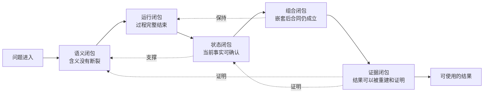
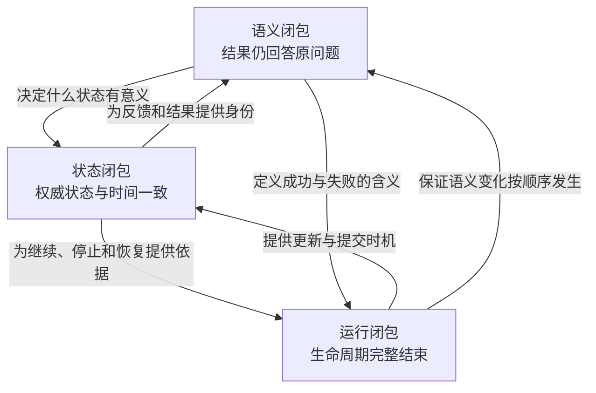
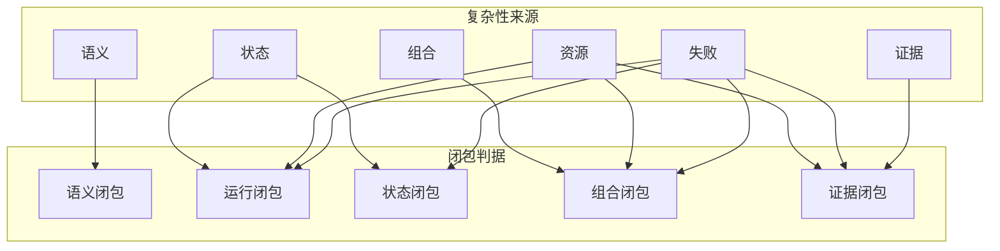
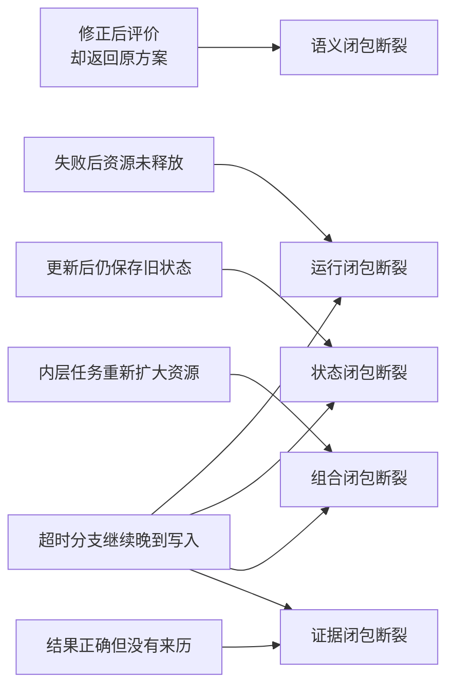

# 第三章　五种闭包：全书要证明什么

第二章把复杂性拆成了六条轴。我们已经能够指出问题来自哪里：结果含义可能变化，状态可能错位，任务组合会破坏局部假设，资源不足会改变执行路径，失败可能只完成一部分，记录下来的证据还可能与真实过程不一致。

可是，能够识别问题来源，并不等于知道问题何时算解决。

一个程序保存了状态，不代表它可以恢复；限制了线程数，不代表内层任务不会重新扩大并行；错误得到了捕获，不代表资源一定被清理；日志记录了全过程，也不代表最终结果能够追溯到正确输入。第二章提供的是一张风险地图，我们还需要一套判定标准，判断这些风险有没有在明确边界内得到处理。

本章用“闭包”描述这种完整性。这里的闭包不是某个具体类，也不要求读者把它理解成严格的数学运算。它表达的是一个工程性质：**一项任务在声明的边界内，能否把自己引入的语义、状态、运行义务、组合关系和证据关系完整地收回来。**

“收回来”意味着，输入进入以后不会在中途失去含义，已经开始的过程最终会到达可解释的结束状态，更新后的权威状态可以被指出，任务进入更大流程后仍然保留原有约束，进程结束以后结果仍能说明自己的来历。只要其中一条关系需要依赖作者记忆、全局变量或事后猜测，边界就仍然敞开。

全书要证明的不是“系统拥有很多功能”，而是五种闭包能否同时成立：语义闭包、运行闭包、状态闭包、组合闭包和证据闭包。它们不是五个仓库区域，也不是五个按顺序调用的模块，而是观察同一次计算的五种完整性标准。



这张图看起来像一条流水线，实际却包含回路。状态是否权威会反过来决定结果语义，组合会检验运行边界是否真实存在，证据则要同时证明前面四种闭包。理解这些依赖以前，需要先澄清“闭合”究竟是一种什么判断。

---

## 3.1 闭包不是“功能齐全”，而是“边界内没有悬空义务”

考虑一段看似完整的程序：

```python
def run_job(data):
    workspace = prepare_workspace()
    background = start_background_work(data)
    result = compute_result(data)
    save_result(workspace, result)
    return result
```

它有输入、有计算、有保存，也有返回值。从成功路径看，功能似乎已经齐全。但只要继续追问，就会发现很多事情悬在函数边界之外：`workspace` 何时清理？`background` 是否参与最终结果？主计算失败以后后台工作会不会继续？保存失败时返回值是否仍然有效？函数返回以后，后台工作有没有资格覆盖刚保存的结果？

这些悬空义务说明，函数结束不等于任务闭合。代码的词法边界由缩进和 `return` 决定，运行边界却由责任决定。只要函数创建的资源还没有归还、启动的工作还没有得到结论、改变的状态还没有稳定下来，或者输出仍然依赖未说明的外部条件，这项任务就在继续把义务泄漏到边界之外。

反过来，闭合也不等于把一切关在内部。一个任务完全可以调用远程服务、读取外部数据并把结果交给后续任务；关键不在于“有没有外部世界”，而在于边界是否明确表达了这些依赖。它需要什么输入，获得什么权限，可能产生什么副作用，结束时交付什么，失败时还欠下什么，都应当能够在边界上被说明。

闭合更不等于永不失败。失败可以是一个完整结论：工作已经开始，部分结果仍然有效，某些外部动作无法撤回，最后一个一致位置已经保存，剩余资源已经释放。这样的失败虽然没有领域答案，却完成了运行叙述。相反，一次返回 `success=True` 的任务，如果仍有后台分支继续写入，反而没有闭合。

因此，判断闭包时不能只问“有没有这个功能”，而要问四件连续的事：进入边界的事实有没有明确含义，边界内发生的变化有没有稳定结论，离开边界的结果能否被正确解释，边界创建的义务有没有全部转交或结束。

可以把这种判断写成一句概念表达：

```text
闭合的任务
= 明确输入
+ 有所有者的变化
+ 可判定的结束
+ 有语义的输出
+ 不依赖隐藏前提的后续使用
```

这一定义解释了为什么“测试通过”也未必足够。如果测试只覆盖返回值，它证明了某组输入在理想路径上得到预期输出，却没有证明失败时资源会释放、恢复时状态属于同一时刻，或任务被并行调用时不会互相污染。测试仍然重要，但它必须针对闭包所包含的责任，而不能把一次函数断言当成全部证明。

五种闭包正是对这些责任的进一步分解。前三种先回答单个任务能否在内部成立：语义有没有断裂，运行是否完整结束，状态能否被确认。第四种再问任务进入更大系统以后，这三种内部完整性是否仍然保持。第五种则问：当原进程和原作者都不在场时，外部观察者能否凭留下的事实重新确认前四种闭包。

这个顺序很重要。一个任务连自身都没有闭合，就没有资格讨论组合；内部已经正确，却没有证据，也不能在进程外被可靠使用。我们先从单个任务内部最基础的三种闭包开始。

---

## 3.2 一项任务怎样在内部闭合

语义闭包关心的是一条含义链有没有在中途断裂。问题定义了输入、目标和约束，运行中的状态表达当前选择，评价产生反馈，反馈推动下一次变化，最终结果又要回到原问题中被解释。如果其中任意一步使用了不同对象、不同单位或不同评价口径，程序即使顺利结束，也没有回答最初的问题。

下面的例子非常短：

```python
raw_solution = generate_solution()
feasible_solution = make_feasible(raw_solution)
score = evaluate(feasible_solution)

return {
    "solution": raw_solution,
    "score": score,
}
```

评价函数正确，修正过程也可能正确，返回的数据类型同样合法。问题在于，`score` 评价的是修正后的方案，结果却把原方案和这个分数放在一起。下游会自然理解为“原方案的得分是 score”，于是一个局部正确的流程生成了语义错误的结论。

修复它不只是把返回字段换成 `feasible_solution`。还要决定原方案是否需要保留，修正前后是否属于同一身份，约束结论针对哪一个版本，后续变化应该从哪个版本继续。语义闭包要求的不是变量名一致，而是问题、被评价对象、反馈、更新对象和最终结果之间没有偷换。

类似错误也会出现在模型训练中。评价分数来自某个中间模型，最终保存的却是随后又更新过的模型；报告说“验证集准确率”，实际使用了训练数据；损失函数按最小化解释，汇总时却按越大越好排序。这些问题都不一定造成异常，它们只是让一条含义链在某个接口处悄悄换了对象。

语义闭包仍然不足以保证任务完整。即使每个数值都绑定正确对象，运行过程也可能没有结束。运行闭包关心的是，一次任务从准备到清理是否形成完整生命周期。它通常经历这样的因果顺序：

```text
确认输入与条件
→ 准备运行环境
→ 初始化过程状态
→ 执行工作
→ 提交稳定结果
→ 判断继续或停止
→ 形成最终结论
→ 释放自己拥有的资源
```

顺序中的每一项都有开始与结束。准备了一份临时空间，就要说明何时释放；启动了后台工作，就要说明谁等待、谁取消、谁确认结束；注册了错误处理，就要保证一次错误不会被多层重复分发；对外提供多个运行入口，就要保证它们遵守同一套准备、执行、结束和清理语义。

一个常见的运行开口，是成功路径拥有完整过程，失败路径却直接跳出。例如：

```python
resource = acquire_resource()
prepare()

result = perform_work()  # 这里抛出异常时，后续不会发生

finish(result)
release_resource(resource)
return result
```

如果 `perform_work()` 失败，资源没有归还，结束事件没有产生，调用方也不知道 `prepare()` 已经造成哪些变化。把释放动作放进“无论如何都会执行”的边界，只解决了资源清理；要形成运行闭包，还需要确定错误由谁拥有、部分结果是否有效、后台工作是否仍在继续，以及最终状态应被描述为失败、取消、超时还是降级完成。

运行闭包提供了过程骨架，但骨架内部仍可能保存错误状态。于是需要把状态闭包单独提出。

考虑下面的顺序：

```python
evaluated = evaluate(current_state)
next_state = update(current_state, evaluated)

save_state(current_state)  # 保存了更新前的状态
current_state = next_state
```

评价和更新都正确，任务也可能正常结束；保存文件却比内存中的权威状态落后一步。如果最终报告来自 `next_state`，恢复文件来自 `current_state` 的旧值，那么正常运行与恢复运行会从不同事实出发。

状态闭包要求任意关键时刻都能回答三个问题：当前哪个状态有权代表过程，状态对应哪个逻辑时间，恢复这一状态还需要哪些关联信息。仅仅“保存过一些变量”不构成闭包；被保存的变量必须共同来自一个一致位置，并足以让过程继续而不依赖旧进程中已经消失的隐含记忆。

权威状态也不能由“最后写入的文件”自动决定。有些程序先生成一批临时方案，再根据反馈完成筛选；真正进入下一轮的是筛选后的状态，而不是刚刚完成评价的临时集合。另一些程序在更新后还会改变内部策略、随机源和停止计数。状态闭包要求这些共同变化在一个明确位置上被承认，而不是各自以不同节奏保存。

语义、运行和状态三种闭包因而形成一个内部三角：



缺少语义闭包，状态保存得再完整也可能属于错误问题；缺少运行闭包，语义正确的计算可能在失败后留下悬空义务；缺少状态闭包，正常路径似乎正确，却无法保证继续、恢复和最终报告使用同一事实。

当这三种闭包在单个任务内部成立，我们只能说它“局部闭合”。下一步才是真正的工程考验：把它放进另一个任务、并行执行或跨进程调用以后，这份完整性还能不能保留。

---

## 3.3 局部闭合为什么不会自动变成系统闭合

设想一项训练任务独立运行时表现良好。它读取输入，完成训练，保存最终模型，释放设备，失败后也能留下可恢复进度。现在，外层任务要用不同参数并行运行八次训练，再根据八个结果选择下一组参数。

如果每个内层任务仍然按独立运行方式取得整台机器的线程和设备，局部资源假设会在组合后冲突；如果外层超时以后只是不再等待，内层任务可能继续保存模型；如果外层只接受部分结果，内层批量记录仍可能等待全部反馈；如果外层为了统一错误处理再次调用清理，内层已经释放的资源可能被重复处理。

每个内层任务都可能通过自己的单元测试。问题发生在边界关系上，而边界关系只在组合以后存在。这就是组合闭包要回答的问题：**一个局部闭合的任务，被顺序连接、嵌套、并行或远程执行以后，是否仍然保持原来的输入、状态、资源、失败和结果含义。**

保持原来含义不代表外层不能施加影响。外层当然可以缩小资源、限制工作数量、设定截止时间，或者把内层结果转换成自己需要的形式。关键在于这些变化必须通过显式边界发生，并且内层能够知道实际生效的条件。

例如，内层提出二十项工作，外层只允许十项开始。组合闭合要求“二十项提议、十项接受、十项反馈”之间保持身份关系，内层相关记忆也要同步缩减。如果外层只截断数组，却不告诉内层哪些工作被拒绝，资源限制就会破坏状态和语义闭包。

再例如，两个并行分支读取同一个输入。如果输入按约定不可修改，两个分支可以安全共享；如果任一分支会原地改变数据，组合边界就必须提供副本或隔离写入。不能因为两个函数分别测试正确，就推断它们同时运行也正确。

错误与结束同样需要保持。内层任务已经处理并标记过的错误，外层可以补充自己的阶段信息，却不应把它当作一件新错误再次触发相同副作用。外层停止等待以后，也不能未经确认就宣布内层已经停止；它需要限制迟到结果的写入资格，并把“请求停止”与“确认停止”区分开。

因此，组合闭包不是“可以调用”，而是“调用以后仍然是同一类任务”。独立运行和嵌套运行不应拥有两套互相矛盾的准备、资源、错误和结果协议。一个组件如果只能在顶层正常工作，一旦成为内层就需要绕过正式入口、共享私有变量或自行扩大资源，它还没有形成可组合能力。

这里必须区分局部闭包与系统闭包。局部闭包以一个运行单元为范围，证明其内部语义、生命周期和状态一致；系统闭包则以完整组合为范围，证明所有单元之间的依赖、资源和失败传播也闭合。前者是后者的必要条件，却不是充分条件。

这也解释了为什么单元测试不能独自证明组合闭包。单元测试可以准确验证一个任务的输入输出、状态更新和失败清理，却通常不会构造资源竞争、共享可变输入、父子取消、部分接纳和迟到写入。组合闭包需要在真正的顺序、嵌套、并行和跨进程边界上验证；否则被测试的只是组件，未被测试的是组件之间新产生的关系。

当系统组合完成以后，所有事实仍然可能只存在于当前进程。原作者看见状态，调试器看见变量，测试也确认过输出，但进程关闭以后，另一个人未必能证明发生过什么。因此，组合闭包之后还需要最后一层：证据闭包。

---

## 3.4 为什么内部正确仍然可能无法证明

设想一项任务真正做对了所有事情。问题定义没有偷换，运行顺利完成，最终状态保存正确，内外层资源与失败关系也保持一致。程序最后只留下一个文件：

```text
best.json
```

文件里的结果也完全正确。但如果它没有说明属于哪次运行、基于哪版输入、对应哪个最终状态，也没有保留真实成本和结束结论，那么外部使用者无法区分：这是刚完成的新结果、上一次运行遗留的旧结果，还是一次失败过程中提前写出的临时结果。

内部正确是一种事实，能够在进程外证明这种事实则是另一种能力。证据闭包关心的是：最终结论能否沿稳定关系追溯到它的问题、输入、关键决策、权威状态、真实成本、失败与恢复历史，以及长期输出。它要求结果离开原进程以后仍然能够说明自己，而不是依赖作者在场解释。

证据闭包不意味着保存全部内存，也不意味着每一步都制作永久副本。不同信息有不同寿命：当前步骤需要的轻量信息可能很快过期，可恢复的大状态需要按一致位置保存，长期交付物需要稳定版本，事件记录则要保留“发生过什么”。闭包来自这些信息之间有可重建的引用关系，而不是来自把所有数据复制进一个巨大文件。

证据还必须与声明区分。配置写着最多使用四个线程，只能证明运行被这样要求；程序是否真的只使用四个线程，需要实际执行记录。源代码中存在恢复函数，只能证明实现提供了一个入口；某次状态是否足以恢复，需要往返验证。页面显示任务完成，只能证明页面读取到了某个状态；它不能单独证明后台工作已经停止，或保存进度与最终结果属于同一时刻。

因此，证据存在强度差异。设计不变量说明什么必须成立，源代码说明当前实现如何尝试满足它，测试说明某个受控条件下曾经成立，真实运行事实则说明某次具体执行发生了什么。一个诚实的系统不能用较弱证据宣称较强结论。

证据闭包也不能修复前面四种闭包。记录得非常详细，却把修正后方案的分数绑定到原方案，仍然是语义错误；完整保存每一步，但保存的是过期状态，仍然无法正确恢复；页面展示了所有并行分支，却没有限制超时分支的迟到写入，组合仍然开口。证据可以暴露这些问题，不能把错误事实变成正确事实。

反过来，没有证据闭包，前面四种闭包也难以跨时间成立。恢复需要知道哪个状态可信，组合需要知道上游结果来自哪个版本，预算需要延续已经发生的成本，审计需要分辨正常、降级和失败路径。证据并不是运行完成后的装饰，而是让一次正确过程能够被后续过程安全继承的条件。

这也是为什么一个可视化页面只能投影证据闭包，不能独自构成证据闭包。页面展示的是系统已经提供的数据；如果来源记录使用不同口径、属于不同时间，页面最多把矛盾画得更漂亮。证据闭包必须先在事实产生的边界上建立，展示层才能忠实呈现。

五种闭包至此都已经出现。接下来需要把它们放在一起，回答两个关键问题：为什么六条复杂性轴没有一一对应成六种闭包，以及某一种闭包成立，为什么不能代替其他闭包。

---

## 3.5 五种闭包怎样共同构成“可用”

第二章有六条复杂性轴，本章却只有五种闭包，这并不是遗漏。复杂性轴描述变化从哪里来，闭包描述系统需要形成什么完整性质；二者不是一对一分类。

语义复杂性主要由语义闭包处理，但也依赖状态闭包保证反馈与对象处于同一时间。状态复杂性直接要求状态闭包，同时需要运行闭包提供稳定提交位置。组合复杂性集中检验组合闭包，却会重新考验前三种内部闭包。证据复杂性最终要求证据闭包。

资源与失败之所以没有各自变成独立闭包，是因为它们横穿整个运行过程。资源从准备、执行到释放都参与运行闭包，在父子任务之间又参与组合闭包，实际消耗还必须进入证据闭包。失败同样决定运行怎样结束、状态哪些部分有效、组合关系如何传播以及证据怎样解释。把资源或失败封装成一个孤立功能，反而会失去它们跨边界的性质。



五种闭包之间也不是可替换关系。语义闭包成立，只能说明结果仍然回答原问题；它不保证资源会释放。运行闭包成立，只能说明生命周期有结论；它不保证保存的是更新后的权威状态。状态闭包成立，只能说明恢复材料一致；它不保证任务被嵌套以后不会越权。组合闭包成立，只能说明内外层合同保持；它不保证进程结束后别人可以证明这一点。证据闭包成立，则只说明事实可追溯，不能把错误语义变成正确语义。

可以用一组反例观察这种不可替代性：



最后一个反例尤其重要。超时后的晚到写入不是单一缺陷：运行没有真正结束，状态可能被旧任务覆盖，组合中的父子边界失效，最终记录也可能过期。同一个现象同时击穿四种闭包，这正是第二章所说的“复杂性相互放大”。

闭包还必须声明范围。一个函数可以在输入输出意义上闭合，一项独立任务可以在单机运行范围内闭合，整个多阶段系统却可能仍然不闭合。说“支持恢复”也必须说明恢复哪个范围：单个步骤、完整任务，还是包含上游依赖与外部副作用的整次运行。没有范围的“闭合”只是模糊赞美，不能作为工程结论。

闭包也不是一次性获得的永久属性。增加新的并行方式、外部服务或恢复路径，会扩大系统边界，原有证明未必继续成立。每次扩展都要重新检查：新增关系由谁拥有，失败如何结束，状态如何提交，证据落在哪里。所谓长期可演进，并不是以后不再需要验证，而是扩展时知道必须重新关闭哪些关系。

现在，我们可以把五种闭包整理成一张真正可使用的判定清单。它不是为了机械打勾，而是为了让每个“系统可用”的声明都能对应明确问题和证据。

---

## 3.6 怎样判定五种闭包是否成立

最有效的检查方式，仍然是选择一条最终结论，沿因果链反向追踪，而不是分别浏览五份功能说明。

假设系统交付了一份方案和一组评价值。先检查语义闭包：评价是否属于交付的那份方案，单位、方向和约束口径是否一致，修正、编码或数据处理有没有在中途换掉对象，最终结果是否仍回答最初定义的问题。这里的失败判据很直接——只要反馈与被反馈对象无法稳定对应，或者输出必须靠猜测才能解释，语义就没有闭合。

接着检查运行闭包：这次任务从哪里开始，经过哪些稳定阶段，成功、失败、超时和取消分别怎样结束，资源是否无论路径都得到处理，对外提供的不同入口是否遵守同一套生命周期。只要存在“函数已经返回，但自己启动的工作仍没有明确归属”，运行就没有闭合。

然后检查状态闭包：当前谁拥有权威状态，它对应评价前、评价后、更新后还是提交后，恢复材料是否来自同一个一致位置，随机过程、成本和内部记忆是否与主状态对齐。只要正常结果与恢复状态指向不同时间，或者只能凭文件名猜测哪个状态最新，状态就没有闭合。

再把同一任务放进顺序、嵌套、并行和远程边界中检查组合闭包。外层限制是否被内层遵守，部分接纳是否同步内层记忆，共享输入是否具有安全语义，错误和取消是否只由明确边界传播，迟到结果是否仍有写入资格。只要独立运行与组合运行需要两套互相矛盾的规则，组合就没有闭合。

最后检查证据闭包：进程关闭以后，结果能否追溯到输入、关键状态、真实成本和结束结论；设计、源码、测试与实际运行分别支持到什么强度；页面与报告是否只是投影已有事实，而不是用显示状态代替事实。只要重要结论只能由原作者凭记忆补充，证据就没有闭合。

这五组判断可以浓缩成下面的最小清单：

```text
语义闭包：结果是否仍在回答原来定义的问题？
运行闭包：所有开始的责任是否都得到明确结束或转交？
状态闭包：权威状态、逻辑时间和恢复材料是否一致？
组合闭包：任务换到嵌套、并行或远程位置后，原合同是否仍成立？
证据闭包：离开原进程以后，前四种闭包能否由事实重新确认？
```

每种闭包需要的验证方式也不同。语义闭包需要围绕对象身份、单位、方向和反馈对齐做性质与合同验证；运行闭包需要在准备、执行、提交、结束和清理的各个位置注入失败；状态闭包需要保存—恢复—继续的往返验证，并比较正常运行与恢复运行；组合闭包必须实际构造嵌套、并行、资源缩减、取消和迟到写入，单元测试无法代替；证据闭包则要跨记录核对输入版本、状态时间、成本口径和最终结论，单独查看页面同样无法证明。

这里可以看出，全书后续章节并不是在平行介绍功能。每一部分都必须回答自己关闭了哪些关系：形式化概念负责让语义和状态可表达，共享运行基础负责关闭生命周期与资源授权，优化和机器学习部分分别关闭自己的领域语义，组合部分检验局部合同能否保持，可靠性部分则在失败、恢复和并发下集中验证状态与证据。

五种闭包由此构成“可用”的最低定义。不是每项任务都必须拥有同样规模的恢复、并行和审计能力；边界可以根据场景缩小。但只要系统宣称支持某种能力，就必须在相应范围内完成闭合，不能把隐藏前提留给使用者。

本章仍然停留在 **I：不变量层面的分析**。它给出了判断目标，却还没有把目标变成能够约束设计与实现的具体规则。知道“状态应当闭合”仍然太宽泛，我们还需要回答：哪些行为绝对不能发生，哪些所有权必须唯一，哪些事实不能被后续异常抹除，哪些声明必须由运行证据支持。

这正是第四章的任务。闭包说明系统最终要达到什么性质，架构不变量则把这些性质翻译成可审查、可测试、可在代码评审中直接使用的规则。下一章将给出十条这样的不变量，并为每一条同时说明正例、反例、可自动检查的部分，以及必须依赖真实运行才能确认的边界。
