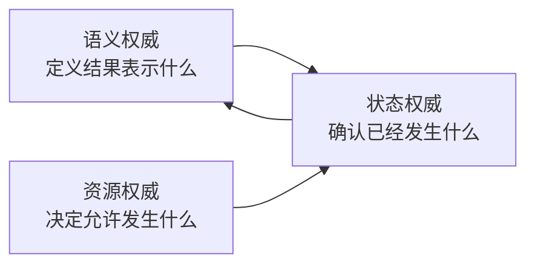
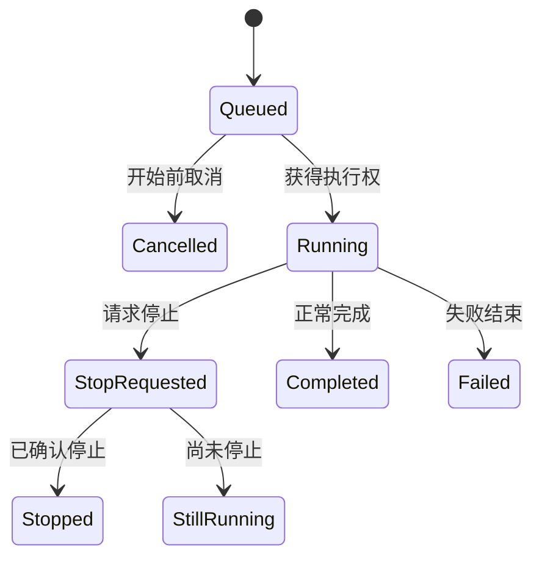
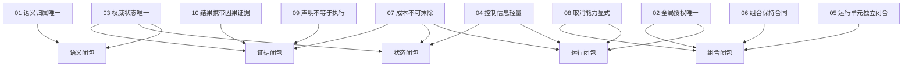

# 第四章　十条架构不变量

第三章给出了五种闭包。它们回答的是结果性问题：一项任务的语义是否完整，运行是否真正结束，状态能否确认，组合后原有合同是否保持，进程之外能否重新证明这些事实。

但“应当闭合”仍然过于宽泛。面对一段具体设计，我们还需要更直接的判断：这个职责应该由谁拥有？某个状态能不能同时由两处决定？内层任务能否重新扩大资源？失败以后能不能把已经发生的成本退回？配置里写了某种能力，是否就可以在报告中宣称它已经生效？

架构不变量用来回答这类问题。闭包描述最终要达到的性质，不变量则规定在任何合法路径上都不能被破坏的关系。它不是编码风格，也不是“最好这样做”的建议；只要不变量被违反，即使程序仍然运行、测试仍有一部分通过，系统也已经失去相应闭包。

不变量必须带有范围。例如，“权威状态唯一”不是说整个系统只能保存一个对象，而是说在一次运行的一个逻辑时刻，对于同一种事实只能有一个权威来源；其他副本可以存在，却必须明确自己是缓存、历史或投影。“资源授权唯一”也不是整台机器只能运行一个任务，而是全局额度只能由一个具有整体视野的边界发放，内层只能消费或收窄，不能自行扩张。

本章提出十条不变量。它们不会被写成十个彼此独立的小功能，因为真正的规则总是沿因果链共同生效。前三条确定所有权，中间三条建立运行边界，接下来两条约束失败历史，最后两条区分声明与事实。章节末尾再把它们汇总为一组可以直接用于设计审查的判定规则。

---

## 4.1 没有唯一所有权，就不会有稳定事实

第一条不变量是：**一种语义只能有一个权威归属。**

设想一个优化任务以“利润最大化”为目标。为了复用只接受最小化数值的计算过程，某处把利润取负。这个变换本身没有问题；问题出现在多个位置都以为自己有权解释方向。评价阶段已经返回负利润，汇总阶段又统一取负，最终报告得到原利润；随后排序阶段却仍按越小越好处理，于是最差方案被选为最好方案。

```python
raw_profit = 120.0
evaluation_value = -raw_profit
reported_value = -evaluation_value  # 不知道上游已经完成方向转换
sort_key = reported_value           # 却仍按“越小越好”参与排序
```

每一行单独看都可能有理由，整体错误来自“谁定义这个数值的含义”没有唯一答案。正确做法不是禁止变换，而是让某一处拥有目标方向、单位和约束解释，其他位置只能消费已经明确的语义，或者通过显式转换产生一种新语义。不能靠多个调用方各自猜测。

语义归属唯一也适用于数据列、模型输出、方案修正和错误分类。谁决定标签含义，谁决定一个向量怎样解码，谁决定某类失败是否可以降级，都应当有明确来源。唯一归属不意味着只有一段代码参与，而是最终解释权不能在多个层次上竞争。

第二条不变量是：**全局资源授权只能有一个权威来源。**

一项独立任务可以提出自己希望使用多少线程、设备、内存、远程工作数量和评价额度，但需求不等于授权。只有具有整体视野的上层边界知道机器上还有哪些任务、总预算是多少、哪些资源需要独占。内层任务得到份额以后，可以选择少用，不能重新观察整台机器并扩大自己。

假设机器有 16 个线程，外层同时运行 8 项工作，并给每项分配 2 个线程。如果内层仍然调用 `cpu_count()` 并创建 16 个工作线程，全局并发会膨胀到 128。每项任务都“正确读取了机器配置”，却共同违反了整体授权。

```text
机器容量：16
外层授权：8 项 × 每项 2 线程
内层私自决定：8 项 × 每项 16 线程
实际潜在并发：128
```

因此，资源事实必须区分请求、授权和实际解析。配置声明“希望使用 GPU”不代表任务获得了 GPU，更不代表实际计算会话真的在那里运行。只要这三者被混成一个字段，资源审计就无法判断系统是在正常降级，还是声明与执行已经分叉。

第三条不变量是：**同一逻辑时刻，同一种运行事实只能有一个权威状态。**

唯一状态并不禁止保存历史、缓存和只读副本。它要求人们能够回答：当前继续运行应该读取哪一个状态，最终结果基于哪一个状态，恢复时哪个状态具有最高权威。如果一处认为更新后的方案集合是当前状态，另一处仍把刚评价的临时集合称为当前状态，二者迟早会在保存、报告或恢复时冲突。

下面的顺序就是典型反例：

```python
feedback = evaluate(current_state)
updated_state = update(current_state, feedback)

save_for_recovery(current_state)  # 保存旧状态
current_state = updated_state
report(current_state)             # 报告新状态
```

正常运行结束时，报告来自新状态；中断恢复时，程序却回到旧状态。两个对象都是真实存在的数据，但只有一个能够代表“更新已经完成”这一时刻。状态权威不唯一，状态闭包就无法成立。

前三条不变量共同建立三种所有权：谁定义含义，谁发放全局资源，谁确认当前状态。它们之间互相制约。语义所有者决定什么状态有意义，资源所有者决定哪些变化可以开始，状态所有者则决定哪些变化已经成为事实。



这三条规则的一部分可以自动检查。类型与字段规则可以发现重复的方向转换或缺失单位；装配检查可以发现内层直接创建全局资源；状态合同测试可以发现更新后仍保存旧对象。但真正的权威关系还需要运行证据：实际使用了哪种评价语义，设备会话最终落在哪里，并发与失败时谁最后写入状态。静态代码只能看见可能路径，不能替真实执行决定哪条路径生效。

有了唯一所有权，下一步要确定边界应该携带什么。一个常见错误是为了让信息“随处可用”，把全部大状态和历史都塞进每次调用；另一个错误则是把任务拆得很漂亮，却让它离开父级以后根本无法独立运行。第四和第五条不变量处理这两个方向。

---

## 4.2 边界既不能过重，也不能依赖隐藏父级

第四条不变量是：**高频流转的控制信息必须保持轻量，大型运行状态应当通过稳定引用独立保存。**

在迭代程序中，每一步都可能需要代数、评价次数、当前模式、停止标志和若干状态位置。为了方便，有人会把整个方案集合、目标矩阵、完整历史甚至模型对象一起放入公共字典，再把这份字典传给每个阶段。

最初这看起来省事：任何函数都能取到全部数据。规模扩大以后，它会同时制造四类问题。第一，大对象在进程、线程或远程边界上传递时不断复制和序列化；第二，任意参与者都可能原地修改共享数据；第三，同一个大状态出现多份副本，权威来源变得模糊；第四，失败恢复时人们不知道公共字典中的对象是否已经完整提交。

更稳妥的关系是：高频控制信息只携带当前步骤真正需要的小字段，以及指向大状态的稳定引用；大状态由适合其生命周期的存储位置管理。

```python
step_info = {
    "round": 42,
    "evaluations": 860,
    "mode": "refine",
    "current_state_ref": "state/run-001/round-42",
}
```

这里的关键不是字符串格式，而是所有权。`step_info` 可以频繁构造、复制和投影；真正的大状态只在明确提交时写入。轻量信息不会因为携带整个模型或方案集合而成为另一个隐形状态仓库。

“轻量”也不是固定字节数。它是一条职责规则：公共控制信息不能成为大型权威状态的第二个所有者。可以通过字段白名单、序列化尺寸上限和大对象检测自动发现明显违反；但共享引用是否指向正确版本、远程存储能否无损恢复，仍然需要往返运行验证。

第五条不变量是：**每个独立运行单元必须在自己的边界内完成输入、运行、失败、结果和清理。**

“独立”并不表示它不需要上游输入，也不表示它可以自行占有全局资源。它表示：只要外部按正式边界提供输入与授权，这个单元就能被构建、启动、失败、结束和检查，而不依赖某个隐藏父对象、交互式变量或特定调用顺序。

一个常见反例是，任务表面上有独立入口，内部却从全局变量读取数据和设备，失败清理由外层脚本手工完成，最终结果则保存在父脚本知道的固定路径。它在原项目中能够运行，复制到另一个组合里就会缺少隐含条件。目录看起来独立，运行责任并没有闭合。

另一个反例是为独立任务提供两条公共入口，其中一条执行完整准备、运行和清理，另一条直接进入循环。使用者根据名字选择不同入口时，得到的是两套生命周期。独立闭合要求所有正式入口最终遵守同一份运行语义，而不是由调用者记住哪一条才“真正可用”。

结构检查可以验证入口、配置和输出声明是否存在，最小构建可以确认任务不依赖当前交互式内存；但独立闭合仍需在成功、失败和恢复路径中实际运行。只有真实移除父级便利条件，才能发现全局变量、固定路径和资源泄漏。

第四条保持边界轻量，第五条保证边界完整。二者看似相反，其实共同要求信息各就其位：独立运行需要的事实必须显式提供，但大型状态不能为了“完整”而被无差别复制。边界一旦清楚，任务才有资格进入更大的组合。第六条不变量正是在组合时保护这些局部规则。

---

## 4.3 组合可以收窄条件，不能偷换合同

第六条不变量是：**一个独立单元被顺序连接、嵌套、并行或远程执行以后，原有语义、状态、资源、错误和结果合同必须保持；任何变化都要显式表达。**

保持合同不意味着外层不能限制内层。外层可以把线程从 8 个缩减为 2 个，可以只接受 20 项提议中的 10 项，也可以设定更早的截止时间。真正的要求是，限制不能悄悄改变内层对事实的理解。

例如，内层一次提出二十项工作，并记录了二十份来源信息。外层因为预算只接受前十项。如果外层只截断待评价数组，内层仍等待二十份反馈，状态就会错位。显式的组合关系应当把“提出二十、接受十、拒绝十”作为同一事实传回，使内层能够同步缩减自己的记录。

```text
错误组合：提出 20 → 静默截断 → 返回 10 份反馈

正确关系：提出 20
          → 明确接受 10、拒绝 10
          → 内层同步记忆
          → 返回与 10 项身份对齐的反馈
```

并行时，输入的可变性也属于合同。如果单独运行的函数允许原地修改输入，并行组合就不能直接把同一个对象交给多个分支；必须提供副本、只读约定或隔离写入。否则，组合改变了函数原本成立的环境。

错误传播同样如此。内层已经认领并标记过的错误，外层可以补充“发生在第几个阶段”，却不能再次执行同一恢复副作用；内层声明某些部分结果有效，外层不能在没有语义规则的情况下把整批抹除。组合层负责协调，不应重新发明内层业务含义。

资源规则在这里再次出现。独立运行单元可以声明完整需求，嵌套以后只能接收父级分配的份额；并行分支不能各自创建超出总额的新资源。这个“只能保持或收窄，不能扩大”的关系可以通过合同测试和数值约束自动检查。代码扫描也可以发现内层直接读取全局机器容量、创建私有线程池或覆盖上层截止时间的明显路径。

但组合闭包最终必须通过真实组合验证。共享可变输入、调度竞态、递归使用同一执行池造成的死锁、超时后的迟到写入，都很难从类型和目录中证明。需要实际运行嵌套、并行、资源缩减和失败传播路径，观察局部合同是否仍然成立。

第六条不变量把第五条的“独立闭合”推广到系统范围。它也带来一个重要后果：组合不能通过删除历史事实来维持表面一致。当部分工作已经发生，外层不能因为整体失败就假装内层从未执行。于是，第七条从组合边界自然进入失败语义。

---

## 4.4 失败可以终止未来，不能改写过去

第七条不变量是：**已经真实发起并产生消耗的工作，不能因为后续失败而从预算和历史中抹除；只有尚未开始的额度可以释放。**

假设系统为三个方案预留三次评价额度，前两个成功，第三个开始后失败。外层捕获异常并取消整批预留：

```python
reserve(3)
try:
    evaluate(item_a)  # 已开始，成功
    evaluate(item_b)  # 已开始，成功
    evaluate(item_c)  # 已开始，失败
except Exception:
    cancel_reservation(3)  # 错误：把真实消耗也一起退回
```

预算随后仍显示三次额度可用，现实却已经执行三次工作。反复触发这种路径可以突破硬上限。正确记账必须至少区分预留、开始、成功、开始后失败和未使用释放。成功与否决定有没有有效反馈，是否开始决定成本是否发生。

这一规则不仅适用于评价次数，也适用于远程调用、设备时间、付费额度和外部副作用。只要工作真正进入现实世界，后续异常就不能把它恢复成“从未发生”。补偿操作可以产生一条新的反向事实，例如退款或删除；它不能删除原动作本身。

这条不变量适合用状态机和性质测试检查。可以在第一项开始前、批量中间、最后一项之后和提交期间注入故障，验证守恒关系：

```text
总额度
= 未开始且仍可用
+ 已预留未开始
+ 已开始成功
+ 已开始失败
```

任何路径都不应让已开始数量倒退。但真实成本是否发生，有时必须由外部系统确认。网络超时时，调用方可能不知道远端是否已经执行；运行记录需要保留“不确定但可能已消耗”，而不能为了账面整齐默认退回。

第八条不变量是：**取消能力必须显式描述，停止等待、请求停止、确认停止和强制终止不能被混为一谈。**

线程、进程和远程任务拥有不同终止能力。一个尚未开始的排队任务通常可以取消；正在运行的线程往往只能协作式检查停止信号；独立进程可能被终止，却仍可能留下外部副作用；远程任务则需要对方确认。



如果接口在请求停止后立即写入 `cancelled`，使用者会以为任务已经没有后续影响；仍在运行的分支却可能继续写文件或消耗资源。明确状态只是第一步，还需要让停止信号传播到可检查边界，并让已经失效的旧任务失去迟到写入资格。

自动检查可以验证状态枚举、停止信号是否传播、写入是否携带当前运行身份；故障测试可以制造超时并确认主线程不再接纳旧结果。但“线程真的停止了吗”“远端是否确认取消”“副作用是否仍在发生”只能通过运行观察或外部回执证明。函数调用返回不能替代现实中的终止证据。

第七条要求历史不可被失败抹除，第八条要求能力不可被名称夸大。二者共同维护失败路径的诚实性。系统可以失败，可以无法强制停止，甚至可以暂时不知道外部工作是否完成；它不能把这些情况报告成没有成本、已经取消或完全结束。

一旦接受这种诚实边界，就必须进一步区分“希望系统怎样运行”和“本次实际怎样运行”。这引出最后两条不变量。

---

## 4.5 配置描述意图，结果必须描述事实

第九条不变量是：**声明、装配和真实执行是三个不同事实，任何声明都不能直接冒充运行能力。**

配置中写着 `device = "gpu"`，只是表达需求；实际环境可能没有设备，装配过程可能选择普通计算，或者初始化后的会话仍然指向旧设备。组件登记表里存在某项能力，只能说明它可以被发现，不代表当前任务真正装配并调用了它。文档写着“支持并行”，也不能说明本次并行分支获得了隔离资源和确定合并语义。

```text
声明：希望使用什么、计划启用什么
装配：本次运行实际连接了什么
执行：真实调用了什么、得到什么、消耗什么
```

三者可以一致，也允许在明确规则下降级，但不能被压缩成一个布尔值。一个可靠报告应当同时指出请求值、生效值和实际值；如果发生降级，还要说明降级是否改变结果可比性。

静态检查和构建检查可以比较配置与装配，发现“声明启用但没有连接”的缺口；调用追踪可以确认某条路径是否真的进入目标能力。然而设备实际使用、远程服务版本和运行时降级仍需真实执行证据。检查工具不能仅凭名称和配置推断运行事实。

第十条不变量是：**最终结果必须携带足够的因果证据，使人能够从结果追溯到问题、输入、权威状态、资源、成本和结束结论。**

“携带”不意味着把全部历史复制到结果里。最终结果可以包含稳定身份和引用，指向大状态、长期输出和事件记录。关键是它不能成为一份与运行过程断开的裸对象。

```python
result_record = {
    "run_id": "run-001",
    "problem_version": "sha256:...",
    "input_version": "sha256:...",
    "final_state_ref": "state/run-001/final",
    "work_summary_ref": "record/run-001/work",
    "resource_summary_ref": "record/run-001/resources",
    "output_ref": "output/run-001/report",
    "status": "completed",
}
```

这份记录仍然不能自动证明内容正确，但它给出了验证路径。另一个人可以检查最终状态与报告是否属于同一次运行，真实发起成本与预算是否一致，资源声明是否与实际使用相符，失败或降级是否影响结果。

反例则是只保存 `best.json`、`model.pkl` 或一张最终页面。裸结果可能完全正确，却没有来历；页面可能展示很多字段，却只是读取了彼此不一致的记录。可视化与索引只能投影已有证据，不能创造因果关系。

第九和第十条共同封闭“声明—事实—结果”的链条。第九条防止系统把意图写成能力，第十条防止系统把答案与过程切断。字段完整性、引用格式和版本一致性可以自动检查；因果链是否指向真实调用、真实状态和真实外部成本，则必须通过测试与运行记录交叉确认。

至此，十条不变量已经沿因果关系全部出现。最后需要把它们重新收拢，说明它们怎样对应五种闭包，以及如何在新增能力和代码评审中真正使用。

---

## 4.6 把十条不变量变成设计判断

十条不变量可以浓缩为以下规则：

```text
01　语义归属唯一：同一种领域含义只能有一个权威解释来源。
02　全局授权唯一：资源与总预算只能由具有整体视野的边界发放。
03　权威状态唯一：同一逻辑时刻，同一种运行事实只能有一个权威状态。
04　控制信息轻量：高频控制信息不承担大型权威状态的第二份所有权。
05　运行单元独立闭合：正式输入给定后，它能独立启动、失败、结束和交付。
06　组合保持局部合同：嵌套、并行和远程执行只能显式收窄，不能偷换语义。
07　已发生成本不可抹除：异常只能释放未开始额度，不能改写已经发生的历史。
08　取消能力必须显式：请求停止、确认停止和强制终止必须准确区分。
09　声明不等于执行：配置、装配与真实运行必须分别报告和验证。
10　结果携带因果证据：答案必须能够追溯到输入、状态、成本与结束结论。
```

它们与五种闭包形成交叉关系，而不是一条规则只服务一个闭包：



实际设计新能力时，可以沿同一顺序作判断。先问语义由谁拥有，避免多个层次重复解释；再问资源和状态由谁授权、谁确认；接着确定高频控制信息与大型状态怎样分离，运行单元能否脱离隐藏父级独立成立；随后把它放进嵌套和并行场景，检查合同是否保持；最后构造部分失败、取消和恢复，确认历史不会被重写，并检查最终结果能否由真实证据支持。

自动化检查适合发现结构性违规：重复语义字段、内层直接创建全局资源、大对象进入高频控制信息、缺失独立入口、子级授权大于父级、结果缺少必要引用。合同测试适合验证状态对齐、预算守恒、失败清理和声明—装配一致性。这些检查能够提前阻止大量错误，却仍然不能代替真实运行。

必须依赖运行证据的部分包括：实际计算使用了哪个设备和线程数，外部服务是否已经执行，超时分支是否仍在运行，迟到写入是否被拒绝，保存状态能否在新进程中继续，真实成本是否与内部账本一致。只要结论涉及现实世界已经发生的事情，就不能只凭代码结构或配置推断。

十条不变量也不是要求所有项目采用相同规模的基础设施。一个短小、无外部副作用的确定性函数，可以把状态、资源和证据边界缩得很小；一项昂贵、并行、可恢复的任务则需要更强保证。规则约束的是已经宣称的能力：如果系统声称支持硬预算，就必须满足成本不可抹除；如果声称支持取消，就必须准确说明取消能力；如果声称可以恢复，就必须有唯一权威状态和完整因果关系。

到这里，卷首的论证已经从“为什么一个答案不够”，经过“复杂性从哪里来”和“怎样才算闭合”，最终落到可以直接约束设计的十条规则。可是，这些规则仍然面向一般的复杂计算：它们适用于优化、训练、仿真和外部任务，却还没有解释为什么本书接下来要把运筹优化与机器学习放进同一套框架讨论。

因此，第五章不会立刻进入仓库，也不会突然抛出一组框架类名。它要先把论证路径从一般软件工程带回具体计算领域：运筹优化究竟在决定什么，机器学习究竟在学习什么，二者为什么共享状态—评价—反馈—更新的运行骨架，又为什么不能被压缩成同一种语义。只有这层统一性得到证明，后面关于统一框架、共享底座和三仓边界的讨论才有真正的前提。

本章建立的十条规则仍属于 **I：架构不变量**。后文会逐条增加源码、测试和真实运行证据；在证据出现以前，不应把“应该满足”写成“当前实现已经满足”。
