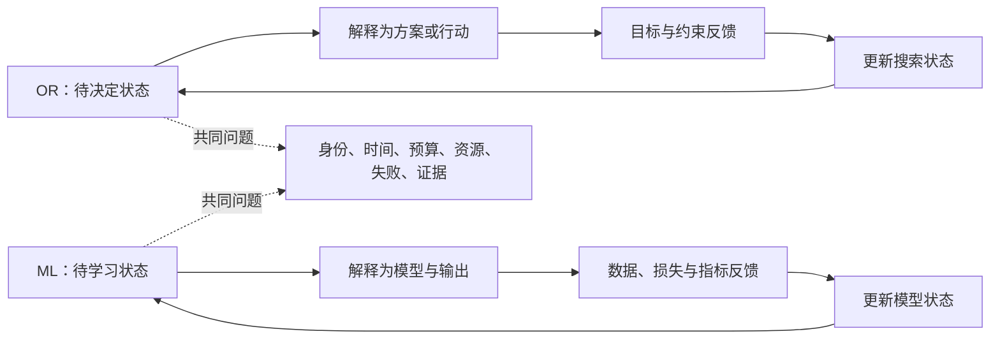
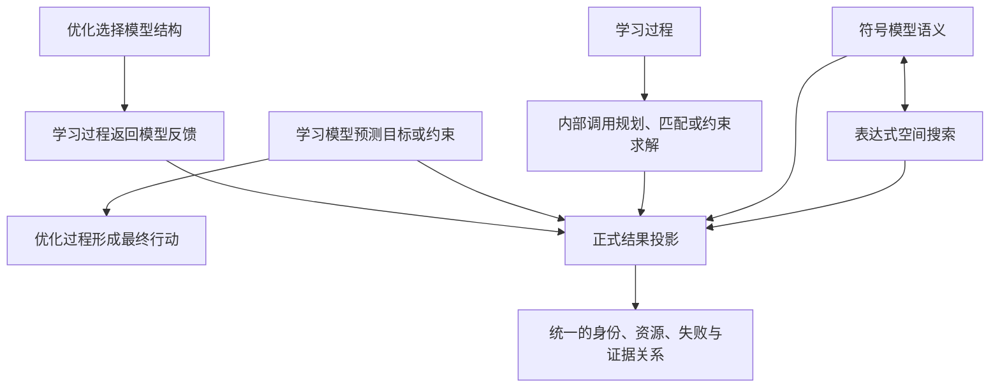

# 第五章　从一般复杂计算回到优化与学习

前四章始终没有正面介绍某个框架，也没有要求读者记住一组类名。我们从一个更宽的问题开始：当计算不再是一次无状态函数调用，而是包含迭代、昂贵评价、资源竞争、部分失败和恢复需求的长期过程时，怎样才能相信它交付的结果？沿着这个问题，前文先拆出了六类相互放大的复杂性，又用五种闭包和十条不变量规定了一个复杂计算过程至少应当保持怎样的完整性。

这些结论并不只服务于某一种算法。训练模型会遇到状态错位，运行仿真会遇到预算和超时，搜索方案会遇到批量失败，调用远端服务会遇到无法确认的副作用。也正因为它们足够一般，新的问题随之出现：如果这些规则适用于许多计算活动，为什么本书接下来要把注意力集中到运筹优化与机器学习？为什么不是数据库系统、编译器、图形引擎或普通 Web 服务？更进一步，优化与学习看起来使用不同的术语、产生不同的结果，它们凭什么进入同一套框架讨论？

这一步不能靠一句“二者都需要迭代”草率带过。循环不是统一性的充分条件，很多完全不同的程序都有循环；二者都使用矩阵、概率或梯度，也只说明它们共享部分数学工具。真正值得建立统一框架的共同点，必须深入到它们如何表示未知、如何获得反馈、如何改变状态、如何消费现实资源，以及最终怎样证明自己回答了原问题。

本章就完成这段回程。我们先不讨论任何仓库，也不预设系统已经由两个框架组成。运筹优化和机器学习首先是两类问题语义，不是两个 Python 包。只有先说明它们分别在解决什么，再找到共同的计算骨架，并确认这种共同性没有抹掉各自的事实来源，后面才有资格讨论“一套框架”应该共享什么、分开什么。

本章最终要建立的结论是：**运筹优化与机器学习都在处理无法一次直接给出答案的未知状态，都通过“形成可评价对象—取得反馈—更新状态”的过程逐步接近可交付结果；它们因而共享运行骨架，但目标、约束、数据、模型和最终产物的含义并不相同。统一应发生在计算与运行结构上，而不是通过消除领域语义实现。**

---

## 5.1 为什么从一般软件工程问题走向这两类计算

并不是所有程序都需要本书讨论的框架规模。一个把摄氏温度换算成华氏温度的纯函数，只要输入和公式确定，答案就能一次算出；一个读取配置并渲染固定页面的程序，虽然也会发生 I/O 和错误，却通常不需要维护“上一轮尝试为什么失败、下一轮应该改变什么”。这类任务当然仍然需要测试、异常处理和可观测性，但它们的核心答案不会在运行过程中被逐步发现。

另一类计算不同。开始时，我们只知道问题、边界和评价方式，却不知道最终应该交付哪一个状态。程序必须先构造一种可能性，让它进入真实或近似的评价过程，再根据反馈决定保留、修改、放弃还是继续探索。答案不是某个公式在入口处已经确定的直接结果，而是一次次选择和反馈共同塑造出来的运行历史。

可以先不用任何领域术语，把这类任务写成一条最小因果链：

```text
给出问题与边界
→ 保存当前尚未确定的状态
→ 把状态变成可以被现实或数据评价的对象
→ 获得反馈
→ 根据反馈改变下一时刻的状态
→ 判断继续、停止或转入另一阶段
→ 提交最终状态及其产生证据
```

这条链与普通数据处理管道的区别，在于反馈会反过来改变后续计算。数据处理通常把输入依次变换为输出；这里的输出会回到过程内部，影响下一轮要尝试什么。评价也不一定便宜或可靠：它可能需要运行一次物理仿真、训练一个子模型、访问外部实验设备、处理一批历史数据，甚至等待人工反馈。于是，状态、成本、资源、失败和证据不再是外围工程问题，而是直接参与答案形成。

运筹优化与机器学习都是这类计算的代表，但代表性来自不同方向。

运筹优化面对的是“应该采取什么行动”。订单怎样排产，车辆怎样走，资产怎样分配，参数怎样选择，结构怎样设计，都需要在许多可能方案中形成一个决定。问题通常会显式告诉我们哪些方案不允许、哪些目标需要尽量改善，但不会直接告诉我们最好的方案是什么。

机器学习面对的是“怎样形成一个能够解释或预测的模型状态”。给定数据、输出要求和评价方式，程序需要逐步调整参数、结构或规则，使最终模型能够在已见与未见情形中产生有意义的输出。问题不会直接给出正确模型，只能通过样本、损失、指标、残差或其他反馈约束模型的变化。

两者一个看起来在“选行动”，一个看起来在“学模型”。这正是它们值得放在一起讨论的原因之一：共同的运行困难出现在相似位置，领域含义却明显不同。若只研究共同点，我们可能做出一个不知道答案含义的通用循环；若只研究差异，两边又会分别重写状态保存、预算控制、并发、恢复和证据系统。后续框架设计需要同时避免这两种损失。

这也解释了为什么本书不是从某个算法家族开始。遗传算法、梯度下降、树搜索、交替方向法、反向传播或采样方法都可以改变未知状态，但它们只是“怎样更新”的不同答案。框架必须先稳定更新动作前后的问题语义、状态身份、评价边界和运行责任，否则算法越丰富，隐式假设越多。

因此，从一般软件工程转向运筹优化与机器学习，不是突然缩小话题，而是选择两类最能暴露前四章问题的复杂计算：它们都通过反馈形成答案，都可能昂贵、嵌套、并行和失败，又必须对最终结果承担清楚的领域解释。下面先分别还原这两类任务，避免在还没有理解差异时过早谈统一。

---

## 5.2 运筹优化在做什么：在约束世界中形成行动

想象一个生产计划问题。工厂需要在若干设备、人员和时间窗口之间安排订单。每个订单有交付期限，不同设备具有不同加工能力，切换产品会产生准备成本，能源消耗随时间变化。管理者希望减少延期和成本，同时又不能违反设备容量、安全规则与工艺先后关系。

这里最先出现的不是算法，而是一个尚未作出的决定：每个订单放到哪里、何时开始、使用哪条工艺路线。把这些尚待确定的内容称为**决策变量**，只是给“不知道但必须决定的东西”一个正式名字。所有决策变量允许取值的集合构成决策空间；其中满足容量、顺序、安全和业务规则的部分构成可行区域。

问题还需要说明怎样评价一个可行决定。总成本、延期时间、能源消耗和设备均衡程度都可以成为需要改善的量，这些量称为**目标**。某些目标希望越小越好，某些希望越大越好；有时可以通过权重把多个目标压成一个数值，有时不同目标之间没有诚实的单一换算关系，只能保留一组彼此不可简单替代的折中方案。

约束与目标看起来都可能返回数值，却承担不同责任。目标回答“允许的方案中哪个更值得选择”，约束回答“这个方案是否有资格进入比较，或者违反了多少”。如果把硬约束只写成一个很大的惩罚项，搜索过程也许能运行，却可能把业务上绝不允许的行为当成价格足够高时可以接受的交换。反过来，把所有偏好都写成硬约束，又会把本应比较的折中关系压成简单的合法或非法。

一个抽象的优化问题常被写成：

```text
在 x ∈ X 中寻找决定

尽量改善：f₁(x), f₂(x), ..., fₘ(x)
同时满足：g₁(x) ≤ 0, ..., gₖ(x) ≤ 0
          h₁(x) = 0, ..., hᵣ(x) = 0
```

这里的 `x` 不是天然的数组。它可能表示一组连续参数、排列、路径、图结构、任务分配、程序表达式或这些对象的混合。把内部保存的状态转成真正的排产表、路线或结构，是问题语义的一部分；同样一串整数，如果一种解释把它当作订单顺序，另一种解释把它当作设备编号，得到的是两个不同问题。

目标和约束也不一定由本地公式直接计算。一个方案的能源消耗可能来自仿真器，安全结论可能来自数值求解器，收益可能需要访问市场场景，可靠性可能要经过多次随机试验。于是，一次“评价方案”可能既昂贵又会失败，还可能产生无法立即确认的外部副作用。程序必须知道评价是否真正开始、哪些结果已返回、失败前已经消耗多少预算，以及结果究竟对应哪个方案版本。

当目标只有一个、空间规则且函数可微时，更新过程可能沿梯度或局部方向前进；当变量是离散结构、评价昂贵、目标互相冲突或约束复杂时，程序可能同时维护许多方案，通过变异、组合、邻域、代理模型、启发式规则或分解策略继续探索。无论采用哪种方法，优化过程都需要维持一条不被偷换的因果链：

```text
当前搜索状态
→ 产生一个或一批待评价方案
→ 把内部状态解释为领域决定
→ 计算目标与约束反馈
→ 根据反馈更新搜索记忆
→ 形成下一轮权威状态
```

这条链最后交付的也不总是“一个最小值”。单目标任务可能交付最佳可行决定及其目标；多目标任务可能交付一组互不支配的折中方案；动态任务可能交付随环境变化的策略；不确定条件下的任务可能交付鲁棒方案及其风险说明。结果必须能回答原来的行动问题，而不只是保存算法最后一轮的内部数组。

现在可以给这类问题一个范围较宽的名字：**运筹优化**，下文也会使用英文缩写 **OR**。这里的 OR 不只指传统线性规划，也不要求问题一定存在解析模型。只要核心任务是从允许的决定中，根据目标与约束形成行动，它就处于优化语义之内。黑盒优化、多目标搜索、调度、路径、组合设计、仿真优化和许多科学计算任务都可以落在这个范围。

从前四章的角度看，运筹优化天然要求五种闭包。方案、目标和约束必须保持语义闭包；提出、评价、更新和停止必须形成运行闭包；更新后的搜索记忆和最终决定需要状态闭包；批量评价、嵌套求解和外部仿真需要组合闭包；最终答案还必须能够追溯评价次数、资源使用、可行性和选择理由，形成证据闭包。

但这还没有说明机器学习。即使训练过程最终也常常最小化某个损失，把它直接等同为上述优化问题仍然过早。机器学习的未知对象、事实来源和结果责任有自己的结构。

---

## 5.3 机器学习在做什么：让数据约束一个可使用的模型

考虑一个需求预测任务。我们拥有过去一段时间的销量、价格、促销、节假日和库存记录，希望形成一个模型，为未来时段给出预测。程序需要决定使用哪些特征、采用什么模型结构、参数取什么值，以及输出究竟表示单点预测、区间还是概率分布。

表面上看，这仍然可以写成“寻找一组让误差尽量小的参数”。但如果只保留这句话，机器学习中最重要的事实会被抹掉。误差来自哪一批数据？训练数据与验证数据怎样分开？时间顺序是否允许打乱？缺失值和类别变量怎样处理？输出是一个连续数值、类别概率还是上下界？模型在训练数据上表现很好，是否意味着它能用于未来？最终保存一组参数，是否足以让另一个进程重建同样的预测行为？

机器学习首先面对的是一个尚未确定的**模型状态**。它可以是一组权重，也可以包含树结构、规则集合、符号表达式、特征选择、超参数和会影响解释的元数据。模型状态本身还不是可用模型；它必须与模型家族、输入 schema、数据变换和输出解释结合，才能形成真正可以评价的对象。

数据在这里不是普通函数参数。它是学习反馈的事实来源，也规定了结论的适用边界。训练集用于改变模型，验证集用于选择和调整，测试集用于尽可能独立地估计最终行为；时间序列还要求未来信息不能泄漏到过去，多来源数据需要保留血缘，不同抽样和切分可能改变指标含义。若数据边界发生变化，即使模型参数完全相同，也不能直接声称是同一次学习结果。

输出同样需要语义。一个长度为三的数组可以表示三个回归目标、三个类别的 logits、某个分布的参数或一个区间的上下界与置信度。只有规定怎样从模型原始输出得到业务可解释结果，评价指标才有意义。否则，程序可以正确计算数组，却不知道这些数值是否回答了用户的问题。

在最常见的监督学习情形中，可以用下面的形式描述训练目标：

```text
给定数据 D = {(xᵢ, yᵢ)}
在模型族 H 中寻找模型 hθ

使训练或经验风险较小：
R_D(θ) = (1 / n) Σ L(hθ(xᵢ), yᵢ)

同时希望模型在未见数据上仍保持有效，
并满足结构、资源、公平性、稳定性或输出合同等要求。
```

这个表达式与优化公式相似，却多出一个不能忽略的层次：经验风险只是通过有限数据观察到的信号，真正关心的是模型在目标分布和未来使用条件下的行为。训练集损失最小并不自动等于模型最好；数据泄漏、分布漂移、过拟合、错误的输出解释和不一致的预处理，都可能让优化数值很好而学习结论无效。

机器学习也不只包括监督学习。无监督学习可能没有显式目标列，却仍然需要定义聚类、表示、密度或结构质量；强化学习通过环境交互获得回报；自监督学习从数据内部构造训练信号；符号学习同时调整表达式结构和参数。它们共有的不是“都有标签”，而是数据或交互经验参与形成模型反馈，最终结果要作为某种可复用的预测、表示、策略或表达式离开训练过程。

因此，训练反馈也比一个标量损失更丰富。它可以包含梯度、残差、多个指标、约束、校准误差、置信区间、稳定性统计和资源消耗。不同反馈服务不同决定：梯度推动参数变化，验证指标支持模型选择，测试结果支持最终报告，资源指标可能限制模型是否可部署。把它们全部压成一个 `score`，会让训练过程失去判断每个数值用途的能力。

一次学习过程可以抽象为：

```text
当前模型状态与数据边界
→ 构造可执行模型及其输出含义
→ 在规定数据或环境上取得反馈
→ 根据反馈改变参数、结构或训练策略
→ 形成下一时刻的权威模型状态
→ 将模型、数据语义、输出解释和报告封装为可使用产物
```

最后一步解释了为什么学习结果不能只是“当前最小 loss”。用户真正需要的可能是能够加载的模型、稳定的输入输出 schema、所需预处理、权重与结构、训练和验证报告、数据版本、运行环境及限制说明。这个长期产物通常被称为模型制品或 **Artifact**；本章暂时只使用它的普通含义——能够离开原训练进程继续被理解和使用的结果，而不是某个具体框架类。

从前四章看，机器学习同样要求五种闭包。数据、模型与输出要形成语义闭包；装配、训练、评价和结束要形成运行闭包；参数、结构、优化器记忆和随机状态要形成状态闭包；交叉验证、分布式训练、超参数搜索和多阶段训练需要组合闭包；最终模型必须能够追溯数据、配置、资源与评价，形成证据闭包。

运筹优化和机器学习至此已经分别站稳。现在才可以比较它们。共同点不应从“都调用某种优化器”出发，而应从两条完整语义链中抽取。

---

## 5.4 共同计算语法：未知状态怎样在反馈中演化

把排产方案与预测模型并排观察，会发现二者都从某种尚未确定的状态开始。优化中的状态可能编码一组决定或一群候选；学习中的状态可能编码参数、结构和元数据。状态本身不一定能直接进入现实世界，它需要先被解释成可评价对象：前者变成排产表、路线或设计，后者变成能够接收数据并产生输出的模型。

评价随后产生反馈。优化反馈通常以目标与约束为核心，学习反馈通常以损失、梯度、残差和指标为核心；二者都必须明确绑定到被评价状态。更新过程再使用这些反馈改变下一时刻的状态，直到满足停止条件，最后提交权威结果。

可以把共同结构写成一个不依赖具体算法的表达式：

```text
sₜ            当前未知状态
cₜ = R(sₜ)    把状态解释成可评价对象
yₜ = E(cₜ)    在问题、数据或外部环境中取得反馈
sₜ₊₁ = U(sₜ, cₜ, yₜ)
               根据当前状态、被评价对象和反馈完成更新
```

这里的 `R` 不是某个固定编码函数，`E` 也不一定是纯函数，`U` 更不代表某一种算法。这个表达式只规定了因果顺序：反馈必须来自明确对象，更新必须知道自己消费的是哪一份反馈，新状态必须在更新完成后才成为下一时刻的权威事实。

这个顺序看似朴素，却能够解释许多静默错误。若评价前构造的运行视图在整批评价后仍被用于更新，预算和阶段信息就会落后一轮；若评价的是修复后的方案，结果却绑定到修复前的身份，反馈就会错配；若模型参数数值相同而结构元数据不同，只比较数组就会把两个模型当成一个；若更新完成后保存的仍是更新前状态，正常运行与恢复运行会从不同事实继续。

共同语法还必须允许批量。许多系统一次提出多个方案或模型状态，再并行取得反馈：

```text
Sₜ = {sₜ¹, sₜ², ..., sₜᴺ}
→ Cₜ = {R(sₜ¹), ..., R(sₜᴺ)}
→ Yₜ = {E(cₜ¹), ..., E(cₜᴺ)}
→ Sₜ₊₁ = U(Sₜ, Cₜ, Yₜ)
```

一旦进入批量，数量和身份就成为合同。提出二十项、预算只允许十项时，不能静默截断后只返回十份反馈；更新方需要知道哪些被接受、哪些从未开始。并行分支也不能共享会被原地修改的输入，超时后仍在运行的分支不能继续覆盖新状态。可见，共同语法并不只是数学迭代，还天然连接资源、失败和证据问题。



这张图的两条环没有被强行合并。左侧仍然交付行动，右侧仍然交付模型；共同区域只包含二者运行时都无法回避的关系。也正是在这里，前四章的抽象重新获得具体对象。

语义闭包要求 `R`、`E` 和 `U` 始终讨论同一个问题：方案的目标不能被误当成模型指标，训练反馈也不能在没有投影规则时直接进入行动排序。运行闭包要求从准备、评价、更新到清理都有结束语义。状态闭包要求明确 `sₜ` 与 `sₜ₊₁` 的提交点。组合闭包要求当 `E` 内部又启动另一条完整迭代时，内层的资源和失败合同仍然成立。证据闭包则要求最终结果能够追溯每次关键反馈与状态变化。

因此，OR 与 ML 的统一性不是一句抽象比喻。它意味着可以对两类任务提出同一组运行问题：当前状态是谁的状态，状态如何获得领域含义，评价何时真正开始，反馈怎样与身份对齐，更新何时提交，预算由谁发放，失败由谁认领，最终结果如何离开进程。只要这些问题的形式相同，共享一部分框架结构就是合理的。

但“问题形式相同”仍不等于“答案语义相同”。在讨论边界以前，还需要观察二者在真实系统中为什么总会进入彼此内部。组合关系会进一步检验这种统一是否只是纸面相似。

---

## 5.5 优化与学习怎样进入彼此，而又不失去自己

最直观的组合是用优化过程选择机器学习系统的结构。学习率、正则强度、网络深度、特征集合、树的参数或整个计算图都可以成为待决定状态；每个决定需要启动一次或多次训练，训练结果再被解释为外层反馈。外层关心的是候选之间怎样比较，内层关心的是模型怎样在给定数据上形成有效结果。训练发生在优化评价内部，却没有因此变成普通目标函数的一行代码。

反过来，机器学习也可以进入优化过程内部。昂贵仿真无法为每个候选都完整运行时，可以学习一个近似模型预测目标或约束；动态调度中，可以用模型预测需求和处理时间，再由优化过程形成行动；搜索策略也可以学习哪些区域更值得探索。此时模型提供信息，最终决定仍由目标、约束和可行性解释。预测模型再准确，也不能自行把一个违反安全约束的方案宣布为可行。

某些任务的内外关系更加紧密。双层优化中，外层决定会改变内层问题，内层最优结果又成为外层反馈；元学习中，一个学习过程试图改善另一个学习过程的适应方式；强化学习可能在每一步调用规划或约束求解；结构化预测可能在输出阶段求解组合问题；科学机器学习会把微分方程、守恒关系或数值求解器放进训练反馈。

符号学习则把二者的关系展现得尤其清楚。待学习对象是一个公式或程序，因此需要定义哪些表达式合法、怎样从内部状态恢复语义、输出怎样解释；同时，表达式空间巨大且离散，往往需要搜索、复杂度权衡和多目标选择。若把整个任务都称为“优化”，数据、表达式含义和模型产物会变得模糊；若把它全部称为“训练”，候选生成、可行结构和搜索记忆又会失去明确位置。更自然的做法是让学习语义说明“什么是模型”，让优化语义说明“怎样探索模型空间”。

这些组合揭示了一条重要原则：**外层和内层描述的是运行位置，不是永久身份。** 某次超参数搜索中，优化位于外层、训练位于内层；另一个系统可能先学习需求模型，再在训练流程的某个阶段调用优化器完成匹配；还可能两个过程交替推进。不能因为某类任务经常位于外层，就让它拥有所有内层语义；也不能因为内层返回一个数值，就把它降格为没有生命周期和状态的普通函数。

真正可组合的内层任务至少要能回答：它接收什么正式输入，需要什么资源，何时算真正开始，怎样报告部分失败，交付什么结果，留下哪些长期产物，结束时释放什么，以及外层取消后是否仍可能继续产生副作用。外层则要说明怎样把内层结果投影为自己的反馈，哪些内层失败使当前候选无效，哪些结果可以缓存，内外预算怎样对账。

可以把几种典型关系并列表示：



图中没有一条箭头意味着调用方获得被调用方的所有权。优化使用验证指标，不等于它有权解释数据切分；学习调用规划器，不等于它有权改写约束含义；共同运行边界发放资源，也不等于它知道缩小模型 batch 或减少搜索种群会不会改变领域结论。

正因为 OR 与 ML 可以互为内外层，共享运行结构不再只是减少重复代码的愿望，而成为保持组合闭包的必要条件。若两边使用不同的任务身份、资源授权、错误语义和结果引用，每一次组合都要重新发明胶水；若两边服从同一运行语法，组合层只需显式翻译领域结果，而不必猜测对方内部状态。

不过，组合越紧密，越容易产生另一个误解：既然机器学习训练经常可以写成优化，是否干脆把 ML 完全纳入 OR；既然现代优化越来越依赖数据和模型，是否也可以把 OR 看作广义学习？最后一节需要给统一性画出边界。

---

## 5.6 统一发生在哪里，差异又必须保留在哪里

从数学上说，许多机器学习任务确实可以写成优化问题。参数是决策变量，损失是目标，正则项或结构要求可以成为约束，训练算法寻找较优参数。这个观察非常重要，它解释了为什么梯度方法、黑盒搜索、多目标选择和约束技术能够进入学习过程。

但数学上的可约化，不等于软件语义上的可替代。

当我们写下 `min R_D(θ)` 时，符号 `D` 所代表的数据边界、`θ` 怎样解码成模型、模型输出怎样解释、训练指标与泛化结论有什么关系、最终如何保存可使用模型，都没有自动包含在“最小化”三个字里。如果共享层只看见目标数值，它无法判断一次训练是否发生数据泄漏，两个相同参数数组是否属于不同模型结构，或最佳 loss 对应的模型是否已经在随后更新中改变。

类似地，优化任务可以使用大量历史数据、学习代理模型，甚至让策略本身通过经验改进，却不会因此自动变成机器学习。只要最终语义仍然是根据显式目标与约束形成行动，模型就是帮助评价或搜索的组件，而不是最终问题的所有者。预测的准确性不能覆盖可行性，训练产物也不能代替最终决定。

二者的关键差异可以沿同一条计算链观察。

在未知状态上，OR 的状态首先代表可能的行动、设计或方案；ML 的状态首先代表可能的模型、函数、表示或策略。在事实来源上，OR 通常由问题声明、目标、约束和外部环境规定正确性；ML 由数据边界、模型假设、输出语义和泛化条件共同规定正确性。在反馈上，OR 关心目标、可行性、违反程度与折中关系；ML 关心损失、梯度、残差、指标、校准与数据切分。在最终交付上，OR 交付可执行决定或方案集合，ML 交付能够继续预测、表示或推断的模型产物及其报告。

这些差异不是术语偏好，而是会改变错误处理和状态提交的工程事实。一个优化候选不可行，可能仍然保留违反程度供搜索使用；一份训练数据 schema 不匹配，继续计算出的指标往往没有意义。一个多目标优化任务可以诚实地交付整条折中前沿；一个分类模型则必须连同类别映射和输出解释交付。一个方案的外部仿真失败与一个模型在验证集上表现差，也不能用同一种“低分”掩盖。

因此，可以统一的是下列关系：

```text
都有尚未确定的状态
都有状态到可评价对象的解释过程
都有可能昂贵、批量或外部化的评价
都有必须与对象身份对齐的反馈
都有根据反馈发生的状态更新
都有资源、预算、取消、失败和恢复问题
都有需要携带因果证据的最终结果
```

不能统一成同一种含义的，则是：什么构成问题事实，什么状态代表有效对象，反馈字段怎样解释，何时认为结果成功，以及最终交付物能够被谁怎样使用。

这条边界可以浓缩为一句话：**OR 与 ML 共享计算语法，不共享领域真相。**

“计算语法”使一套共同框架成为可能。状态需要身份，评价需要预算，更新需要提交点，内外任务需要资源派生，失败需要所有者，结果需要证据；这些规则无需为行动和模型各写一遍。“领域真相”则要求二者保留独立语义。共同结构可以运输状态与反馈，却不能替优化解释 Pareto，也不能替学习解释数据和输出。

这也回答了本章开头的问题。我们选择 OR 与 ML，不是因为它们恰好是两个已有软件包，也不是因为它们都流行，而是因为它们展示了一种非常有代表性的统一：答案通过反馈逐步形成，运行结构高度相似，领域语义又足够不同，迫使框架同时处理共享与分离。若这组关系能够被正确建模，仿真、科学计算、外部求解与其他反馈驱动任务也能通过明确边界进入，而不必污染核心语义。

到这里，我们还没有得到三个仓库，也没有理由提前讨论某个类应该放在哪里。我们只证明了两个前提：第一，OR 与 ML 可以进入同一套框架，因为它们共享状态—表示—评价—反馈—更新—提交的运行骨架；第二，这套框架不能把它们压成一种语义，因为行动问题与模型问题拥有不同的事实来源和结果责任。

第六章将以这两个前提为起点，讨论“统一而不混同”怎样成为真正的框架结构。那时才需要回答哪些运行关系可以共享，哪些语义必须独立，为什么一个庞大单体、两套互不相干的运行时和一个完全中立的工作流引擎都会丢失某种闭包。等抽象层次成立以后，第七章才会把它们落实为实际仓库与外部边界。

本章的结论主要属于 **I：架构不变量的领域化推论**。它说明后续设计必须保持何种统一与差异，并不声称某个当前实现已经完整满足这些要求。关于具体源码、测试和真实运行的证据，将在框架结构与各语义层正式出现后逐步加入。
