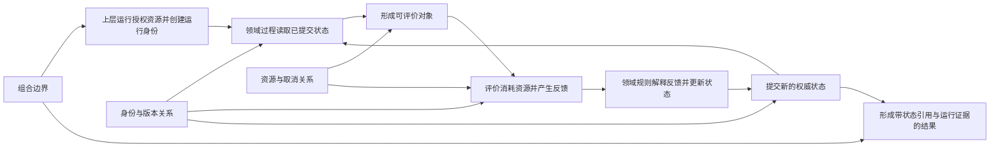
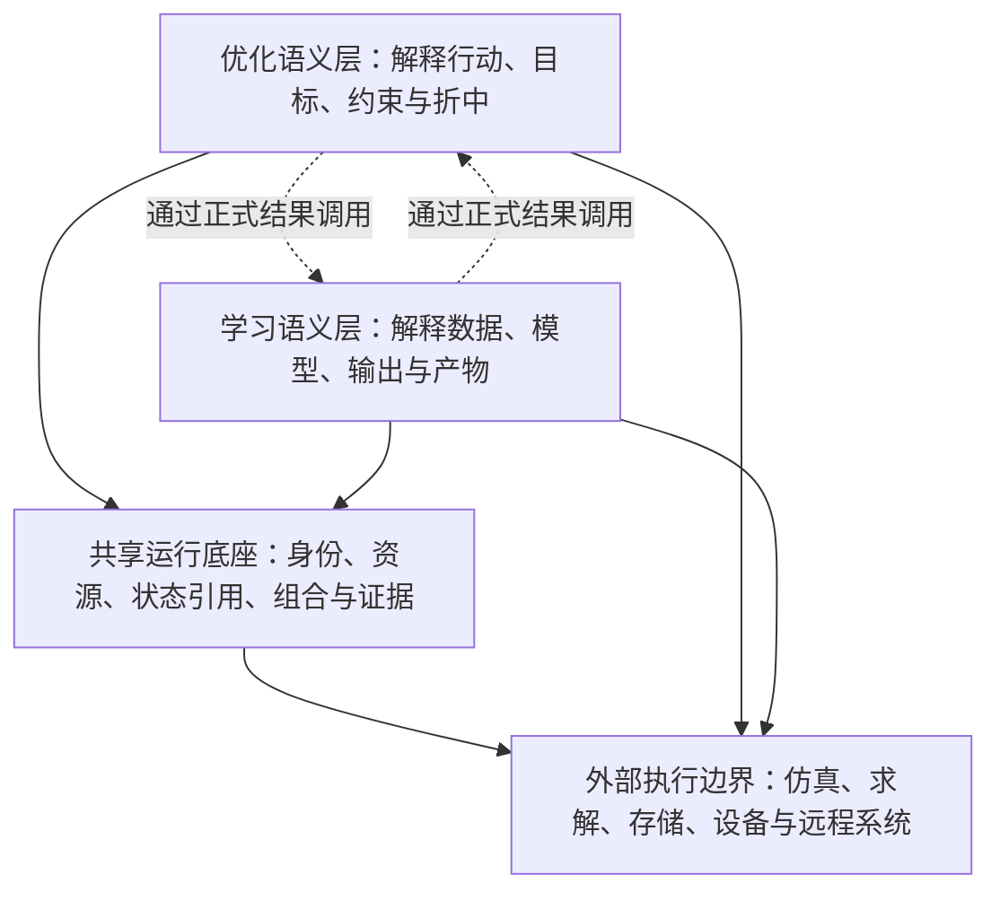

# 第六章　统一而不混同：一套框架为什么需要两种语义

第五章没有得出“现在有两个框架，所以需要把它们接起来”这样的结论。它甚至有意避开了框架、仓库和类的名字，只把运筹优化与机器学习还原成两类问题：一类要在目标与约束规定的世界中形成行动，一类要在数据、模型假设与输出含义规定的世界中形成可使用的模型。二者处理的未知不同，判断结果成立的事实来源不同，最终承担的责任也不同；与此同时，它们都要让某种尚未确定的状态经过表示、评价、反馈和更新，逐步成为可以提交的结果。

因此，我们现在拥有的是**两类语义和一组共同计算关系**，而不是两个必须被保留的既成软件系统。这一区分很重要。如果把现有代码组织当作起点，后面的工作就会退化成包依赖整理：找出重复工具，移动几个类，增加一层接口，然后把“能够互相调用”称为统一。可是，两个包能够互相导入，不代表一次跨领域运行具有统一的资源账本；两个对象都叫作状态，不代表恢复以后仍是同一候选或同一模型；一条工作流能够把前一步输出传给后一步，也不代表后一步理解这个输出为什么有效。

真正需要回答的问题是：当两类语义进入同一个长期计算过程时，哪些责任如果分别实现就会产生冲突，因而必须由共同结构承担；哪些责任如果交给共同结构，又会让它越权解释领域事实，因而必须留在各自语义内部？只有这两个问题同时得到回答，“统一”才不是合并目录，“分层”也不是给重复代码换一个更漂亮的名字。

本章将从一次可能真实发生的组合运行出发。外层过程需要比较若干生产方案，每个方案的成本与风险由一个从历史数据训练出来的模型估计；模型训练过程中又要选择结构和超参数，其中某些约束通过外部仿真验证。这里既有行动选择，也有模型学习，还有外部执行。它们可能顺序发生，也可能嵌套、并行、失败或恢复。这个例子不承担全书故事主线，它只是把架构压力集中到一个现场：同一份总预算怎样分配，某次评价究竟属于谁，超时后哪些分支仍可能写入，保存的状态如何知道对应哪一轮运行，最终方案怎样追溯到确实使用过的模型与数据。

沿着这些问题，我们会逐步得到本章的核心结论：**统一框架必须共同承担运行、状态、资源、组合与证据关系，但不能共同解释优化和学习各自的领域真相。共同部分构成运行底座，差异部分形成两条独立的语义链，外部系统则停留在正式执行边界之外。**这个结构不是从仓库数量推出来的；恰恰相反，后续的工程边界必须接受这个结构的检验。

---

## 6.1 共同骨架为什么会产生共同责任

“OR 与 ML 都有状态、评价和更新”仍然只是一项观察。观察到相似，不等于必须共享实现。两个领域都使用数组，却不需要全世界只保留一个数组类；两个程序都有循环，也不意味着它们必须共用同一个循环控制器。要从相似走向架构结论，还需要证明：若某些关系由各领域分别维护，它们会在组合时争夺同一项事实的解释权，最终破坏前四章建立的闭包。

先回到本章开头的组合运行。外层需要评价十个生产方案，每个方案都要训练一个预测模型，再把模型放进仿真环境估算交付风险。假设整次运行最多允许使用八块 GPU、四十个 CPU 线程、五百次仿真和两小时墙钟时间。若行动选择、模型训练和仿真调用分别维护自己的资源配置，它们都可能在局部看来“没有超额”：外层只启动十个方案，训练侧每个模型只申请一块 GPU，仿真侧每次只占四个线程。可是三者同时发生时，物理机器面对的不是三份局部说明，而是它们的总和。

总预算也是如此。外层说“还可以评价三个方案”，并不能推出内层模型训练还有足够预算；训练侧说“本轮只增加一次 step”，也不能说明这一步没有触发几十个批次和一次昂贵验证；仿真侧某次调用失败，更不能让已经发生的物理成本从外层账本里消失。只要存在嵌套，预算就具有祖先—后代关系：子过程可以获得父过程派生出的额度，却不能创造父过程没有授予的资源。于是，“谁有权发放资源”和“谁记录已经发生的成本”不再是 OR 或 ML 各自的领域问题，而是整个运行树共同面对的事实。

状态同样会越过领域边界。外层方案的评价结果取决于某个具体模型，模型又取决于具体数据切分、参数状态和训练历史。如果只保存外层目标值，我们无法确认恢复后读到的模型是否仍是产生该目标值的那一个；如果只保存模型文件，我们也无法确认它服务于哪个方案、哪次仿真和哪轮搜索。这里需要的不是把所有对象塞进一份巨型字典，而是让每个重要状态拥有稳定身份，并让跨层关系以引用连接。状态内容可以属于不同领域，身份、版本、提交时刻和引用有效性却必须遵守同一种运行纪律。

失败进一步暴露了共同责任。设想某个并行分支达到超时。外层已经停止等待，训练线程却可能仍在后台完成，随后把模型写入共享存储；仿真请求也可能已送达远端服务，无法被本地线程真正撤回。如果每一层只报告“本层已取消”，最终记录就会把停止等待、协作式停止和外部副作用终止混为一谈。要准确表达事实，取消必须沿运行关系传播，晚到写入必须携带能够被识别的运行身份，而最终报告必须区分已经请求停止、已经确认停止和仍可能继续执行。

这说明共同骨架所产生的共同责任并不是“大家都需要的工具函数”，而是**只有拥有整体视野的一方才能维护的关系**。资源总量、父子授权、运行身份、状态引用、取消传播、错误归属和最终证据，都跨越了单个领域语义。若优化过程和学习过程各自维护一套，它们在独立运行时可能都显得合理，一旦嵌套，就会出现两个预算真相、两个取消结论、两个状态版本或两个互不兼容的恢复协议。

可以把这种区别写成一条简单判断：

```text
如果一项规则只需要理解“这个对象在本领域意味着什么”，
它应当留在领域语义内部；

如果一项规则必须同时约束父任务、子任务、并行分支和外部调用，
它就需要由共同运行结构维护。
```

前一句保护语义所有权，后一句保护全局一致性。共同层的必要性不是来自代码复用率，而是来自某些事实不能有多个权威来源。它必须足够强，能够关闭跨任务运行；又必须足够克制，不替任何领域解释结果。这种“强而不越权”的要求，将贯穿后面的所有分层。

---

## 6.2 需要共享的不是算法，而是五类关系

共同责任一旦被识别，下一步很容易走偏：把各种算法、数据类型和业务组件一起搬进“公共模块”，期待公共模块越大，统一程度就越高。实际上，共同部分的边界不应由使用次数决定，而应由它维护的关系决定。一个只有 ML 使用的数据切分器，即使非常基础，也不因此成为跨领域真相；一个只有某个大型优化案例暂时用到的取消令牌，只要它表达的是通用父子运行关系，就可能属于共同结构。

前四章提出了语义、运行、状态、组合和证据五种闭包。到了 OR 与 ML 的具体场景中，它们不再只是抽象质量标准，而会自然分成两类：语义闭包由各领域分别完成，其余四类闭包中的跨任务部分必须共享。不过，为了避免把这种分法理解成五个孤立模块，更准确的说法是：统一框架要维护五组彼此咬合的关系，其中领域语义有两个权威来源，跨任务运行则只有一个共同秩序。

第一组是**生命周期关系**。任何长期计算都有开始、准备、反复推进、提交与结束，但这些阶段不能只是一组名字相似的回调。开始意味着运行身份和初始授权已经形成；推进意味着本轮读取了一个确定状态，并产生了能够对齐的反馈；提交意味着新的权威状态已经替代旧状态；结束意味着停止条件、剩余任务和最终产物已经得到处理。优化可以把一次推进称为 generation，学习可以称为 step、epoch 或 fit phase，二者不必共享领域词汇，却必须对“何时允许读、何时允许写、何时算完成”遵守可组合的时序。

第二组是**状态关系**。共同层不需要知道一个向量表示生产排程还是神经网络参数，但必须知道状态属于哪次运行、哪个逻辑时刻、由谁提交，以及哪些反馈是基于它产生的。高频控制信息与大型权威状态还要分开：当前步数、停止标记和状态引用适合频繁传播；种群、模型参数、历史轨迹和大型评估结果应当由能够保存版本的大对象存储承载。否则，一份为了方便控制而复制的上下文会悄悄变成第二份权威状态，恢复和并行写入都会失去确定含义。

第三组是**资源与成本关系**。共同层需要表达的不是“GPU 对模型训练很重要”或“CPU 对仿真很重要”，而是资源由谁授权、如何从父级派生到子级、并行 fan-out 受什么上限约束、已经开始的外部成本怎样计账、未开始额度怎样退还。领域层可以声明最低需求和降级策略，例如模型训练知道 batch 缩小会怎样影响统计行为，优化过程知道种群裁剪会怎样影响算法账本；但它们不能自行把局部偏好升级为全局授权。授权与适配是两个不同决定：共同层回答“最多可以用什么”，领域层回答“在这些许可内怎样保持自己的语义”。

第四组是**组合关系**。一个独立运行单元被放进顺序、并行或嵌套结构后，它的输入、输出、错误和取消合同不应改变。外层优化调用内层训练，不意味着优化层可以直接读取训练对象的临时字段；学习过程调用外部求解器，也不意味着求解器的内部句柄可以成为模型状态。组合边界需要正式的输入信封、结果投影和资源派生。所谓“正式”并不等于繁重，而是调用双方都能说明：传入了什么、输出承诺什么、哪些状态仍归被调用方、失败由谁接住。

第五组是**证据关系**。最终结果不仅要携带答案，还要能够连接到产生答案的运行事实。一个生产方案引用了哪个模型版本，模型使用了哪份数据边界，评价实际消耗了多少预算，是否发生降级，某个并行分支是否超时但仍在后台执行，这些信息不能在结束时依靠日志文本猜测。共同层需要提供稳定的运行身份、事件时间、资源记录和状态引用；领域层再在这些骨架上解释目标、约束、指标、模型结构和产物含义。证据因此也是共享与分离的交界面：共同层保证链条没有断，领域层保证每个节点没有被误读。

五组关系可以放进同一幅因果图中：



图中只有“解释反馈并更新状态”必须知道自己面对的是行动还是模型，其他箭头大多表达跨领域都成立的运行约束。但这并不意味着共同层只是一只被动容器。它要拒绝超过父级授权的资源申请，拒绝已经失效运行身份的晚到写入，拒绝不能与输入数量对齐的批量结果，并保证结束报告引用的是最后一次合法提交。它不解释目标值，却可以检查目标批次与候选批次是否一一对应；它不理解模型质量，却可以检查报告引用的模型状态是否真实存在。

因此，“共享算法”和“共享关系”是两种完全不同的设计。共享算法追求把相似代码放到一起，容易不断吸收领域细节；共享关系追求让跨任务事实只有一个权威来源，边界反而更稳定。统一框架真正需要共享的是后者。

---

## 6.3 两条语义链为什么必须分别闭合

如果共同层已经掌握生命周期、状态、资源、组合和证据关系，为什么还需要明确区分优化语义与学习语义？能否把一切都抽象成“状态”“分数”和“更新器”，再让不同算法填入实现？这种设计非常诱人，因为它看上去极其统一：所有过程都接收一个对象，返回若干数值，再据此产生下一个对象。早期原型也常常从这里开始。

问题在于，裸“分数”会抹掉决定正确性的结构。对多目标优化而言，`[12.4, 0.83]` 可能分别代表成本和可靠性，两个方向的优劣规则可能不同，约束违反不能随意混进其中，候选之间也未必存在单一全序。支配关系、可行性优先和前沿保留不是对数组做排序的工具细节，而是“什么叫更好”的领域定义。共同层若直接解释这些值，就已经开始拥有优化语义。

机器学习的反馈同样不能压成一个分数。训练损失、验证指标、梯度、残差、校准误差和数据质量报告具有不同时间与用途。训练损失可以驱动参数更新，却不一定能够选择最终模型；验证指标可以参与选择，却不能反过来当作训练样本；同一个准确率在类别映射不同或数据切分泄漏时不再表示同一事实。模型状态还可能包含相同数值、不同结构元数据的两个对象，仅比较数组会把不同模型误认为同一候选。

更深的区别出现在结果责任上。优化过程的完成，不只是“找到了最低数值”，而是提交了一个能够在问题约束下被解释为行动的方案，或者诚实提交一组无法进一步简单取代的折中。学习过程的完成，也不只是“损失下降”，而是提交了能够被重新加载、正确解码并在规定输入输出语义下使用的模型产物，同时说明数据边界与评估证据。共同层可以运输二者，却不能替它们定义完成。

因此，两类领域都需要一条从问题事实到最终结果的闭合链。优化链可以抽象地写成：

```text
问题中的决策含义
→ 候选怎样表示一个可能行动
→ 目标与约束怎样评价该行动
→ 反馈怎样参与比较、选择和搜索
→ 哪个候选或哪组折中可以成为最终决定
```

学习链则是：

```text
数据边界与模型任务
→ 一个未知状态怎样解码成模型
→ 模型怎样产生具有明确含义的输出
→ 损失、梯度、指标和残差怎样反馈
→ 哪个模型状态及其配套信息可以成为可用产物
```

这两条链可以在运行中互相调用，却不能互相代替。外层优化选择模型结构时，模型训练的验证指标可以投影为优化目标，但训练数据怎样切分、结构怎样解码、产物怎样保存仍由学习语义解释；学习过程使用组合求解器完成结构化推断时，求解结果可以成为模型计算的一部分，但决策变量、可行性和求解失败仍由优化或外部求解语义解释。投影只把被调用方的正式结果翻译为调用方需要的反馈，不转移对方内部事实的所有权。

可以把这条边界理解为“共同运输，分别解释”。共同结构负责让输入、结果、引用和资源安全穿过边界；优化语义负责回答行动是否有效以及怎样比较；学习语义负责回答模型是否有效以及怎样使用。一个字段能够被共同序列化，不代表共同层理解它；一个结果能够被另一侧消费，也不代表消费方取得了它的定义权。

这里还需要避免另一种误解：保留两条语义链，不等于每种算法都要建立一套封闭世界。不同优化方法当然可以拥有不同的候选生成与更新策略，不同学习方法也可以拥有梯度、采样、规则生长或其他更新方式。语义链规定的是这些方法必须回答的共同领域问题，而不是要求它们共享同一数学机制。优化算法可以完全不知道模型的内部训练细节，学习算法也可以完全不知道多目标折中前沿的维护实现；它们只需在各自领域合同中交付能够被运行底座运输、被组合边界投影的正式结果。

到这里，共享与分离的界线已经初步清楚：共同层维护“运行如何真实发生”，优化层解释“行动为什么成立”，学习层解释“模型为什么成立”。下一步仍不能立刻宣布架构完成，因为同一原则可以被几种截然不同的软件形状声称满足。必须把最常见的三条路线放到组合、失败和恢复场景中检验，看看它们究竟在哪一层失去闭包。

---

## 6.4 三种看似自然、实际无法闭合的统一方式

第一种路线是建立一个包罗万象的大组件体系。既然优化和学习都有状态、评价、更新，就定义一种通用问题、一种通用状态、一种通用反馈和一种通用执行器；目标、约束、损失、指标、模型与候选都作为可选字段挂在上面。短期内，这种方式非常高效。所有对象都能通过同一入口，组件数量看起来减少，示例也容易写成几十行。随着能力增加，公共对象会逐渐携带 `objectives`、`violations`、`loss`、`metrics`、`gradients`、`model`、`dataset`、`population` 等字段，每个消费者从中挑选自己认识的部分。

这类设计的问题不是字段太多，而是解释权已经无法定位。假设一个通用更新器收到 `score`，它怎样知道这个值是需要最小化的目标、越大越好的验证指标、约束违反，还是仅供诊断的残差？如果对象同时存在目标和损失，哪个值能够改变状态？如果模型训练失败但外层优化给它分配了一个惩罚值，运行应当记录“合法的劣质候选”还是“内层计算失败后采用降级反馈”？字段可以继续增加，却无法替代领域判断。

大组件体系还会形成错误的依赖方向。为了支持多目标搜索，共同对象开始理解支配关系；为了支持训练恢复，共同执行器开始理解优化器参数、数据迭代器和模型文件；为了支持结构搜索，它又开始认识两边的内部状态。最终所谓公共层并不公共，而是所有领域实现的总和。任何一侧改变语义，都可能迫使共同对象升级；任何外部系统接入，也会继续向中心增加字段。系统表面上只有一套类型，实际上没有任何层能够独立说明自己的合同。

把本章开头的组合运行放进去，这个问题会更加明显。外层方案、内层模型和仿真请求都可以叫作 `state`，但它们的提交条件不同；优化目标、验证指标和仿真告警都可以叫作 `feedback`，但它们的失败语义不同。一个巨型通用对象只能把差异藏进约定，不能让差异消失。它实现了类型层面的合并，却破坏了语义闭包。

第二种路线走向相反方向：既然领域含义不同，就让优化和学习各自拥有完整运行时。两边分别实现生命周期、并行池、资源配置、上下文、快照、检查点、插件、日志和错误处理，组合时再写一层适配器。这种方式在初期也很合理。每一侧都能围绕自己的术语设计，独立案例运行顺畅，团队也不必等待共同协议成熟。

问题在嵌套的第一刻出现。两套运行时都会认为自己有权创建线程池和设备会话，都会维护自己的预算与取消状态，都会给快照定义自己的信封。外层优化调用内层训练时，究竟谁决定总线程数？训练侧看到一张可用 GPU，是否可以启动自己的并行子任务？外层超时以后，内层的取消标记是否仍然有效？两个快照都叫作“最新状态”时，恢复顺序由谁确定？如果适配器只是传值，这些问题没有答案；如果适配器接管资源、状态和生命周期，它事实上已经开始重造一个共同运行层。

重复运行时的危险还不止维护成本。最严重的是**同一现实事实被记录两次**。一次模型训练消耗了真实 GPU 时间，学习运行时记为三十步，外层优化运行时可能只记为一次候选评价。若第三十步之后失败，学习侧知道成本已经发生，优化侧却可能因为“候选没有返回”而退还整个评价预算。两边的记录各自在局部接口内说得通，合并后却违反成本不可抹除。类似地，学习侧已经保存新模型，优化侧仍引用旧候选；外层认为分支已取消，内层线程仍能写入。两个局部闭包不能自动拼成一个全局闭包。

第三种路线试图避开前两种冲突：建立一个完全中立的工作流引擎。它不理解优化，也不理解学习，只负责把节点连接起来、按顺序或并行执行，并把上一步输出交给下一步。每个节点仍然可以保留自己的领域实现，因此既没有巨型公共对象，也没有强迫两边共用算法。这似乎最接近“共同运输，分别解释”。

真正的问题在“完全中立”四个字。若工作流只运输裸数组、字典和文件路径，它无法判断输出是否完整、引用是否仍然有效、批量结果是否与输入对齐、子节点是否超过父级资源授权。它可以看到节点 A 返回成功，却不知道 A 的后台分支仍在运行；可以看到节点 B 产出模型路径，却不知道该模型是否来自当前运行；可以把两个并行结果做 `mean` 或 `concat`，却不知道这些结果是否允许这样合并。

为了弥补这些缺口，工作流引擎会逐渐增加任务身份、资源声明、取消协议、状态引用、结果信封、提交语义和错误分类。一旦这些关系具有正式合同，它就不再是完全中立的连接器，而成为本章所说的共同运行底座。反过来，如果它坚持只做无语义转发，跨领域组合就只能依赖节点外部的私有胶水。每个案例都要手工猜测字段、恢复顺序和错误含义，组合闭包仍然不存在。

这三条路线分别牺牲了不同的东西：

```text
把所有对象并成一种组件体系
→ 共同层取得领域解释权
→ 语义闭包消失

让每个领域拥有完整运行时
→ 全局事实出现多个权威来源
→ 运行、状态与证据闭包消失

让完全中立的工作流只做值传递
→ 组合没有身份、授权和提交合同
→ 组合闭包消失
```

它们的共同错误，是把“统一”和“分离”当成只能二选一的尺度：要么尽量把东西放在一起，要么尽量让它们互不依赖。可信框架需要的不是在这条尺度上寻找折中点，而是沿责任性质切开：跨任务事实统一，领域解释分离；运行合同足够强，领域知识保持克制。这样得到的不是三条路线的平均值，而是一种不同的结构。

---

## 6.5 从排除错误结构到得到分层答案

现在可以开始推导架构，但仍然不需要任何仓库名。前面的结论已经给出四项约束。

其一，资源、运行身份、父子关系、取消、状态引用和证据链不能由多个领域各自建立，因为它们描述的是同一次现实运行。其二，目标、约束、可行性、数据、模型、输出和产物不能由公共层统一解释，因为它们分别构成优化与学习的领域真相。其三，一个领域调用另一个领域时，必须通过正式输入和结果投影组合，不能读取对方临时状态。其四，外部仿真器、数据库、数值求解器和设备运行时具有自己的失败与副作用，不能假装成框架内部的普通纯函数。

满足这四项约束的最小结构，不是一个万能核心，也不是两套平行框架，而是三种内部责任加一条外部边界。

最下方需要一个**共享运行底座**。这里的“底座”不是说它在调用栈中永远位于最底层，也不是说所有公共工具都应放进来；它表示一组不依赖 OR 或 ML 领域解释、却对所有运行单元具有约束力的协议。它维护运行身份、生命周期骨架、资源授权与派生、轻量控制信息、大状态引用、并发与取消边界、事件与结果信封。它可以拒绝不合法的运行行为，却不决定一个候选是否占优，也不决定一个模型是否泛化。

共享底座之上需要两条**领域语义层**。优化语义层拥有从决策问题到行动结果的解释链：怎样表示候选，怎样评价目标与约束，怎样把反馈交给搜索策略，怎样维护可行性、支配或其他比较关系，怎样提交最终方案。学习语义层拥有从数据和模型任务到模型产物的解释链：怎样定义数据视图与输出含义，怎样把未知状态变成模型，怎样训练和评价，怎样保持反馈与模型身份对齐，怎样交付可以重新使用的产物。

称它们为“两条语义层”，并不是宣布任何运行只能属于其中之一。一个结构搜索任务可以在外层使用优化语义，在内层调用学习过程；一个强化学习过程可以调用规划或求解；一个科学机器学习任务可以让微分方程求解器参与评价。层描述的是某个决定由谁解释，不是任务在目录中的永久身份。同一个完整运行可以经过多层，但每个事实在某一时刻仍只有一个语义所有者。

最后需要一条**外部执行边界**。框架能够描述和调度仿真、数据库访问、对象存储、数值求解、远程集群与设备会话，却不应假装拥有这些系统的内部语义。一个远端任务是否已经被服务端接收，一个数据库事务是否提交，一个物理仿真能否中断，都必须通过明确的外部能力合同反映。框架负责发放允许使用的资源、传递运行身份、记录请求与结果、处理超时和降级；外部系统或其正式接入层负责把这些协议翻译成真实调用。

这四个部分的依赖方向比它们的名字更重要：



实线表示使用共同运行协议，虚线表示领域之间通过正式结果发生组合。优化层与学习层可以互相调用，但这种调用不是对彼此内部实现的依赖。它们应当像调用一个独立运行单元那样提供输入、派生资源并接收结果。外部边界则可能被共同底座或某个领域语义触发：共同底座负责通用存储与执行关系，领域层负责只有本领域才能正确形成的请求。无论从哪里触发，外部系统都不能反向成为框架内部语义的隐含所有者。

分层答案还给出了一条非常实用的归属判断。面对任何新能力，不要先问“哪个包现在最方便放”，而要问它做出的关键决定是什么。若它决定父子任务能获得多少线程或设备，它属于共同授权；若它决定种群被预算裁剪后算法账本怎样同步，它属于优化语义；若它决定一个状态怎样解码成模型、哪些元数据影响模型身份，它属于学习语义；若它把框架请求翻译为某个云服务或仿真器调用，它属于外部边界。一个能力可能跨越多层，此时需要拆成共享合同、领域解释和外部适配，而不是把整个功能块判给最先调用它的一方。

这正是“统一而不混同”的具体含义。统一不是让所有东西继承同一个基类，而是让跨任务事实服从同一个运行秩序；不混同不是让领域完全隔离，而是让每条语义链保留自己的解释权。两者不是妥协，而是互为条件：没有共同底座，领域组合无法可信；没有独立语义，底座得到的只是表面一致的错误答案。

---

## 6.6 共同结构怎样支持独立运行与跨层组合

分层图能够说明责任方向，却还没有证明这个结构真的可以运行。尤其需要回答一个问题：如果共同底座不理解 OR 与 ML 的领域细节，它怎样让两类任务独立启动，又怎样让它们在嵌套时保持合同？答案不在于让底座知道更多领域字段，而在于把“可运行”本身变成正式形状。

设想一个最小的独立运行单元。它应当能够接收一份明确输入，在获得资源授权后完成装配，开始自己的生命周期，提交权威状态，最终返回带证据的正式结果；失败时，它能够说明错误发生在哪个阶段、哪些成本已经发生、哪些状态仍然有效。调用者无需知道它内部用了遗传搜索、梯度下降还是外部求解。只要这些条件成立，它既可以被人直接运行，也可以成为更大流程的子任务。

“正式形状”并不意味着所有运行单元拥有相同目录或相同类名，而是它们在组合所必需的边界上可预测。输入必须完整到足以独立启动，资源需求必须能够在启动前声明或计算，结果必须有稳定信封，状态必须能够通过引用恢复。一个只能依赖父对象私有字段才能工作、只能从全局变量获得设备、或者只能把结果留在内存属性里的任务，不是真正独立的运行单元；它只是某段调用栈中的实现片段。

当多个运行单元需要一起工作时，还需要一个拥有更大视野的上层协调者。它不替子任务执行领域算法，而是决定顺序、并行、依赖和资源派生：哪些任务可以同时开始，哪个任务的正式产物成为另一个任务的输入，失败是否阻止后续任务，父级总预算怎样划给各子级。之所以需要上层协调者，不是为了增加一个“总管”对象，而是只有位于共同祖先位置的角色才能看见全局授权和完整依赖图。

回到外层方案优化、内层模型训练的例子。一次组合运行可以沿下面的顺序发生：

```text
上层协调者创建总运行身份并取得总资源授权
→ 外层行动搜索获得其中一部分可用额度
→ 外层产生一个待评价方案
→ 通过正式输入启动独立的模型训练单元
→ 子单元继承派生后的资源，而不是重新探测全局资源
→ 训练单元提交模型状态和正式模型结果
→ 边界投影只把外层需要的指标与产物引用交回
→ 外层结合仿真反馈解释目标和约束
→ 外层更新搜索状态并提交新的权威方案状态
→ 最终结果连接方案、模型、评价和资源证据
```

这条链中，没有任何一步要求外层读取“训练器当前最优字段”，也没有要求内层知道“自己正在为第几个优化候选服务”。双方通过运行身份、输入信封、状态引用和结果投影建立关系。内层可以独立测试和恢复，外层也可以把它替换为另一个满足相同正式结果合同的学习过程。

并行时，正式形状还要增加隔离约束。两个分支不能在未声明的情况下共享可变上下文，也不能默认接收同一个可原地修改的数组；共享执行池必须遵守父级授予的并发上限，不能由每个分支私建线程池。超时只能先产生取消请求，运行中的线程是否真正停止必须另行确认。若分支在超时后才完成，它的写入必须带有原运行身份，由提交边界判断是否仍然接受。这样，“主流程已经继续”和“旧分支仍在现实世界运行”可以同时被如实表达。

状态恢复时，正式形状则要求区分控制信息与权威大状态。恢复入口首先读取轻量记录，知道运行阶段、计数、停止原因和最新状态引用；随后通过引用读取相应的候选集合、模型状态或产物。领域层负责把这些内容恢复成有意义的对象，共同层负责引用没有错位、版本没有倒退、父子运行关系仍然成立。若保存和恢复使用不同信封，或者未知领域对象在通用序列化中退化为字符串，表面上的“读取成功”不构成状态闭包。

因此，共同结构支持组合的方式不是获取所有内部状态，而是要求每个参与者在边界上承担完整责任。越是复杂的嵌套，越应减少跨层窥探，增加正式输入、结果、引用和授权。组合不是把对象揉在一起，而是让独立闭合的单元通过共同秩序建立因果关系。

---

## 6.7 用决策权而不是名词判断边界

在真正进入工程实现以前，还需要把本章结论变成一种可重复使用的判断方法。否则，“共享底座”“优化层”“学习层”很容易再次退化为三个概念篮子：看起来通用的放底座，名字像算法的放优化，和模型有关的放学习。这种按名词分类的方法无法处理资源适配、跨层评价、状态序列化和外部能力接入一类真正困难的问题。

更可靠的问题是：**这个能力最终有权决定什么？**

考虑预算。总预算与父子额度的发放必须只有一个全局权威，因此属于共同运行关系；预算截断后，差分进化怎样裁剪内部索引、策略组合怎样修改分配账本，则只有优化方法能够正确决定；训练收到较小设备额度后怎样调整 batch、是否允许降低精度，则属于学习语义；远程服务怎样把额度变成供应商配额，是外部边界的翻译。所谓“预算功能”实际上跨越四种责任，不能整体扔进一个目录。

再考虑状态。运行身份、版本、引用和提交规则属于共同关系；候选是否仍与评价反馈对齐、环境选择后哪一组种群才是权威，属于优化语义；相同数值但不同结构元数据是否表示同一模型、怎样恢复模型产物，属于学习语义；Redis、对象存储或数据库怎样安全保存字节，则属于外部存储能力。若只因为它们都叫 snapshot 就集中到同一层，共同层会被迫认识所有领域对象；若让每个领域自己实现完整存储，又会产生不兼容信封。正确拆法是共同协议规定身份与信封，领域 codec 负责意义，外部 backend 负责持久化事实。

并行执行也一样。并发额度、共享池、排队、取消令牌和运行命名空间属于共同底座；某个优化算法的分支输入能否复制、分支结果怎样按照策略合并，可能需要优化语义参与；模型、数据读取器和插件是否线程安全，需要学习语义明确声明；远程集群是否支持真正终止任务，则由外部执行边界报告。一个 `parallel=True` 配置无法替代这些决定。

由此可以形成一条四问法：

```text
第一问：它维护的是跨任务事实，还是解释领域事实？
第二问：它需要全局视野，还是只需要局部对象含义？
第三问：它在组合时运输正式结果，还是窥探对方内部状态？
第四问：它控制的是框架内合同，还是翻译外部系统能力？
```

如果答案仍然混杂，就继续拆分，而不是勉强选一个归属。例如“用机器学习模型评价优化候选”至少包含三件事：外层如何把候选转成内层正式输入，学习过程如何训练或调用模型，以及模型结果如何投影为目标与约束反馈。第一件事是组合合同，第二件事属于学习语义，第三件事回到优化语义。把三件事写进一个案例脚本虽然能运行，却会让任何一边都无法独立验证。

这种判断方法也解释了为什么“谁调用谁”不能决定所有权。外层调用内层，只获得正式结果的使用权，不获得内层事实的解释权；共同底座调度所有任务，也不因此拥有所有领域语义；领域组件调用外部服务，也不意味着外部客户端应该进入领域核心。调用方向描述控制流，所有权描述哪一方能够为某项事实给出权威解释，二者经常并不相同。

至此，本章已经从第五章的共同计算语法得到了一套抽象架构。我们没有假设先存在两个框架，也没有为了凑出三个仓库而分层。推导顺序恰好相反：因为 OR 与 ML 在同一运行中会共享资源、状态、组合和证据事实，所以需要共同底座；因为行动与模型由不同事实来源定义，所以需要两条独立语义链；因为仿真、存储、求解器和设备具有框架不能吞并的现实语义，所以需要外部执行边界。

本章也没有证明当前工程已经满足这个结构。它给出的仍然是 **I：架构不变量的分层推论**。真正的实现可能存在历史目录、兼容入口、重复协议和未闭合路径；这些都需要后续结合源码、测试和运行证据判断。现在得到的，是用于审查那些实现的尺子，而不是对实现现状的赞美。

下一章才会第一次把这套抽象结构落到实际工程。那时，三个仓库的名字不会作为突然出现的产品清单，而会分别回答已经产生的责任：谁维护共同运行底座，谁关闭优化语义，谁关闭学习语义；仓库之外的系统又怎样通过正式边界接入。只有到那一步，版本、依赖、兼容和迁移才有讨论意义，因为我们已经知道它们应当保护什么，而不是只知道文件目前放在哪里。
