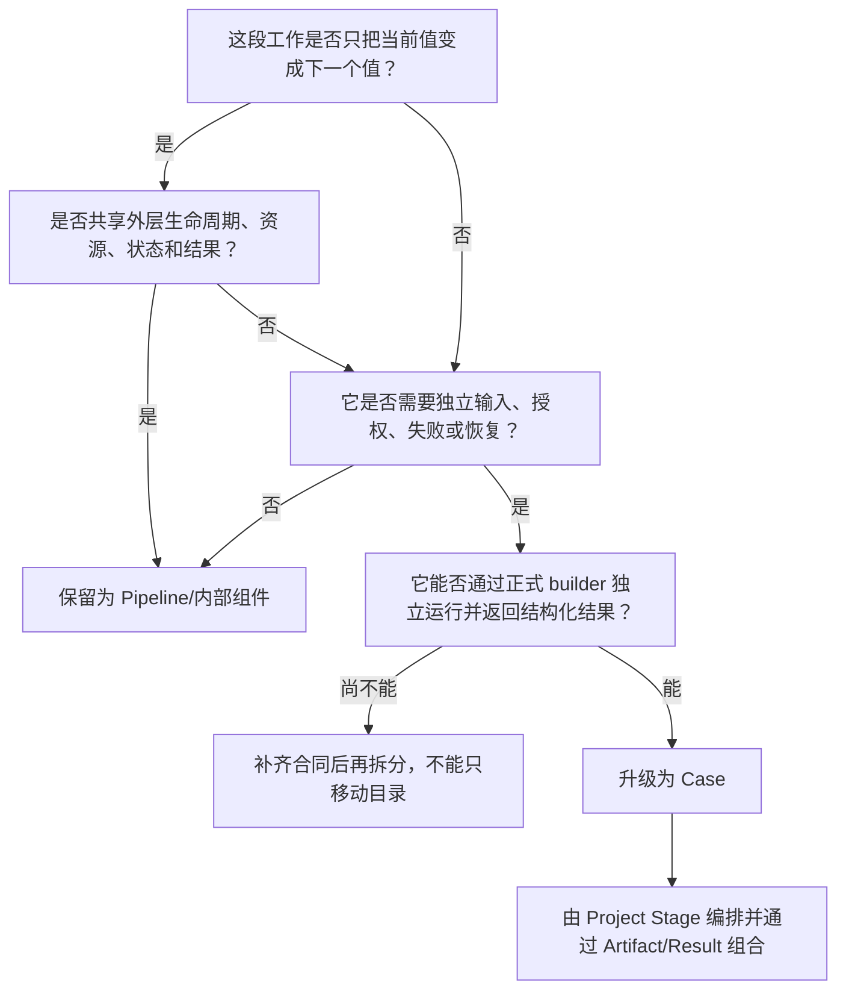
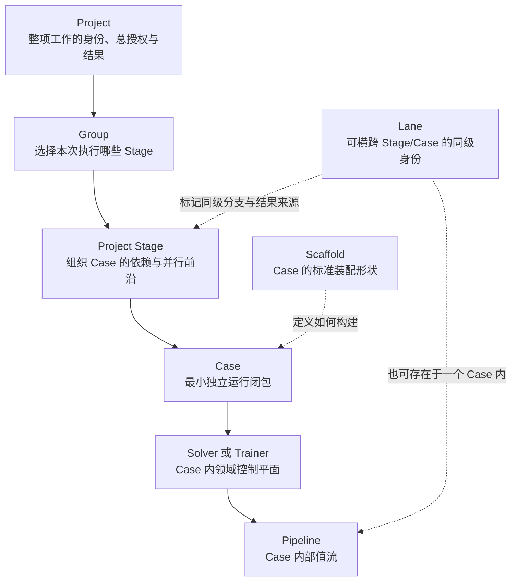

# 第八章　工作尺度：Project、Stage、Case、Scaffold 与 Pipeline

前七章解决的是架构为什么存在。我们从可信运行的一般问题出发，经过闭包、不变量、OR 与 ML 的共同计算语法，最终说明了 `blackbase`、`nsgablack`、`mlblack` 和外部边界分别保护什么责任。可是，知道责任属于哪一层，还不足以准确描述一次运行。用户说“这个阶段要并行”，可能指 Project 中的多个独立任务，也可能指一个 Solver 内的算法阶段，还可能只是 Pipeline 的两个算子；开发者说“把它拆成模块”，可能只是提取一个函数，也可能已经需要一个能独立恢复的 Case。若工作尺度没有统一语言，正确的仓库边界仍会被错误的运行边界破坏。

本章因此进入第一部的形式本体。所谓“本体”，不是用抽象词汇把工程重新命名，而是回答框架究竟把哪些东西视为同一种对象，以及这些对象之间允许建立什么关系。Project、Stage、Case、Scaffold 与 Pipeline 都与“组织工作”有关，却不是五种大小不同的文件夹。Project 关闭整项工作的授权与结果；Stage 表达 Project 依赖图中的执行边界；Case 是最小独立运行闭包；Scaffold 让 Case 具有可重复装配的外形；Pipeline 组织 Case 内部的值流。它们的差异来自闭合责任，而不是代码行数。

这种区别必须先于目录设计。一个只有二十行的远程评估任务，如果拥有独立资源、失败、重试和结果，就可能应该是 Case；一个包含上千行特征变换的 Pipeline，如果没有独立运行身份和结果责任，仍然只是一个 Case 的内部结构。规模不能由文件数量判断，嵌套层级也不能由调用栈深度判断。

本章会先建立判断尺度的共同问题，再依次说明五个对象。随后讨论 Group 与 Lane 为什么不是这条层级链上的新增台阶，解释 Solver 与 Trainer 为什么处于同一 Case 尺度，最后给出从 Pipeline 升级为 Case 的判定方法。为了避免把应然结构误写成现状，本章也会指出当前源码中 `Stage` 一词存在 Project 级与 Case 内部两种用法；二者可以共存，但必须明确限定，否则名字相同会掩盖不同的授权边界。

---

## 8.1 在命名对象以前，先判断它关闭了什么

考虑三个表面上都可以叫“步骤”的工作。

第一项工作把数值特征标准化，然后把类别字段编码，最后生成训练输入。每一步都接收一个值并返回另一个值；它们共享同一数据边界、同一错误所有者和同一训练任务资源。如果第二步失败，整个训练 Case 可以直接报告失败，不需要为编码步骤单独建立恢复身份。

第二项工作同时训练三个模型，分别使用不同可选依赖和设备额度，任何一个都可能独立失败，完成后再由比较阶段选择产物。这三个训练任务即使写在同一个 Python 文件中，也已经具有各自输入、资源、生命周期和结果。把它们称为三个普通函数，会让总授权、局部失败和产物身份无处安放。

第三项工作先运行数据诊断，再根据诊断结果选择是否执行符号搜索。用户有时只想运行诊断，有时只想运行符号搜索，有时希望两者都执行。这里除了独立任务，还出现了可选择的执行路径和阶段依赖。

若只按“代码是否复用”分类，这三项工作都可以被做成函数；若只按“是否有先后顺序”分类，它们又都可以被称为 Pipeline。框架需要更严格的判断。对任何一段工作，可以连续追问：它能否在获得正式输入后独立构建？能否获得一份边界明确的资源授权？能否独立开始、失败和结束？是否需要自己的恢复状态与审计记录？是否交付能被其他任务引用的正式结果？其失败是否可以在不窥探内部变量的情况下由上层处理？

这些问题不是要求所有答案都为“是”。它们用来发现责任在哪里闭合。如果一段工作只负责把当前值变成下一个值，资源与结果都归外层，它属于内部值流；如果它拥有独立输入、生命周期、状态、资源和结果，它已经成为独立运行单元；如果它安排多个独立运行单元并发或顺序执行，它处于更高的编排尺度；如果它进一步拥有整项工作的总授权、运行身份和最终结果，它构成 Project 边界。

可以先把尺度写成一组闭合问题，而不是名称列表：

```text
整项工作在哪里获得唯一 run identity、总授权和最终结果？
独立运行单元之间的依赖与并行在哪里声明？
哪一个单位能够独立 build、run、fail、recover、audit？
这个单位怎样获得稳定而可检查的装配外形？
单位内部的值怎样经过变换、路由、并行与合并？
```

这五个问题依次引出 Project、Stage、Case、Scaffold 与 Pipeline。顺序很重要：不是先创建五层目录，再向其中填入代码；而是先辨认五种闭合责任，再决定需要哪些对象和文件承载。

---

## 8.2 Project：一次工作的世界边界

Project 首先回答的是“哪些运行属于同一项工作”。如果一次实验训练三个模型、比较结果并发布最佳产物，四个步骤应共享一个顶层运行身份；如果一次外层搜索为每个候选启动内层训练，所有子运行应能够追溯到同一个总预算和输入版本；如果用户第二天恢复运行，系统需要知道恢复的是哪项工作、使用哪份配置、已经完成了哪些子任务。

因此，Project 不是装着 Case 的文件夹，而是一项工作的**世界边界**。在这个边界内，顶层输入、配置指纹、run id、总资源 offer 与 policy、共享预算、Stage 选择、Artifact 注册表、运行 manifest 和最终 ProjectResult 应当形成一致关系。边界之外的任务可以读取 Project 产物，却不能被悄悄计入同一份预算或状态历史。

Project 拥有全局视野，却不拥有领域细节。它知道 Case A 必须在 Case B 前完成，知道两个 Case 是否允许并行，知道总共只有八个线程和一张逻辑 GPU；它不知道 A 的 objectives 怎样比较，也不知道 B 的 validation loss 怎样解释。Project 发放的 ResourceContext 是有效许可，Case 声明的是资源需求。若需求超过许可，Project 可以拒绝、排队或按照已声明策略降级，却不能替领域层决定缩小种群或 batch 是否仍保持语义。

Project 的最终结果也不是最后一个 Case 返回值的随意别名。一项工作可能包含多个成功结果、部分失败、Artifact 注册表、资源审计和恢复信息。ProjectResult 应当说明选择了哪个 Group、执行了哪些 Stage 与 Case、每个 Case 的状态与耗时、哪些 Artifact 可以继续使用、整体为何成功或失败。CLI exit code 可以告诉操作系统命令是否成功，却不能替代这份结构化结果。

从形式上，可以把 Project 写成：

```text
Project = (
  identity,
  configuration,
  stage_graph,
  global_resource_authority,
  artifact_registry,
  run_manifest,
  project_result
)
```

这些元素不必全部驻留在一个对象里，但必须只有一套权威关系。两个 Project 可以使用相同 Case，也可以把前一 Project 的 Artifact 作为后一 Project 的输入；它们仍然拥有不同 run identity、资源账本和最终结果。Project 因而是资源闭包和证据闭包的最外层单位，而不是一个可复用算法组件。

当前 `blackbase.project` 的静态表面已经能看到 `CaseRunRequest`、`CaseRunResult`、`ProjectRunResult`、Project runtime config、run manifest、Group/Stage 解析和 Artifact registry 等对象。这支持上述本体，但仅能作为源码静态证据。真实运行是否在恢复、分布式 worker 和 Redis authority 下始终保持同一世界边界，需要后文的执行证据。

---

## 8.3 Case：最小独立运行闭包

Project 之下为什么还需要 Case？因为 Project 不能把每个函数调用都当作调度节点，也不能直接进入 Solver 或 Trainer 内部管理状态。它需要一种粒度：足够独立，可以被构建、运行、重试和审计；又足够完整，能够在自己的领域内交付有意义的结果。这个粒度就是 Case。

“最小独立运行闭包”中的每个词都有约束。**最小**表示如果再切开，子部分将失去独立输入、生命周期或结果责任；**独立**表示它不依赖父对象私有字段和隐式全局状态；**运行**表示它不只是配置或目录，而会真实消费资源、改变状态并产生结果；**闭包**表示正常结束、失败、恢复和审计都能在边界内说明。

一个标准 Case 至少要回答六个问题。它从哪里接收输入，怎样通过规范 builder 完成装配，消费哪份有效 ResourceContext，由什么控制平面推进生命周期，权威状态保存在哪里，最终返回什么结构化结果。输入可以包含普通配置、DataRef、ArtifactRef、SnapshotRef 和 component overrides；结果可以是优化方案、TrainerResult、Artifact、指标和审计记录。具体字段因领域而异，边界责任不变。

Case 的独立性并不要求它永远作为操作系统进程运行。本地 Project 可以在同一进程内 build 并调用，远程执行可以把请求放进任务队列，外层 Case 也可以短路调用内层 Case。运行位置可以变化，合同不能变化：同一 Case 不应因为被嵌套就改为读取父级私有状态，也不应因为在本地就跳过资源派生和结果信封。

独立失败是识别 Case 的重要信号。若模型训练失败，外层搜索可以将其记录为一次明确的内层失败并决定是否降级；若一个 Pipeline 算子失败，通常由所属 Case 接管并形成 Case 失败。只要上层需要针对某一部分单独重试、缓存、恢复、分配资源或选择性跳过，这部分就已经接近 Case 尺度。

但“可重试”也不是唯一标准。一个数据库读取算子可能有重试，却仍然只是一个 Case 内的 Provider 调用，因为它没有独立领域结果和完整生命周期；一个只有十行代码的模型转换任务可能需要独立 Artifact、版本和审计，因此可以成为 Case。尺度判断必须综合输入、资源、状态、失败与结果，不能靠单一特征。

Case 的权威边界还意味着大对象不能依靠调用者内存属性传递。若 Case A 训练模型，Case B 使用模型，A 应提交 Artifact 或 Snapshot 引用；B 通过正式输入获得引用，并验证 schema 与来源。共享 Python 对象可以作为同进程优化，但不能成为唯一合同，否则远程、恢复和重放都会改变语义。

这也解释了为什么一个 Case 通常只承载一个 Solver 或 Trainer。二者都是领域控制平面，都希望拥有生命周期、权威状态、错误与结果。如果在一个 Case 中并列两个互相独立的 Solver，却没有明确的父级结果与资源关系，这个 Case 实际上藏着一个未建模的 Project。反过来，一个 Trainer 内部使用若干紧密耦合的优化步骤，只要它们共同服务一份 Trainer 状态和一个结果，就不必机械拆成多个 Case。

---

## 8.4 Stage 与 Group：组织 Case，而不替代 Case

有了 Project 和 Case，还需要表达 Case 之间的执行结构。假设数据诊断完成以后才能训练，而三个模型训练可以并行，最终比较必须等待三个训练全部结束。仅列出四个 Case 名称无法表达依赖，仅按文件顺序执行又失去并行机会。Project 因而需要一组执行边界，把处在同一依赖前沿、遵守同一调度策略的 Case 组织起来；当前合同称这种边界为 Stage。

Project-level Stage 描述的是“这一批 Case 在什么前提下、以什么策略执行”。它可以声明 Case 集合、serial 或 parallel policy、资源请求、输入 Artifact、运行模式、外部执行配置和失败策略。前一 Stage 的正式 Artifact 可以进入后一 Stage，但后一 Stage 不能读取前一 Stage 的临时内存。Stage 完成意味着其包含的 Case 已按照策略形成可判断的结果，而不只是某个函数返回。

Stage 本身通常不是最小独立运行闭包。它不需要重新实现 Solver 或 Trainer 生命周期，也不拥有独立领域状态；它是 Project 对 Case DAG 的一种结构化切片。Stage 失败应当由包含的 Case 结果与声明策略推导，而不是另起一份和 Case 冲突的错误真相。Stage 可以拥有自己的名称、时间、调度事件与汇总状态，这些属于编排证据，不把它变成领域执行核心。

同一个 Project 还可能存在多种运行视图。开发时只跑 smoke Stage，日常任务只跑训练与评估，完整审计再运行全部 Stage。当前配置用 **Group** 为一组 Stage 名称建立可选择入口，例如 `default`、`diagnostics`、`symbolic` 或 `all`。Group 回答“本次选择哪条已声明执行路径”，不回答 Case 内部怎样运行。

因此，Group 不是比 Stage 更大的新运行单元，也不天然表示并行。选择 `all` 可能依次运行两个 Stage，选择 `benchmark` 也可能只运行一个包含多个并行 Case 的 Stage。Group 需要进入 run manifest 和 ProjectResult，因为它改变本次实际执行范围；它却不应拥有第二份资源 authority 或 Artifact registry。

这里必须处理一个现实中的术语重载。当前 `nsgablack.core.solver_stage` 与 `mlblack.core.trainer_stage` 也定义了 `StageSpec` 或串行 Stage runner，用来在一个复合 Solver/Trainer 内运行若干子阶段并传递 Artifact。它们与 Project-level Stage 名字相同，尺度却未必相同。若这些内部阶段共享一个 Case 的输入、授权、状态责任和最终结果，它们更接近**内部 phase**；若每个阶段都能独立构建、获得子级 ResourceContext、失败、恢复并交付正式结果，它们实际上已经接近子 Case，应通过 Project/Case 合同表达。

因此，阅读或设计 `Stage` 时必须加限定词：Project Stage、Solver phase、Trainer phase 或 Pipeline route stage。名字不能决定尺度。后续治理可以保留兼容类名，但文档、配置和运行报告必须显示其所属边界，避免同一个 `stage_name` 同时被当作 Project 调度节点和 Case 内算法阶段。

---

## 8.5 Scaffold：让 Case 可以被找到、装配和检查

Case 是运行闭包，但“应当独立”并不会自动让它独立。一个案例可能只有作者知道先导入哪个模块、先设置哪个全局变量、怎样创建 Problem、如何挂载 Plugin，以及运行结果藏在哪个对象属性中。这样的代码在本机脚本里能够成功，却无法被 Project 稳定构建，也无法在运行前检查资源与能力。Scaffold 就是在这里出现的。

Scaffold 不是另一个运行尺度，而是 Case 的**标准装配形状**。它让一个尚未启动的 Case 对上层可见：规范 builder 在哪里，运行入口在哪里，组件配置如何聚合，Problem、Pipeline、Adapter、Bias、Plugin、evaluation 与 runtime requirement 放在哪些职责位置。Project 借助 Scaffold 装配 Case，Doctor 借助 Scaffold 检查结构，开发者借助 Scaffold 替换组件；真正执行生命周期的仍是 Case 内的 Solver 或 Trainer。

这一区别可以用建筑类比理解，但不能被类比限制。Case 像一间能够独立工作的实验室，Scaffold 像实验室必须满足的接口图纸：门、供电、输入输出和安全出口在哪里。图纸不会自己做实验，却使不同实验室能够被同一园区接入。目录只是图纸的一部分，builder、配置、合同和检查入口同样属于 Scaffold。

当前统一合同规定 `build_solver.py` 为规范装配入口，`run_solver.py` 为规范 CLI/debug 入口；训练 Case 可以保留 `build_trainer.py` 与 `run_trainer.py`，但它们应当是薄别名。第七章已经解释，这个命名存在历史痕迹，却能防止两个 builder 同时成为事实来源。对 Project 而言，它只需要知道一个 canonical build surface；Case 的 `kind=solver|trainer` 决定领域语义和优先执行方法，不产生第二套目录形状。

一个好的 builder 不只是返回“某个对象”。它应接收 Project 注入的 ResourceContext 和公开 component overrides，装配真正启用的组件，把生效资源同步到 backend session，并在 check/build-check 中报告实际组合。若配置文件声明 Adapter A，builder 却仍装配默认 Adapter B，Scaffold 只是外观正确；若 `--check` 只回显配置意图而不检查构建结果，也不能证明 Case 具有真实装配闭包。

Scaffold 还应控制隐式依赖。Case 内模块可以相互导入，但规范入口必须能够在干净进程中解析；输入 Artifact 应从请求注入，而不是依赖开发者工作目录中的偶然文件；资源 token 应来自 ResourceContext，而不是读取机器固定编号；组件注册应在 Case 内闭合，而不是要求用户先运行另一个脚本修改全局 registry。

这也说明模板与真实 Scaffold 的区别。模板可以包含占位实现和教学说明，真实 Case 则必须替换占位组件、声明依赖并形成独立结果。把几十个示例都复制为外形相同但内部空洞的目录，不会提高架构一致性。Scaffold 的价值在于装配合同，而不在于目录数量。

从本体关系看，Scaffold 与 Case 是一对“定义形状—形成实例”的关系：Scaffold 规定如何构造运行闭包，Case 是一次能够实际获得输入和资源的运行单元。同一个 Scaffold 模式可以产生许多 Case，不同领域的 Case也可以共享同一 Scaffold 形状。Scaffold 本身不进入 Stage 调度；Project 调度的是通过 Scaffold 构建出来的 Case。

---

## 8.6 Pipeline：Case 内部的值流，不是缩小版 Project

Case 装配完成以后，内部仍然需要组织计算。优化候选可能依次经过初始化、编码、修复和解码，学习数据可能经过解析、数值化、特征变换和条件路由，评价过程也可能包含并行算子与结果合并。若这些步骤都硬编码进 Solver 或 Trainer，控制平面会被领域变换淹没。Pipeline 用来表达这类 Case 内值流。

Pipeline 的基本问题是：“当前值怎样经过一组已装配算子成为下一个值？”它可以拥有命名 slot、serial 或 parallel mode、route、merge、timeout 和取消策略；但这些能力仍然受到 Case 边界约束。Pipeline 继承 Case 的运行身份与 ResourceContext，错误最终由 Case 生命周期接管，大状态通过 Case 的 Snapshot/Artifact 合同提交，Pipeline 本身不创建新的顶层结果。

这使 Pipeline 与 Project Stage 看起来相似却本质不同。二者都能表达顺序和并行，但 Project Stage 编排的是拥有独立生命周期与结果的 Case，Pipeline 编排的是一个 Case 内共享生命周期的算子。Project 可以对某个 Case 单独重试、恢复或分配资源；Pipeline 中某个算子通常只能按照 Case 已声明的内部错误策略重试。Project Stage 之间传递正式 ArtifactRef，Pipeline 算子之间通常传递当前值和轻量上下文。

可以把差异写成：

```text
Project Stage：CaseResult / ArtifactRef → CaseRunRequest
Pipeline：      value + local context → transformed value
```

这不是类型上的绝对限制，而是责任上的默认。Pipeline 也可能处理 DataRef，Case 之间也可能传递小配置；关键在于前者的中间输出是否已经成为独立可交付结果，后者是否拥有独立运行闭包。

Pipeline 内部的并行尤其容易越界。两个分支接收同一可变 context 或同一可原地修改数组，会造成竞态；算子在超时后继续持有 Snapshot handle，可能产生晚到写入；无参数 ThreadPoolExecutor 会绕过 Project 授予的线程额度。因此 Pipeline kernel 即使位于 Case 内，也必须复用共享池、复制或只读化分支输入、传播 cancellation token，并使用 run namespace 拒绝失效写入。Case 内部不等于可以绕过 L0。

合并策略也需要区分结构语义与领域语义。`list`、`first`、`last`、`concat`、`sum` 或 `mean` 可以作为通用结构操作，但只有在 slot 合同声明结果允许这样合并时才合法。多个 Pareto 前沿不能因为 Pipeline 支持 `mean` 就求平均，多个模型 Artifact 也不能因为数组形状一致就拼接。Kernel 执行 merge，领域合同决定 merge 是否有意义。

当前 `blackbase.kernel` 提供 PipelineSpec、PipelineSlotSpec、PipelineOrchestrator 与 build kernel 表面，slot spec 中还存在名为 `stages` 的路由阈值配置。这里再次出现术语重载：slot 内 `stages` 表示某种随 generation 或 step 切换算子的局部策略，不是 Project Stage。配置与报告若不显示 `pipeline.slot.stages` 的完整路径，读者很容易误以为它能分配独立 Case 资源。

因此，Pipeline 是组合能力的重要部分，却不能成为所有编排的默认容器。只要其中某段工作开始要求独立 builder、独立资源、独立恢复、独立 Artifact 和独立失败处理，就应重新判断它是否已经超出值流尺度。

---

## 8.7 Lane 是同级身份，Solver 与 Trainer 是 Case 内控制平面

复杂项目还会出现 Lane。多条 Lane 可能使用不同算法、偏置、数据切片、模型家族或资源配置并行探索，然后通过共识、选择或 ensemble 汇总。因为 Lane 常常并行，又可能跨越多个阶段，人们容易把它看成 Project、Stage、Case 之后的另一层固定容器。实际上，Lane 不是稳定的工作尺度，而是一种**同级运行身份与比较语义**。

一条 Lane 表示“这一路为何与其他路不同”。差异可能来自机制先验、搜索策略、模型家族、数据区域、设备类型或实验假设。Lane identity 需要进入结果和证据，因为跨 Lane 汇总必须知道每个结果来自哪种条件。可是，Lane 自身是否成为 Case，要重新通过闭包测试决定。

如果三条 Lane 只是同一个 Solver 内使用不同只读参数的轻量分支，共享一份权威种群、一个生命周期和一个最终前沿，它们可以由 Adapter 或 Pipeline 的并行路由表达。如果每条 Lane 有独立 Solver/Trainer、独立状态、资源预算、失败和 Artifact，Project 就应把它们建成多个 Case，并在 Stage 中并行调度。如果一条 Lane 本身包含数据准备、训练与评估等多个独立 Case，它甚至可能由一组带 lane identity 的 Stage/Case 组成。Lane 描述横向身份，不预先决定纵向尺度。

Group 与 Lane 也不能混用。Group 是用户在启动 Project 时选择的一组 Stage，表达“本次运行哪条已声明路径”；Lane 是运行图中若干同级挑战者的身份，表达“这些结果为何需要分别观察和比较”。选择 `symbolic` Group 可能启动四条 Lane，也可能一条都没有；同一 Lane 也可能跨越多个 Stage。Group 属于执行选择，Lane 属于协作与结果语义。

这时可以重新看 Solver 与 Trainer。它们有时被误认为 Project 下两种不同层级：Solver 做外层编排，Trainer 只是 Solver 的内部函数。第七章已经否定这种固定关系，本章可以给出尺度上的理由。Solver 能独立推进优化生命周期、保存状态并返回优化结果；Trainer 能独立推进学习生命周期、保存状态并返回模型结果。只要二者满足 Case 闭包，它们就处于同一运行尺度。

外层和内层只是一次组合中的位置。超参数搜索中 Solver Case 位于外层、Trainer Case 位于内层；一个学习系统调用规划搜索时，Trainer Case 可以位于外层、Solver Case 位于内层。嵌套不改变被调用者的 Case 身份，也不允许调用者吞并其资源和状态语义。内层 Case 获得派生 ResourceContext，返回正式 CaseResult；外层只消费结果投影。

同理，SerialTrainer 或 SerialStageSolver 只有在子阶段共同构成一个不可分割的语义结果时，才适合留在单 Case 内。若子阶段可独立运行、各自拥有 Artifact 和完成策略，它们更自然地成为多个 Case，由 Project Stage 连接。复合控制平面不能因为继承关系方便，就代替 Project 级编排。

---

## 8.8 从 Pipeline 升级为 Case：一套可执行的尺度判定

到这里，五个核心对象和两个横向概念已经各就其位，但工程中最常见的问题仍然是“这一段到底要不要拆成 Case”。答案不能来自偏好，也不能只看它是否昂贵。可以用一组由弱到强的信号作判断。

最弱的信号是代码复杂：函数很多、目录很大、配置很长。这只说明需要内部模块化，不足以建立 Case。更强的信号是独立依赖与后端：某段工作需要 PyTorch、商业求解器或远程服务，但如果它仍然完全受一个 Case 的生命周期与结果控制，可以先作为 Provider 或 Pipeline 组件。再往上，若它需要独立资源 grant、独立取消与重试、独立 Snapshot/Artifact、独立完成条件，Case 边界已经出现。最强的信号是它必须被其他 Project 复用、单独运行或独立审计；此时继续藏在 Pipeline 内会直接破坏组合闭包。

可以把判定过程写成一棵小型决策树：



这棵树还隐含一个重要原则：升级为 Case 不是把文件移动到 `cases/` 就完成。新的 Case 必须补齐 builder、输入输出、资源需求声明、ResourceContext 注入、状态与 Artifact、错误与结果合同；原调用方要改为通过正式请求和结果投影组合。若只保留对旧对象的直接引用，目录变了，运行尺度没有变。

反过来，也不应把每个小步骤都升级为 Case。Case 越多，Project 需要管理的运行身份、资源 lease、Artifact 引用和失败状态越多。若两个步骤不能独立说明结果，拆开只会制造伪闭包。例如标准化和特征编码通常共同服务一份 DataView；候选 encode 与 repair 通常共同服务一次 Representation；它们适合通过 Pipeline 组合，而不是各自占用 Case。

最终可以把本章对象关系收敛为：



箭头不是目录包含关系，而是责任关系。Project 通过 Group 选择 Stage，Stage 调度 Case；Scaffold 规定怎样构建 Case；Solver 或 Trainer 在 Case 内关闭领域生命周期；Pipeline 组织其内部值流；Lane 可以横向标记 Case 或内部分支，不占据固定层级。

这套本体为后续合同提供了承载单位。资源授权从 Project 派生到 Case，Stage 只组织授权发生的顺序与并行；Context 与 Snapshot 首先属于某个 Case 运行，Project 通过 manifest 和引用建立全局证据；Pipeline 算子声明局部 I/O 和 context 合同，不创建第二份 Case 状态；Result 与 Artifact 沿 Case 和 Project 边界提交。后面讨论任何类型、状态、错误或生命周期时，都必须先说明它属于哪个尺度。

当前 Project runtime、`STAGES`/`GROUPS` 配置、CaseRunRequest/Result、统一 Scaffold 与 Pipeline kernel 为这些关系提供了 **D/S：声明与源码静态证据**。内部 Stage runner 和 lane-specific 研究代码则提醒我们，术语仍有历史重载，需要在报告与迁移中继续收紧。本章没有运行 Project check、Case build-check 或多 Stage 恢复，因此不声称这些尺度在所有现实路径上已经闭合。

下一章将从“工作有多大”转向“组件有何权力”。同一个 Case 内，Problem、Representation、Adapter、Controller、Plugin、Backend、Solver 与 Trainer 为什么不能互相替代，将不再通过目录说明，而通过它们各自拥有的决定来定义。只有工作尺度与角色权力同时明确，合同才能知道约束谁，状态才能知道由谁提交，错误也才能找到真正的所有者。

本章的尺度关系主要属于 **I：架构不变量的形式化展开**；当前配置和源码只提供 **D/S** 证据。其出口是一组能够承载后续类型、生命周期、状态与组合合同的正式运行单位。
