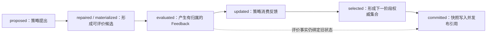

# 第十二章　身份、时间与版本：同一个“值”为什么不是同一个状态

第十一章建立了一条不能倒置的关系：UnknownState 经 Representation 成为 Candidate，Candidate 接受评价后产生 Feedback，Feedback 推动策略生成新的权威状态，运行最后才从已提交事实形成 Result。那一章还留下一个更困难的问题：如果两个 Candidate 语义等价，它们是否就是同一次提出？如果两份 Snapshot 内容相同，它们是否代表同一个提交点？如果恢复后的 generation 又从 20 开始，新的第 20 代与旧运行的第 20 代怎样区分？

这些问题不能继续靠比较值来回答。值描述对象“是什么”，身份描述“是哪一个”，逻辑时间描述“处于哪一步”，版本描述“按照哪套规则解释”，lineage 描述“由谁产生、从哪里继承”。五者经常相关，却不能互相替代。指纹相同可以说明两份状态在某种等价规则下内容一致，不能证明它们来自同一次评价；时间戳更晚可以说明墙上时钟读数更大，不能证明它在并行因果关系中一定是后继；schema version 相同可以说明字段可读取，不能证明状态属于同一 Representation 或同一数据版本。

框架进入并行、嵌套、重试和恢复以后，身份不再是为了日志好看而附加的字符串，而是运行正确性的坐标系。预算要知道哪次评价已经实际发起，取消要知道拒绝哪个运行分支的晚到写，缓存要知道一份 Feedback 能否复用，Snapshot 要知道自己提交的是哪个逻辑版本，Manifest 要知道哪些 Case 结果来自当前运行、哪些从历史运行恢复。没有这套坐标，系统可以保存很多数据，却无法证明数据之间的关系。

本章的命题是：**框架中的一个状态实例至少由语义内容、实例身份、逻辑位置、解释版本与 lineage 共同确定；只有值相同，不足以把两次运行事实合并。** 这不是要求所有对象都携带一张庞大身份证，而是要求每一次跨边界、复用、提交和恢复都能取得完成判断所需的最小坐标。

---

## 12.1 身份不是一个名字，而是一组逐层收窄的坐标

开发者常把 identity 理解为 UUID：给对象生成一个足够随机的字符串，碰撞问题就解决了。UUID 确实可以提供实例唯一性，但它不能独自回答对象位于哪次 Project 运行、属于哪个 Stage 和 Case、是否是某个父任务的重试、使用了哪份资源授权，也不能说明两份不同 UUID 的状态是否语义等价。

框架身份更接近一组分层坐标。一次最外层执行首先有 Project run；run 内有 Stage 和 Case；Case 内有 generation 或 step；一次 propose 产生若干 candidate instance；每个 candidate 可以触发一次或多次 evaluation task；evaluation 可能产生不同 attempt，由不同 Worker 和 lease 执行；最终某次 commit 又把选择后的权威状态写成一个可引用版本。不同问题需要不同深度，但身份越过边界时不能丢掉必要的父坐标。

```text
project_run
  └─ stage
      └─ case_run
          └─ generation / step
              └─ candidate_instance
                  └─ evaluation
                      └─ attempt / worker / lease
```

这棵树只是最小骨架，真实 lineage 可能形成有向无环图。一个新候选可能由两个父候选交叉产生，一个 Artifact 可能聚合多个 Stage 的输入，一次恢复运行也可能继承旧 Manifest 中多个成功 Case。因此父坐标不能永远只用一条文件路径表示；路径适合定位，lineage 需要可查询的边。

当前共享 Project 表面已经拥有这套坐标。ProjectRunResult 与 ProjectRunManifest 携带 `run_id`；CaseRunRequest 的 `CaseRunIdentity` 携带 project/root/case/parent/invocation/attempt/depth；外部 TaskEnvelope 映射 `parent_task_id`、`trace_id` 与 namespace；TaskResult 再关联 worker、lease 和起止时间。Project 外部任务还使用 `project:{run_id}:{stage}:{case}` 形成确定性 broker identity，用于关闭“任务已经提交，但 Manifest 尚未来得及记录就崩溃”的窗口。这些都是源码事实 **S**。

共享 Case 运行层现在已经用 `CaseRunIdentity` 明确 `project_run_id`、`root_run_id`、`case_run_id`、`parent_case_run_id`、`invocation_id`、`attempt` 与 `depth`，父子调用和外部 TaskEnvelope 都沿用这条 lineage。[S] 但这仍不等于候选评价层的身份已经闭合：候选反馈通常使用 generation 加批内 `individual_id`，Feedback 的核心字段尚未在所有 Adapter/Provider 路径拥有统一 candidate/evaluation identity。批内索引在一次函数调用中足够，却不能跨重排、重试或恢复保持全局唯一。因此应区分“Case run identity 已闭合”和“candidate-to-feedback identity 仍需收口”。

一份更稳妥的身份应允许组合而非拼字符串猜测。例如 candidate identity 可以在逻辑上表示：

```text
CandidateIdentity =
    project_run_id
  + stage_id
  + case_run_id
  + generation_or_step
  + proposal_batch_id
  + proposal_index
  + candidate_instance_id
```

并非每个字段都要成为人类可见长字符串。系统可以用紧凑 ID 作为主键，把其余坐标放入 envelope；关键是不能只剩 `individual_id=3`。在两代、两个并行 Case 或两个嵌套 Trainer 中都可能出现 3，它只是局部序号，不是身份。

---

## 12.2 三种“相同”：内容相同、语义等价与实例相同

第十一章已经说明 values 相等不一定 decode 成同一个 Candidate。本章需要进一步区分三种经常被一个 `==` 混在一起的关系。

第一种是内容相同。对于 ndarray，它可以是 dtype、shape 与 bytes 相同；对于结构化状态，还应包含规范化 metadata。内容指纹适合快速校验、去重和缓存候选键，但其结论受规范化规则约束。遗漏 decode-relevant metadata 会得到过宽的相等，包含临时日志时间又会得到过窄的相等。

第二种是语义等价。两份状态在当前 Representation 与任务合同下产生相同领域行为，即使编码不完全一致，也可以被视为同一种 Candidate。例如调度编码经过 repair 后得到同一可执行顺序，符号表达式经过规范化后代数等价，某些模型参数置换后输出函数不变。语义等价由 Representation 或领域规则定义，存储层没有资格猜测。

第三种是实例相同。即使两个状态内容完全相同、语义也等价，只要它们在不同 proposal、不同运行、不同 seed 或不同评价尝试中出现，它们仍是两个 candidate instance。随机评价可能为它们产生不同 Feedback；预算也可能分别为两次调用计费。实例身份回答的不是“能不能当成同一种方案”，而是“这条运行事实是否属于那一次出现”。

可以把三者写成不对称的判断关系：

```text
same_instance(a, b)  => same lineage position
equivalent(a, b)     => same domain meaning under Representation R
same_content(a, b)   => same canonical payload under schema V
```

它们之间没有普遍可逆关系。same instance 通常应该保持内容版本可追踪，但对象在原地可变时甚至可能出现“同一 Python 对象地址、内容已经变化”的危险情况；semantic equivalent 不保证评价样本相同；same content 也不保证 Representation 版本相同。因此框架不应提供一个含义模糊的全局 `is_same()`，而应让调用方明确自己要判断实例归属、语义复用还是字节完整性。

mlblack 当前默认 `unknown_state_fingerprint()` 将 values 的 dtype、shape、连续 bytes 与规范化 metadata 一起计算 SHA-256，ModelRepresentation 还允许覆盖 `fingerprint()` 和 `equivalent()`；更新后 Feedback 对齐使用的正是语义等价接口。这是源码事实 **S**，它解决了“只比较 values”的直接错误。但 SHA-256 指纹不是 candidate instance id。若同一个状态被评价两次，指纹可以相同，两次 evaluation id、seed、data revision、worker 和耗时仍然不同。

这种区分也决定去重政策。确定性、无副作用的评价可以在严格相同的 evaluator contract 下复用等价 Candidate 的结果；随机评价可以复用历史分布作为先验，却不能把一次样本当成本次实际观测；昂贵仿真即使输入相同，也可能因外部模型版本或场景数据改变而必须重算。缓存是否命中不是 fingerprint 单独做出的决定，而是 fingerprint、评价合同与版本坐标共同做出的决定。

---

## 12.3 从 run 到 evaluation：每一层身份在防止什么错误

分层身份不是为了让 payload 字段越来越多，而是每一层都关闭一种不同的歧义。run identity 防止不同启动互相覆盖；Stage 和 Case identity 防止组合结构中同名局部对象混淆；candidate identity 防止批量重排和重复值错绑；evaluation identity 防止重试、缓存与实际执行混为一谈；attempt、worker 和 lease identity 则防止超时或失去授权的执行者晚到提交。

run id 首先标识一次执行尝试。相同配置连续运行两次，得到的仍应是两个 run，因为开始时间、随机性、资源环境和失败位置可能不同。恢复也不应悄悄改写旧运行的历史。当前 ProjectRunRecorder 会为新运行生成 UTC 时间加随机后缀的 `run_id`，Manifest 保存 `resumed_from`，并拒绝在同一 run id 路径覆盖既有 Manifest；恢复前还校验 project、group、framework 与 config fingerprint。这项源码路径 **S** 已经把“新尝试”和“继承来源”分开。

Stage/Case identity 表达结构位置。Case 名字只在 Project 范围内才有意义，Stage 名字又决定同一 Case 是否处于不同阶段或依赖关系中。当前 Manifest 以 `(stage_name, case_name)` 索引成功 Case，Project artifact registry 也按 Stage/Case 注册产物。这能支持阶段级恢复，但名称变化会被视为结构变化；若未来允许同一 Case 在一个 Stage 中多次实例化，就还需要 invocation id，不能继续用名称二元组充当全部身份 **D**。

task identity 表达一次可调度工作。TaskEnvelope 以 task id 为主键，parent task 与 trace id 提供因果关联，namespace 隔离不同资源与存储域。外部 Project task 使用确定性 id 是有意设计：如果提交成功后进程在持久化 Manifest 前崩溃，恢复者可以用相同 id 查询 broker，而不是再提交一个重复任务。这说明 identity 有时需要随机以区分新实例，有时需要确定性以实现幂等；选择依据是生命周期语义，不能统一规定“全部 UUID”或“全部内容哈希”。

evaluation identity 则应位于 candidate 与 task 之间。一个 Candidate 可以被多个评价规范检查，也可以因重试形成多个 attempt。评价主身份应稳定表示“我们要得到哪条反馈事实”，attempt identity 表示“第几次、由谁实际尝试完成”。若每次重试都生成全新的 evaluation id，系统难以判断它们是不是同一逻辑工作；若所有重试共用一个 task id 而没有 attempt/lease fencing，晚到的旧 Worker 又可能覆盖新结果。

当前 TaskResult 已携带 task id、worker id、lease id、started/finished time 与 resource context，Project 外部执行也要求持久 L0 authority 下进行 fence 检查 **S**。但候选评价路径常以 `individual_id` 和 generation 构造 Context，并没有在共享 Feedback 中统一暴露 evaluation/attempt id。因此完整的设计应让候选评价生成稳定 evaluation id，再让每次调度生成 attempt id，并把 lease epoch 或 run token带到写边界 **D**。

这套层次还能解释 trace id 的位置。trace id 用于把跨组件、跨任务事件串成一条观察链，不必等同于 task id；同一 trace 下可以有多个并行 task，同一 task 的重试也可以保留 trace。trace 帮助观察，task/evaluation/attempt identity 决定幂等和状态所有权。把 trace id 当数据库唯一键，会错误地压扁合法的并行分支。

---

## 12.4 逻辑时间：状态不是“最新的”，而是处于某个已命名阶段

身份回答是哪一个对象，逻辑时间回答它在因果链中的位置。墙上时钟只能告诉我们进程观察到的时间，不能稳定表达并行事件的先后：两个 Worker 的时钟可能偏移，一项任务更早开始却更晚结束，超时分支甚至会在主流程提交新状态后继续写入。框架需要把算法和运行阶段显式命名。

对一代优化或一步训练而言，最小状态机不是“开始—结束”，而是 proposed、repaired/materialized、evaluated、updated、selected、committed。它们不是六份一定要永久保存的副本，而是六个具有不同事实强度的时点。



proposed 只说明 Adapter 已提出状态，它可能被预算或 Representation 过滤；evaluated 说明 Problem/Provider 已实际接受并产生反馈，同时预算成本已经发生；updated 说明策略内部状态已消费反馈；selected 说明环境选择或权威状态解析已经完成；committed 才说明对应 Snapshot 已成功写入，并且后续 Context 可以把它作为当前引用发布。任何阶段都不能因为变量已经赋值就冒充后一个阶段。

这条时序解释了 propose_context 与 update_context 的区别。propose_context 描述上一提交点，例如 evaluation count 仍是 90；本批 20 个候选评价后，update_context 应看到 110、更新后的 best 和新的评价事实。如果 update 继续读取旧 Context，预算、阶段切换和自适应策略会晚一个逻辑时间触发。Context 的正确性不只取决于 key 是否存在，还取决于它属于哪个 phase revision。

generation 与 step 是逻辑时间坐标，不是全局版本。nsgablack 通常使用 generation，mlblack 使用 step_index，共享 Plugin 生命周期将二者映射到相同阶段钩子；这有助于复用运行机制，却不意味着二者的领域含义完全相同。更不能只用 `generation=5` 给 Snapshot 定位：不同 run、不同 Case、恢复分支甚至嵌套外层/内层都可能有第 5 代。

事件序号可以补充局部全序。当前 nsgablack decision trace 包含 seq、timestamp、generation、step、run id 与决策输入输出，按 seq 回放 **S**。seq 在单一记录器范围内能表达先后，timestamp用于人类观察耗时；跨记录器或分布式 Worker 若没有统一序列 authority，就只能依赖父子关系、task identity 和提交协议建立偏序。文档不能因为每条事件都有时间戳，就声称已经拥有全局一致的事件顺序。

“当前状态”由此获得严格含义：不是 wall clock 最大、文件修改时间最新或变量最后赋值的对象，而是当前 run/Case 在允许的状态机中，已经完成最新合法 commit 的版本。Dashboard 展示的 latest、Controller 读取的 current、恢复入口选择的 last checkpoint 都应服从同一规则。

---

## 12.5 四种版本：逻辑修订、语义解释、协议结构与存储记录

工程中常见一个 `version` 字段承担所有演进含义。状态写着 version 2，开发者却不知道它是第二代候选、第二版 Representation、第二版 JSON schema，还是 SnapshotStore 中第二次覆盖。恢复能否继续、缓存能否复用和读取器能否解析需要的是不同版本轴。

逻辑 revision 描述一次运行内部的状态演进。它可以与 generation/step 相关，但一次 generation 内可能发生多次评价、选择与提交，因而更稳妥的是拥有独立、单调的 commit revision。逻辑 revision 用于比较“谁是当前权威”，不能由内容哈希替代：两次连续提交即使内容相同，也代表控制平面已经经历了两次不同事件。

语义 version 描述 Representation、Problem、数据或评价规范怎样解释内容。相同 UnknownState payload 在 representation v1 和 v2 下可能产生不同模型；相同 Candidate 在 data revision A 和 B 上产生的 Feedback也不是同一事实。语义 version 决定能否复用评价与恢复运行，通常需要 assembly signature、component version、data checksum 和 evaluator policy 共同表达。

protocol/schema version 描述字段结构怎样读写。当前 UnknownState protocol payload 和 ProjectRunManifest 都有显式 schema version；Manifest 读取器对非当前版本直接拒绝，而不是猜测字段。这是清晰的源码事实 **S**。兼容迁移可以增加显式 migration，但“能够 parse 旧 JSON”不等于旧运行语义与当前代码兼容。

storage record version 描述同一个逻辑 key 在 Backend 中的写入代次、CAS revision 或 object generation。它用于处理并发覆盖和 stale handle。当前 SnapshotHandle 携带 key、backend、schema、meta 与 created_at，快照 key通常包含 generation/step 与随机后缀；这些字段足以定位记录 **S**，但 Handle 本身没有统一的单调 record revision。若存储后端允许覆盖同一 key，created_at 和 key name 仍不能替代正式的 compare-and-set 语义 **D**。

Project config fingerprint 展示了版本组合的一种实践。当前 blackbase 对 project_config、Case 下 Python/`.case` 文件以及 group/framework 计算 SHA-256，resume 时要求 fingerprint 与 Project 身份匹配。这能阻止明显不同的工程配置误接旧 Manifest **S**。但它不是完整环境指纹：外部数据、模型权重、Provider 服务版本、依赖锁文件和机器驱动不一定都包含其中。白皮书应把它称为 Project 配置指纹，而不是“整次运行绝对可复现证明”。

因此，版本判断应该明确提问：我现在要确认的是结构可读取、语义可解释、逻辑上更新，还是存储上未被并发覆盖？只写 `version=3` 会让四个问题互相冒充。恢复需要至少同时通过 schema compatibility、semantic compatibility 与 lineage authorization；缓存命中则需要 semantic compatibility 和评价条件一致，不要求同一逻辑 revision；权威提交比较需要逻辑/storage revision，不关心内容是否碰巧相同。

---

## 12.6 Lineage：恢复、嵌套、重试和派生都不是复制粘贴

identity 把节点区分开，lineage 解释节点之间怎样产生关系。没有 lineage，恢复后的运行看起来像一次全新启动，嵌套 Trainer 的结果不知道对应哪个外层 Candidate，重试成功的 TaskResult 也无法说明替代了哪个失败 attempt。开发者往往用目录层级或文件名表达这些关系，但一旦任务进入 Redis、对象存储或远程 Worker，路径就不再是可靠的因果模型。

恢复是一种 lineage，而不是覆盖。新 run 继承旧 Manifest 中经过验证的成功 Case、Artifact refs 和外部 task link，同时保留自己的 run id 与新的失败/完成状态。当前 ProjectRunManifest 通过 `resumed_from` 和 config fingerprint 表达这一关系，Project runner 可以把历史成功 Case 标为 resumed **S**。这种设计保留旧证据并形成新尝试，比“打开旧 manifest 原地继续写”更容易审计。

嵌套运行也是 lineage。外层 Candidate 触发内层 Trainer 时，内层 run 至少应记录 parent candidate/evaluation identity、父 ResourceContext namespace 与父 lease；返回的 TrainerResult 再被投影成外层 Feedback。当前 nsgablack→mlblack Bridge 会把 outer individual id 和 outer generation写入 UnknownState metadata，并以 `mlblack.{individual_id}` 派生子 namespace；ResourceContext.derive_child 还保留 parent namespace 与 parent lease id，并限制 child threads 不超过父授权 **S**。这些字段建立了局部父子关系，但仅用 individual id 仍不足以跨 run 唯一定位父 Candidate，完整 lineage 还需要上节的复合身份 **D**。

重试则需要区分逻辑工作与执行尝试。evaluation E 可以有 attempt A₀、A₁；A₀ 超时后 A₁ 获得新 lease 并成功，最终 Feedback 属于 E，却应注明由 A₁ 产生。A₀ 即使后来返回，也不能覆盖 A₁ 的已提交结果。取消 event 只能请求 A₀ 停止，真正阻止晚到写还需要 fencing token、lease epoch 或当前 attempt revision 在存储边界校验。TaskEnvelope/TaskResult 已有 task、parent、worker 与 lease 字段，Project 持久 L0 路径也有 fence 检查 **S**；所有 Context/Snapshot/Artifact Backend 是否统一拒绝失效 attempt 的晚到写，仍需专门一致性证明，不能从一个入口推断全局已实现。

派生状态也需要领域 lineage。进化算法的 offspring 可以有两个 parent candidate，局部搜索状态可以由一个 anchor 派生，训练中的 θ₁ 由 θ₀ 与 Feedback g₀ 更新得到，Artifact 则可能由多个 Snapshot 和数据输入构建。lineage 边至少应表达 relation type，例如 `mutated_from`、`crossed_from`、`updated_from`、`selected_from`、`resumed_from`、`derived_from_artifact`。如果只保存 parent id 而没有关系类型，后续无法解释是复制、聚合还是替代。

lineage 不应把全部 payload 再复制一遍。节点保留稳定 identity 与自身记录，边保留父子、转换组件、逻辑时间和必要证据引用；大对象通过 Snapshot/Artifact ref解析。这样同一 Candidate 可以同时参与多个评价，同一 Feedback 可以被某次 update 消费，某个 Result 也可以追溯到多个提交节点，而不必制造一个无限嵌套的 JSON。

---

## 12.7 缓存键与随机种子：必须从身份和语义派生

缓存与随机数看似是性能和可复现性细节，实际上最直接地检验身份体系是否完整。缓存键过窄会把不相干的 Feedback 当成同一事实，过宽则让任何复用都失效；随机种子只在顶层设置一次，在并行和重排后仍可能得到完全不同的子序列。

一份评价缓存的最小键不能只有 candidate fingerprint。它至少取决于 namespace、Candidate 的语义指纹、Representation/Problem/evaluator signature、数据或场景 revision，以及影响评价的随机条件。可以写成：

```text
EvaluationCacheKey = H(
    namespace,
    candidate_semantic_fingerprint,
    representation_signature,
    evaluator_signature,
    data_revision,
    stochastic_policy,
    seed_or_sample_identity
)
```

资源数量是否进入 key 要看它会不会改变语义。线程数只影响速度时可以不进入；非确定性 GPU kernel、不同数值精度或 Backend 实现会改变允许误差和结果时，就应进入 evaluator signature 或 reproducibility policy。缓存不应盲目包含 run id，否则跨 run 永远无法复用；也不应完全忽略 namespace 和租户边界，否则不同 Project 可能读到不该共享的数据。

语义等价与缓存命中也不是一回事。Representation.equivalent 只说明候选领域含义相同，缓存仍要确认评价合同相同。相反，两个 candidate instance 即使不是同一次提出，在确定性评价下也可以合法共享同一缓存 Feedback，但返回时应保留 cache source evaluation id，不能伪装成本次 Provider 真的执行了一次；预算策略还必须说明 cache hit 是否计入 evaluation count 或 cost budget。

随机种子应由稳定身份派生，而不是由线程调度顺序决定。理想形式是 `seed = H(base_seed, identity_path, stream_name, attempt_policy)`，使用稳定哈希或 SeedSequence，而不是 Python 进程随机化的 `hash()`。这样 candidate 7 的随机流不会因为 candidate 3 提前失败、并发任务换序或新增一个无关 Plugin 而改变。

当前 nsgablack `fork_rng(stream)` 会为每个 stream name 缓存 Generator，但新 stream 的 child seed 是从父 RNG 按首次请求顺序抽取；`get_rng_state()` 保存主 Generator 状态，`set_rng_state()` 恢复主状态后清空子流缓存。这是源码事实 **S**。它在固定调用顺序下可重复，却不自动保证并发重排后的身份稳定，也不保存已消费子流的独立状态。后续若追求严格 replay，应让子流从 base seed 与身份路径确定性派生，或者把所有活跃子流状态纳入 checkpoint **D**。

随机评价的 retry policy 还要回答重试是否沿用相同 seed。若目的是重现因基础设施错误中断的同一 evaluation，通常应保持 sample identity；若目的是追加 Monte Carlo 样本，新的 attempt 实际上应成为新的 evaluation sample，不能伪装成同一尝试。身份模型先区分 evaluation 与 attempt，seed policy 才能清楚表达这两种行为。

---

## 12.8 Stale handle：引用只有在提交时序中才具有“当前”含义

SnapshotHandle 看起来只是 key、backend、schema、meta 与 created_at 的组合，真正危险的却是“latest”这个关系。Handle 本身只指向一条记录；它从来不会自动知道自己是不是当前版本。所谓 latest snapshot，是某个 run/Case 的控制平面在完成合法提交后发布的一条可变指针。

stale handle 的典型形成过程是：第 0 代评价后生成 handle H₀，Context 把它发布为 population ref；第 1 代完成 Adapter update，却没有再提交或更新 latest pointer；随后 Controller、Plugin 和 Result builder 都从 Context 读取 H₀。数组、目标和 generation 字段可能各自看起来合法，整条运行却一直引用旧状态。另一个形成方式来自并发：超时分支持有旧 run token，在主分支提交 H₁ 后才写入 Hlate，并把 latest 指针覆盖回错误版本。

防止 stale 不能只靠在 key 中加入 generation。key 名称是标签，commit protocol 才决定可见性。一次正确提交至少具有如下顺序：先解析 update/selection 后的权威状态；验证 population、Feedback 与 identity 对齐；用新的逻辑 revision 写完整 Snapshot record；确认写入成功；最后以带 run/case/revision 的条件更新 current ref。任何一步失败，旧 current ref仍然有效，新记录可以作为未发布或失败记录保留，不能发布半成品。

```text
resolve authoritative state
→ validate identity + shape + feedback alignment
→ write snapshot(revision = r+1, complete = true)
→ storage acknowledges durability
→ publish current_ref with compare-and-set(r -> r+1)
→ emit committed event
```

当前 nsgablack ComposableSolver 在 Adapter update 后解析 Adapter 权威 population，并通过统一 commit path写 population snapshot；Solver 的 `_persist_snapshot` 会在 generation 变化时生成新 key，在同一 generation 内可以复用当前 key，成功写入后更新 `_latest_snapshot_handle` 与 `_snapshot_generation`。这条单进程时序是源码事实 **S**，已经修复了“第一次有 handle 后永远不再刷新”的直接问题。mlblack 也在 update 后区分 evaluated 与 authoritative population，再写 step snapshot **S**。

但这仍不能单独证明跨 ContextStore 与 SnapshotStore 的原子发布，也不能证明所有远程 Backend 都实现 compare-and-set 与 fencing。SnapshotHandle 当前没有统一的 run id、case id 和单调 revision 一等字段，它们可能出现在 key 或 meta 中；不同存储实现对覆盖、TTL 和并发的语义也可能不同。完整的一致性提交将在后文专章处理，本章只给出判断标准：created_at 更新、key 看起来更新或 Context 中出现 snapshot ref，都不能独自证明“当前权威版本已提交”。

相应的验证需要覆盖因果关系，而不只是读写成功。测试应构造同值不同 candidate instance，证明 Feedback 不会串绑；构造同一 candidate 的两次随机评价，证明 evaluation identity 不同；改变 decode-relevant metadata，证明语义 fingerprint 随之变化；恢复相同 generation，证明新 run 不会覆盖旧 Snapshot；打乱并行执行顺序，证明身份派生 seed 稳定或明确记录不稳定政策；让旧 attempt 在新 commit 后晚到，证明 fence 拒绝其写入；模拟 Snapshot 写成功但 current ref发布失败，证明恢复能够识别未发布记录。只有这些合同测试 **T** 和真实 Backend 运行 **R** 才能把源码结构提升为可靠性证据。

到这里，第十一章的状态与反馈终于有了坐标：UnknownState 有语义内容与实例身份，Candidate 有 Representation 解释版本，Feedback 有 evaluation/attempt 归属，权威状态有逻辑 revision，Result 有 run 与 lineage，Snapshot handle 只有经过 commit 才能成为 current ref。下一章因此可以准确区分 Context、Snapshot、Artifact、Event 与 Manifest：它们不再只是五种保存格式，而是分别承载不同时间尺度、可变性、所有权和证据责任的信息载体。

本章关于身份分层、逻辑阶段和版本正交属于 **I：状态与证据闭包的不变量**；Project run/task/manifest、ResourceContext lineage、状态指纹、decision trace 与更新后提交路径提供 **S：源码证据**；统一 Candidate/Evaluation/Attempt identity、身份派生随机流以及跨 Store 的 CAS/fencing 仍有 **D：设计收口**。最终判断可以浓缩为一句话：**同一个值可以在不同运行中出现很多次，语义等价可以允许复用，但只有身份、时间、版本与 lineage 一起成立时，框架才有资格说“这条反馈属于这个状态，这个引用就是当前提交”。**
