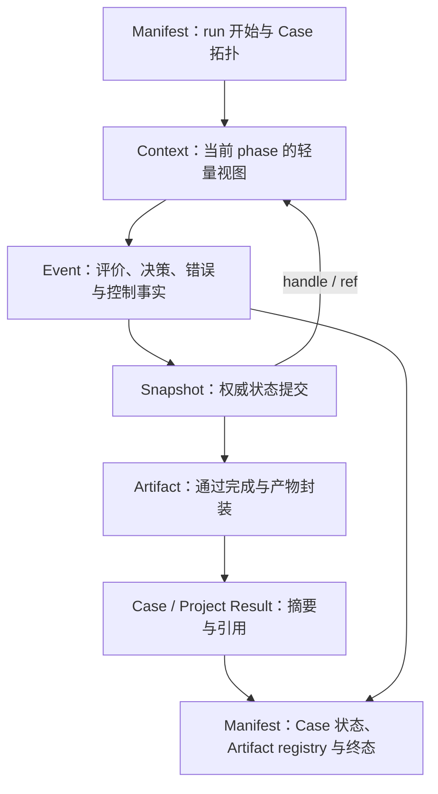

# 第十三章　五类信息载体：Context、Snapshot、Artifact、Event 与 Manifest

第十二章为运行对象建立了身份、逻辑时间、版本和 lineage。现在可以回答一个此前总会陷入争论的问题：一份信息究竟应该放在哪里？如果只按 Python 类型判断，population 是 ndarray，模型可能是任意对象，错误是字符串，资源授权是字典，似乎都可以塞进一个 Context；如果只按“需要持久化”判断，Snapshot、Artifact、Event 和 Manifest 又都能落盘，似乎只是文件后缀不同。这样的分类没有触及它们真正的职责。

五类载体并不是五种存储技术，而是对五个不同问题的回答。Context 回答“组件在当前时点需要知道什么”；Snapshot 回答“某个提交点的权威运行状态是什么”；Artifact 回答“哪项产物应被下游或未来运行继续使用”；Event 回答“刚才发生了什么事实”；Manifest 回答“整次 Project 运行由哪些 Case 构成、目前处于什么状态、最终留下了哪些可恢复结果”。它们可以使用相同的 Redis、文件系统或对象存储，也可能共享 JSON 信封，但不能因为 backend 相同就互换语义。

这一区分的重要性在于，同一项业务内容可能在五种载体中留下不同投影，却不能被完整复制五遍。一个 population 的大矩阵属于 Snapshot；当前 Context 只携带 snapshot ref、population size 和必要统计；一次 population commit 形成 Event；若最终 Pareto 解集要交给别的 Project，它可以被提升为 Artifact；Manifest 最后只登记产生该 Artifact 的 Case 状态与引用。每个载体都保留自己完成职责所需的部分，彼此通过 identity 和 ref连接。

本章命题是：**信息载体由时间尺度、所有权、可变性、写入频率、保留周期和消费方式共同定义，而不是由对象类型或存储介质定义。** 只有这六个维度明确，Context 轻量、Snapshot 权威、Artifact 可复用、Event 可追溯和 Manifest 可恢复才会成为一套相互配合的协议，而不是五个重叠的数据仓库。

---

## 13.1 先问信息在回答什么，而不是先问它能存到哪里

假设一代优化刚刚结束，系统同时拥有 generation、evaluation count、当前种群、目标矩阵、一次预算截断原因、Pareto front、决策 trace、资源 grant、一个训练出的代理模型以及本次 Case 的完成状态。如果没有载体边界，最常见的实现是把这些内容合进一个大字典，然后把字典同时称为 context、checkpoint、result 和 report。短期内所有消费者都能“拿到数据”，长期却会出现四类冲突。

第一类冲突是更新频率。generation 和剩余预算会被频繁读取，population 每代提交一次，模型 Artifact 可能只在训练结束产生，Event 每次决策都追加，Manifest 则在 Case 状态变化时重写。把它们放进同一对象，会迫使所有信息采用同一种写频率：要么大对象被高频复制，要么关键控制状态迟迟不刷新。

第二类冲突是可变性。Context 是当前视图，可以被生命周期阶段更新；Snapshot 应表示一个已经命名的状态截面，发布后不应被调用者原地修改；Artifact 代表可复用产物，通常以内容或版本固定；Event 是已经发生的事实，原则上只追加；Manifest 在运行中是可原子替换的汇总，结束后成为终态记录。若一份可变字典同时承担这些职责，任何字段修改都可能改写历史。

第三类冲突是保留周期。Context 可以带 TTL 并在运行结束后清理；中间 Snapshot 可以按恢复窗口淘汰；正式 Artifact 可能需要跨运行长期保存；Event 的保留策略服从审计要求；Manifest 至少要活到恢复和治理不再需要它。把所有内容放在同一 Redis key 下，TTL 到期时会一起消失；全部永久保存又会让高频状态无限膨胀。

第四类冲突是消费方式。Controller 希望低延迟读取当前预算，恢复器希望按 schema 一次加载完整状态，下一 Stage 希望通过稳定引用取得模型，审计器希望顺序扫描事实，Project runner 希望快速判断哪些 Case 可以恢复。一个万能 payload 要么让每个消费者理解全部内部字段，要么产生大量不受治理的局部解析器。

因此，载体分类应从问题出发。当前控制决策所需的轻量投影进入 Context；恢复或回放所需的权威状态截面进入 Snapshot；跨阶段、跨 Case 或跨运行使用的正式产物进入 Artifact；不可逆的运行事实进入 Event；运行拓扑、终态和引用索引进入 Manifest。Result 不是第六个同类存储，而是对调用者的终态返回，它引用或摘要这五类载体，后文会说明它怎样把它们连接起来。

这一分类也允许同一内容经历“晋升”。训练中间模型首先可以是 Snapshot 的一部分，用来崩溃恢复；经过完成检查、schema 封装和完整性校验后，它成为正式 ModelArtifact；Artifact ref 再被登记进 Manifest。晋升不是复制文件再换名字，而是增加新的消费承诺。一个 Snapshot 恰好能被另一个 Stage 读取，并不自动让它拥有 Artifact 的版本、兼容和长期可用合同。

---

## 13.2 Context：当前计算的轻量控制视图

Context 最容易被滥用，因为它通常表现为 `dict[str, Any]`，每个组件都能方便地读写。它的真正价值不是容量，而是让相邻组件在同一个逻辑时点共享必要的控制信息：当前 generation/step、candidate identity、evaluation count、少量指标、resource context、停止信号，以及 Snapshot/Artifact 的引用。

“轻量”不能用某个固定字节数机械定义，但至少包含三层约束。Context 中的值应该能被低成本复制或序列化，不应拥有需要独立关闭的外部资源，不应成为大状态的唯一权威。一个十几个字段的 ResourceContext 字典适合进入；完整 population、模型对象、全部 history、长 trace、数据库连接和 GPU session 不适合。若某个 best_state 只有三个浮点数，内联或许无害；若它是一亿参数模型，字段名仍叫 best_state 也不能因此豁免。

Context 还是一个有 phase 的视图。propose_context 表示评价前，update_context 表示评价后；同样的 `evaluation_count` 在两个 Context 中都合法，却属于不同逻辑时间。因而 Context 最好携带或可推导 run/case/generation/phase identity，并在组件合同中声明 requires、provides 和 mutates。否则读取者只知道 key 存在，不知道它是否已经 stale。

ContextStore 只是这一视图的后端接口。当前共享实现提供内存与 Redis 版本、get/set/update/delete、TTL 和当前键值快照 **S**。这里 `ContextStore.snapshot()` 只是“复制当前 KV 视图”的方法名，不等同于 SnapshotStore 的权威状态提交。若开发者看到 snapshot 这个词就把它当 checkpoint，便会混淆 API 操作与载体本体。

规范 key 解决的是另一部分问题。generation、evaluation count、snapshot key、resource context 和各种引用应来自共享 registry，兼容 alias 在边界规范化后得到同一名称。它能避免 `bestobj`、`best_f` 和 `best-objective` 形成多个事实源，却不能自动保证 value 足够小，也不能保证写入时点正确。key governance、size governance 与 phase governance 必须同时存在。

当前 nsgablack 的 Context 构建路径会先清理 ContextStore 中的 population、objectives、violations、Pareto、history 和 decision trace，再构建当前视图，附加 Snapshot refs，经过 Plugin 投影后再次剥离大字段并写回轻量 Store。这是明确的源码事实 **S**，也体现了“Plugin 有机会增强 Context，但不能突破大对象边界”的原则。需要大状态的组件可以通过显式 helper 读取 Snapshot，在局部内存中使用，不能把水合后的对象原样长期写回 Context。

mlblack 当前 build_context 会投影 run name、step、best score、population size、ResourceContext 和 compute backend，也会直接复制 best_state 数组 **S**。这在小参数状态中可能足够轻，但状态规模并没有由字段名保证。更严格的收口应对 best_state 应用尺寸阈值或统一 state/snapshot ref；Context projection 只保留 fingerprint、shape、score 与 handle **D**。同样，ContextEvent 若把大量 value 和事件列表直接积累在 Context 中，也会逐步破坏轻量边界；Context 可以镜像最近事件或 event ref，长期事件流应另有载体。

因此，Context 的判断问题不是“下游会不会用到”，而是“下游此刻是否需要低成本取得这项控制信息，以及它是否能从权威载体重新解析”。答案为否的对象不应进入 Context；答案为是但对象很大的，进入的是 ref 和摘要，而不是本体。

---

## 13.3 Snapshot：一次提交点的权威状态截面

Snapshot 回答的不是“现在有哪些 key”，而是“在某个逻辑提交点，继续运行所需的权威状态是什么”。它可以包含 population、objectives、constraints、Adapter state、Trainer state、RNG state、必要 history 游标和外部 warm-start ref。哪些字段必需由具体 Case 的恢复合同决定，但 Snapshot 必须作为一个有 schema、有身份、有完整性状态的整体解释。

共享 SnapshotStore 将接口分成 Handle 与 Record。Handle 提供 key、backend、schema、meta 和 created_at，是适合放入 Context、Result 或 Manifest 的轻量引用；Record 在 Handle 基础上携带 data，只有真正读取时才把大对象带回进程。这项源码结构 **S** 正好体现“引用流动、本体留在权威存储”的边界。

Snapshot 的 envelope 也很重要。Store 的 write 合同接收 Mapping，但训练阶段可能需要保存任意通用 payload。若调用方为了满足 Mapping，写成 `{snapshot_key: payload}`，读取者就会得到额外一层与 key 重复的结构；另一个调用方又可能直接保存 payload，最终同一 read API 返回两种形状。当前共享 `wrap_snapshot_payload()` 使用固定 marker 与 `value` 字段，`unwrap_snapshot_payload()` 统一解包；mlblack 写通用 Snapshot 已走这条 envelope，并只在读取端兼容历史 `{key: payload}` 形式 **S**。兼容分支应帮助读旧数据，不应继续成为新写入协议。

Snapshot 还要区分 incomplete 与 complete。评价前可以为了调试保存 candidate population，但它没有 objectives/Feedback，不应被恢复器当作已完成一代；Adapter update 后的权威 population 可能有一部分状态未评价，也不能伪造 feedback alignment。nsgablack 的 snapshot metadata 可记录 complete 与各数组 shape，mlblack population snapshot v2 同时记录 authoritative 和 evaluated 两组对象及 `feedback_aligned` **S**。这些字段建立了检查条件，但真正的 complete 仍要由 schema validator 根据身份、cardinality、Adapter state 和恢复需求判断。

Snapshot 与 checkpoint 经常被当作同义词。可以把 checkpoint 理解为“被恢复政策选中的 Snapshot + 生命周期/组件状态 + 可继续入口”。并非每个 Snapshot 都足以 checkpoint：只有 population 而没有 Adapter 内部账本，只有模型参数而没有优化器状态，或者只有主 RNG 而没有子随机流，都可能只能用于观察，不能精确续跑。SnapshotStore 负责保存记录，Case 的 checkpoint contract 负责定义哪些记录可恢复。

TTL 与不可变性也需要明确。中间 Snapshot 可以设置 TTL，说明它只服务近期恢复或观察；正式 checkpoint 需要符合更长保留策略。一个 key 被重复 write 在技术上可能可行，但发布后的 Snapshot 最好按内容或 revision 保持不可变，新提交生成新记录，再更新 current ref。否则旧 Event 和 Manifest 虽然仍引用同一 key，读到的内容已经变化。当前不同 Backend 对覆盖和并发的具体语义不完全相同，跨 Store 的原子发布仍属于后续一致性章节的证明对象 **D**。

Snapshot 因而处在运行内部与证据外部之间。它比 Context 重、比 Event 更接近状态、比 Artifact 更关注续跑。它可以成为 Artifact 构建的输入，也可以被 Event 和 Manifest 引用，但不能独自说明这次运行为什么作出某个决策，或某个模型是否已经被批准为长期产品。

---

## 13.4 Artifact：从运行状态晋升为可消费产物

Artifact 的关键词不是“大对象”，而是“对下游作出稳定消费承诺”。一个很小的类别映射可以是 Artifact，一个很大的临时 population 也可能只是 Snapshot。判断依据是对象是否要跨 Stage、Case、Project 或运行继续使用，是否拥有明确 producer、schema、版本、完整性与读取方式。

共享 DataRef 提供跨 Case 的中立引用：uri、kind、backend、media type、checksum、size bytes 与 metadata。CaseRunRequest 可以携带 input artifacts，CaseRunResult 返回 artifact refs，Project Manifest 再登记它们。这条共享表面 **S** 不要求 blackbase 理解模型或 Pareto 的私有含义，只保证引用能够运输和审计。真正的领域 Artifact schema 仍由生产它的语义层拥有。

mlblack 的 ModelArtifact、TrainerStateArtifact、RunReport 与 ArtifactBundle 展示了这种领域封装。ModelArtifact 不只保存 model，还记录 family、head、Representation 与 metadata；TrainerStateArtifact 表达 checkpoint-style state 与 signature；RunReport 与模型、Trainer state分离；ArtifactBundle 最后把三者及 Snapshot refs组合。默认保存同时写 pickle payload 和 JSON 描述 **S**。JSON用于审计，pickle承载任意 Python模型对象；pickle 只能从可信来源加载，不能因为有一份 JSON 旁车就变成安全的跨信任边界格式。

Stage 内还有另一类名为 ArtifactRef 的轻量对象：小 payload 可以 inline，大 payload 通过 SnapshotStore 保存后以 uri解析。nsgablack 与 mlblack 当前各自保留相似的 Stage ArtifactRef 实现，这是迁移期的源码事实 **S**。它更接近“阶段数据传递引用”，不应与共享 DataRef 或最终 ModelArtifact 混成一个概念。长期应明确哪些引用只在复合 Case 内有效，哪些可跨 Case/远程运输，并让正式跨边界表面收敛到共享协议 **D**。

Snapshot 晋升为 Artifact 需要额外动作。系统应选择一个已提交状态，验证其 schema 和完整性，封装领域解释，计算 checksum 或 signature，写入目标 backend，再产生稳定 ref。Artifact 可以引用其来源 Snapshot，而不是把所有 lineage 展平复制。若只是把 `last_population_snapshot` 的 key 改名为 `model_artifact`，下游仍不知道怎样 decode、是否已完成训练、依赖哪份 DataView，也无法判断兼容版本。

Artifact 的更新通常使用新版本或新 identity，而不是原地改写。同一个 URI 若内容变化却 checksum 不变或为空，Manifest 和缓存都会失去可信度；同一个 model name 可以指向多个版本，但“latest model”与“latest snapshot”一样只是一个可变索引，不是 Artifact 本身。可审计系统应让 Result/Manifest 固定引用具体版本，再由部署或用户界面维护另一个显式 alias。

Data 也可以成为 Artifact。训练所用 DataView 的完整内存对象不适合进入 Context，但其 schema、split policy、checksum 与可解析 DataRef 可以作为输入 Artifact；报告、图表、导出的 Pareto front、符号表达式包和模型卡同理。Artifact 的关键不是它看起来像模型，而是它已经从一次运行内部状态变成可由外部消费者独立理解的交付边界。

---

## 13.5 Event：记录已经发生的事实，而不是保存当前真相

Snapshot 是状态截面，Event 是状态怎样变化的事实。一次预算 reservation 被建立、候选被派发、Provider 返回、Adapter 完成选择、取消被请求、lease 丢失、Snapshot 提交，这些都是 Event。它们不应该通过修改旧事件来反映当前状态，而应追加新的事实；当前状态可以由事件投影得到，也可以由 Snapshot 加后续事件恢复。

一个可审计 Event 至少需要 event identity 或局部 sequence、run/case/task identity、逻辑 phase、发生时间、source、event type、输入摘要、reason、outcome 和相关引用。大 payload 不必内联，Event 可以引用 candidate fingerprint、Snapshot handle、Artifact ref或 Error record。事件越靠近事实发生边界记录，越能减少事后根据最终变量猜测过程的歧义。

当前共享 ContextEvent 记录 kind、key、value、timestamp、source、generation 与 step，并提供 set/update/append/delete 的 Context replay **S**。它适合表达轻量 Context 变化，却还不是完整的持久 Event store：value 可以很大，事件当前可被追加到 Context 列表，异常在 non-strict replay 中还可能被跳过。若把它用于长运行证据，应该把事件流移出 Context，本地只保留 ref 与短窗口。

nsgablack 的 DecisionTracePlugin 走得更远。它为决策事件分配递增 seq，记录 run id、generation、step、component、decision、reason code、inputs、thresholds、evidence 和 outcome，并追加 JSONL、生成 summary 与 artifact path **S**。这足以提供源码层面的决策追踪表面，但“deterministic replay”不能仅由日志文件名称或类注释证明：如果事件没有捕获随机流、外部 Provider 版本或全部状态转移，ReplayEngine 只能重放或筛选记录，未必能重新计算出同一结果。完整确定性仍需测试与运行证据。

Event 与日志也不完全相同。日志面向人类诊断，可以包含自由文本、重复消息和格式化上下文；Event 面向机器判断，需要稳定 schema、identity 和不可歧义的 reason/outcome。日志可以从 Event 渲染，Event 不应依赖解析日志文本才能恢复语义。错误同样应该先形成结构化 Error/Event，再由 logger输出；只有 `"something failed"` 的一行文本不足以支持重试、预算结算或所有权判断。

事件不可变并不意味着整个 Event 文件永远不能轮转、压缩或按保留策略删除。它意味着一条已经发布的事实不能原地改成另一条事实；纠正需要追加 supersedes/corrects 事件。当前 DecisionTrace 配置允许在 run 初始化时覆盖同名文件，因此真正隔离仍依赖唯一 run id与输出路径 **S**。若多个运行都使用默认 `run`，覆盖策略可能损害证据；规范装配应注入真实 run identity，而不是把默认值当生产安全策略 **D**。

---

## 13.6 Manifest：整次运行的可恢复账本

Manifest 经常被写成一份运行结束后的摘要 JSON，但它的首要职责其实在运行过程中：记录 Project 身份、配置指纹、Stage/Case 状态、外部 task link、Artifact registry、失败位置与恢复来源，使新的进程能够判断哪些工作已经合法完成、哪些需要重新执行。

Manifest 与 Event 的差别是“当前账本”与“事实序列”。Event 说 Case A 在某时开始、某 task 被提交、某 attempt失败；Manifest 说当前 run 中 Case A 的权威状态是什么、它留下了哪些 Artifact refs。Manifest 可以根据新事实被原子重写，Event 应追加。只保存 Manifest 能恢复当前状态，却解释不了完整过程；只保存 Event 理论上可以重建状态，但启动时需要扫描和验证大量记录，也更容易受不完整 schema 影响。二者互补。

当前 blackbase ProjectRunManifest 包含 schema version、run id、project/group/framework、config fingerprint、status、exit code、started/updated time、resumed_from、Case records 与 Artifact registry **S**。ProjectRunRecorder 在开始时写 running Manifest，在外部 task 提交后先持久化 task identity，Case 完成后登记 status、错误、耗时与 Artifact refs，最终写入终态；写入采用临时文件再 replace，避免普通文件路径上留下半截 JSON **S**。

原子替换保证的是单个 Manifest 文件写入完整，不自动保证它与 SnapshotStore、外部 broker、Artifact backend 和 lease store形成分布式事务。源码中特意在外部 task 场景使用确定性 task id并提前登记，是对“submit 成功、Manifest 未写就崩溃”窗口的补偿；其他跨 Store 提交仍需要各自的幂等、fencing 与恢复协议。Manifest 是协调这些引用的账本，不是能够让所有后端自动原子的魔法容器。

Manifest 也不是完整 Result。ProjectRunResult 面向当前调用者，包含 Case results、Artifact registry、status、run id、Manifest path 与 resumed_from；Manifest 面向持久恢复，可以被之后的进程重新读取。Result 可以引用 Manifest，Manifest 不必复制 Result 中所有展示字段。反过来，Dashboard 可以从 Manifest 投影进度，却不能把页面当前显示称为 Manifest authority。

恢复时，Manifest 必须同时通过结构和语义检查。当前读取器严格要求 schema version，恢复入口还校验 project、group、framework 和 config fingerprint **S**。这能阻止明显不匹配的 Project 恢复；Artifact checksum、外部数据 revision、依赖环境和 Case 内 checkpoint 是否兼容，还需要相应语义层验证。Manifest 声称 Case 成功，并不自动证明它引用的 Artifact 仍存在、未损坏且当前代码可读取。

终态 Manifest 最好保持不可改写，后续恢复形成新 run，并通过 resumed_from 建立 lineage。这样原始失败或成功记录仍是事实，新运行可以明确说明继承了哪些 Case。若在原 Manifest 中把 failed 改成 success，审计者会失去失败曾经发生的证据，也无法区分原运行与恢复尝试。

---

## 13.7 五类载体怎样共同形成 Result 与恢复路径

五类载体不是各自完成后再拼成一张报告。它们在运行中按因果次序协作：Project 启动时创建 Manifest；Case 由 Manifest 中的结构和 ResourceContext 启动；生命周期构建当前 Context；组件产生 Event；控制平面在合法时点提交 Snapshot，并把 Handle 投影回 Context；Case 完成后将选择的 Snapshot 状态封装为 Artifact；Case Result 返回摘要与 Artifact refs；Project 再把 Case 终态和 Artifact registry写回 Manifest。

正常完成时，这条链让 Result 保持轻量而不失证据。OptimizationResult 可以内联小型 Pareto 指标，同时引用保存完整 population/front 的 Snapshot 或导出 Artifact；TrainerResult 可以返回 best state/feedback 的摘要，同时让 ModelArtifact 承担长期模型交付；ProjectRunResult 则给出 Manifest path和 Artifact registry。调用者不必读取全部历史即可得到结论，需要审计或恢复时又能沿引用返回事实。

失败时，这条链更能显出价值。Context 可能已经包含 stop_requested，Event 记录 Provider 超时和已消耗预算，最近 complete Snapshot 保存上一个合法提交点，部分生成的 Artifact 尚未登记为正式产物，Manifest 把 Case 标为 failed并保留错误和外部 task link，Result 返回失败 status 与 Manifest path。系统不需要通过返回一个零数组伪装成功，也不会因为最后一代失败就丢掉此前可恢复状态。

恢复时，新的 Project 先读取并验证旧 Manifest，解析已成功 Case 的 Artifact refs与未完成 Case 的 checkpoint Snapshot；创建新 run 和新的 Manifest，通过 resumed_from建立 lineage；恢复器把 Snapshot 状态装入 Case，而不是把旧 Context 整包还原；必要的 Event sequence和随机状态用于继续运行；新 Result 和 Artifact 最终属于新 run。Context 是重建出来的当前视图，不是恢复源本身。

这也说明 Result 不应暗中拥有另一套大对象仓库。Result 中的 population、history 或 model如果可能很大，应通过正式引用交付；若为了交互便利内联小对象，需要 schema 明确说明内联与引用两种形态。一个字段有时是 ndarray、有时是字符串 key、有时是 SnapshotRecord，会迫使所有调用者做猜测分支，应使用 envelope 或独立 `*_ref` 字段。

generic payload envelope 在这里承担的是结构统一，而不是语义统一。它让 SnapshotStore 能无歧义保存任意 payload，但 payload 若要成为 Artifact 或 Result，仍要经过各自 schema。`unwrap_snapshot_payload()` 成功只能证明拿回了原层级，不能证明模型可加载、Feedback 对齐或 Case 可恢复。

---

## 13.8 对象归类不是单选题，而是受阶段约束的投影规则

理解五类载体后，可以重新处理那些最容易争议的对象。正确答案通常不是“某对象永远只能出现一次”，而是明确本体落点与其他载体允许保留的投影。

population、objectives、violations 和运行中 Pareto front 的本体属于 Snapshot，因为它们是高频变化、用于续跑的权威状态。Context 可以保留 size、best score、front size、current snapshot ref；一次 front 改善形成 Event；最终需要交付的 Pareto 解集可以导出为 Artifact；Manifest 只登记其 Artifact ref和生产 Case。

模型对象在训练中可能属于 Snapshot 的 Trainer state，训练结束并通过完成检查后成为 ModelArtifact。Context 只放 model ref、family、head 或小型 capability 摘要，不能放已拟合 estimator 本体。外层优化把内层训练结果投影成 Feedback时，仍应保留内层 Result/Artifact lineage，不能只留下目标数组。

DataView 在 Case 内可以是 Problem/Trainer 已加载的运行对象，但跨 Case 输入应通过 DataRef与 schema表达；Context 只携带 data ref、split id、schema id 或尺寸摘要。若数据是固定输入 Artifact，Manifest 可登记其引用或 checksum；数据加载、切分和版本选择则形成 Event。把完整 X/y 复制到 Context 会同时破坏轻量边界与数据版本判断。

history 与 trace 也不是同一种东西。压缩的最近指标窗口可以进入 Context，完整代级状态历史更适合 Snapshot 或专门的历史 Artifact；decision trace 的每条记录属于 Event 流，最终 JSONL 与 summary 可以作为 Artifact 被 Result引用。把整个 trace 列表长期保存在 Context 中，会让每次 Context 构建成本随运行长度增长。

配置的生效摘要可以进入 Context，完整 Project/Case 配置及 fingerprint应由 Manifest或配置 Artifact保存；“采用 fallback CPU”的事实形成 Event。资源 grant 的当前轻量结构属于 Context，lease 分配/释放/丢失属于 Event，最终实际资源摘要进入 Result/RunReport，Manifest保留恢复需要的运行状态。错误首先是结构化 Error/Event，当前错误状态可以投影到 Context，终态错误摘要进入 Result与 Manifest，长堆栈或诊断包可以成为 Artifact。

报告若只是当前指标 view，可以由 Context 渲染；正式 RunReport 是 Artifact 或 Result 的组成；Dashboard 只是读取 Context、Event、Manifest和 Artifact生成的视图，不获得新的权威性。相同道理适用于 Catalog：它说明组件可发现和声明的能力，不存储这次运行的当前状态，也不能替代 Manifest。

验证五类载体要围绕边界失败设计，而不只是分别测试 CRUD。Context 测试要证明大对象会被剥离、规范 key与 phase ref正确；Snapshot测试要覆盖 envelope往返、schema、complete/incomplete、TTL 和真实 Redis codec；Artifact测试要覆盖 checksum、领域解码、跨 Stage/Case引用与不可信 pickle边界；Event测试要覆盖 identity、顺序、重复、丢失和只追加语义；Manifest测试要覆盖原子替换、崩溃窗口、resume fingerprint、Artifact缺失与终态不可改写。组合测试还要模拟 Snapshot成功但 ref发布失败、Artifact写成但 Manifest未登记、Event晚到以及恢复时 Context重建。

当前源码已经提供 ContextStore、规范 key与大对象剥离、Snapshot Handle/Record和通用 envelope、DataRef与领域 Artifact、Context/Decision/Resource Event、Project Manifest与 Result引用表面，可标记为 **S**。这些实现分布在共享底座与两个语义层中，个别 ArtifactRef、Context projection和事件持久化仍处于迁移收口阶段；是否满足真实 Redis、远程 Worker、长运行和恢复语义，需要合同测试 **T** 与运行证据 **R**，不能由类名推断。

本章至此为一致性提交、恢复和证据闭包准备了材料：Context提供现在，Snapshot保存提交状态，Artifact交付长期产物，Event保留发生事实，Manifest维持整次运行账本。下一章将转向另一组经常被塞进普通配置字典的对象——资源、预算、截止时间、取消与错误。它们不仅要被某种载体保存，更要沿父子运行传播、改变生命周期状态，并由明确 authority作出决定。

本章的五类载体边界属于 **I：状态与证据闭包的不变量**；共享 Store、Handle、DataRef、Event表面、ArtifactBundle与 ProjectRunManifest提供 **S：源码证据**；统一跨框架 ArtifactRef、尺寸强制、持久 Event authority和跨 Store原子发布仍包含 **D：设计收口**。最终原则并不是“每种数据只放一个地方”，而是：**每项事实只有一个权威本体，其他载体只保留与自身职责相称的摘要、引用或不可变事件；任何复制都必须能够说明来源、时点和失效规则。**
