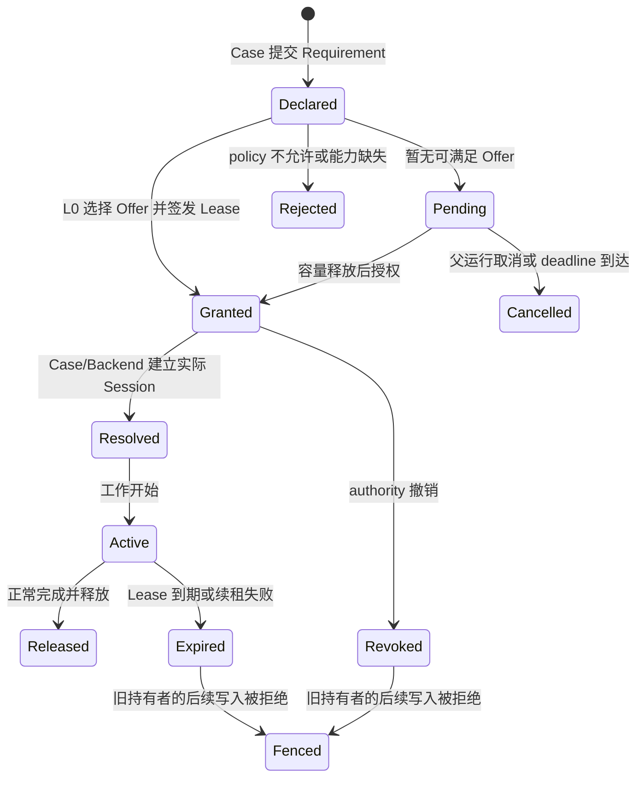
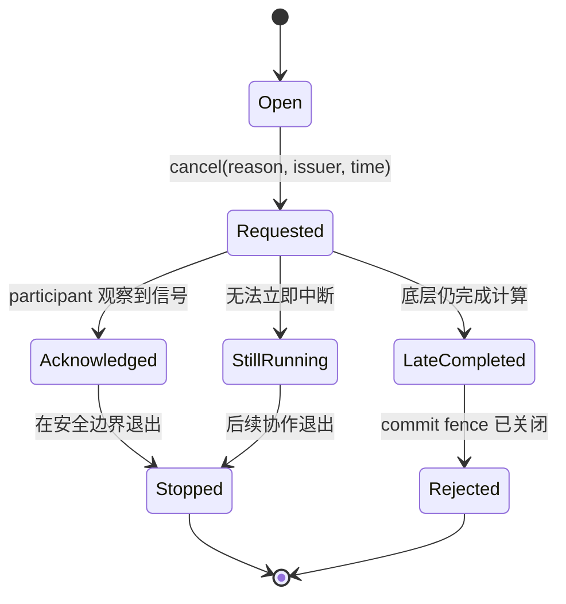
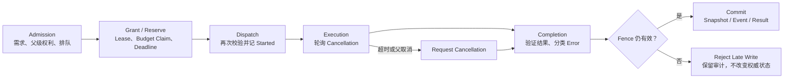

# 第十四章　控制对象：资源、预算、截止时间、取消与错误

第十三章把运行信息分配给了 Context、Snapshot、Artifact、Event 与 Manifest。于是一个更深的问题随之出现：放入这些载体的内容，是否都只是等待组件读取的数据？答案是否定的。population snapshot 描述某个提交点的状态，model artifact 描述可以交付的产物；但“这个 Case 最多还能发起多少次评估”“这个子任务是否仍有权使用两条线程”“父运行取消以后这个分支还能不能提交结果”，并不是普通事实描述。它们会决定某个动作是否允许发生，也会让仍在运行的对象失去原有权利。

这就是资源、预算、截止时间、取消与错误需要被单独讨论的原因。它们当然可以被序列化成数字、布尔值或字典，也可以投影进 Context、Event 和 Manifest，可它们的本体不是这些字段。`threads=4` 若只是一个配置值，任何子组件都能把它改成 32；`evaluation_count=90` 若被误当成预算，两个并行 Case 都可能认为还剩 10 次；`timeout=30` 若被误当成强制终止，主线程停止等待以后，后台分支仍会继续写 Snapshot；`on_error` 若每层都认为自己应该调用一次，同一故障就会触发两三次恢复和告警。数据形状看起来都合法，运行权利却已经失真。

因此，本章讨论的不是五项功能，而是一类共同对象：**控制对象是由明确 authority 签发或解释、在作用域内约束未来动作、沿父子运行单调传播，并以状态转移留下证据的协议对象。** 资源 grant 决定允许使用什么执行能力；预算 claim 决定允许消耗多少稀缺成本；deadline 决定最迟何时还可继续；cancellation token 撤销继续推进的意图；error record 则在某个动作未能履约时确定失败发生在哪一阶段、由谁处理以及能否重试。

这五者并不完全同构。资源通常先授权再使用，预算在预留与消耗之间结算，deadline 由时间单调逼近，取消信号只能从未请求走向已请求，错误则是一次失败事实及其处理责任。但它们共享四个不能省略的问题：

1. 谁拥有决定权，谁只是提出需求或消费授权；
2. 这个决定对哪个 run、Case、attempt、branch 和 namespace 生效；
3. 当前处于什么状态，下一步允许发生哪些转移；
4. 发生竞争、失败、超时或恢复以后，用什么证据拒绝旧参与者继续产生副作用。

若这四个问题只存在于开发者脑中，框架仍然只是“把很多组件接了起来”。只有当它们进入正式协议，复杂的优化、训练、嵌套评估和并行流水线才真正拥有可执行边界。

---

## 14.1 从配置值到控制对象：关键差别是决定权

普通配置描述偏好或声明。例如用户希望使用 GPU、希望最多运行一小时、希望并行四个分支。控制对象描述的是声明经过某个权威边界后，当前运行实际上获得了什么权利，以及这项权利是否仍然有效。两者之间至少隔着一次解析或授权。

以线程数为例，Case 声明 `threads=8` 只说明需求。Project 可能因为整机只剩四条可分配线程而授予四条，也可能排队等待，或者按 strict policy 直接拒绝。Case 真正能消费的是 grant，不是 requirement。Trainer 随后选择的计算 backend 又可能只启用两条线程；这两条才是 resolved execution。于是“请求八条、授予四条、实际使用两条”不是矛盾，而是三个不同逻辑时点。真正的错误，是 Dashboard 只展示请求值，却声称运行使用了八条；或者 backend session 仍然运行在 CPU，而审计只因为 requirement 写了 GPU 就报告 GPU 已生效。

预算也一样。`max_evaluations=100` 是限额，`evaluation_count=90` 是某种运行计数，`reserved=6` 是已经承诺给在途工作的额度，`committed=88` 是权威账本确认的消耗。它们不能互换。如果两个 Case 同时读到 count=90，再各自发起十次评估，单靠计数器无法阻止总量到 110。必须存在能原子处理“检查剩余量并预留”的 Budget Authority。

控制对象因而至少应具有如下逻辑结构：

```text
ControlObject
  identity      它是哪一个控制对象或哪一次 claim/token/lease
  kind          resource | budget | deadline | cancellation | error
  authority     谁能签发、推进或终结它
  subject       它约束哪个 run/case/task/attempt/branch
  scope         它在哪个 namespace 与生命周期范围内有效
  state         当前状态与允许的下一状态
  version       revision、lease epoch 或 fencing token
  policy        不足、超时、失败、重试时采用什么规则
  evidence      reason、timestamps、usage、owner 与相关引用
```

这里最容易混淆的是 authority 与 observer。Plugin 可以观察预算接近耗尽并提出 stop 建议，Controller 可以根据最新 Context 产生控制决策，但它们不因此自动成为 Project 级资源或共享预算的签发者。Adapter 可以根据剩余预算减少 propose 数量，却不能私自提高预算。Backend 可以报告实际设备和内存占用，却不能把未获授权的 GPU “发现”成可用资源。职责清晰的系统允许多方提供信号，只允许一个明确边界对同一控制域作最终裁决。

当前框架栈已经出现了这种分层。blackbase 的 Project/L0 负责资源 lease 与共享预算 authority；ResourceContext 将授权投影给 Case；nsgablack 的 Solver 控制平面在本地生命周期中消费评估预算并执行停止决策；mlblack 的 Trainer 与跨框架 Bridge 接收派生后的子 ResourceContext，而不应另行创造全局 lease。这些是源码结构可以确认的事实 **S**。它们还不等于所有控制域已经得到完整运行证明：例如跨进程 deadline 的统一表达、所有 Provider 对取消的响应程度、实际硬件占用与 grant 的一致性，仍需测试或真实运行证据 **T/R**，不能由类名直接推定。

一旦把控制对象看成权利而不是字段，就会自然得到一条贯穿本章的原则：**子运行可以放弃或缩小父运行授予的权利，不能自行扩大；旧运行可以被撤销，不能因为仍持有一个 Python 引用就继续提交。** 前者是父子派生的单调性，后者是 fence 的必要性。后面的所有状态机，都是这条原则在不同控制域中的展开。

---

## 14.2 资源不是“机器上有什么”，而是“本次运行获准使用什么”

资源控制从需求开始，却不能停在需求。一个完整路径至少包含 ResourceRequirement、Offer、Grant、Lease、Resolved 与 Usage 六个视角。ResourceRequirement 由任务声明需要什么；Offer 描述某个执行位置能够提供什么；Grant 是 authority 在策略、容量和并发竞争下批准的子集；Lease 把 grant 绑定给有身份和有效期的持有者；Resolved 表示 Solver、Trainer 或 Backend Session 实际采用的设备与执行器；Usage 则是运行后的观测。省略其中任何一层，都会让“资源声明”和“实际资源”混在一起。

例如一个内层训练 Case 声明需要一块 GPU、四条线程和 8 GiB 显存。Project 的某个 worker offer 中有一块空闲 GPU 与八条线程，于是 L0 为父 Case 签发一项 lease，并在 ResourceContext 中给出 device token、threads、backend、namespace、lease id 与 fencing token。外层 Solver 为一次候选评估创建内层 Trainer 时，只能从该 ResourceContext 派生子 grant：线程数可以从四条收窄到两条，namespace 可以增加 `candidate-017` 后缀，scope 可以变成 `inner-training`；但子对象不能把线程改成八条、换用第二块未授权 GPU，或自行生成一个看似有效的 Project lease。

当前共享 `ResourceContext.derive_child()` 会把子线程数限制为不超过父值，保留父 lease，并记录 parent namespace 与 parent lease id；它明确声明自己不会签发新的 Project-level lease **S**。这个实现传达了正确的基本方向，但还要理解它的边界：复用同一父 lease 不等于多个孩子各自获得了完整父容量。如果父 grant 有四条线程，外层一次并行启动四个“每个最多四条”的孩子，单个 child clamp 全部合法，总 fanout 仍可能超额。对子任务逐一做 `child <= parent` 是必要条件，不是总量调度的充分条件；并发总和仍须由共享 Pool、semaphore、lease ledger 或 Project scheduler 约束。

这也解释了为什么 Pipeline parallel 不能在组件内部随手创建一个无界线程池。并行策略可以声明分支结构，真正执行必须复用 ResourceContext 注入的 Pool 或 executor，并把 worker limit 限制在 grant 内。当前 blackbase 的 PipelineOrchestrator 会优先读取注入的 pool/executor 与资源上下文，按 worker limit 分批提交；分支输入和 Context 也会在执行前复制，并给可写 runtime handle 套上取消 fence **S**。这些设计不只是性能优化，它们把“并行几个”从局部实现细节提升为可审计授权。

资源状态可以概括为：



Lease 解决的是“谁在多长时间内持有这些资源”，fencing token 解决的是“旧持有者晚到时怎样被识别”。假设 worker A 获得 lease token 41，网络中断后 Project 判定它失联并把同一资源重新授予 worker B，token 递增到 42。A 随后恢复网络，仍可能完成旧任务并尝试写 Result。仅检查 lease id 或进程是否存活不够；持久化边界必须验证当前 token，拒绝 41 的晚到写。Fence 不是终止 A 的计算，它只是撤销 A 让副作用进入权威世界的资格。

namespace 与 fence 相互补充。namespace 隔离“写到哪里”，token 判断“当前是谁有权写”。只有 namespace 而没有 token，旧 worker 仍可覆盖同一运行空间；只有 token 而没有 namespace，不同 candidate、branch 或 attempt 的对象容易互相误认。一个嵌套训练任务的运行身份通常应能追溯到 `project/run/case/candidate/attempt`，其 Snapshot、Event、budget claim 和 result 都携带或可推导同一血缘。

最后必须回到 Resolved 与 Usage。ResourceContext 是被动 grant，不是实际 backend session。Trainer 构造以后若更换 ResourceContext，却没有同步重建 ComputeBackendSession，审计与执行就会分叉；这正是框架此前必须修复的运行问题。正确顺序是先获得 grant，再以 grant 解析 backend 和 device，建立 session，最后报告 requested/granted/resolved/observed 四组字段。fallback 也应是正式决定：请求 CUDA、获准 CUDA、初始化失败后退到 CPU，必须记录原因与是否符合 policy；不能悄悄回退后仍保留“GPU run”的标签。

资源控制的目标因此不是尽量填满设备，而是使每一次执行都能回答：谁申请、谁批准、批准多少、实际采用什么、何时失效、谁释放，以及旧持有者为何不能再写。只有完成这条因果链，资源才从配置项变成运行边界。

---

## 14.3 预算是一套结算协议，计数器只是其中一种观测

预算经常以一个整数开始，也最容易被一个整数毁掉。`max_evaluations=100` 看起来只需在循环末尾检查 `evaluation_count >= 100`；可一旦出现 batch、并行、失败、重试、缓存、嵌套 Case 或付费 Provider，这个检查就不再能守住硬边界。原因在于预算限制的是未来可发生的成本，而计数器通常只描述过去某类事件的数量。没有原子预留，所有并发参与者都会基于过期的“剩余量”作决定。

预算对象首先要说明“一单位是什么”。evaluation budget 的一单位可以定义为一次真正派发给 Problem/Provider 的候选；cost budget 可以是货币最小单位或外部服务账单估值；token budget 可以区分 input、cached input 与 output token；time budget 可以是可占用计算时间，也可以只约束墙钟持续时间。不同预算不能因为都能表示为数字就共享含糊的 `count` 字段。每个 budget 必须有 name、unit、limit、scope、authority 与 charging point。

charging point 是最重要也最容易写错的地方。对昂贵评估而言，成本通常在外部动作真正开始时产生，而不是在合法结果返回时产生。如果 Provider 已经收到请求、仿真器已经启动，随后返回 shape 错误或网络断开，这次调用仍消耗预算。把预算计数放在成功 return 之后，会让失败成为绕过硬预算的方法；把整批预算在函数入口永久扣除，又会让尚未开始的候选无法释放。正确做法是把一次调用拆成至少四个数量：

- proposed：算法希望评估多少；
- reserved：authority 暂时承诺给本批多少；
- consumed/started：实际已经派发、不可退款多少；
- successful：返回并通过语义验证多少。

失败数量可以由 started 与 successful 及明确完成记录推导或单独记账；unused 则是 reservation 中尚未开始的部分。预算安全关注 consumed，算法进度可能关注 successful，吞吐率关心 completed，Controller 还会读取 remaining。它们服务于不同判断。

假设 Solver 预留三次评估。第一个候选调用 Problem 后成功，第二个调用后抛错，第三个尚未开始。账本变化应是：

```text
初始：limit=3, committed=0, reserved=0
预留：limit=3, committed=0, reserved=3
派发候选 1：committed=1, reserved=2
派发候选 2：committed=2, reserved=1
候选 2 抛错：committed 仍为 2
批次取消：只释放未派发的 1，最终 remaining=1
```

若第二个候选甚至没有进入 Problem——例如 decode 在派发前失败——那么它不应被标记 started；如果 charging contract 把 decode 也视为昂贵资源消耗，则应另设 decode budget 或把 charging point 前移，不能靠异常类型事后猜测。预算语义必须在副作用边界之前确定。

当前 blackbase 的 `BudgetAccount` 在 Case 内维护 `BudgetClaim`，claim 明确区分 amount、consumed、remaining 和 active/completed/cancelled；共享 authority 则以 run scope、lease id 与 fencing token 原子处理 reserve、consume、complete、cancel **S**。`BudgetSnapshot.remaining` 按 `limit - committed - reserved` 计算，过期 lease 的 reservation 可由 authority 回收；SQLite 与 Redis 是共享实现的两种 backend **S**。nsgablack 在批量评估前建立 claim，在真正 dispatch Problem/Provider 前 consume，并只在异常时 cancel 尚未消耗的余额；`evaluation_count` 随 consume 增加，而不是等整个 batch 成功以后统一增加 **S**。这正是“已经付出的成本不能因后续失败而退还”的落地。

这里的 `complete` 不能被理解为“所有单位都成功”。在当前共享账本中，它首先表示 reservation 已经关闭，completed amount 至少不能小于此前 consumed；领域层仍需分别记录合法 Feedback 数、失败数与错误 phase。Budget Authority 负责守住上限，不应被迫理解什么是 Pareto objective 或训练 feedback；Solver/Trainer 负责在正确 charging point 消费，并把成功、失败和缓存语义投影为领域事件。

并发使 reservation 必须原子化。两个 Case 即使共享同一个 Redis，也不能采用“先 GET remaining，再各自 SET 新值”的读改写；需要由 authority 在事务或原子脚本中完成 fence 校验、回收过期 reservation、检查余额和创建 reservation。Case 本地的 RLock 只能串行化同一进程中的 allowance-and-reserve，不能代替跨进程 authority。反过来，所有运行都经共享 authority 时，本地 Controller 仍然有价值：它可按 Case 自己的上限先收窄 requested，减少无意义竞争，并在 remaining 归零时请求安全停止。

预算与停止也不是同一动作。预算 authority 拒绝新的 reservation，是硬边界；BudgetController 在 generation start/end 根据最新 evaluation count 与 remaining 产生 `stop`，是生命周期治理。前者必须在评估派发前生效，后者通常在安全边界结束循环。若只保留 Controller，单个大 batch 仍可能越界；若只保留 reservation，Solver 虽不会越界，却可能在余额为零后继续空转。当前 nsgablack 的控制决议会将 budget 域或 stopping 域中的 `stop` 显式映射为 `request_stop()`，评估入口同时执行原子 allowance/reservation **S**。两条路径分别保证硬边界与及时收敛。

重试、缓存和嵌套会进一步检验定义是否诚实。已经派发后失败的重试是新的 attempt，通常再次收费；若外部 Provider 支持 idempotency key，并能证明重复投递没有产生第二次账单，才可按 Provider 合同合并。缓存命中若没有外部计算，可以不消耗 evaluation-compute budget，但仍可能消耗 cache lookup、存储或 token budget；命中事件必须引用 candidate fingerprint、Provider version 与原始结果身份，不能只因数值相同就免费复用。外层 Solver 调用内层 Trainer 时，也不能让每个孩子获得父 budget 的完整副本；孩子的 claim 必须由同一 authority 结算，或由父级先预留一个不可超出的子额度。

这就得到预算的核心不变量：

```text
0 <= committed + reserved <= limit
0 <= claim.consumed <= claim.amount
cancel 只能释放 claim.remaining
任何 started 副作用都必须对应 consumed
任何 consumed 都必须可追溯到一次 claim、subject 与 charging point
child 可用额度不得超过 parent 派生给它的额度
```

`evaluation_count` 可以与 consumed 在某一明确合同下相等，但它们仍是不同概念：前者是 Solver 的领域进度投影，后者是 authority 的硬账本。框架可以让二者同步，不能用“当前看起来相等”证明它们永远属于同一事实源。

---

## 14.4 Deadline 决定最迟时刻，timeout 只描述一次等待

预算限制可消耗总量，deadline 限制可继续推进的时间窗口。工程中常把 deadline 与 timeout 混用，因为二者都可能最终产生 `TimeoutError`；但它们回答的问题不同。deadline 是某项工作最迟允许推进到何时，通常属于整个 task、Case 或 run 的控制对象；timeout 是某个调用者愿意等待某一步多久，通常属于局部操作。

假设父 Case 还剩 40 秒，内层 Trainer 的配置写着 timeout 60 秒，Trainer 内又调用一个 Provider，单次请求 timeout 30 秒。子任务的有效 deadline 不能变成从现在起 60 秒，而应是父 deadline 与本地请求共同收窄后的较早者；Provider 的等待同样不能越过子 deadline。可以写成：

```text
child_deadline = min(parent_deadline, now + child_timeout)
call_timeout = min(configured_call_timeout, child_deadline - now)
```

这就是时间控制的父子单调性。子对象可以主动设置更短时间以预留清理窗口，却不能延长父对象已经承诺的终止时刻。若没有本地 timeout，就继承 parent deadline；若父级没有 deadline，本地 timeout 才独立建立边界。

实现时还要区分墙钟时间与单调时间。进程内计算 elapsed 和剩余等待应使用 monotonic clock，避免系统时间校准导致倒退；持久化、跨进程传输和审计需要 wall-clock timestamp 或带时区的绝对 expires-at。monotonic 数值没有跨进程共同原点，不能直接塞进 TaskEnvelope 让另一台机器比较。一个稳健边界应传输可解释的绝对期限、签发时间与允许偏差，接收方校验后换算成本地 monotonic deadline；分布式场景还需考虑时钟偏差，或由中心 lease/authority 判定是否仍有效。

同一个“30 秒超时”还可能覆盖不同阶段：

- queue timeout：任务在队列中最多等多久；
- acquire timeout：等待资源 lease 多久；
- execution deadline：工作本身最迟何时必须停止推进；
- provider timeout：一次外部请求最多等待多久；
- join timeout：父线程等待子分支结果多久；
- cleanup timeout：取消后最多等待清理多久。

这些阶段的后果并不相同。queue timeout 发生时工作尚未开始，通常可以释放全部未消费预算；Provider timeout 可能发生在付费请求已经派发以后，预算不能退款；join timeout 只说明调用者不再等待，后台线程可能仍在运行；cleanup timeout 则说明系统已经发出取消，但未能在期望时间内确认所有参与者退出。只返回一个 `timed_out=true` 会掩盖关键风险。

当前 blackbase Pipeline parallel 把 slot timeout 换算成 monotonic deadline，收集分支时不断计算 remaining；deadline 到达后请求取消、尝试 cancel pending future，并在 parallel report 中区分 timed_out、cancelled 与 still_running **S**。这比简单的 `future.result(timeout=...)` 更完整，因为报告承认“等待结束”和“计算结束”不是同一事实。不过其 deadline 目前主要是单个进程内的 slot 语义；跨 Task Transport、外部 Worker 和 Provider 的统一 deadline envelope 仍需要在后续运行章节分别验证，不能把局部实现外推成全栈保证 **D/T**。

deadline 到达以后，系统还要决定结果可见性。某个分支可能在 deadline 后一毫秒返回正确值；若父运行已经选择超时结果并释放资源，这个晚到值不能仅因“计算成功”就成为权威结果。deadline 应触发 cancellation，并关闭当前 attempt 的 commit 权；随后到达的结果只能被记录为 late result，或被 fence 直接拒绝。由此可见，deadline 本身不会终止计算，它需要取消协议限制继续执行，需要 fence 限制继续提交，还需要错误/结果协议解释最终状态。

---

## 14.5 取消是一种协作协议，Fence 才负责拒绝晚到副作用

Python thread、远程 API、GPU kernel 和外部仿真器没有统一的强制终止方法。`future.cancel()` 通常只能取消尚未开始的 future；已经进入 running 的线程不会因为调用者超时就被安全杀死。即使某种进程执行器支持 terminate，强杀也可能让文件、事务、设备状态或外部服务停在未知位置。因此框架不能把取消定义成一个保证“目标已经停止”的命令，只能把它定义成参与者共同遵守的状态协议。

一个 cancellation token 至少经历以下事实：



token 的核心是单向性。它可以从 open 进入 requested，不能被某个子组件重新清零；第一次 reason 通常应被保留，后续原因作为补充事件记录。父 token 被请求后，所有子 token 都应观察为 cancelled；子分支取消不一定反向取消父运行，是否上抛由 strict/failure policy 决定。这样既能表达“用户取消整个 Project”，也能表达“一个 speculative branch 被淘汰，但其他分支继续”。

协作式取消要求计算在合适边界轮询。Pipeline 应在 operator 前后检查；Solver/Trainer 应在 generation/step、评估派发和提交前检查；批量 Provider 若支持分块或原生 cancel，应在请求边界传入 token；长时间纯 Python 循环应主动轮询；不可中断的第三方调用至少要在返回后、任何权威写入前再次检查。轮询太稀疏，取消响应会很慢；在每个微小数值操作中轮询又会造成开销。合理的检查点通常对应“继续会产生新的显著成本”或“即将产生外部副作用”的位置。

取消信号只能阻止守约参与者继续推进，不能阻止一个已经失联或没有轮询的参与者写入。因此还需要 commit fence。当前 PipelineOrchestrator 为每次并行 slot 创建 run token 与 namespace，把 cancellation state 注入分支 Context，并对 context/snapshot 等可写 runtime handle 包装 fence；slot 取消或完成以后，旧 handle 的 set、update、write、commit 等操作会抛出 late-write rejection **S**。并行报告同时记录哪些 future 真正 cancelled、哪些仍在 running **S**。这是一个很重要的语义组合：

```text
cancellation token：请不要继续
deadline：现在已经不应继续
future.cancel：尽力阻止尚未开始
lease/run fence：即使继续，也不能再改变权威状态
audit event：记录它是否以及何时真正停下
```

这组机制仍有作用范围。一个包装过的 SnapshotStore handle 可以拒绝通过该 handle 的晚到写，却不能自动阻止算子偷偷保存原始 store 引用、直接写数据库或调用外部 API。跨边界组件若有副作用，必须显式声明 cancellation 与 fencing capability；对不能接受 token 的系统，可使用 attempt namespace、幂等键、临时对象加原子发布、数据库条件写或服务端 lease token。框架不应承诺它无法控制的“强制停止”，而应在 report 中诚实标出 still_running 与 residual risk。

停止请求也不能与取消混为一谈。BudgetController 的 `request_stop()` 通常表示“不再开启下一代，在安全边界正常结束”；cancellation 则表示当前进行中的工作也不应继续。early stopping、patience exhausted 和达到 max generations 多数属于 graceful stop；用户紧急终止、父 deadline 到达、strict parallel branch failure 更可能触发 cancellation。二者最终都可能进入 teardown，但 Result 状态、预算结算和可接受 Artifact 不同。正常停止可以提交最后一个完整 snapshot；取消只能提交取消前已经完成且通过 fence 的状态，不能把半完成 update 伪装成成功终态。

取消协议最终不是为了让界面上的按钮立即变灰，而是为了使“取消之后还会发生什么”可以准确回答：哪些工作未开始，哪些正在运行，哪些额度已经消耗，哪些写权限已关闭，何时完成清理，以及是否仍有无法控制的外部副作用。

---

## 14.6 错误所有权：捕获异常不等于拥有处理权

错误与前四类控制对象不同，它首先是一项已经发生的失败事实。但错误一旦出现，系统必须决定是否重试、是否取消兄弟分支、是否提交部分结果、谁触发 Plugin、谁生成失败 Result，以及谁执行 teardown；它因此立刻进入控制域。

大型框架中最常见的错误处理反模式，是每层都“负责任”地捕获并处理。同一个 candidate 评估失败，individual helper 调用一次 `on_error`，population helper 再调用一次，Solver run loop 又调用一次；Plugin 可能重复告警、重复保存 checkpoint、重复执行补偿。另一种反模式恰好相反：只有 run loop 会分发错误，用户直接调用公开 `evaluate_population()` 时便没有任何 on_error。两者都源于没有区分“添加上下文”与“拥有最终分发”。

合理的规则是：底层在仍能辨认语义的位置验证、添加 phase/context，并保留 cause chain 后重新抛出；最外层公共生命周期边界负责恰好一次分发。所谓最外层公共边界，不一定永远是 `run()`：如果用户直接调用 `evaluate_population()`，这个公开方法就是边界；若它由 `run()` 调用，异常上的 dispatched marker 会让上层识别已经分发，不再重复。当前 nsgablack 的 evaluation helper 只附加 evaluation phase，`evaluate_individual()` 与 `evaluate_population()` 通过 `_dispatch_error_once` 设置 marker 并调用 Plugin，run loop 再次捕获时会检查同一 marker **S**。这使直接 API 与完整运行都能做到至少一次且至多一次。

一条可用于控制的 Error record 不应只保存 message。它至少需要：

```text
error_id / attempt_id
run_id / case_id / task_id / candidate_id
phase                 build | acquire | decode | evaluate | update | commit | teardown ...
origin                最初抛出错误的组件
boundary              最终拥有分发与状态决定的公共边界
type / code / message
cause_chain
retryable             根据明确分类，而非看到 Exception 就重试
side_effect_started   是否已越过成本或外部副作用边界
budget_settlement     consumed / releasable / unknown
cancellation_effect   none / branch / case / project
partial_refs          失败前已正式提交的 Snapshot/Artifact
timestamps
redaction             对凭据、数据和用户内容的脱敏策略
```

phase 比堆栈顶部更有语义。相同的 `ValueError` 出现在 candidate dimension validation、Provider result shape validation 和 Snapshot deserialize 时，对 owner、重试与恢复的含义完全不同。origin 说明故障来自哪里，boundary 说明谁决定这次 attempt 的终态；二者不应合成一个模糊的“owner”。Provider 可以是 origin，Trainer evaluation boundary 是分发 owner，Project policy 则可能是是否重启整个 Case 的 recovery owner。

错误、取消与正常停止也应保持正交。用户请求取消不是业务错误，通常产生 cancelled Result；deadline 导致的 TimeoutError 同时会发起取消，但仍要标出 timed_out 与 still_running；预算耗尽在硬边界前被正常识别时可以是 exhausted/stopped，而不是 failed；错误处理策略主动取消兄弟分支时，原始分支是 failed，兄弟分支是 cancelled，不能全部覆盖成同一个 exception。

并行还需要聚合错误而不是只保留第一个字符串。strict 模式可以因为一个分支失败而请求取消剩余分支，但报告仍应按 branch identity 保存：哪些成功、哪些失败、哪些排队时取消、哪些仍在运行。当前 blackbase 的 `ParallelBranchFailure` 包含 index、operator、error type、message、timed_out、cancelled 和 still_running，strict 汇总异常保留 partial results **S**。这提供了结构基础；生产审计还应关联 branch namespace、attempt、budget claim、resource lease 和安全脱敏后的 cause ref **D**。

最后，teardown 不是“只有成功才做”的 hook。错误 owner 在决定 Result 之前，必须通过 `finally` 释放 session、pool、lease、临时文件与 reservation；teardown 自己失败时不能覆盖原始错误，而应成为附属 cleanup error。当前 nsgablack run loop 在 finally 中调用 teardown 并再将 running 置 false **S**。下一章会把这一规则放进完整生命周期代数，因为错误所有权只有和 setup、commit、finish、teardown 的顺序一起看，才能确定哪一层真正拥有结束一次运行的资格。

---

## 14.7 重试不是“再调用一次”，而是受约束的新 attempt

一旦错误被分类为 retryable，系统仍不能原地把同一个动作再执行一遍。重试会重新竞争资源、消耗时间和预算，也可能遇到第一次调用已经产生但尚未可见的外部副作用。把它当作普通循环，最容易造成重复收费、重复写 Artifact 或重复更新数据库。

正确的模型是：logical task identity 保持稳定，每次尝试拥有新的 attempt identity、开始时间、资源上下文、预算 claim 与 commit namespace。父任务可以因此回答“这是同一项工作第几次尝试”，存储边界也能拒绝 attempt 1 在 attempt 2 已经胜出后的晚到提交。若外部系统支持幂等键，logical task id 可作为业务幂等范围，attempt id 用于运行审计；若调用本身不幂等，则 recovery policy 必须先查询或补偿第一次副作用，不能直接重发。

重试策略至少要同时受四项剩余权利约束。第一是 budget：第一次已经 started 的单位不退款，第二次需要新的可用额度；第二是 deadline：backoff 与下一次预计运行不能越过父 deadline；第三是 resource grant：新 attempt 只能重新获取或派生当前有效 lease，不能复用已过期 token；第四是 cancellation：父 token 已请求以后不得开始新 attempt。任何一项不满足，retry policy 都应转为终止或降级，而不是继续循环。

可以把一次重试决策写成如下逻辑：

```text
if parent_cancelled:
    do_not_retry("parent cancellation")
elif not error.retryable:
    do_not_retry("deterministic or policy error")
elif attempts >= max_attempts:
    do_not_retry("attempt limit")
elif remaining_deadline < backoff + minimum_runtime:
    do_not_retry("deadline cannot contain next attempt")
elif budget_allowance < estimated_charge:
    do_not_retry("budget exhausted")
else:
    create_new_attempt(
        child_resource_context,
        new_budget_claim,
        narrower_deadline,
        new_namespace_and_fence,
    )
```

什么错误可重试必须由边界合同决定。临时网络中断、可恢复的 worker loss、明确的 rate limit 可能可重试；candidate dimension 错误、objective cardinality 错误、缺失能力、反序列化 schema 不兼容通常是确定性错误，重试相同输入只会重复失败。GPU OOM 则取决于 policy：若允许收窄 batch 或切换 backend，它可能触发一次有审计的重新装配；若只是无条件以相同参数重跑，它不是有意义的重试。

随机算法还要处理可复现性。retry 若复用相同 seed，可以尝试重放同一评估；若外部数据或 Provider 本身非确定，结果仍可能不同。retry 若派生新 seed，则已经改变实验语义，必须记录。对一次 candidate 的随机训练评估，框架需要明确失败 attempt 是否算作样本、第二次结果是否能绑定原 candidate identity，以及选择最优结果是否造成幸存者偏差。重试不只是可靠性机制，也可能改变统计解释。

父子运行传播同样不是简单复制一份 Context。设父运行有八条线程、100 次评估、60 秒 deadline，并收到一个 open cancellation token。它启动两个孩子时，可以为每个孩子声明最多四条线程、各自 reservation 上限和更短 deadline；但共享 authority 必须保证两个孩子的 committed + reserved 总和仍不超过 100。父取消后，两个孩子都观察到 requested；某个孩子独立失败是否取消另一个，由 parent failure policy 决定。孩子的 error record 回到父级时，应保留 child phase 与 attempt lineage，而不是被包装成一句“inner task failed”。

跨框架 Bridge 正是这个原则的检验点。外层 nsgablack Solver 把一个候选交给内层 mlblack Trainer 时，Bridge 应创建独立 Trainer、派生子 ResourceContext，并把 TrainerResult 投影成 objectives/violation；它不应让 Solver 知道 Trainer 私有 backend 细节，也不应让 Trainer 重新取得全局资源 authority。当前正式 bridge 已采取派生子资源与独立 Trainer 的方向 **S**。下一步需要由 Project/共享预算把训练时间、evaluation/cost budget、attempt identity 和取消信号完整贯通，才能从“边界正确”走向“组合运行闭合” **D/T**。

由此可见，retry policy 本身不是一个 `max_retries` 整数。它是错误分类、幂等合同、预算结算、期限判断、资源再授权、身份派生与最终证据的联合决策。只有新 attempt 的所有控制对象都合法，重试才是一项被允许的未来动作。

---

## 14.8 统一控制信封：在四个边界上完成判断与审计

到这里，资源、预算、deadline、取消和错误已经不再是五条平行功能线。一次工作能否继续，取决于它们在同一个逻辑时点是否共同允许。框架不必把它们强行实现成一个巨大的 `ControlManager`，但需要让每个执行边界取得一致的控制视图，并按固定顺序作决定。

第一个边界是 admission。任务尚未开始，系统验证输入与能力，解析 requirement，检查父 deadline 与 cancellation，估计预算，决定排队、拒绝还是申请 lease。这个阶段失败通常没有业务副作用，未建立的 reservation 不应计费。

第二个边界是 dispatch。工作即将真正进入 Problem、Provider、GPU kernel、外部 worker 或有副作用算子。系统再次检查 cancellation 和 deadline，确认 lease/fence 仍有效，将 reservation 转为 consumed/started，并记录 attempt event。硬预算必须在这里之前守住，不能等结果回来再补账。

第三个边界是 completion。底层调用已经返回，但结果尚未成为权威状态。系统验证 shape、identity、schema 与 cardinality，记录 successful/failed，检查是否在 deadline 后晚到，并把错误交给唯一 owner。计算完成不等于可以提交。

第四个边界是 commit。Adapter/Trainer 的权威状态已经确定，系统在 fence 仍有效的前提下写 Snapshot、更新 Context ref、追加 Event、生成或登记 Artifact，并最终形成 Result/Manifest。取消或 lease 过期后的晚到参与者在这里被拒绝。第十三章讨论的五类信息载体，正是在这一边界接收控制对象产生的事实与引用。

这四个边界可以连成一条最小因果链：



一个可供生命周期读取的统一控制投影，可以包含 resource grant/resolved、lease id/fencing token、各预算 snapshot 与当前 claim、effective deadline、cancellation requested/reason、attempt identity 和最近 error ref。这个投影适合进入轻量 Context；权威账本仍留在 L0 authority，完整错误与事件进入 Event/Result，资源和预算终态进入 Manifest，恢复所需游标进入 Snapshot。统一视图不等于统一存储，更不意味着任何组件都能修改所有字段。

统一控制对象的审计字段至少要回答以下问题，但不必把它们都打印成一张 Dashboard 表：

- requested、granted、resolved 和 observed resources 是否一致，fallback 由谁批准；
- budget limit、reserved、consumed、released、successful、failed 分别是多少；
- effective deadline 从哪个父级派生，在哪个 phase 到达；
- cancellation 由谁、因何、何时请求，哪些参与者 acknowledged、cancelled 或 still running；
- error origin、phase、boundary owner、attempt 与 retry decision 是什么；
- commit 使用了哪个 namespace、lease 和 fencing token，是否发生 late-write rejection；
- 最终 Result 是 completed、stopped、exhausted、cancelled、timed_out、failed 还是 degraded。

这些字段的价值不是“信息越多越好”，而是让系统不必根据最终状态反推过程。一个 failed Result 若没有 side-effect-started 与 budget settlement，无法判断能否退款；一个 timed_out Result 若没有 still-running，无法判断后台风险；一个 GPU 标签若没有 resolved backend，无法判断加速是否真正发生；一个 retry success 若没有 attempt lineage，无法判断是否重复产生外部副作用。

对当前实现的证据也应保持分级。资源 Requirement、Lease、父内原子 `ChildResourceGrant`、共享 Budget Authority/Handle、显式 Case lineage、SQLite/Redis cancellation ref、nsgablack 评估 claim、Controller stop 映射、Pipeline 协作取消与公开评估错误的恰好一次分发，都可以从源码结构确认 **S**。父子 grant 聚合上限、SQLite 跨重建取消/deadline、串行/进程/外部 worker 的统一 Case 信封已有合同测试 **T**；真实 Redis、GPU、付费 Provider、进程强杀和网络分区下的行为仍需要运行或外部证据 **R**。Provider cancellation capability、Artifact/Snapshot late-write fence 与 candidate-level attempt identity 的全栈贯通仍有部分属于设计收口 **D**。白皮书若把这四种强度写成同一句“框架支持”，就会重新制造本书试图消除的证据混乱。

本章最终建立的不是一份参数清单，而是一组运行资格：资源回答“可以在哪里、以多大并发执行”，预算回答“还允许付出多少成本”，deadline 回答“最迟何时仍可推进”，取消回答“继续执行的意图是否已被撤销”，fence 回答“旧参与者是否仍有资格提交”，错误回答“未履约发生在哪里、由谁决定后果”，retry 则必须在全部资格重新成立后才能创建下一次 attempt。它们沿父子关系只会收窄，不会凭空扩张；已经发生的成本与错误只会留下新事实，不会被状态回滚抹除。

有了这组控制对象，下一步才能严谨回答“一次运行究竟允许发生哪些事件”。setup 何时取得资源，generation/step 在哪里检查 stop 与 cancel，evaluate hook 位于预算 dispatch 的哪一侧，Adapter update 后何时提交权威 Snapshot，错误由哪个公共边界分发，finish 与 teardown 在失败时怎样保证闭合——这些都不再是任意回调顺序，而会构成下一章的生命周期代数。
