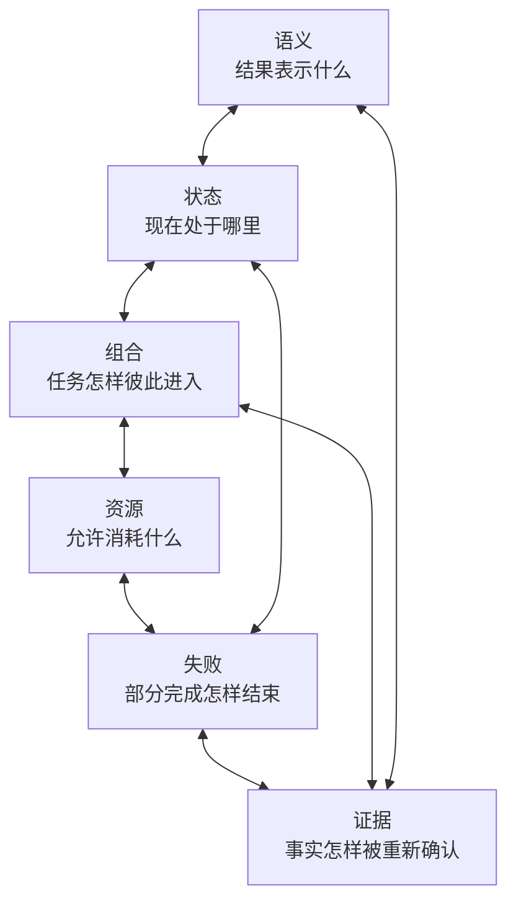
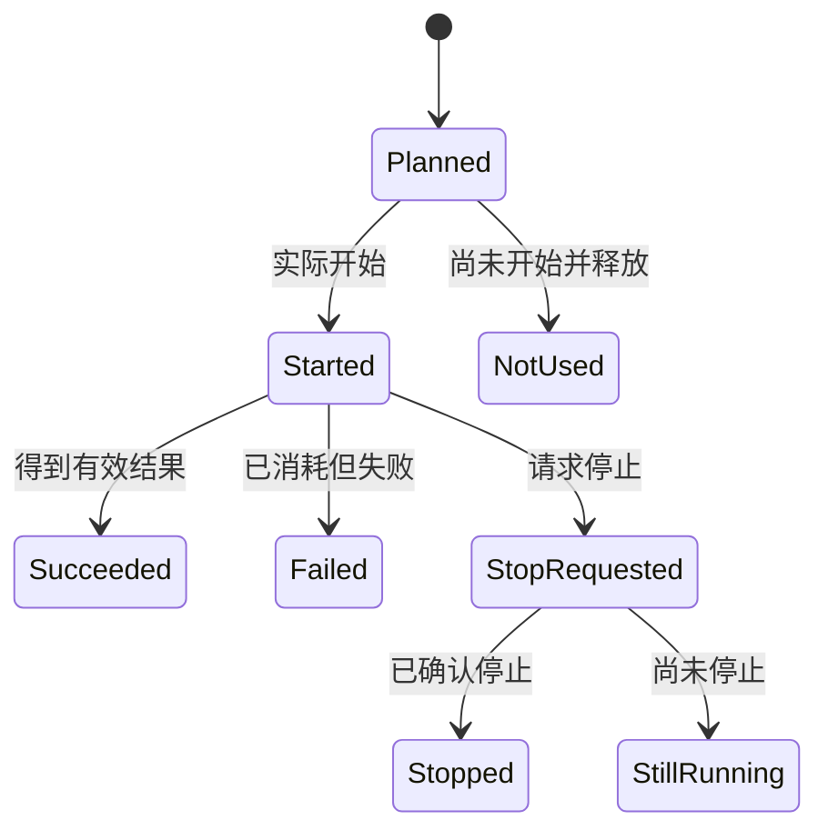
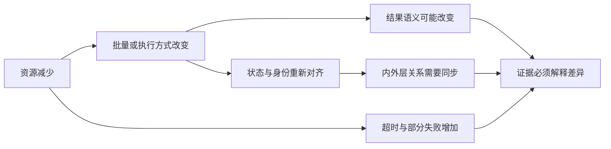

# 第一卷·第二章　六类复杂性怎样相互放大

第一章最后留下了一个问题：为什么有些程序只有几百行，却比拥有上百个模块的系统更难可靠运行？

如果复杂性只来自代码数量，答案应该很简单。函数越多，系统越复杂；模块越少，系统越容易理解。可现实并非如此。一万个彼此独立、输入输出固定的纯函数，虽然阅读量很大，行为却可能相当稳定；一段只有几十行的脚本，只要同时修改共享状态、并行调用外部服务、限制成本、允许中断并在最后拼接报告，就可能很难判断自己究竟做了什么。

差别不在“有多少代码”，而在“有多少事情可以独立变化，又必须在某个时刻重新对齐”。指标含义可以变化，内部状态可以变化，任务可以被嵌套或并行，资源可能少于请求，失败可能只影响一部分工作，记录下来的证据还可能与真实过程错开。每一种变化单独看都能处理；几种变化交叉以后，局部合理的决定就可能共同产生错误结论。

本章把这些变化归纳为六条复杂性轴：语义、状态、组合、资源、失败和证据。称它们为“轴”，是因为它们不是六种组件，也不是六个按顺序执行的步骤，而是六个可以相对独立变化的方向。一个任务可能语义简单但资源复杂，也可能资源充足却状态复杂；真正危险的情况，是多个方向同时变化，而系统没有说明它们怎样保持一致。



这张图的重点不是连线数量，而是环。语义变化会改变哪些状态仍然有效；状态变化会影响失败后从哪里继续；任务组合会扩大资源需求；资源不足会制造排队、截断和超时；失败又会让最终记录难以解释。如果把六条轴写成六份互不相关的功能说明，就会错过真实复杂性产生的地方——它往往藏在两条轴的交界处。

我们先从最容易被忽略的一条交界开始：一个数值的含义，与它所处的时间并不能分开。

---

## 2.1 同一个数值，为什么可能不是同一件事

假设报告里写着：

```text
score = 0.91
```

单看数值，我们几乎什么都不知道。它可能是准确率、召回率、相关系数，也可能是经过变换的损失；可能来自训练数据、验证数据或未来时间窗口；可能越大越好，也可能只是为了显示方便而做了反向换算。即使双方都知道它是“准确率”，还要继续问：类别是否平衡，阈值是多少，样本权重是否变化，0.91 是单次结果还是多次平均？

这就是语义复杂性。它不是指领域名词多，而是指一个值只有依赖目标、单位、方向、约束、数据范围和解释规则，才能成为有意义的反馈。两个程序都返回浮点数，并不意味着它们可以交换结果；两个结果恰好数值相等，也不意味着它们代表同一个事实。

语义问题一旦进入迭代，就会立刻与状态问题交叉。仍以分数为例，程序在一次更新过程中可能依次拥有：上一轮保留的方案、本轮新生成的方案、本轮已经评价的方案，以及评价后最终选中的方案。四个阶段都可能出现 `score = 0.91`，但这个分数所绑定的对象和作用完全不同。

如果分数属于新生成方案，它只是等待后续选择的反馈；如果属于最终保留方案，它已经参与下一轮状态；如果报告拿到了前者，保存文件却记录后者，二者即使都写着 0.91，也不能拼成一次一致的结果。数值没有变化，身份和时间却已经变化。

一个更隐蔽的例子发生在计数和控制判断之间：

```python
progress_before = {
    "evaluations": 90,
    "mode": "explore",
}

new_scores = evaluate_twenty_items()

    # 本批完成以后，真实评价次数已经是 110。
    # 但后续决策仍然读取评价前的记录。
decision = choose_next_mode(
    scores=new_scores,
    progress=progress_before,
)
```

假设程序规定评价次数达到 100 时从探索切换到精细搜索。计算本身没有错：二十项都得到了正确分数，总次数也确实从 90 变成 110。错误发生在时间对齐上。后续决策读取了评价前的 90，于是模式切换晚了一轮。

这个问题很难通过检查最终数值发现。所有变量都合法，程序也不会崩溃；只有把“这份进度属于哪个时刻”写进推理，才能看到决策依据已经过期。状态复杂性因此不只是“需要保存很多变量”，而是需要区分同一变量在不同逻辑时间上的版本，并知道哪个版本有权代表当前过程。

语义和状态还会通过身份发生更深的交叉。设想两个模型拥有完全相同的参数数组，但一个使用列顺序 `[年龄, 收入]`，另一个使用 `[收入, 年龄]`。如果只比较数组，它们似乎是同一个状态；如果考虑输入解释，它们代表不同函数。又比如两个方案使用相同数值向量，但一个按“小时”解释，另一个按“分钟”解释，数值相等反而会掩盖巨大差异。

因此，“是否相同”不能总由数值决定。有时需要比较来源、结构和会影响解释的附加信息；有时还需要一个贯穿生成、评价、更新和保存过程的稳定身份。否则，正确反馈可能被绑定到错误对象，旧状态也可能因为“看起来一样”而被当成新状态。

到这里，证据复杂性已经悄悄出现了。日志可能记录了评价后的 110，控制决策却使用了评价前的 90；最终报告显示新模式，实际下一轮仍按旧模式运行。每一份记录单独看都有来源，放在一起却讲述不同时间的故事。可见，证据问题并不只发生在运行结束后，它从第一个会变化的状态开始就已经存在。

在只有一个程序、一个执行顺序时，作者还可能靠变量命名和记忆维持这些关系。一旦一项任务进入另一项任务，或者同一份工作被拆成多个并行分支，隐含关系就会迅速失效。于是，语义与状态的问题自然把我们带到第三条轴：组合。

---

## 2.2 一项任务进入另一项任务以后，局部正确为什么会失效

组合最容易被误解成“按顺序调用几个函数”。如果每个函数无状态、无副作用，组合确实只是把前一个输出接到后一个输入。但复杂任务中的组合通常还携带自己的进度、成本、失败方式和内部假设。一个单独运行正确的任务，被放进外层循环或并行分支以后，不一定仍然正确。

先看一个数量对齐的问题。某个生成过程一次提出二十个待评价方案，并在内部记住这二十个方案分别来自哪一种生成方式。外层任务检查剩余成本后，只允许其中十个进入真实评价：

```python
proposal = generate_items(count=20)
accepted = proposal[:10]  # 剩余成本只允许评价 10 个
scores = evaluate(accepted)
update_generation_memory(scores)
```

表面上，外层成功遵守了成本上限，十个评价也都正确完成。但内层生成过程仍然认为二十个方案都会返回反馈。它可能保存了二十个来源索引、二十份策略分配或二十组父子关系。当更新只收到十个分数时，轻则数组长度不匹配，重则前十个分数被错误绑定到另一组记录，程序继续运行却逐渐破坏搜索逻辑。

这里没有哪个局部决定明显错误。提出二十个方案是合理的，外层只接受十个也是合理的，评价十个更没有问题。错误来自三个事实没有一起传播：原提议是什么，实际接受了什么，内层记忆应怎样随之缩减。组合复杂性正是这种“局部合同在穿过边界时丢失一部分”的风险。

并行会让同一问题更难观察。假设两个分支接收同一个可变数组，一个分支为了计算方便在原地排序，另一个分支同时做归一化：

```python
shared = load_values()

left_future = run_in_parallel(sort_and_score, shared)
right_future = run_in_parallel(normalize_and_score, shared)
```

两个函数单独测试都正确；并行以后，结果取决于谁先修改数组。某次运行中归一化先读到原始顺序，另一次运行中却读到已经排序的数据。错误不再稳定复现，增加日志甚至可能改变调度时机，让问题暂时消失。

这说明组合不只是“把谁和谁连接起来”，还要回答连接时共享什么。输入是不可变值、独立副本，还是允许共同修改的对象？进度是每个分支独立拥有，还是多个分支写入同一位置？随机源是否隔离？一个分支失败以后，另一个分支还能不能提交结果？如果这些关系没有明确规定，函数级正确性无法自动延伸为组合正确性。

资源复杂性也从组合中自然出现。假设一台机器有 16 个线程。一个独立任务为了加速，默认使用全部 16 个线程；单独运行时没有问题。现在外层同时启动 8 个这样的任务，每个内层任务仍然观察到机器有 16 个线程，于是理论并发量扩张到 128：

```text
外层并行数：8
每个内层任务自行创建的线程数：16
潜在工作线程：8 × 16 = 128
机器实际可用线程：16
```

结果可能不是更快，而是线程争抢、内存上涨、上下文切换增加，最终触发超时。更麻烦的是，每个局部任务都可以声称自己“按照默认配置使用了 16 个线程”，却没有任何一个局部任务拥有决定全局资源分配的视野。

所以，资源不能只被理解为配置值。一个任务“想使用什么”、上层“允许它使用什么”以及运行时“实际获得了什么”是三种不同事实。独立任务可以表达需求，但被嵌入以后，它必须服从整体边界；内层任务只能使用外层分给它的份额，不能重新观察整台机器并扩大自己的额度。

同样的问题也会出现在设备、内存、远程工作数量、时间和付费预算上。配置文件写着使用某种设备，不代表实际会话真的在那里运行；外层给内层十次机会，内层不能因为重试就把机会扩展为二十次；一个阶段获得的临时写入空间，也不能被超时后的后台分支无限期持有。

组合因此把资源从性能问题提升为正确性问题。资源不足会改变执行顺序、批量大小、超时概率和降级策略；这些变化又会影响状态和结果语义。例如，批量从二十缩减为十，不只是速度变慢，还可能改变统计估计、选择压力和停止时机。资源决策如果被当作运行细节，领域结果就可能在没有明确说明的情况下发生变化。

到这里，六条轴中的四条已经相互连接：语义决定缩减是否允许，状态记录实际接受了什么，组合传播内外层关系，资源决定哪些工作能够开始。只要资源有限，等待、拒绝和中断就不可避免；一旦中断出现，失败就不能再被压缩成一个布尔值。

---

## 2.3 失败为什么不是成功的反面

在最简单的函数模型里，成功意味着返回值，失败意味着抛出异常。两者互斥，而且失败后通常可以假设没有结果。复杂运行打破了这个对称性：任务可能已经完成一部分，消耗已经发生，外部副作用无法撤销，其他并行分支仍在继续。此时，失败不是“成功等于零”，而是一组需要分别说明的事实。

前一章已经见过三项批量评价中第三项失败的例子。把它写成状态变化，可以更清楚地看到问题：



如果程序只保留 `success` 与 `failed` 两种状态，图中大部分事实都会消失。尚未开始的工作与已经开始但失败的工作会被混在一起，停止请求会被误写成已经停止，仍在运行的后台任务也可能被当成不存在。

重试会进一步放大这种歧义。设想程序向远程服务提交一个计算请求，请求已经执行，但返回消息在网络中丢失。调用方只看到超时，于是重新提交。第二次调用也许得到结果，却可能在远端生成两份记录、扣除两次费用或重复修改同一对象。

因此，“可以重试”不仅取决于异常类型，还取决于前一次工作是否可能已经发生，以及外部动作能否安全重复。读取一个文件失败通常可以重试；创建订单、写入数据库和启动昂贵仿真则需要稳定请求身份或去重规则。否则，恢复机制会把一次通信失败放大成业务副作用。

并行失败还会带来结束所有权问题。外层任务决定不再等待，并不代表内层分支已经结束；某个分支失败，也不一定意味着其他分支的结果全部无效。系统需要知道谁有权宣布整体结束，谁负责通知其他分支，哪些分支仍可能产生结果，以及这些迟到结果是否还有资格被接纳。

如果没有明确边界，同一个异常还可能被多层重复处理。最内层记录一次错误并执行清理，中间层再次捕获并触发恢复，最外层又把它当作新错误发送通知。一次失败最终产生三份告警、两次回滚或重复写入。每一层都以为自己在“负责”，合起来却没有唯一责任人。

失败复杂性因此同时拉动状态、组合和资源三条轴。它要求状态能表达部分完成，要求组合关系说明失败怎样传播，也要求资源账本保留真实消耗。它还会反过来影响语义：如果某个评价失败，最终指标是忽略缺失项、使用惩罚值、终止整批，还是保留已完成部分？不同选择代表不同问题，不能被一个通用的异常捕获偷偷决定。

最危险的失败往往不是明显崩溃，而是降级后继续。程序可能在设备不可用时退回普通计算，在批量接口失败时改为逐项执行，在某个数据源缺失时使用缓存。降级本身可以合理，但它会改变时间、成本甚至结果分布。如果最终报告只写“成功”，使用者就不知道本次结果与正常路径是否仍然可比。

由此可见，失败处理不是运行外围的保护壳。它会决定哪些状态有效、哪些成本保留、哪些结果可以使用，以及最终问题是否已经改变。可是，这些决定只有被准确记录，才能在运行结束以后重新判断。失败轴最终把我们带到第六条轴：证据。

---

## 2.4 证据为什么不是运行结束后的附属品

人们通常在程序完成以后才想到证据：加一些日志，保存一份状态，生成一张报告，再做一个可视化页面。这样做隐含了一个假设：运行事实已经稳定存在，证据只需要把它拍下来。

现实中，证据本身也在不同时间、由不同参与者产生。日志可能在评价完成后立即写出，状态文件可能在下一步更新前保存，最终报告则在全部过程结束后汇总。只要三个动作没有共同时间，它们就可能分别正确，却无法组成同一个结论。

设想一次运行留下了下面四条记录：

```text
日志：第 42 轮已经完成
保存进度：内容实际对应第 41 轮结束
最终报告：评价次数为 840
外部账单：实际发起了 860 次评价
```

每条记录都可能有合理来源。日志在评价结束后就把“完成”写了出去，随后状态更新失败；保存进度因此仍停在上一轮。最终报告只统计成功返回的 840 次，外部账单则记录了另外 20 次已经开始但失败的调用。问题不是哪一条绝对虚假，而是四条记录使用了不同的“完成” 和“次数”定义。

如果只看日志，运行似乎到达第 42 轮；如果尝试恢复，只能回到第 41 轮；如果检查预算，内部报告认为还剩 160 次，现实费用却只剩 140 次。证据不一致最终会重新进入运行，造成错误恢复和预算突破。它不是事后展示问题，而是下一次执行的输入问题。

语义复杂性决定证据中的字段表示什么。`count=840` 究竟是成功次数、已开始次数还是计费次数？状态复杂性决定证据属于哪个时刻。组合复杂性决定上游与下游记录怎样关联。资源复杂性要求区分请求、允许和实际使用。失败复杂性要求保留部分完成与未确认结束。证据轴之所以特殊，是因为它需要同时承载其余五条轴的结论。

但证据不能反过来创造事实。配置里写了“使用 8 个线程”，只能证明有人提出过这个设置，不能证明运行时真的获得并使用了 8 个线程；页面显示“已取消”，只能证明某个状态被写入，不能证明后台工作已经停止；功能清单列出“支持恢复”，也不能证明当前保存的状态足以恢复这一具体任务。

因此，证据有不同强度。设计规则说明系统希望保持什么；源代码说明当前实现尝试做什么；测试说明某个受控场景曾经满足条件；真实运行记录才说明某次具体执行实际发生了什么。四者可以互相支持，却不能越级替代。把“代码里有这个函数”写成“生产运行已经可靠支持”，与把“页面上显示成功”写成“过程确实完整”属于同一种推理错误。

证据还必须能够解释失败，而不仅是装饰成功。一次高质量的失败记录应当让人知道：失败发生在哪个阶段，哪些工作已经开始，哪些结果仍然有效，是否有任务尚未确认停止，最后一个内部一致的位置在哪里，以及下一次应该重试、继续还是重新开始。如果失败后只留下堆栈文本，人的确看见了错误，却仍然不知道系统处于什么状态。

由此可以得到一个重要反转：证据不是运行结束后的旁观者，而是运行闭合的一部分。没有与事实同身份、同时间的证据，状态无法安全恢复，成本无法准确延续，组合关系也无法在进程外重建。

现在六条轴已经全部出现。下一步不应再逐条重复定义，而应观察它们为什么会把一个局部小问题逐渐放大成系统问题。

---

## 2.5 六条轴为什么不是简单相加

如果六类复杂性互不影响，治理会很容易：分别写六个工具，各自解决一个问题即可。现实困难在于，一条轴的变化经常改变另一条轴上的判断条件。

资源减少是一个直观例子。它首先表现为“可用线程更少”或“剩余评价次数不足”，看起来只是性能与额度变化。但为了适应资源，程序可能缩小批量、减少重复试验、切换到较便宜的评价方式或提前停止。这些调整会改变统计可靠性和结果含义，于是资源变化进入语义轴；批量大小改变以后，内部索引和进度也要变化，于是又进入状态轴；如果任务被嵌套，调整还要同时通知外层和内层，于是进入组合轴；资源不足更容易产生超时与降级，于是失败轴也被激活；最终报告若没有说明路径变化，证据又与真实语义脱节。

可以把这条放大链画成：



失败也会形成类似的放大链。一个内层任务超时，外层停止等待；内层却继续占用资源并在稍后写入结果。这个写入改变了状态，使外层刚生成的报告过期；外层如果自动重试，又可能重复产生外部副作用；报告若只保留最终成功值，就会抹掉额外成本。最开始只是一次超时，最后却同时成为资源泄漏、状态污染、重复执行和证据失真。

语义变化同样不是局部的。把评价指标从平均表现改成最差场景表现，看起来只是换一个公式，却可能需要不同的数据、不同的批量组织、更高的评价成本和新的失败处理方式。此前保存的中间状态是否还能继续使用，也必须重新判断；如果仍然沿用旧的缓存和报告字段，系统会把两个不同问题伪装成同一次运行的前后阶段。

这些例子说明，系统风险更接近下面的关系，而不是六项工作量的简单求和：

```text
系统风险
≈ 独立变化的数量
× 变化之间未声明的耦合
× 未被观察的失败路径
```

这不是一个用于计算分数的数学公式，而是一种诊断视角。某条轴本身很复杂但边界清楚，风险未必很高；两条看似简单的轴之间存在隐含耦合，反而可能产生静默错误。批量从二十变成十并不复杂，复杂的是内层记忆仍按二十解释；超时返回也不复杂，复杂的是后台工作继续持有写入权；保存一个分数更不复杂，复杂的是分数与最终模型来自不同时间。

因此，复杂性的真正单位不是组件，而是**必须同时成立的关系**。组件数量增加当然会提高阅读和维护成本，但数量本身不能说明结果是否可靠；关系没有被表达，才会直接破坏结果含义。一个设计是否成熟，不能只看它支持多少算法、多少模型或多少执行方式，而要看这些能力组合以后，原本的身份、时间、资源、失败和证据关系是否仍然成立。

这也解释了为什么为每个新场景增加一段私有脚本通常不能解决根因。脚本可以把某条路径跑通，却会把新的隐含关系留给作者记忆。下一次更换批量、嵌套层级、设备或失败策略，脚本又需要另一组特殊判断。局部补丁越多，六条轴之间的耦合越分散，系统越难说明自己的真实规则。

既然问题来自跨场景重复出现的关系，解决方向也必须跨场景成立。我们需要的不是为每一种算法和模型分别发明状态、资源与失败规则，而是一组不随具体领域变化的约束：值必须保留含义，状态必须指出时间，内层任务不能扩大外层边界，已经发生的成本不能被异常抹除，停止请求不能冒充已经停止，记录不能声称超过事实本身的结论。

这些约束还不是具体架构，但已经构成了寻找架构的标准。下一节把它们变成一种实际阅读方法，并说明为什么第三章需要从“复杂性来源”转向“系统是否闭合”的判断。

---

## 2.6 沿一条结果反向穿过六条轴

六条轴最实用的用法，不是给系统贴六个标签，而是选择一条最终结论，沿它的来路反向追踪。

假设报告声称：“模型在验证集上的准确率为 0.91。”先不要检查页面是否漂亮，也不要先统计代码中有多少模块。第一步是追问 0.91 的含义：验证集如何形成，类别和阈值怎样定义，指标是否越大越好，它是否对应最终交付的模型。这是在检查语义轴。

接着追问时间：0.91 在训练过程的哪个时刻计算？计算以后模型是否又发生变化？报告、保存的模型和最佳记录是否属于同一步？这是状态轴。

然后沿依赖继续向上：数据准备、训练、验证和报告由谁产生，彼此通过什么关系连接？某一阶段重新运行以后，下游是否知道上游版本已经变化？如果训练是另一项外层搜索中的内层工作，它独立运行时的输入、输出和失败含义是否仍然保持？这是组合轴。

再看这次运行被允许消耗什么，以及实际用了什么。训练请求了多少设备、线程、时间和尝试次数？上层允许了多少？内部并行有没有重新扩大额度？资源不足时是否更换了计算路径，而报告仍把结果与正常路径混为一谈？这是资源轴。

随后检查不顺利的路径。有没有失败样本被忽略、超时任务仍在运行、远程请求被重复提交、降级结果被当作正常结果？已经开始却失败的工作是否仍计入成本？错误由谁处理，是否触发了重复清理或重复副作用？这是失败轴。

最后检查前面五组答案能否由事实重新确认。输入版本、过程位置、实际成本、失败记录和最终输出是否指向同一次运行？配置、源代码、测试与真实执行各自支持到什么程度？是否有记录使用了同一个字段名，却表达不同口径？这是证据轴。

这种追踪方式有一个重要特点：它始终围绕同一条结论前进。我们不是分别做六次互不相关的审计，而是在每一步问“当前事实是否仍然能和最终的 0.91 对上”。只要某一处关系断裂，最终结论就必须降低可信等级，或者明确标注自己只能回答更窄的问题。

同样的方法可以用于优化方案、仿真报告、数据产品和远程计算。领域词汇会变化，六类追问却保持稳定：结果是什么意思，它属于哪个时间，它经过怎样的组合，它使用了什么资源，失败留下了什么，证据能否把这些事实重新连起来。

这就是第二章的出口。第一章证明复杂任务必须同时描述“算什么”和“怎样运行”；本章进一步说明，“怎样运行”不是一条单独的技术流水线，而是语义、状态、组合、资源、失败和证据六条相互耦合的轴。复杂性主要来自它们之间的关系，而不是来自组件数量。

到这里，我们已经能够识别问题来源，却还不能判断一个系统是否真正解决了它们。例如，记录了状态并不等于状态能够恢复；限制了资源并不等于内层任务不会越界；保留了日志也不等于结果可以追溯。我们还缺少一组“何时算完整”的判定标准。

第三章将由此引出五种闭包。六条复杂性轴描述压力从哪里来，闭包则回答系统有没有把这些压力封闭在明确边界内。这个顺序很重要：只有先理解复杂性如何产生，闭包才不会被误解成另一套抽象名词；它们将成为后续每一层设计都必须通过的判定条件。

与第一章一样，本章建立的仍是 **I：不变量层面的分析**。它不声明某个具体实现已经满足这些要求，也不提前借用后文对象来解释问题。源码事实、测试证据和真实运行证据会在相应责任被正式定义后再逐层进入正文。
