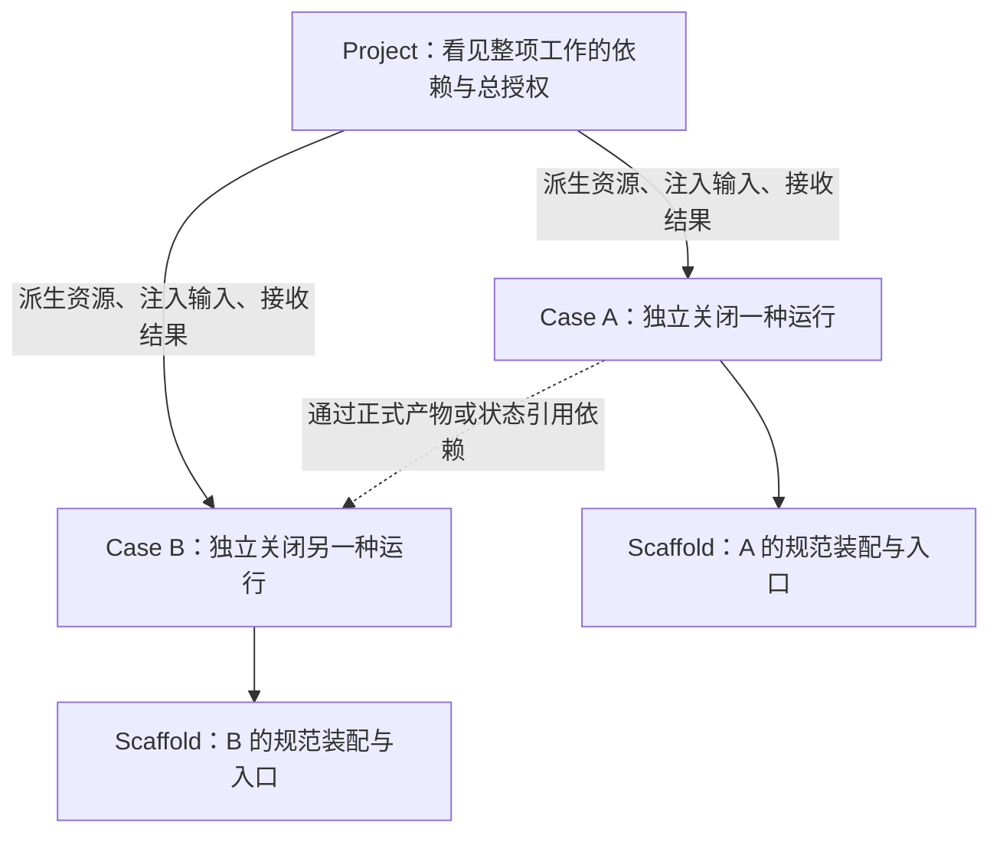
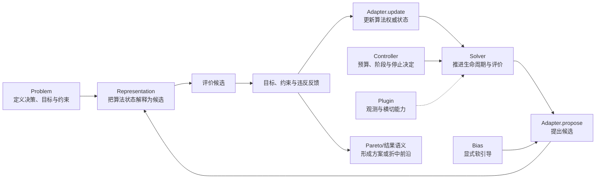
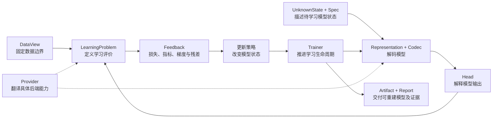
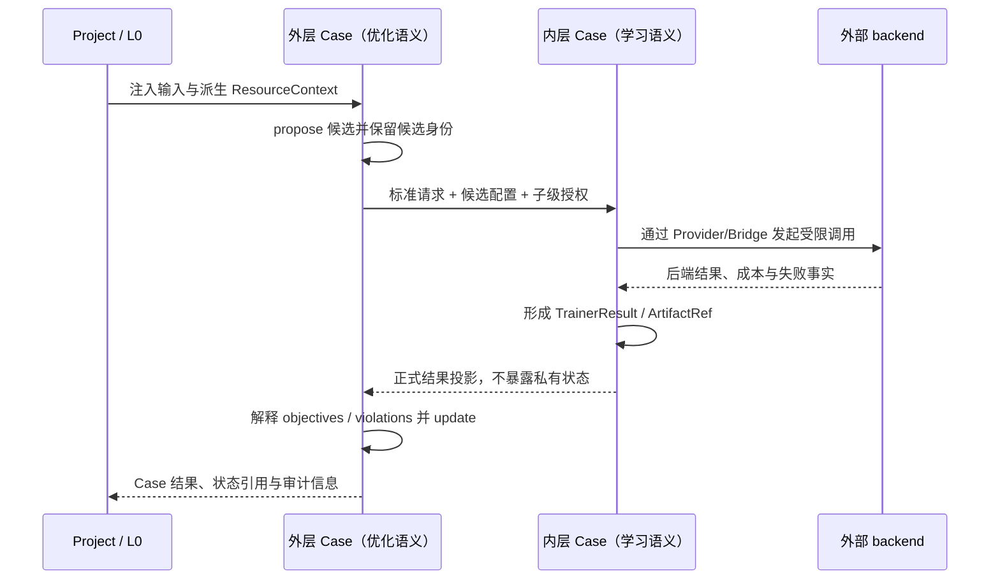
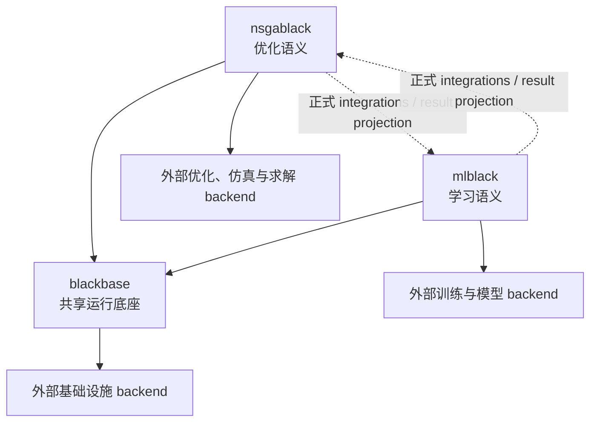

# 第一卷·第九章　三仓一边界：统一框架如何落到工程

上一章结束时，我们得到了一套尚未命名的结构。任何跨任务的资源授权、运行身份、状态引用、组合和证据关系，都需要服从同一个运行秩序；任何关于行动是否可行、目标怎样比较、数据怎样解释、模型怎样使用的判断，都必须留在相应领域内部；仿真器、数据库、数值求解器、对象存储和设备运行时则拥有框架不能吞并的现实语义，只能通过正式执行边界接入。

这个结论仍然不要求工程必须恰好拥有三个 Git 仓库。抽象责任可以暂时放在一个代码库的三个包中，也可以被拆成更多发布单元。若只因为当前磁盘上存在三个目录，就宣布“三仓架构是必然的”，我们又会回到本书一直反对的做法：把历史结果当作设计前提。真正需要解释的是，什么情况下抽象分层值得上升为独立仓库边界；当前的 `blackbase`、`nsgablack` 和 `mlblack` 是否分别对应这些条件；仓库之外的系统为什么不能继续被吸收入任一核心层。

因此，本章第一次说出这三个名字，却不会先罗列它们“有什么功能”。每个名字都要出现在相应责任已经产生之后。读者先看见一种不能由其他层代替的决定，再看见谁被指定为这项决定的权威所有者；先看见一条完整因果链，再认识链上不同角色的正式名称。这样，名字是对问题的压缩，不是要求读者无条件接受的术语。

当前工程还处于收敛期。三个仓库的说明文件、包依赖和公开源码已经明确表达统一框架栈的方向，但历史入口、兼容转发、重复资源模块和仍在迁移的示例也真实存在。本章会严格区分两种话语：当我们说“应当”时，依据来自前八章的架构推导；当我们说“当前声明”或“源码中存在”时，依据来自本章写作时对 README、协作规则、包配置和公开定义的静态阅读。除非后文给出执行命令与结果，否则不把源码存在写成运行能力已经闭合。

本章的任务由此变得明确：先说明仓库作为语义权威和演化边界的意义，再依次让共享底座、优化语义、学习语义和外部边界获得工程名字；随后说明它们怎样在一个 Project 中组合，最后用一组容易放错位置的能力检验这套边界是否真的可用。

---

## 9.1 仓库边界保护的不是目录，而是独立演化能力

软件分层首先是一条逻辑规则：某一层只能依赖哪些事实，哪些决定只能由它作出。仓库则在逻辑规则之外增加了现实约束。独立仓库拥有自己的版本、发布节奏、依赖清单、兼容承诺、测试范围和维护责任。把一层拆成仓库，意味着其他层不能再把它的内部文件路径当作稳定接口，也意味着这层必须交付足以被外部使用的正式表面。

不是所有逻辑层都值得拆仓。若两个部分必须永远同步发布、使用完全相同的依赖、修改时总要同时改动，而且不存在独立使用场景，把它们拆开只会增加版本协调。反过来，若一部分需要被多个领域共同依赖、另一部分具有大量领域专属依赖和独立演化速度，继续放在同一发布单元就会产生不必要耦合。例如，共享资源协议只需要轻量基础依赖，而机器学习后端可能选择性依赖 PyTorch、XGBoost 或 Transformers；多目标搜索策略的变化不应迫使一个只运行训练任务的用户升级整个优化算法家族。

仓库边界至少要保护四种独立性。

第一是**语义独立性**。共享层发布新资源协议时，不应顺便改变何谓可行候选；学习层增加新的输出 Head 时，不应改变优化层怎样计算支配关系。第二是**依赖独立性**。底座不能因为某个模型后端而强制安装大型训练库，优化层也不应因为一个数据库插件而把数据库驱动变成核心依赖。第三是**版本独立性**。领域能力可以在共同合同允许的范围内快速演化，共同合同则以更谨慎的兼容节奏发布。第四是**验证独立性**。每个仓库要能在自己的权威范围内建立测试和文档证据，同时通过跨仓合同测试证明组合没有断裂。

只有满足这些条件，拆仓才不是整理癖。上一章得到的三种内部责任恰好具有不同的依赖与演化特征：共同运行底座需要轻量、稳定并被两种语义共同依赖；优化语义拥有独立算法族和目标—约束—前沿规则；学习语义拥有数据、模型、训练后端和产物生态。于是，把三者分别作为发布边界是有理由的。这个理由并不是“三”这个数字本身神圣，而是当前三种权威责任已经足够独立，又仍然能够通过一组小而正式的合同组合。

为什么不继续拆成十几个仓库？因为 `Context`、资源池、任务信封和组合内核共同维护同一运行秩序，过度拆分会让一次协议变更跨越大量版本矩阵；优化中的 Problem、Representation、Solver 与 Adapter 共同关闭一条搜索语义链，机械拆开会使领域不变量只能靠跨仓约定维持；学习中的 DataView、Codec、Head、Trainer 与 Artifact 也具有相同情况。仓库边界应位于语义闭包之间，而不是位于每个类之间。

这也给“恰好三个仓库”一个有限而诚实的含义：它是当前框架对三种内部权威责任的工程实现，不是对所有未来系统的数学证明。若未来出现一种拥有独立语义、独立依赖和稳定组合合同的新领域层，它可以成为新的仓库；若两个现有边界长期无法独立演化，边界也应重新审视。架构保护的是责任，而不是数字。

---

## 9.2 共同运行责任获得名字：blackbase

第八章已经说明，共享层必须维护那些跨越优化、学习和外部任务的事实，但不能解释领域结果。当前工程把这项责任交给 `blackbase`。名字中的 base 不表示它是“所有代码的父类集合”，也不表示凡是看起来通用的工具都应迁入其中；它表示 `blackbase` 是统一框架栈的共享 substrate——一层负责让运行能够被独立装配、获得授权、形成状态关系并安全组合的底座。

先从最外层问题开始。一项真实工作往往不只有一个计算过程：先准备数据，再训练模型，然后用模型评价方案，最后生成报告；或者同时比较多个算法，再把结果交给后续阶段。谁能看见这些运行单元之间的顺序、并行、依赖和总资源？单个优化循环或训练循环都没有足够视野。于是需要一个代表整项工作的上层边界，当前合同把它称为 **Project**。

Project 不是装算法的巨型对象。它拥有的是跨运行单元的秩序：顶层入口、依赖关系、总体资源配置、子级授权和最终汇总。Project 可以决定两个任务是否并行，却不决定 NSGA-II 怎样产生候选；可以把一份模型产物交给下游任务，却不解释模型输出。它对应上一章的“上层协调者”，其权威来自完整视野而非领域知识。

Project 内部必须存在能够独立启动和失败的单位。否则，所谓编排仍只是把若干函数调用藏进一个脚本。当前合同把这种单位称为 **Case**。一个 Case 获得正式输入和派生后的资源授权后，应能完成装配、运行、提交状态并返回结果；它可以承载优化 Solver，也可以承载学习 Trainer。Solver 与 Trainer 在领域语义上不同，在运行层级上却是同级：二者都只是一个 Case 内部关闭自身语义的执行核心。

仅有“每个 Case 独立”仍然不足。若每个案例随意命名入口、把组件散落在任意目录、依赖全局变量完成装配，上层运行时就只能通过猜测启动它。于是需要一种可重复的装配形状，当前合同称为 **Scaffold**。Scaffold 规定规范构建入口、运行入口、问题、pipeline、adapter、plugins、evaluation 与 runtime 等职责如何出现。它不是为了统一领域代码内容，而是为了让 Project 在不读取私有实现的情况下找到 Case、注入资源、覆盖组件并进行检查。

这三个名字形成的不是目录层级游戏，而是一条运行责任链：

Project 能够声明资源，不代表配置文件里的数字已经变成现实授权。运行时还需要一份不可由子任务擅自扩大的有效许可，说明本 Case 获得多少线程、哪些逻辑设备、什么命名空间、怎样的预算和后端提示。当前共享类型把这份派生许可称为 **ResourceContext**。Case 消费它并报告实际使用，不能重新探测机器后绕过它创建更大的全局池。领域层仍可以在许可内适配：学习任务决定如何缩小 batch，优化算法决定候选被预算截断后怎样对账，但“最多允许使用什么”只有 Project 级 L0 有权决定。

运行推进还需要传播高频的小信息，例如当前 generation 或 step、评价计数、停止请求、状态引用和少量指标。若每次都复制完整种群、模型参数或历史轨迹，控制通道会同时承担大状态所有权。`blackbase` 因而区分 **Context** 与 **Snapshot**：Context 保持轻量、可校验并适合频繁构建，Snapshot 保存需要版本和引用的大对象。关键不是对象尺寸阈值本身，而是权威关系——Context 指向状态，不能悄悄复制成另一份状态真相。

当多个组件按顺序、并行或条件分支执行时，共同层还需要规定槽位、调用、合并、取消和晚到写入。当前源码把这类机制组织为 **Pipeline kernel**。这里的 Pipeline 不是专指模型特征工程，也不是优化候选表示的同义词；kernel 只维护“算子怎样被编排”的共同运行语法。具体槽位承载什么含义，仍由使用它的领域层说明。共享层可以检查并行分支的执行合同和合并策略，却不应发明多目标折中的领域规则。

生命周期能力也存在共同部分。日志、审计、checkpoint、错误观察和评价前后事件都需要稳定的注册、优先级、严格模式与事件分发。`blackbase` 当前提供共享 **Plugin** 基础生命周期，并允许领域层扩展。共享层拥有的是 hook 何时分发、错误怎样传播和插件怎样排序；一个插件能否改变候选、能否接管模型评价，以及改变后的结果是否合法，仍由相应领域合同约束。

最后，跨 Case 传递不能依赖任一领域的私有对象图。`blackbase` 因而提供轻量共享类型，例如 `UnknownState`、`Feedback`、`PopulationSnapshot` 与 `TrainerResult`。这些名称容易造成误解：类型放在共享仓库，不表示共享仓库拥有其全部含义。`UnknownState` 可以运输数值与元数据，但只有学习表示知道它怎样解码成模型；`Feedback` 可以运输 objectives、constraints、gradients 或 residuals，但各字段如何参与更新由领域层决定。共享类型负责可传递的形状，领域层负责语义。

从当前静态结构看，`blackbase` 的 README、包配置与 `src/blackbase` 公开定义已经覆盖 Project/Case 执行请求与结果、Scaffold、ResourceContext、资源池与预算 authority、Context/Snapshot、PipelineOrchestrator、Plugin 生命周期和共享类型。源码存在只能证明这些合同与实现入口已经出现；它不能单独证明所有嵌套、Redis、超时和恢复路径都已在真实运行中闭合。这个证据限制需要一直保留。

---

## 9.3 搜索因果链获得名字：nsgablack

共享底座能够启动一个 Case、发放资源、保存状态并分发事件，却无法回答这个 Case 为什么在搜索。若输入是一组生产订单，共同层不知道哪些数组表示排程，不知道延迟与能耗是目标还是硬约束，也不知道两个互有优劣的方案应保留哪一个。第八章把这类解释归给优化语义层，当前工程中的权威仓库是 `nsgablack`。

`nsgablack` 这个名字源于多目标进化算法，但它当前声明的职责已经不是一个 NSGA-II 包装器，也不是所有算法的集合。它要关闭的是从“问题要求什么行动”到“为什么最终方案能够被提交”的完整搜索因果链。为了理解其中的正式角色，最自然的顺序不是背诵四层架构，而是跟着一次搜索实际发生。

搜索开始前，必须先知道哪些方案有意义、怎样评价方案、哪些边界不可违反。生产调度中的订单、设备、时间窗、决策变量、目标和约束，结构设计中的几何边界与物理性能，路径规划中的节点、代价和通行条件，都属于问题事实。当前框架把拥有这些事实的角色称为 **Problem**。Problem 回答“评价什么”，而不是“下一步尝试什么”。它可以调用仿真器或数据模型获得目标值，却不应偷偷决定搜索策略。

问题事实通常不能直接成为算法内部操作的对象。排程可以表示成排列、优先级向量或离散图，模型结构可以表示成基因、树或条件参数，连续设计可以表示成有界向量。算法需要初始化、变异或组合这些状态，Problem 则需要看到能够解释为领域方案的对象。连接两者的职责称为 **Representation**。它拥有 init、encode、decode、mutate 与 repair 等表示转换，但 repair 的权限有限：它可以让对象回到表示或基本约束允许的边界，不能把业务偏好和搜索捷径伪装成“修复”。

有了问题与表示，还缺少让整条搜索生命周期可靠推进的控制平面。谁在 generation 开始前建立上下文，谁调用候选评价，谁保证批量反馈与候选数量对齐，谁在更新后提交权威状态，谁分发插件事件并在结束时形成结果？这个角色称为 **Solver**。Solver 拥有优化运行的生命周期与评价入口，却不应固化某一种候选生成策略。否则每增加一种算法，都要复制预算、错误、Snapshot 和 Plugin 调度。

真正决定“下一步尝试哪些候选”以及“得到反馈后怎样改变搜索状态”的角色称为 **Adapter**。它通过 `propose` 与 `update` 把算法策略插入 Solver：遗传选择、差分变异、局部邻域、信赖域、退火、路径搜索或多策略分配都可以有不同实现。Adapter 拥有算法账本，因此当硬预算只接受原计划候选的一部分时，不能只在 Solver 外层裁剪数组；Adapter 还必须同步内部索引、配对关系和分配记录。反过来，Adapter 不拥有全局资源池，也不应绕过 Solver 直接形成另一套评价生命周期。

运行中还会出现不属于某个搜索算法、却能改变是否继续或采用何种策略的控制决定。例如达到评价预算、耐心耗尽、满足目标、进入新阶段或请求停止。若这些判断散落在循环条件、插件和 Adapter 内部，同一个时刻可能产生冲突决定。`nsgablack` 把这类角色称为 **Controller**，并通过控制仲裁形成统一决定。Controller 读取已经提交的运行事实，不能依赖过期上下文；预算域产生的停止意图也必须真正映射到 Solver 的停止状态，而不能只留下一个无人消费的字典字段。

优化过程还经常需要先验与偏好。领域知识可能提示某些区域更有希望，代理模型可能给出不确定性，算法经验可能调节探索强度。这些信号既不是硬约束，也不应直接取代 Adapter 的搜索规则。框架把这种软引导称为 **Bias**。Bias 可以改变评分、采样倾向或上下文投影，但其作用必须可观察，并与硬约束清楚分离。若某个配置允许偏置覆盖约束违反，系统必须明确承认它改变了安全边界，而不是把结果仍称为普通可行解。

checkpoint、trace、运行报告、后端评价、事件观察和外部审计不应被写进每个 Solver 或 Adapter。它们作为横切能力通过 **Plugin** 接入。`nsgablack` 的 Plugin 是共享生命周期在优化语义中的扩展：它可以观察 generation、评价和错误，也可以在正式合同允许时短路评价；但一旦接管评价，就必须返回数量、目标维度和约束结构均合法的反馈。Plugin 扩展能力，不取得搜索语义所有权。

多目标场景还需要解释一种单目标排序无法表达的结果。当方案 A 成本更低但风险更高，方案 B 风险更低但成本更高，如果没有诚实的权重，系统不能随意把它们压成一个分数。**Pareto 支配与前沿**因此属于优化语义：它规定哪些方案被另一个方案全面替代，哪些方案构成当前不可简单取代的折中集合。共享 Snapshot 可以保存前沿，通用 Pipeline 可以运输前沿，Dashboard 可以展示前沿，但只有优化层有权解释为什么它是前沿。

现在可以把这些名称重新放回一条因果链：

图中 Solver 位于控制平面，Adapter 位于策略平面，Representation 位于表示平面，Plugin 位于能力平面；Problem、Controller、Bias 和 Pareto 进一步关闭问题、控制、引导与结果语义。它们不是为了让类名整齐而分开，而是因为每个角色回答不同问题。Problem 不能替 Adapter 选择下一候选，Representation 不能替 Problem 重写业务约束，Plugin 不能把观测变成隐式算法，Solver 也不能因为掌握生命周期就吸收所有策略。

当前 `nsgablack` 的 README、协作规则与源码公开定义已经能找到 SolverBase、ComposableSolver、AlgorithmAdapter、RepresentationPipeline、Controller、Bias 和 Plugin 等表面，包依赖也显式指向 `blackbase`。这说明工程正在把共享运行责任下沉，同时保留优化语义。与此同时，仓库内仍可看到资源、Context、Snapshot、Project 等历史或转发路径；在迁移完成前，不能仅凭目录名判断权威实现。判断标准应是新代码的正式导入方向、实现是否只是 forwarder，以及合同测试是否证明两条路径行为一致。

---

## 9.4 从数据到模型产物的因果链获得名字：mlblack

共享底座也无法独自关闭机器学习。它可以运输数组和元数据，却不知道一列是特征、目标、时间戳还是分组键；可以保存一个未知状态，却不知道它应解码成线性模型、神经网络还是符号表达式；可以记录 accuracy，却不知道类别映射和验证边界是否正确。第八章把这些决定归给学习语义层，当前工程中的权威仓库是 `mlblack`。

`mlblack` 不是“给优化框架增加几个模型插件”，也不应成为另一个拥有私有 Project、调度器和全局资源池的完整运行时。它要关闭的是从“数据和任务要求什么模型”到“为什么最终产物能够继续使用”的因果链。这个过程的第一步不是选 Trainer，而是让数据边界变得明确。

同一组数组可以表达监督回归、序列预测、图学习、图像任务或偏好学习。样本轴在哪里，特征叫什么，目标是否存在，训练与验证怎样分开，时间顺序能否打乱，图的邻接关系如何对应节点，这些条件会改变后续一切结论。当前框架把稳定表达这类数据边界的对象称为 **DataView**。它不是任意 DataFrame 的包装，也不是所有任务都必须拥有 target；监督学习需要目标，无监督表示学习和数据剖析并不因此失去合法性。DataView 的责任是让数据形状与角色可检查，使下游组件不再靠位置猜测含义。

接下来需要描述希望得到哪一类模型。线性、树、神经网络、时序结构或符号表达式可能具有不同超参数、拓扑和能力要求。只传一个裸参数数组不足以说明这些结构，因此需要稳定的模型 **Spec** 与尚未完全解释的 **UnknownState**。Spec 描述模型家族和结构条件，UnknownState 承载当前仍在变化的数值与语义元数据。UnknownState 作为轻量跨框架类型可以定义在 `blackbase`，但“哪些元数据会改变模型身份”属于 `mlblack`；相同 values、不同结构 metadata 可能是两个完全不同的模型。

未知状态怎样成为可执行模型，需要一条显式解释过程。当前框架用 **ModelRepresentation** 表达整体表示责任，用 **Codec** 处理状态与模型参数或结构之间的编码解码。为什么不能只保留 Codec？因为模型表示除了序列化转换，还可能涉及初始化、结构条件、状态等价性、指纹和与训练策略的合同。Codec 回答“如何转换”，Representation 回答“这个状态怎样作为一种模型存在”。对于条件模型、神经图和符号表达式，这个区别尤其重要。

模型产生输出以后，仍然不能立刻计算一个通用 loss。点预测、区间、概率分布、多类别概率、分段函数和符号表达式拥有不同输出结构与有效性条件。当前框架把输出语义集中在 **Head**。Head 说明模型原始输出怎样组织成任务可理解的结果，也使 Problem 不必从张量宽度猜测含义。区间上下界颠倒、概率未归一化、类别顺序错位都不是普通数值误差，而是输出合同失败。

数据、模型表示和输出含义建立以后，才有资格定义评价。当前框架把消费 DataView、调用表示与 Head、产生损失、指标、梯度、残差或约束反馈的角色称为 **LearningProblem**。它与优化 Problem 都叫 Problem，是因为二者都拥有领域评价事实；它们却不能被压成同一种语义。LearningProblem 必须理解数据切分和输出含义，不能由共享层仅凭 objectives 数组代替。

谁推进一次完整学习生命周期？它需要装配表示、问题和更新策略，管理 step、评价、最佳状态、checkpoint、错误与最终结果，还要在 Adapter 更新以后从权威来源提交模型状态。这个控制平面称为 **Trainer**。Trainer 与优化 Solver 在 Case 层级上相同，共享运行底座的生命周期骨架；但 Trainer 的完成语义、最佳反馈和产物构建属于学习层。一个复合 Trainer 即使串行运行多个子阶段，也必须像标准 Trainer 一样关闭 setup、插件事件、错误、teardown 与最终结果，不能因为“只是组合器”而绕过生命周期。

模型状态怎样更新仍然可以有多种策略：梯度下降、黑盒优化、采样、闭式拟合或外部库训练。`mlblack` 可以复用共享 Adapter 形状或提供学习侧适配，让更新策略与 Trainer 控制平面分离。但 Adapter 不应直接读取业务数据并私自评价；它接收由 LearningProblem 形成的正式反馈。反过来，当学习任务需要搜索结构、预算或多目标折中，真正的搜索语义应通过 `nsgablack` Case 接入，而不是在 Trainer 内悄悄复制一套外层优化框架。

某些模型能力并不适合在框架内部重写。scikit-learn estimator、PyTorch 训练、XGBoost、远程模型服务或特定硬件 backend 都可能拥有自己的会话与失败方式。学习层需要一个正式 **Provider** 表面，把 mlblack 的模型与评价合同翻译成具体后端能力。Provider 知道怎样调用某个后端，却不因此获得 Project 级资源授权；它必须消费注入的 ResourceContext，报告实际设备与降级，不能隐藏全局调度。

训练结束后，一份 Python 内存对象还不是可交付模型。模型结构、参数、Codec、Head、类别映射、特征信息、训练报告和来源关系需要共同保存，才能在新进程中重建相同含义。当前框架把这类可复现交付物称为 **Artifact**。Artifact 与 Snapshot 不同：Snapshot 主要服务运行中的权威状态、恢复与引用，Artifact 面向运行结束后的继续使用、交换和审计。一个大型 Artifact 可以由共享存储保存并通过引用传递，但其 schema 与重建规则仍属于 ML 语义。

学习链因此可以写成：

当前 `mlblack` 的 AGENTS、README、包配置和公开源码已经声明或定义 Numeric/Image/Graph/TimeSeries 等 DataView、ModelRepresentation、Codec、OutputHead、LearningProblem、BlankTrainer/ComposableTrainer、Provider 相关后端表面以及多类 ModelArtifact。其 `pyproject.toml` 以 `blackbase` 为基础依赖，并把 sklearn、torch、xgboost、transformers 等保持为可选依赖，这与“共享底座轻量、学习生态独立演化”的仓库理由一致。和另外两仓一样，这些是静态证据；某个类存在、某条示例命令写在 README 中，不等于本章已经执行并验证了所有模型族和恢复路径。

---

## 9.5 三个仓库怎样组成一次运行，而不是互相侵入

分别说明三个仓库的职责以后，最危险的误解是把它们想成从上到下依次调用的三层蛋糕：`blackbase` 在最底，`nsgablack` 永远在中间，`mlblack` 永远在最上。真实组合不是固定高度，而是由 Project、Case 与正式结果连接的运行图。`blackbase` 提供所有节点遵守的运行秩序，`nsgablack` 和 `mlblack` 的 Case 可以分别处于外层或内层；谁调用谁取决于当前任务，谁拥有语义则不随调用位置改变。

例如超参数搜索中，外层 Case 使用 `nsgablack` 的搜索语义产生模型配置，内层 Case 使用 `mlblack` 训练并返回验证结果。这里外层拥有“怎样比较配置”的优化语义，内层拥有“怎样解释数据、训练模型和形成指标”的学习语义。外层不能读取 Trainer 的临时 `best_state` 猜测结果，必须通过正式 TrainerResult 或 Artifact 引用接收；内层也不能因为自己很昂贵就创建全局 GPU 池，必须消费外层经 Project L0 派生的 ResourceContext。

反过来，一个学习任务可以在内部调用规划或组合求解。例如结构化预测通过外部求解器寻找满足约束的输出，强化学习策略在评价时调用规划 Case，或者训练流程用优化 Case 选择数据子集。此时 mlblack Case 位于外层，却没有取得目标—约束求解的内部解释权。被调用的 nsgablack Case 仍然独立装配 Problem、Representation、Solver 与 Adapter，再把正式方案或反馈投影给学习任务。

这就是为什么框架要求所有正式 Case 共享同一种 Scaffold 形状。统一的不是 Case 内部组件，而是上层如何找到它、构建它、注入资源和收取结果。当前工程把 `build_solver.py` 规定为唯一规范装配入口，把 `run_solver.py` 规定为唯一规范 CLI/debug 入口；训练 Case 可以提供 `build_trainer.py` 和 `run_trainer.py`，但它们只是薄别名。这个命名带有优化框架先出现的历史痕迹，在语义上并不表示 Trainer 是 Solver。它解决的是迁移期必须只有一个装配真相的问题：若两个入口都能独立装配，迟早会出现 Project 调用一套、用户命令调用另一套的分裂。

更理想的理解是把规范入口看作“Case builder”，只是当前兼容合同继续使用 `build_solver.py` 这个文件名。架构判断不能由文件名反推：Catalog 中 `kind=solver` 或 `kind=trainer` 表达领域语义和默认执行方法，不改变二者同属 Case 的运行层级。未来若重命名规范入口，也必须通过版本化迁移完成，不能再次保留两个权威 builder。

一次跨仓运行的正式数据流可以写成：

图中最重要的不是类名，而是每条箭头的内容。Project 向 Case 传递的是生效授权，不是资源愿望；外层向内层传递的是正式请求，不是对方对象的私有引用；内层返回的是结果投影和 ArtifactRef，不是等待调用方自行读取的内存字段；外部 backend 返回的不只是业务值，还应包括能够说明真实成本、超时和降级的运行事实。

Snapshot 与 Artifact 在这条链上承担不同角色。某轮搜索的权威种群、某个 Trainer 的可恢复状态或大型中间反馈适合通过 Snapshot 引用；已经完成、需要被下游 Case 或运行结束后的用户继续消费的模型与报告适合通过 Artifact 引用。一个对象可能从运行状态演化为正式产物，但转换必须显式发生。不能因为两者都保存在 Redis 或对象存储中，就把生命周期语义混在一起。

这种组合方式也限制了 component override 的权限。外层可以通过正式配置覆盖内层公开组件，例如指定模型规格、训练预算或 Provider 选择；它不能越过 builder 直接替换内层未声明的私有字段。ResourceContext、输入 payload、component overrides 和结果 payload 共同形成跨 Case 表面。凡是必须通过 import 对方内部模块、修改全局变量或读取临时属性才能完成的组合，都说明正式表面仍不完整。

---

## 9.6 外部边界为什么既不能消失，也不能反客为主

前面多次提到外部系统，但“外部”不是“不重要”的同义词。生产优化的主要成本可能来自物理仿真，学习过程的实际计算可能全部发生在 PyTorch 或远程训练服务，状态可靠性可能依赖 Redis 和对象存储。它们对运行成败至关重要，却仍然不应成为三个核心仓库中领域真相的隐含所有者。

判断一个能力是否位于外部边界，可以看它的最终事实由谁决定。数据库事务是否提交由数据库决定，远程任务是否已经开始由远程调度器决定，GPU kernel 是否执行由设备运行时决定，商业求解器如何解释某个模型由求解器 API 决定，物理仿真是否收敛由仿真系统决定。框架能够请求、约束、记录和解释返回值，却不能仅凭本地布尔字段改写这些现实事实。

因此，外部接入通常包含三部分。框架内部先形成一个领域正确的请求：优化层知道决策变量与约束怎样翻译，学习层知道模型、数据和后端能力怎样翻译。接着，一层正式 **Provider** 或 **Bridge** 把框架合同映射到具体系统，并把外部错误、成本、取消能力和结果重新映射回来。最后，真正的 backend 在框架之外执行。三者不能压成一个“调用函数”，因为请求语义、协议翻译和外部事实由不同责任方拥有。

Provider 与 Bridge 也不是完全相同的词。Provider 通常向一个领域层提供可替换的执行能力，例如 mlblack 通过 Provider 使用某种 estimator、训练库或模型服务；Bridge 更强调两个已经拥有各自合同的系统之间怎样翻译，例如把一个独立 TrainerResult 投影成 nsgablack 需要的 `(objectives, violation)`，或把框架任务信封映射为远程队列消息。二者都不应让调用方窥探被调用方内部，但 Bridge 往往还要显式处理两套语义之间的投影。

某个接入代码放在语义仓库中，不等于外部系统被该仓库拥有。`nsgablack` 中可以有数值求解器或仿真 backend 的 Plugin，因为只有优化层知道怎样把候选翻译成求解请求、怎样把结果解释为目标与约束；`mlblack` 中可以有 torch、xgboost 或时间序列后端，因为只有学习层知道模型与数据合同。真正的求解器、仿真器和训练库仍然在边界之外，接入层必须报告其能力与限制。

共享基础设施的外部 backend 则更适合从 `blackbase` 接入。ContextStore、SnapshotStore、lease、budget authority 与 task transport 可以选择内存、文件、SQLite 或 Redis 实现；共同协议规定键、版本、租约和信封，具体后端负责持久化与并发事实。安全序列化若遇到未知领域对象，不能静默退化成 `repr` 字符串然后宣称恢复成功；应由共享信封携带类型信息，由领域 codec 恢复意义，或明确拒绝无法安全编码的状态。

外部边界还必须诚实表达取消。Python thread 的 `future.cancel()` 无法强制终止已经运行的函数，远程 API 的取消请求也可能只表示服务端已收到请求。框架应区分 requested、acknowledged、cancelled 与 still-running，并使用运行 token 或 namespace 拒绝超时分支的晚到写入。若外部系统不支持强制终止，Provider/Bridge 必须报告协作式取消，而不是把“停止等待”写成“任务已经停止”。

由此可见，“三仓一边界”中的“一边界”不是第四个杂物仓库，而是一条始终存在的责任线。线内的框架合同可以版本化、测试和推理；线外的系统拥有自己的事实与副作用；Provider、Bridge 和 backend adapter 负责让两边能够交互，却不能伪造任何一边的能力。

---

## 9.7 二十个归属判断：把功能拆成它真正做出的决定

抽象边界只有能够处理模糊案例才有价值。下面不是给目录贴标签，而是对二十项常见能力追问“谁有权作出哪个决定”。同一能力若同时包含多种决定，就应拆成合同、领域实现和外部适配，而不是整体判给一个仓库。

先看共享运行责任。**一，Project 总线程与设备额度**由 `blackbase` L0 发放，因为只有 Project 看见全部 Case；领域层只能声明需求并适配有效授权。**二，共享评价预算的预留、消费与未使用额度释放**属于共同 budget authority，但一次预算裁剪后算法内部如何对账属于 `nsgablack`。**三，持久线程池、任务排队和父级 fan-out 上限**属于 `blackbase`，而分支结果是否允许 mean、concat 或领域融合要由声明这种合并的语义层决定。**四，运行 token、协作式取消和晚到写入围栏**属于共同运行合同，外部任务能否真的被终止则由 Provider/Bridge 报告。

再看状态与存储。**五，Context 的规范键、轻量字段治理和 replay 基础协议**属于 `blackbase`；某个目标、指标或阶段字段的含义由相应领域层说明。**六，Snapshot 的信封、handle、版本与存储 backend**属于 `blackbase`，种群怎样形成权威快照属于 `nsgablack`，TrainerState 怎样编码恢复属于 `mlblack`。**七，Redis serializer**是共享存储能力，但 `UnknownState` 和模型 Artifact 的正式 codec 需要学习语义参与，不能由通用 serializer 猜测。**八，模型缓存**若指可复用模型产物及其指纹，属于 `mlblack`；缓存对象保存在哪里由共享 Artifact/Snapshot backend 承担；云对象存储客户端仍在外部边界。

优化侧的决定也要继续拆。**九，硬约束、目标方向和违反程度**属于 `nsgablack` Problem，不能由通用 Pipeline 从字段名猜测。**十，候选 init、encode、decode、mutate 与 repair**属于优化 Representation；repair 不能吸收业务搜索策略。**十一，propose/update、差分索引、多策略分配账本和环境选择**属于 Adapter；Solver 负责调用时序与评价入口。**十二，Pareto 支配、archive 和多目标最终结果**属于 `nsgablack`，共享 Snapshot 只运输和保存。**十三，预算停止、耐心停止与阶段切换的优化决策**由 Controller 解释已提交运行事实，但总预算权威仍来自 `blackbase`。**十四，代理模型帮助评价优化候选**至少拆成 mlblack 模型 Artifact、跨层评价 Bridge 与 nsgablack 目标/约束投影，不能整体塞进 Solver 或 Plugin。

学习侧同样如此。**十五，数据 schema、训练/验证切分、时间边界和类别映射**属于 `mlblack` DataView 与 LearningProblem，Project 只能传 DataRef。**十六，相同数值状态是否因 metadata 不同而代表不同模型**属于 ModelRepresentation/Codec 的等价性和指纹合同，共享 UnknownState 只提供运输形状。**十七，点、区间、概率和符号输出怎样解释**属于 Head，不能由通用 Feedback 或 Dashboard 决定。**十八，GPU session 选择**包含两步：`blackbase` ResourceContext 授权可用逻辑设备，`mlblack` Provider/Trainer 在授权内建立并审计实际 backend session；setter 修改授权后，两者必须原子同步或明确禁止变化。**十九，最终模型、Codec、Head、特征信息与报告怎样组成可重建产物**属于 mlblack Artifact，持久化位置可由共享 backend 提供。

最后看跨领域与治理。**二十，Catalog、Doctor 与 Dashboard**不拥有运行能力本身。Catalog 索引正式组件，Doctor 检查声明和结构合同，Dashboard 投影已有状态与证据；它们可以分布在共享层和领域层的治理表面，却不能因为“可见”就成为权威。一个条目出现在 Catalog、一个组件通过静态 Doctor、一个曲线显示在 Dashboard，都不等于真实运行已经装配并执行了该能力。

这二十项判断反复显示同一模式：功能名称太粗，决策权才是稳定边界。预算既有全局授权，也有算法对账；Snapshot 既有共享信封，也有领域 codec；GPU 既有资源许可，也有模型 backend 适配；代理评价既有模型语义，也有优化结果投影。跨仓能力的正确形状通常不是“选一个仓库全放进去”，而是在 `blackbase` 定义共同合同，在 `nsgablack` 或 `mlblack` 保留领域解释，再通过正式外部接入完成现实调用。

---

## 9.8 权威实现与领域适配器

0.3 边界收口后，共同 Context、Snapshot、资源、Pipeline kernel、Plugin 生命周期、Catalog 核心和共享类型均由 `blackbase` 权威实现；`nsgablack` 与 `mlblack` 不再保存这些模块的旧导入转发树。此时判断职责不能只看名称，而应检查状态与协议的唯一写入者。

因此，需要区分四种代码身份。

**权威实现**拥有合同、行为和后续演化决定。新能力首先在这里落地，测试也以这里为事实来源。**领域适配器**把共享合同翻译成优化或学习语义，例如把通用 Feedback 解释为目标与约束，或把共享 Plugin 事件映射到 Trainer 生命周期；它拥有翻译，不重新实现共同底座。持久化格式的显式迁移 reader 可以保留，但运行时 import 转发器与双写实现均不属于正式产品面。

判断一份文件属于哪种身份，不能只看注释。应沿公开入口追踪到实际实现：导入最终落在哪里，状态由谁创建，Project builder 实际装配了哪一个版本。只要语义层还能创建私有 L0 资源池、写另一份共享 Snapshot 协议或改变公共字段语义，就形成 split-brain。

当前包依赖已经固化该边界：`nsgablack` 与 `mlblack` 的 `pyproject.toml` 都依赖 `blackbase>=0.3.0,<0.4.0`，`blackbase` 的核心依赖保持轻量；mlblack 的大型训练生态作为可选依赖存在。这形成下面的依赖图：

虚线不能变成核心包之间随意互相导入。`mlblack.core`、pipeline、problems 与 representations 应保持不依赖 `nsgablack`，显式组合放在 integrations；`nsgablack` 也不能硬编码 Trainer、Provider 或模型内部字段，只能消费正式请求、结果、ResourceContext 和 Artifact/Snapshot 引用。否则，即使 Git 仓库已经分开，运行时仍然是一个循环依赖的隐式单体。

本章对当前状态采用三档证据。三个 README、AGENTS 和 `pyproject.toml` 能证明 **D：当前声明与依赖意图**；公开类、转发模块和目录能够提供 **S：源码静态结构**；只有测试、Doctor、build-check 与真实后端运行才能提供 **T/R：执行证据**。本章没有运行这些命令，因此不会把 Project 资源闭包、Redis 恢复、跨框架嵌套或外部取消写成已经验证通过，只能说相关合同和源码表面当前存在。

到这里，“三仓一边界”才具有完整含义。`blackbase` 不是第三个业务框架，而是 Project/Case/Scaffold、资源、状态、组合与证据的共同 substrate；`nsgablack` 不只是算法集合，而是关闭决策、目标、约束、搜索和 Pareto 结果的优化语义层；`mlblack` 不只是模型库，而是关闭数据、表示、输出、学习、Provider 与 Artifact 的机器学习语义层；外部系统通过正式 Provider、Bridge 和 backend surface 接入，保留其现实事实与失败能力。

这个结构也回答了本章开头的问题：不是因为已有三个目录，所以理论上需要三个仓库；而是因为共同运行、优化语义和学习语义具有不同权威、依赖与演化节奏，当前工程选择用三个仓库保护它们。仓库是推导结果的工程载体，不是推导起点。三个仓库能否长期成立，取决于它们是否继续保持各自闭包并通过小而正式的合同组合，而不取决于名字是否稳定。

前九章至此完成了一条从一般问题到具体框架的连续路径：先说明为什么复杂计算不能只交付答案，再分析复杂性与闭包，提出不变量；继而区分答案形成、领域求值和运行治理，为外部计算找到正式边界；随后证明优化与学习共享计算语法而不共享领域真相，再从共同责任与独立语义推导抽象分层；最后才把分层落实为三个仓库和一条外部边界。接下来的第一卷后半将暂时离开仓库目录，进入形式本体：Project、Case、状态、反馈、资源、事件和结果究竟是什么对象，它们之间有哪些不能靠命名约定维持的关系。

本章的仓库归属主要属于 **I：架构不变量的工程推论**，当前说明文件与源码存在属于 **D/S：文档声明与静态事实**。运行闭包是否已经成立，必须由后文逐项给出测试和真实运行证据。
