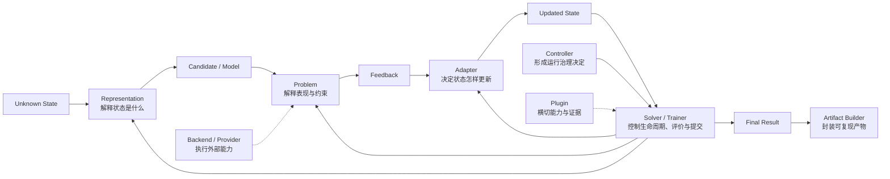

# 第一卷·第十一章　角色本体：Problem、Representation、Adapter、Controller、Plugin 与 Backend

第十章建立了工作的尺度。Project 是整项工作的世界边界，Stage 组织 Case 的依赖与并行，Case 是最小独立运行闭包，Scaffold 规定 Case 怎样装配，Pipeline 组织 Case 内部值流。可是，即使一个 Case 的边界已经正确，内部仍可能把完全不同的责任揉进同一个循环：从业务数据读取约束，顺手修复候选，再决定下一批搜索策略，同时创建 GPU session、写 checkpoint、根据日志请求停止，最后从一个临时字段构建结果。它也许可以运行，却没有人能够说清任何决定究竟由谁拥有。

这一章讨论的不是“一个类应该放在哪个文件”，而是**角色**。角色是一组决策权与相应责任：Problem 有权解释问题事实，Representation 有权解释状态怎样成为领域对象，Adapter 有权决定搜索或更新策略，Solver/Trainer 有权推进控制平面，Controller 有权形成运行治理决定，Plugin 有权在正式生命周期点提供横切能力，Backend/Provider 有权执行外部能力，Artifact builder 有权把已经确定的结果封装成可复现产物。

“有权”并不表示其他角色从来不能调用它，也不表示一种权力必然对应一个 Python 对象。一个小型实现可以由同一个类同时实现两个接口，一个大型实现也可以把一种角色拆成多个协作组件。关键在于每项事实必须有唯一权威解释，每次跨角色调用都不能偷偷转移所有权。Solver 调用 Problem，不代表 Solver拥有目标定义；Plugin 观察 Adapter，不代表 Plugin 可以改写策略；Provider 执行训练，不代表 Provider 可以决定业务指标。

方法名也不足以决定角色。两个对象都可以拥有 `evaluate()`：Problem 的 evaluate 解释领域候选，Provider 的 evaluate 调用后端能力，Plugin 的 evaluate hook 可能短路标准路径。三个方法的名字相同，决策权完全不同。反过来，`repair()`、`sanitize()` 和 `project()` 可能承担同一种表示修复责任，只看名称又会把它们错误拆开。

因此，本章采用一条贯穿始终的判断：**不要问组件“做了哪些动作”，先问它“哪一类决定只有它能够正确作出，以及作出错误决定时应由谁负责”。**沿着一次状态—候选—反馈—更新—提交的因果链，我们会逐步建立这些角色，再用反例检验边界。

---

## 11.1 角色由决策权定义，而不是由调用顺序定义

假设一个优化 Case 调用预测模型估算候选风险。调用顺序可能是 Solver 先生成 Context，Adapter 提出向量，Representation 解码生产方案，Problem 把方案交给模型 Provider，Provider 返回概率，Problem 将概率解释为风险目标，Controller 检查剩余预算，Plugin 记录 trace。若按“谁先调用谁”划分层级，Solver 好像拥有一切，因为其他组件都从它开始；若按“谁真正执行计算”划分，Provider 又好像拥有一切，因为昂贵计算发生在那里。两种判断都不正确。

Provider 知道怎样得到概率，却不知道这个概率应成为目标、约束还是告警；Problem 知道怎样把概率解释为风险，却不知道下一批候选怎样产生；Adapter知道怎样使用目标反馈改变搜索，却不知道概率来自哪种模型；Solver 知道何时调用这些步骤，却不拥有任何一步的领域定义。调用链是一条控制路径，角色边界是一张解释权地图。

可以从四个问题识别一项决策权。

第一，组件依赖哪类事实才能作出决定？需要业务目标和约束的是 Problem，需要状态编码规则的是 Representation，需要算法历史的是 Adapter，需要全局生命周期时点的是控制平面。第二，这个决定的结果被谁视为权威？Problem 的目标反馈进入策略，Adapter 更新后的内部状态成为下一轮策略依据，Controller 仲裁后的停止意图必须被控制平面执行。第三，决定失败时错误属于哪里？数据 schema 错误不是 Adapter 失败，后端连接失败也不是目标很差。第四，其他组件能否在不理解其内部事实的情况下消费正式结果？如果不能，边界仍然泄漏。

由此得到一个比继承树更稳定的角色描述：

```text
Role = (
  facts_it_may_interpret,
  decisions_it_may_make,
  state_it_may_authoritatively_change,
  errors_it_must_own,
  result_contract_it_must_expose
)
```

同一个组件可以实现多个 Role，但必须显式承担每一份合同。例如一个极小的数值问题可以把 Representation 的 decode 和 Problem 的 evaluate 写在同一文件，仍应先完成“状态到领域点”的映射，再完成“领域点到目标”的评价；不能因为物理上同处一类，就让目标函数开始修改编码规则。角色分离首先是因果分离，其次才是代码分离。

角色也不会因为嵌套而改变。外层 Solver 调用内层 Trainer，Trainer 仍拥有学习控制平面；Trainer 调用数值求解 Backend，Backend 仍只拥有外部执行。父级拥有资源派生和结果消费权，不自动获得子级领域解释权。这个原则使同一角色能够在本地、嵌套和远程模式下保持合同。

---

## 11.2 Problem：拥有“什么算作事实”的解释权

任何反馈驱动过程都需要一个地方回答：当前对象在这个问题中表现如何？生产方案的成本、延期与可行性，路径的距离与禁行违反，模型在验证数据上的损失、校准与残差，都不能由通用循环从数组位置猜测。这项权力属于 Problem。

Problem 拥有的是**问题事实语义**。在优化侧，它定义决策变量的领域边界、目标方向、约束和评价含义；在学习侧，LearningProblem 结合 DataView、模型输出和任务合同，定义损失、指标、梯度或残差怎样形成 Feedback。共享 ProblemBase 可以规定 `evaluate(candidate, context)` 的最小调用形状，却不能统一两边返回值的完整含义。

“拥有评价语义”不等于 Problem 必须亲自完成所有计算。一次目标评价可以调用仿真器、数据库、训练 Case 或代理模型。Problem 的责任是形成领域正确的请求，并把外部结果解释为正式反馈。例如仿真器返回温度曲线，Problem 决定最大温度是硬约束还是优化目标；模型 Provider 返回违约概率，Problem 决定它如何进入风险目标。Backend 产生数值，Problem 赋予数值在当前问题中的意义。

这条边界也规定 Problem 不应做什么。它不应根据上一代历史选择新的候选，那属于 Adapter；不应为了偏好某类解而偷偷改变约束，软偏好应进入 Bias 或显式目标；不应创建全局线程池或设备 lease，那属于 Project L0；不应在 evaluate 过程中把候选替换成另一个对象却仍返回原身份的反馈，那会破坏状态与反馈对齐。

Problem 的正确性不能只靠返回类型验证。`np.ndarray` 形状正确，目标顺序仍可能错误；Feedback 有 objectives 字段，数据切分仍可能泄漏；约束返回零，可能只是异常被误当成无违反。Problem 合同至少要说明输入候选语义、反馈字段、目标方向、约束约定、批量 cardinality、外部失败与不可评价怎样表示。具体合同将在第十二章展开，本章只确定这些解释权属于谁。

Problem 与 Bias 的边界尤其需要清楚。Problem 描述现实或任务规则，Bias 描述搜索希望更重视什么。设备容量是硬约束，某类排程更容易被现场接受可能是软偏好；标签和数据切分是学习事实，对简洁模型的偏爱可以是正则、目标或显式 Bias。若把偏好写进 Problem 却不披露，结果看起来是在求原问题，实际已经换了问题。

错误所有权同样提供判据。业务约束无法计算、数据 schema 不匹配、目标维度不符合声明，首先是 Problem 或其调用链上的 Backend 错误；它们不能被 Adapter 统一改成“大惩罚”后失去来源。Problem 可以根据正式政策把某类不可评价映射成违反或惩罚，但原始失败、映射原因和已发生成本必须保留在证据中。

---

## 11.3 Representation：拥有“这个状态表示什么”的映射权

Problem 评价的是领域对象，算法或训练过程维护的却常常是另一种状态。一个排列可以表示访问顺序，一个连续向量可以解码成结构参数，一组 values 加 metadata 可以描述神经网络、树模型或符号表达式。若没有显式映射，相同数组会在不同组件中被赋予不同含义，状态身份也无法稳定。Representation 因而拥有从未知状态到可评价对象的解释权。

这项角色包含 init、encode、decode、repair、mutate 和 batch 变体，却不能简单理解为“处理数组的工具箱”。`decode` 决定状态怎样成为候选、模型或函数，是最核心的语义；`init` 产生满足表示基本条件的初态；`encode` 若存在，说明领域对象怎样回到状态空间；`repair` 恢复表示或明确约束下的合法性；`mutate` 提供一种可用变换。Adapter 可以决定何时调用 mutate、调用多少次，却不应自行复制编码知识。

在 mlblack 中，ModelRepresentation 与 Codec 进一步分担模型解释。Codec 处理状态与模型参数或结构的编码解码，Representation 还要维护状态初始化、条件结构、fingerprint 和 equivalence。Output Head 则拥有模型最终输出的语义：点、区间、概率、类别或符号对象需要不同参数块和有效性规则。Head 可以视为学习表示链中的专门角色，而不是 Problem 从张量宽度临时推断出来的技巧。

Representation 的状态身份不能只比较 values。相同数值配上不同激活函数、类别映射、图拓扑或符号 grammar，可能解码成完全不同对象。当前 ModelRepresentation 的静态表面已提供覆盖 values 与 metadata 的 fingerprint/equivalent 方向，这正是表示权的自然延伸：只有理解 decode 语义的角色，才有资格判断两个状态是否等价。

`repair` 是最容易越权的方法。它应当保证表示可解码、基本边界合法或显式约束得到机械修复，例如裁剪连续变量、补全排列、规范化概率参数。它不应根据历史目标选择“更有希望”的方向，不应把领域业务规则改写成隐藏搜索，不应因为某个候选分数差就替换成精英个体。前者属于 Representation，后者属于 Adapter、Bias 或 Problem。只要 repair 开始依赖代际表现和策略历史，它就不再只是修复。

Representation 也不拥有最终评价。一个状态能够成功 decode，只说明它成为了某种领域对象，不说明对象在 Problem 中表现良好。反过来，Problem 不应绕过 Representation 直接解释内部向量，否则结构 metadata、修复和 identity 合同都会被跳过。二者的边界是：Representation 回答“它是什么”，Problem 回答“它在本问题中怎样”。

---

## 11.4 Adapter 与 Solver/Trainer：策略权和控制权必须分开

有了可评价对象和正式反馈，系统还要决定下一步怎样改变未知状态。遗传选择、差分变异、邻域搜索、信赖域更新、梯度下降、采样或闭式拟合都属于策略。这项权力由 Adapter 承担。共享 AdapterBase 用 `propose` 与 `update` 描述最小闭环：先根据当前策略状态提出候选，再消费与候选身份对齐的反馈，更新自己的算法账本。

Adapter 拥有策略，因此也拥有策略产生的待决状态。差分进化记录候选与差分索引的配对，多策略系统记录每条策略提出多少候选，梯度方法记录动量或优化器状态。若预算只允许原批次的一部分进入评价，控制平面可以裁剪执行批次，却必须通过正式 disposition 通知 Adapter，让它同步裁剪内部账本。否则，下一次 update 会把反馈绑定到错误提议。

Adapter 不拥有评价入口。它不能因为需要一个分数就直接调用 Problem，绕过 Solver/Trainer 的预算预留、Plugin hooks、错误边界和 evaluation count；也不能私自创建并行池，让局部策略超过 ResourceContext。Adapter 可以声明批量偏好、线程安全和能力需求，真实执行仍通过控制平面和共享资源合同。

那么 Solver 或 Trainer 拥有什么？它们拥有的是**领域生命周期控制平面**。控制平面建立正确时点的 Context，调用 Adapter.propose，经过 Representation 得到候选，通过正式评价入口取得反馈，再重新构建包含最新计数与状态引用的 update Context，调用 Adapter.update，读取 Adapter 或领域组件的权威状态并提交 Snapshot，最后形成 Result。它还负责 setup/teardown、Plugin 分发、错误边界、停止请求和最终 Artifact 入口。

控制平面与策略平面分离，使同一 Solver 能装配不同优化 Adapter，同一 Trainer 能使用不同更新方法，而不复制预算、状态与生命周期。它也防止控制平面演化成万能算法：Solver 不应因为掌握 run loop 就硬编码 NSGA-II 环境选择，Trainer 不应因为掌握 fit loop 就把所有模型后端写进自身。

Solver 与 Trainer 的区别来自领域完成语义，而非控制权大小。Solver 要提交可执行方案或多目标前沿，Trainer 要提交可重建模型、反馈与报告；二者都在 Case 内推进生命周期，都消费 ResourceContext，都不能自己成为 Project L0。一个 Trainer 调用 Solver 或 Solver 调用 Trainer时，被调用方仍拥有自己的控制平面，不应退化成几段内部方法调用。

Bias 位于策略附近，却不拥有完整策略。它提供软先验、偏好或代理信号，Adapter 决定如何使用，Problem 保持原事实可辨认。若 Bias 直接更新算法账本，它已经成为 Adapter 的一部分；若 Bias 改写硬约束，它已经改变 Problem。把 Bias 单独命名，正是为了让软引导不会伪装成现实规则。

---

## 11.5 Controller 与 Plugin：运行决定不是生命周期副作用

长期运行会不断产生治理问题：预算是否耗尽，是否因为多轮没有改善而停止，是否应切换策略或阶段，某个降级条件是否已经触发。这些问题既不属于候选评价，也不等于搜索策略。它们读取运行事实，形成对控制平面的决定。当前 `nsgablack` 将这项角色称为 Controller。

Controller 拥有的是一个明确 decision domain 中的**运行决策权**。BudgetController 可以根据最新 evaluation count 计算剩余额度并提出停止，StopController 可以根据耐心条件提出停止，阶段 Controller 可以提出切换。多个 Controller 可能同时产生意见，因此还需要 Arbiter 按 domain、priority 和冲突政策形成唯一决定。Controller 本身不直接重写 Solver 内部任意字段；它提交 ControlDecision，由控制平面在合法 slot 应用。

这一区分让决策可审计。若一个预算 Controller 产生 `{"stop": true}`，运行记录应能说明它在哪个 slot、基于哪份 Context、以什么 reason 提出；控制平面又怎样把 budget domain 的停止意图映射成 request_stop。若 Controller 只修改一个共享字典，或控制平面从未消费其决策，配置存在却没有行为。Controller 的正确性既包括“决定合理”，也包括“决定确实被生命周期执行”。

Controller 必须读取当前事实。评价前构建的 Context 不能继续用于评价后的阶段切换，否则本批已经发生的成本与最佳结果不可见；从未提交的临时状态作出停止决定，也可能导致恢复后不一致。控制平面负责在正确时点重建 Context，Controller 负责解释其中属于自己 domain 的字段。二者任何一方越权，都会产生时序错误。

Plugin 同样挂在生命周期上，却拥有另一种权力。Plugin 提供**横切能力与受控副作用**：trace、checkpoint、指标记录、审计、外部日志、评价前后观察、错误通知和报告扩展。共享 PluginManager 负责注册、优先级、启停、严格模式、事件分发与短路协议；领域 Plugin 在这些时点执行具体能力。

Controller 与 Plugin 的分界不在“是否有 hook”，而在是否拥有运行决定。一个日志 Plugin 看到预算耗尽并自行把 `solver.stop_requested=True`，就绕过了 Controller/Arbiter；一个 Controller 顺手写数据库和上传模型，又把治理决定与外部副作用绑在一起。更清晰的组合是 Controller 产生停止决定，控制平面应用，Plugin 观察决定与结束事件并记录证据。

Plugin 也不能因为能够短路评价就取得 Problem 权力。评价 Provider Plugin 可以从缓存或远端服务返回 Feedback，但仍必须满足 Problem 声明的目标维度、约束数量、批量 cardinality 和身份对齐；它不能把异常随意转成零目标，也不能改变目标顺序。短路改变执行路径，不改变语义合同。

错误 hook 需要唯一分发所有者。若单个候选 helper、批量 helper 和最外层 run loop 都触发 `on_error`，同一错误会被记录或恢复多次；若只有 run loop 分发，公开 `evaluate_population()` 入口又可能完全没有错误事件。正确边界是在公开生命周期入口建立统一 error boundary，异常携带 phase 与 dispatched marker，保证一次失败最多且至少分发一次。Plugin 接收错误，不拥有错误传播规则。

因此，Controller 回答“运行接下来应该做什么”，Plugin 回答“在这个正式时点需要附加什么能力或证据”。前者的输出必须进入控制平面，后者的副作用必须被生命周期约束。把二者都叫“hook”会丢掉这项根本差异。

---

## 11.6 Backend 与 Provider：拥有执行能力，不拥有领域目的

Problem 可能需要仿真，Trainer 可能需要 PyTorch，Snapshot 可能需要 Redis，Project 可能需要远程 worker。真正执行这些能力的系统拥有自己的 API、资源模型、错误和取消限制。框架内部需要 Backend 或 Provider 把正式合同翻译成现实调用。

Backend/Provider 的决策权是**如何在某种外部能力上执行已经形成的请求**。PyTorch Provider 可以决定如何创建受 ResourceContext 限制的 device session，Redis Backend 可以决定怎样原子写入一个已定义的 Snapshot envelope，仿真 Bridge 可以决定怎样提交任务并轮询结果。它们不能决定为什么要训练这个模型、某个仿真量是否构成业务约束，也不能自行扩大资源授权。

Provider 经常知道大量技术细节，因此很容易反客为主。例如一个分类 Provider 发现正样本稀少，自动改变类别权重；如果这一行为没有进入 LearningProblem 或配置合同，它已经改变学习目标。商业求解器 Backend 为了加速擅自放宽约束，则直接改写优化事实。Backend 可以提出 capability、fallback 和 tuning option，领域层必须显式选择并记录生效设置。

资源关系也必须保持单向。Project L0 发放 ResourceContext，Case 控制平面把有效授权传给 Backend/Provider，后者在许可内创建 session 并报告实际使用。如果 BlankTrainer 构造时先创建 CPU session，随后 setter 注入 GPU ResourceContext 却不重建或校验 session，审计显示的授权与真实执行设备就会分叉。解决方法不是让 Provider 自行探测全部 GPU，而是让授权变更与 session 状态原子同步，或者禁止构造后改变授权。

外部失败不能被伪装成领域劣质结果。仿真超时、数据库断连、CUDA OOM、远程任务丢失与“候选确实表现很差”是不同事实。Provider 应返回结构化错误与能力状态，Problem 或控制平面根据明确政策决定重试、降级、惩罚或终止。即使最终映射成惩罚目标，证据链也应保留原始失败和已消耗成本。

取消能力尤其能检验 Backend 合同。线程 future 被 cancel 不代表正在执行的 Python 函数停止，远程服务返回 accepted 也不代表任务已终止。Provider 必须说明支持的是停止排队、协作式取消、服务端确认还是强制终止；控制平面据此设置 fence 和晚到写入规则。一个统一 `cancel()->True` 接口若不描述能力等级，只会制造错误确定性。

Backend 与 Plugin 有时会结合，例如一个评价 Plugin 使用远端 Provider。这没有问题，只要角色仍然可辨认：Plugin 决定在什么生命周期点接入，Provider 决定怎样执行外部调用，Problem 决定返回值的领域含义。把三者写进一个类可以减少代码，却不能合并三种责任。

---

## 11.7 Artifact builder：封装已经成立的结果，而不是重新选择结果

一次运行结束时，内存里可能同时存在当前状态、最佳状态、最后一次评价、Adapter 内部账本、模型对象、指标、Snapshot 引用和运行报告。谁负责把这些内容变成可以在新进程中继续使用的产物？这项角色由 Artifact builder 承担。

Artifact builder 拥有的是**产物封装权**。它根据已经提交的最终 Result 和权威状态，收集模型或方案、表示/Codec、Head、特征与类别信息、训练状态、报告、资源证据和 Snapshot references，构造成版本化 Artifact。它可以选择序列化格式和 envelope，却不能重新运行评价、重新比较候选或从旧字段猜测“哪个才是最佳”。最终选择属于 Solver/Trainer 和领域结果语义，builder 只物化这个选择。

这条边界防止结束阶段悄悄改写历史。假设 Adapter.update 后已经产生新的权威模型状态，Trainer 的 `self.population` 仍保存评价前对象；Artifact builder 若直接读取方便字段，就会封装旧模型。正确做法是控制平面先从 Adapter/Representation 的权威接口提交最终状态，Result 引用该状态，builder 再据此构造 Artifact。封装不能补救上游尚未闭合的状态语义。

Artifact builder 与 SnapshotStore 的角色也不同。SnapshotStore 负责运行状态 envelope、版本和持久化 backend，Artifact builder 负责哪些内容共同构成可复现产物。模型 Artifact 可以引用 Snapshot，也可以把最终参数物化进自己的 schema；无论采用哪种方式，读取端必须恢复模型含义，而不只是得到一组字节。

Artifact builder 还不能被 Dashboard 取代。Dashboard 读取已有 Artifact、Result 和事件，展示模型、前沿和资源信息；它没有权力重新拼接互不一致的记录。若页面显示的最佳指标来自 run A、模型文件来自 run B，视觉上再完整也不构成产物。builder 在提交时关闭 schema 与 lineage，Dashboard 只能投影。

当前 mlblack 的静态 `ArtifactBuilder` 会根据 Trainer 与 result 构造 model artifact、trainer state、run report 和 Snapshot references，这证明角色表面已经存在。它是否在所有 Trainer、复合阶段和 Redis 恢复路径中都读取最终权威状态，仍需要执行测试证明。本章只用它说明角色方向，不把类存在当作闭包证据。

---

## 11.8 一条完整角色链，以及越权时会发生什么

现在可以把角色放回一次 Case 运行，但这次图中的箭头只表示正式调用，不表示所有权转移：



沿这条链可以系统检查越权。

Adapter 直接读取业务数据，会把 Problem 的事实语义藏进策略，导致同一算法无法在其他问题复用，也使数据错误被误判为策略错误。Representation 的 repair 承担搜索，会让候选在评价前被隐式优化，反馈无法追溯到原提议。Plugin 改写 Pareto archive 或模型选择规则，会让启停一个观测能力改变算法答案。Controller 使用旧 Context，会让预算和阶段切换晚一轮发生。Solver/Trainer 私自创建全局 GPU 池，会与 Project L0 产生两个资源权威。Provider 决定业务目标，会把技术 fallback 变成未披露的问题变更。Artifact builder 重新挑选最佳对象，会让最终产物脱离运行时权威状态。

这些反例并不要求组件之间毫无交流。Problem 可以形成供 Adapter 消费的反馈，Representation 可以形成供 Problem 评价的候选，Controller 可以读取控制平面 Context，Plugin 可以观察所有正式事件，Backend 可以返回 capability 与错误，builder 可以读取 Result 和状态引用。边界限制的是**解释与提交权**，不是数据流本身。

也不能把“每个角色一个类”变成教条。一个简单 Case 可以让同一对象实现 Problem 与 Backend wrapper，只要外部失败和领域反馈仍然分别表达；一个复杂 Adapter 可以拆成 proposal policy、selection policy 和 state ledger，只要它们共同对策略状态负责。角色本体关心的是决定是否唯一、合同是否显式、错误能否找到所有者。

可以用下面的规则完成日常判断：

```text
如果组件在定义现实或任务怎样评价，它属于 Problem；
如果组件在定义状态怎样成为对象，它属于 Representation；
如果组件在决定下一步尝试或怎样更新，它属于 Adapter；
如果组件在推进时序、评价入口和状态提交，它属于 Solver/Trainer；
如果组件在对预算、停止或阶段作治理决定，它属于 Controller；
如果组件在生命周期点增加横切能力，它属于 Plugin；
如果组件在翻译并执行外部能力，它属于 Backend/Provider；
如果组件在封装已成立的最终产物，它属于 Artifact builder。
```

若一个功能同时命中多条，不要选择最方便的目录，而要拆出多个角色并定义它们之间的正式结果。例如“用远程模型评价优化候选”包含 Provider 的远程执行、LearningProblem 的模型指标、Bridge 的结果投影和优化 Problem 的目标/约束解释。把它们塞进一个评价 Plugin 虽然能跑，却让四种错误和四种状态无法区分。

当前 `blackbase.abc` 已提供 ProblemBase、RepresentationBase、AdapterBase，`blackbase.plugin` 提供共享 Plugin 生命周期，`nsgablack` 提供 Solver、Controller、Bias 与优化扩展，`mlblack` 提供 LearningProblem、ModelRepresentation、Head、Trainer、Provider 和 Artifact builder。它们构成 **D/S：当前声明与源码静态表面**，不能单独证明所有角色已经在每条运行路径中严格分离。

第十章给合同找到了尺度，本章给合同找到了责任主体。下一章将进一步回答：即使知道“谁负责”，怎样证明一个具体组件真的能被装配和运行？类型注解只能说明一部分，Context 读写、资源需求、backend capability、生命周期、I/O、错误、取消、版本和兼容还需要彼此正交的合同。只有这些合同显式化，角色边界才不再依赖开发者记忆。

本章的角色关系属于 **I：架构不变量的角色化展开**；源码类和方法只提供 **D/S** 证据。其出口不是一张类图，而是一套能够判断决策权、状态权和错误所有权的语言。
