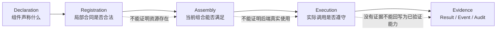

# 第一卷·第十二章　合同本体：类型、能力、上下文、资源与 I/O

第十章回答合同约束哪个工作尺度，第十一章回答合同约束哪个责任角色。现在还差第三个问题：一个组件说自己“实现了某个角色”，框架凭什么相信它能够进入当前运行？一个类继承 ProblemBase，只说明它拥有一个可调用的 `evaluate()`；这并不能证明输入候选维度正确、Context 中存在所需数据、批量结果数量对齐、外部 Backend 支持必要能力、资源授权足够、异常能够被正确归属，或者恢复时 schema 仍然兼容。

工程中大量“组件已经注册，却一运行就失败”的根因正在这里。开发者把可调用性当成可组合性，把配置字段存在当成能力已经解析，把 `Optional` 当成可以静默缺失，把默认值当成兼容策略，把函数体抛出的 TypeError 当成签名不匹配。每个局部判断似乎都很方便，组合起来却没有一份完整承诺。

本章把合同理解为一组正交证明义务。类型合同说明值的静态或运行形状，I/O 合同说明值怎样跨组件与 Case 边界，Context 合同说明组件读取和写入哪些运行信息，能力合同说明执行路径需要什么 Backend 特性，资源合同说明需求怎样变成有效授权，生命周期合同说明方法允许在哪个时点调用，错误与取消合同说明失败事实怎样传播，版本合同说明保存或传输的对象能否被另一端理解。

这些合同不能被压成一个巨型 `config: dict`。配置只表达意图；合同定义意图成立所需的条件；解析过程把当前组件、Backend、资源和输入组合成生效能力；真实运行再提供条件确实被遵守的证据。四者缺一不可。

可以先用一个形式化表达固定本章立场：

```text
Runnable(component, case) =
    TypeContract
  ∧ IOContract
  ∧ ContextContract
  ∧ CapabilityContract
  ∧ ResourceContract
  ∧ LifecycleContract
  ∧ ErrorAndCancellationContract
  ∧ VersionContract
```

这里的合取意味着任何一项失败，组件都不能被诚实地称为“已解析可运行”。系统可以根据明确政策选择 fallback，但 fallback 会形成一份新的生效合同，不能假装原合同已经满足。

---

## 12.1 Python 类型只能说明入口形状，不能说明运行承诺

类型注解非常重要。它能告诉调用者参数是 Sequence 还是 Mapping，返回值是否可能为空，静态检查器也能发现大量拼写和组合错误。但框架中的对象往往携带比 Python 类型更丰富的含义。同一个 `np.ndarray` 可以是候选、目标矩阵、梯度、图邻接或模型参数；同一个 `dict[str, Any]` 可以是 Context、配置、Feedback 或 Artifact metadata。类型相同不代表合同相同。

即使只看函数调用，签名也不能靠捕获 TypeError 猜测。一个框架若依次尝试 `operator(value, context)`、`operator(value)`、`operator()`，并把任何 TypeError 都理解成参数不匹配，那么接受两个参数但函数体内部真正抛出 TypeError 的算子会被再次执行。数据库写入、Artifact 保存或计数器更新可能发生两遍，原始错误还会被掩盖。正确做法是调用前用签名绑定判断某种参数组合是否合法；一旦成功绑定，函数体抛出的 TypeError 必须原样传播。

这说明调用合同至少包含两层。第一层是**绑定合同**：方法接受哪些参数，哪些是 keyword-only，缺省值是什么。第二层是**语义合同**：`candidate` 表示什么，`context` 属于哪个逻辑时点，返回对象怎样解释，调用是否允许产生副作用。Python signature 能帮助第一层，无法独立完成第二层。

运行时 shape 也是合同的一部分。一个多目标 Problem 声明三个目标，evaluate 返回长度二的数组，即使类型仍是 ndarray，也已经违反合同；一个 batch Provider 接收 N 个候选，返回 M 行结果且 `M != N`，不能把多余或缺失部分交给 Adapter 自行猜测；一个模型输出概率 Head，返回负数或未归一化值，形状正确仍可能语义非法。

因此，类型合同需要逐步具体化为 dtype、rank、dimension、cardinality、field schema、nullability、identity 和 serialization 等条件。不是每个组件都要声明所有维度，但它必须声明自己依赖哪些条件。未声明不是“自动兼容”，只是框架无法提前证明。

`required` 与 `optional` 也不能由参数是否有默认值决定。某个 Provider 参数在 Python 中可以是 `None`，但当前运行模式若要求 GPU capability，它就是运行级 required；某个 metrics 字段在一般合同中可选，但最终 Artifact schema 若承诺包含校准报告，它在产物构建阶段就变成 required。必需性属于具体组合与阶段，不只属于函数定义。

---

## 12.2 I/O 合同：值能够传递，不等于含义能够抵达

组件之间首先通过值连接。Representation 输出候选，Problem 输出 Feedback，Case 输出 Result 与 ArtifactRef，Pipeline 算子把一个中间值交给下一个算子。若只要求“能够序列化”或“下游没有立刻报错”，系统仍可能把错误对象传得非常顺畅。I/O 合同需要保证接收方得到的不只是字节，而是可以在自己的角色中正确解释的对象。

Case 内 I/O 通常要求低延迟，可以传递结构化 Python 对象；跨 Case 或远程 I/O 必须依赖正式 envelope 与引用。当前 CaseRunRequest 明确携带 project、stage、case identity、kind、mode、ResourceContext、component overrides、input artifacts 与 argv；CaseRunResult 则携带 status、output、artifact refs、耗时、退出码和错误。它们把“启动一次 Case”与“拿到一个普通函数返回值”区分开来。

大对象不应为了方便被内联到请求中。DataRef 或 ArtifactRef 至少需要 locator、kind、backend、media type、checksum、size 和 metadata，使接收方能够检查来源和完整性。一个文件路径字符串只能说明“本机某处可能有东西”，无法说明内容类型、版本、校验和与生命周期。远程执行时，本地绝对路径甚至没有意义。

领域 I/O 还需要正式 schema。Prediction 不只是数组，还可能需要 output kind、类别映射、区间含义或概率校准；Data 不只是 X/y，还需要样本轴、feature schema、时间与分组边界；Artifact 不只是 pickle，还需要模型家族、Codec、Head、依赖版本和 lineage。共享信封负责运输，领域 schema 负责解释，两者缺一不可。

批量 I/O 尤其需要 cardinality 与 identity。若 Adapter 提出十个候选，预算只允许六个进入评价，系统不能只返回一个长度六的数组，让 Adapter 猜测哪四个被删。BatchDisposition 需要记录 proposed count、accepted indices、reason 与 reservation id，后续 Feedback 必须保持 accepted order。部分失败也不能仅靠缩短结果长度表示，否则失败候选与成功候选会错位。

I/O 合同还要定义失败输出。一个外部 Provider 超时，是返回 ErrorResult、抛出带 phase 的异常，还是根据显式政策形成不可评价 Feedback？任何一种都可以设计，但不能同时存在三种隐式约定。返回空数组、None 或零分常常让类型检查通过，却把失败伪装成合法业务值。

因此，一份可组合 I/O 合同至少回答：输入是谁、属于哪次运行和哪个版本；值的结构与语义是什么；批量元素怎样对齐；大对象怎样引用；正常结果和失败结果怎样区分；下游怎样验证完整性。第十三章会专门展开 UnknownState、Candidate、Feedback 与 Result，本节只确定它们必须通过正式边界转换，不能由一个 ndarray 贯穿全部阶段。

---

## 12.3 Context 合同：声明读写关系，而不是共享任意字典

长期运行中的组件需要访问当前 generation、step、candidate identity、资源引用、少量指标和停止状态。若每个组件都接收一个任意字典并自由读写，调用签名看起来统一，依赖却全部变成隐藏状态。组件只有运行到某条分支时才暴露缺失 key，两个 Plugin 也可能无声覆盖同一字段。

ContextContract 用 `requires`、`optional`、`provides`、`mutates` 与 `cache` 把这种隐式依赖变成可检查关系。

`requires` 表示组件进入相应阶段前必须已经存在的字段；缺失意味着当前组合不成立，而不是随便填一个默认值。`optional` 表示组件能够在字段缺失时保持合同，并且缺失行为必须明确。`provides` 表示组件承诺产生此前不存在或由它负责的字段。`mutates` 表示它获准改变已有字段，因此需要处理多写者冲突与时序。`cache` 表示字段可以派生或重建，不应被误认为不可替代的权威状态。

这五类关系不能只做文档。装配时可以检查某个 required key 是否由上游、Case runtime 或输入提供；可以发现两个组件都宣称 mutates 同一 key；可以验证字段是否来自规范 key registry；运行时可以检查 provides 是否真正发生。若合同只被 Catalog 展示，却不进入 build-check 和运行边界，它仍然只是注释。

required 与 optional 的区别需要严格保持。最危险的实现是 `ctx.get("data", default_data)`：它把一项真正必需的数据依赖伪装成可选，并可能让训练在错误数据上继续。可选字段不是“框架会帮忙猜”，而是组件已经定义无此字段时的合法语义。例如 trace id 可以缺失并关闭链路关联，训练数据不能因为 optional 默认值而从未知位置加载。

`provides` 与 `mutates` 也不能合并成“writes”。首次建立 `candidate.model` 的 Representation 与修改已存在 `candidate.model` 的 Plugin 拥有不同责任；后者若未声明 mutates，就应被合同检查拒绝。多个 provides 写同一 key 也需要唯一权威或显式 merge，不能以插件优先级偶然决定真相。

Context 仍然必须保持轻量。合同中声明一个 key，并不意味着可以把 population、模型对象或完整 history 直接塞入 Context。大对象应进入 Snapshot 或 Artifact，Context 提供 handle/ref。否则 requires/provides 虽然可检查，状态所有权仍会复制。

当前共享 ContextContract 还包含 artifact requires/provides、phase in/out、required metrics 与 fallback policy，并兼容历史命名。兼容别名可以帮助迁移，但规范化后必须得到同一合同；如果两种命名分别进入不同检查器，系统会再次形成合同 split-brain。

---

## 12.4 能力合同：从“配置启用”走到“当前环境已解析”

组件经常需要某种能力而非某个固定实现：批量评价、梯度、恢复、概率输出、稀疏运算、GPU、事务写入、远程取消。能力合同应该描述“必须能做什么”，Backend/Provider 再说明“由谁以及怎样做到”。若组件直接依赖具体库名，替换后端和运行前检查都会变得困难。

能力至少有四个状态：declared、available、resolved 和 used。declared 表示配置或组件声称需要或支持；available 表示当前环境发现候选实现；resolved 表示装配过程选出了满足约束的实现；used 表示真实运行确实经过它。把这四个状态压成 `enabled=True`，就会出现配置里有 GPU、实际 session 仍在 CPU，或 Catalog 声称 supports_resume、真正对象却没有可恢复状态。

required capability 缺失应在运行前失败。若 Problem 明确需要 gradient，所选 Representation/Provider 不支持，build-check 应报告不可满足，而不是等到第几十步调用时才抛 AttributeError。optional capability 缺失可以触发已声明 fallback，但 fallback 必须说明语义与成本变化。例如批量 Provider 不可用时退回单点评价可能只影响性能；GPU 不可用时退回 CPU 可能影响时间预算；概率 Head 不可用时退回点预测则改变任务语义，通常不能静默降级。

“缺失能力”和“能力运行失败”也必须区分。环境中没有 Redis driver 属于 resolution failure；Redis 已解析但运行中断连属于 execution failure。前者适合在装配阶段阻止启动或选择 fallback，后者需要错误、重试和幂等合同。把二者都捕获为 `except Exception: use memory`，可能在中途把权威状态切换到另一 backend，破坏恢复与并发一致性。

能力声明还需要参数化。`supports_batch=True` 不足以说明最大 batch、输入形状、部分失败语义和线程安全；`supports_resume=True` 不足以说明能恢复哪些状态与 schema 版本；`supports_cancel=True` 不足以说明协作式还是强制取消。布尔值适合第一层筛选，正式合同还要携带 capability detail。

当前 ComponentContract 已能表达 supports_gradient、supports_batch、supports_resume、required metrics 与 fallback，并将 ContextContract 作为可序列化桥梁。这是合同收敛的静态基础，但 capability 是否真的被 builder 解析、是否与实际 Backend session 一致，仍需要 build-check 与运行报告证明。

---

## 12.5 资源合同：需求、供给、授权与实际使用是四个对象

资源配置最容易制造“声明即事实”的错觉。一个 Case 写 `threads=8`，只说明它希望使用八个线程；机器检测到十六个线程，只说明 worker 可以提供；Project 分配四个线程，才形成该 Case 的有效授权；Case 最终因为串行 fallback 只使用一个线程，又是另一项运行事实。需求、供给、授权与实际使用必须分别表达。

**ResourceRequirement** 属于 Case 或组件，描述完成任务所需或希望获得的线程、设备、内存、Backend capability 和 timeout。**ResourceOffer** 属于 worker 或执行环境，描述当前可供分配的能力。Project L0 根据 policy、其他任务和 lease 形成 grant，再通过 **ResourceContext** 注入 Case。Backend session 最终报告 effective usage。四者可以不同，但差异必须可解释。

这条链具有单调约束：子 Case 的 grant 不能超过父级授权，组件的 effective usage 不能超过 Case grant，派生 ResourceContext 不能凭空增加线程、设备 token 或预算。领域层可以拒绝过小授权，也可以按公开策略降级；它不能在本地探测到更多 GPU 后自行扩张。资源需求是请求，不是所有权。

资源合同也不应只表达数量。一张逻辑 GPU token 与本机 `cuda:0` 不是同一个概念，远程 Backend、exclusive/shared policy、显存要求、线程安全和 namespace 都会影响可用性。Project 发放逻辑设备身份，Provider 把它解析为实际 session，并在报告中同时记录 grant 与 effective device。把本机编号硬编码进 Case，会让调度、远程和审计同时失效。

timeout 也不只是资源字段。ResourceRequirement 可以声明期望时限，Project 可以给出 deadline，Pipeline 可以设置 slot timeout，外部 Provider 又有自己的请求超时。它们必须明确谁计时、超时影响哪个 scope、是否触发 cancellation token，以及已开始成本怎样保留。一个到处传递的 `timeout=30` 若没有 scope，无法判断它限制单次评价、一个 Case 还是整项 Project。

ResourceContext 是被动 grant，不是 allocator。Trainer、Solver、Stage runner 和 Provider 可以读取、派生更小子级并审计，不能通过 setter 把它变成新全局资源源。复合 Trainer 启动子 Trainer时，应派生 scope 与 namespace，确保 teardown 发生；Project Stage 并行多个 Case 时，则由 L0 根据总 offer 发放独立 lease。相同“子任务”在不同尺度上使用不同授权路径。

资源不足与 Backend 失败也不能混淆。构建前发现没有满足显存要求的 worker，属于资源解析失败；已经获得 GPU lease 后 CUDA OOM，属于执行失败，可能说明实际占用、模型估计或共享 policy 不符合预期。前者不应进入训练循环，后者必须进入错误与审计链。

当前 `blackbase.resources` 已定义 ResourceOffer、ResourceRequirement、ResourceContext、ResourceLease、Allocator、Budget authority 和 audit primitives，静态上具备分离这些对象的基础。是否所有 Case builder、内部 stage 和 Backend 都真正消费同一 grant，仍然需要运行证据。

---

## 12.6 生命周期、错误与取消：合同必须覆盖非成功路径

很多接口只描述成功调用：setup 后反复 step，最后返回 Result。真实系统更常在中间失败、部分成功、超时、请求停止或恢复。若合同不描述这些路径，开发者会在每层各写一套 try/except/finally，造成 teardown 漏失、on_error 重复、预算回滚过度和后台任务晚到写入。

生命周期合同首先规定调用顺序与时点。Problem evaluate 必须在输入和 Context 已验证后发生；Adapter update 必须接收评价完成后的最新 Context；Snapshot commit 必须读取 update 后的权威状态；Artifact build 必须发生在最终 Result 确定以后。相同方法在错误时点调用，即使参数类型完全正确，也会产生 stale state。

setup 与 teardown 必须成对。只要 setup 成功创建了线程池、文件、设备 session 或临时租约，后续任何阶段失败都应进入 finally 清理。复合 Trainer 不能只给成功子阶段调用 teardown，Project 外部 worker 也不能因为进程异常就假定远程 lease 自动消失。生命周期合同需要说明重复 teardown 是否幂等、部分 setup 怎样回滚。

错误合同至少携带 phase、owner、cause、retryability、cost state 和 dispatch state。phase 说明失败发生在 build、setup、propose、evaluate、update、commit、artifact 或 teardown；owner 说明哪个角色首先解释；cause 保留原始异常；retryability 不能仅从异常类型猜测；cost state 说明哪些真实调用已经开始；dispatch state 防止同一错误多次触发 Plugin on_error。

“捕获异常”不等于拥有错误。底层 helper 可以添加 phase 后重新抛出，最外层公开入口负责分发一次 on_error 和形成 CaseResult；Provider 可以报告外部 cause，Problem 决定是否映射为领域反馈。若每层都认为自己应该恢复，同一次异常可能被重试多次；若每层都只重新抛出，公开 evaluate API 又可能没有任何错误事件。合同必须指定 error boundary。

部分失败时，预算合同尤其重要。顺序评价预留三个额度，前两个已经调用 Problem，第三个失败，只能退还尚未开始的额度；前两个无论成功与否都已经消耗现实成本。reservation、started、completed、failed 和 unused 需要分别计数。把整批 reservation 全部 cancel，会让用户通过反复制造第三个失败突破硬预算。

取消合同应表达能力等级。requested 表示上层希望停止，acknowledged 表示子层收到请求，cooperatively-stopped 表示算子在安全点退出，force-terminated 表示执行环境确认终止，still-running 表示调用方已经停止等待但任务可能继续。Python thread 通常不能安全强制终止，因此 future.cancel 只对尚未开始任务可靠。外部 Provider 也必须报告真实能力。

取消还要配合 fence。超时分支可能保留 ContextStore、SnapshotStore 或 Artifact handle，在主流程继续后晚到写入。run token、namespace 与有效状态机必须让存储层拒绝失效写入，而不只是依赖算子自觉。取消因而同时是生命周期、资源、状态和 I/O 合同的交叉点。

这些内容会在第十四、十五章进一步形式化；本章的结论是：一个只描述成功方法签名的组件合同远远不够。可运行性必须覆盖失败、部分完成、清理、取消和恢复。

---

## 12.7 版本与兼容：能读旧对象，不等于旧语义仍然成立

框架跨仓库、跨进程并持续演化，任何正式 I/O 都会遇到版本问题。Context key 会规范化，Snapshot envelope 会改变，Artifact schema 会增加字段，Feedback 可能扩展 metrics，Case builder 入口可能迁移。若版本合同缺失，读取端只能凭字段是否存在猜测来源。

版本至少分为实现版本、协议版本和数据版本。包的 `0.1.0` 是实现发布版本，`population_snapshot_v1` 是某类协议或 schema 版本，数据集与模型 Artifact 还可能拥有自己的内容版本。三者不能互相替代。升级 Python 包不一定迁移旧 Snapshot，读取相同 schema 也不表示模型依赖版本兼容。

兼容有多个方向。向后兼容表示新实现能读取旧对象，向前兼容表示旧实现能忽略或理解新字段，语义兼容则要求字段含义没有被悄悄改变。给新字段加默认值最多解决结构兼容；如果旧对象缺少 candidate identity，而新算法依赖身份对齐，填空字符串并不能恢复语义。

兼容 forwarder 也必须有合同。旧 import path 可以重导出新权威实现，但不能保留独立状态、不同默认值或不同异常语义；旧 builder 可以调用新 builder，但不能额外装配组件。否则所谓兼容层是第二套实现。迁移期应记录 deprecated version、目标移除版本和等价测试，而不是永久保留“也许有人在用”的路径。

跨仓 I/O 还要防止类型只在本地可导入。CaseRunRequest、DataRef、UnknownState、Feedback 与 Result 等共享协议对象需要稳定的 transport payload；领域对象通过 codec/envelope 转换。安全 serializer 遇到未知对象时若只保存 type 与 repr，读取成功得到字符串，不是兼容，而是静默数据丢失。无法恢复正式语义时应拒绝或要求注册 codec。

版本迁移不能在读取时无声修改权威事实。迁移函数应明确 `from_version -> to_version`，保留原 checksum 与 lineage，输出新对象并记录事件；若迁移改变目标方向、类别映射或约束含义，则已经超出结构迁移，需要领域确认。通用底座不能自行完成语义迁移。

因此，版本合同回答的不只是“能否反序列化”，还包括读取后是否仍能满足当前角色、Context、能力与 I/O 合同。兼容是整组合取式的兼容，不是 JSON parse 成功。

---

## 12.8 注册、装配与运行：合同必须在三个时点被重新证明

一份合同写在类属性或 Catalog 中，只能证明组件声明了什么。组件进入具体 Case 后，上下游、Backend、资源和输入已经变化，需要重新解析；真实运行时，外部能力、返回 shape 和副作用又可能偏离声明。因此合同验证至少发生在注册、装配和运行三个时点。

**注册时**检查局部自洽：名称与 schema 合法，Context key 来自规范 registry，required/optional 不冲突，supports 字段与接口表面基本一致，版本和依赖元数据完整。注册检查不能证明当前 Project 有 GPU 或上游会提供 data；它只拒绝明显不完整的组件声明。

**装配时**检查组合可满足：每个 requires 是否由输入或上游 provides，多个 mutates 是否冲突，required capability 是否能够解析，ResourceRequirement 是否能从 Project grant 满足，Artifact schema 是否兼容，builder 实际装配的组件是否与配置一致。build-check 应报告 effective components、resolved Backend、effective ResourceContext 和 fallback，而不是原样打印配置。

**运行时**检查动态事实：批量 cardinality 与 shape、Backend 实际设备、Context 提供字段、预算消费、取消状态、Snapshot 写入和 Result 引用。运行时验证不应重复所有静态工作，却必须保护无法提前知道的边界。真实执行证据来自这些检查与事件，而不是从类名推断。

三个时点可以画成一条逐渐增强的证据链：



默认值必须在这条链中被审计。默认值适合补充不影响语义的便利配置，例如未指定日志名称；不适合掩盖 required data、目标维度、设备授权或取消能力。每次使用 default，报告应能区分 explicit、inherited、resolved default 和 fallback，避免用户看到一个值却不知道它从哪里来。

合同冲突也不能简单“后注册覆盖先注册”。两个 Plugin mutates 同一 key、两个 Controller 声称拥有同一 domain、两个 Provider 都宣称唯一输出 Artifact，必须由显式合并或仲裁规则处理；没有规则就应在装配时失败。确定性优先级可以决定事件顺序，不能自动决定语义所有权。

由此可以得到一份最小合同范式：

```text
component identity + role
input/output schema and cardinality
context requires/optional/provides/mutates/cache
required and optional capabilities with fallback
resource requirement and effective grant
lifecycle phases and legal call order
error owner, retry and cancellation semantics
protocol/schema version and compatibility policy
registration/build/runtime validation rules
```

这不是要求所有组件填写冗长表格，而是要求它们显式声明与自身有关的维度。纯函数算子可能只需要 I/O 和 Context 合同；远程训练 Provider 则必须覆盖能力、资源、错误、取消和版本。合同强度应随已宣称能力增加，而不是所有组件一刀切。

当前 `blackbase.contracts`、ContextContract、ResourceRequirement/ResourceContext、BatchDisposition、DataRef、CaseRunRequest/Result，以及 mlblack 的兼容 forwarder 构成 **D/S：声明与源码静态表面**。这些对象已经提供共同语言，但某个 Case 是否在注册、build-check 和运行三个时点全部使用它们，必须逐条验证。本章没有执行 Doctor、测试或真实 Backend。

第十二章完成后，我们已经知道合同约束什么尺度、由哪个角色承担、需要覆盖哪些正交维度。下一章将把 I/O 链中最容易混为一谈的四种对象单独展开：UnknownState、Candidate、Feedback 与 Result。它们不是同一个数组在不同变量名下的别名，而是状态被解释、评价和提交时的四个不同阶段。只有这四者分开，cardinality、identity、metadata 和 schema version 才有准确落点。

本章的合同体系属于 **I：架构不变量的协议化展开**；现有合同类属于 **D/S** 证据。其出口是一套可用于 registration、build-check 和 runtime validation 的证明义务，而不是一张只供文档展示的字段表。
