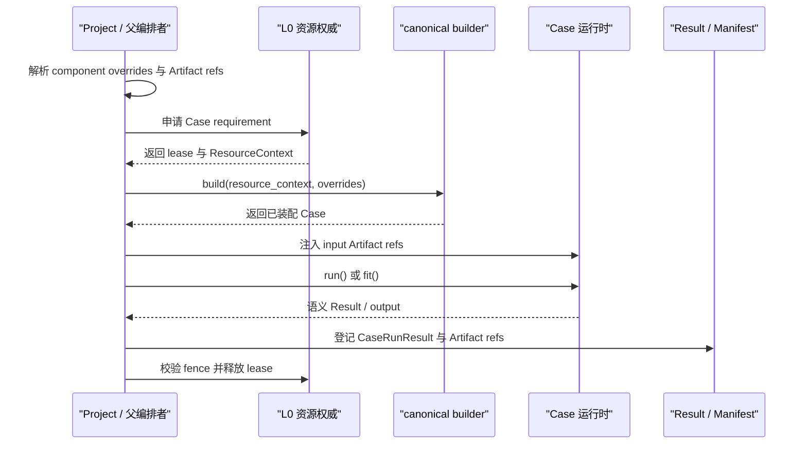

# 第五卷·第一章　Case 作为组合单元：独立运行与被调用为何是同一件事

前面的两卷分别建立了优化与机器学习的内部闭包。一个 Solver 为什么必须围绕候选、反馈与权威种群组织，一次 Trainer 运行为什么必须围绕数据语义、模型状态、Feedback 与 Artifact 组织，到这里都已经有了各自的答案。然而，只要两个完整任务第一次发生关系，前面获得的秩序就会立刻受到考验。

设想一个模型校准任务。它独立运行时会读取一份版本明确的数据，申请计算资源，初始化模型，执行若干轮训练，保存 checkpoint，最后交付模型 Artifact、验证指标和运行报告。后来，一个外层结构搜索任务需要反复改变模型结构，并把每次校准后的指标作为候选反馈。最容易写出的代码，是在外层 `evaluate()` 里直接 import 内层 ML 装配函数，临时构造几个对象，然后调用 `fit()`。数值可能正确返回，程序也可能跑完，但原来属于校准任务的输入身份、资源授权、统一 Solver 生命周期、插件钩子、失败记录、Artifact 提交和恢复入口，已经悄悄消失了。它不再是“那个可独立运行的校准任务”，而变成了一段只在外层函数内部成立的私有代码。

这正是组合层首先要解决的矛盾：如果一个任务只有在独立运行时才完整，那么它实际上不可组合；如果为了被调用而复制另一套简化实现，那么独立路径与组合路径迟早会产生两个事实版本。所谓“Case 作为组合单元”，不是说所有函数都要套一层目录，也不是说父任务只能启动子进程，而是要求同一个运行单元无论由用户直接启动、由 Project 编排，还是由另一个任务间接触发，都保持同一份装配事实和同一组边界合同。

因此，本章的命题可以写得很严格：

> **[I] 一个标准 Case 的身份，由它接受什么有效请求、通过哪一个 canonical builder 完成装配、遵循什么生命周期、提交什么 Result 与 Artifact、怎样释放资源和报告失败共同决定；调用位置、进程形态和上层语义可以变化，这些合同不能随之变化。**

“独立运行与被调用是同一件事”说的正是这种合同同一性，而不是说两次运行具有相同的 PID、相同的日志前缀，或者父子任务必须共享全部状态。把这层含义说清楚以后，外层优化包住内层训练、训练过程调用内层优化、多个 Solver 协作以及跨 Worker 执行，才会拥有共同的起点。

---

## 1.1 真正需要保持的不是调用形式，而是任务闭包

独立运行通常给人一种很强的“完整感”：有一个命令行入口，有一份配置，有从开始到结束的日志，运行结束后还能看到结果文件。嵌套调用则很容易被理解成普通函数调用：父对象准备参数，子对象返回一个值。问题在于，这两个印象都抓住了表面形式，没有抓住运行单元本身。

一个任务之所以值得成为 Case，不是因为它有 `run_solver.py`，而是因为调用者需要单独回答一组问题：它接收了哪一版输入；使用了什么组件组合；获得了多少线程或哪块设备；何时开始、何时结束；失败发生在哪个阶段；留下了什么可复用产物；能否在不重跑父任务全部历史的前提下恢复或重试。命令行只是回答这些问题的一种入口。反过来，一段代码即便被放进独立目录，如果它仍然偷偷读取父对象字段、私建线程池、直接传递可变数组，而且没有自己的 Result，那么它也没有形成真正的 Case。

可以把 Case 抽象成一个带运行语义的变换：

```text
Case : EffectiveRequest × PriorEvidence
       → Result × ArtifactRefs × NewEvidence
```

这里的 `EffectiveRequest` 不是用户最初写下的愿望，而是经过顶层配置解析、资源授权和依赖解析以后，真正交到 Case 手中的请求。`PriorEvidence` 也不是把父任务内存整个复制进来，而是它被允许读取的 Snapshot、Artifact、恢复记录和必要的轻量上下文。输出同样不只是一个数值：`Result` 描述本次任务的语义终态，`ArtifactRefs` 暴露可被其他运行单元消费的大对象，`NewEvidence` 则使这次运行能够被解释、恢复或审计。

用这个定义回看模型校准，就能看出独立与嵌套时究竟什么应当相同。两种路径都应使用同一份数据版本、同一个模型与训练组件装配入口、同一种 ML 生命周期到 Solver hook 的映射、同一种指标含义和同一种模型 Artifact schema。变化的是请求来源：独立运行的请求可能来自一个单 Case Project，嵌套运行的结构参数可能来自外层候选；独立运行可能获得四个线程，嵌套运行只能获得父 grant 派生出的一个线程；独立运行的 namespace 可能是 `calibration`，嵌套运行则附加父候选和子任务身份。资源数值和命名空间不同，并不破坏同一性，因为它们本来就是请求的一部分；真正破坏同一性的是两条路径装配出不同的模型、跳过不同的钩子或生成语义不同的结果。

这一区分也解释了为什么“Case 可独立运行”不能退化成“目录里的文件可以直接执行”。可独立运行首先意味着：在不依赖某个特定父对象私有字段的前提下，只要提供完整请求和正式输入引用，它就能建立自己的生命周期并交付自己的结果。一个 Case 可以由 Project 在当前进程构建，也可以在隔离进程或外部 Worker 中构建；这些只是执行拓扑。反之，如果必须先构造某个外层 Solver，再从它的 `self.history` 中偷取数组，所谓独立入口即使存在也只是演示壳。

因此，组合闭包的第一条判据不是“父任务能否调用子任务”，而是：

> **[I] 把调用者替换为另一个遵守同一 Request/Result 合同的调用者以后，子任务的语义、装配、生命周期和交付是否仍然成立。**

普通 Python 调用只能证明可调用性，不能证明这一点。后面所有协议，都是为了让这种替换成为可检查的工程事实。

---

## 1.2 请求与结果把父子关系从对象穿透改造成边界通信

如果父任务直接持有子任务的全部内部对象，组合关系看起来很灵活：想改参数就改字段，想读状态就读属性，想省一次序列化就传 ndarray。但这种灵活性意味着双方没有边界。父任务开始知道子任务怎样保存 population、Trainer 在哪一步创建 backend session、哪个插件字段保存 checkpoint；子任务也可能反向读取父 Solver 的 generation、预算计数器和线程池。任何一边的内部重构都会变成跨仓破坏。

Request/Result 的意义，是把这种对象穿透收敛为一次有方向的协议交换。父层负责形成有效请求，子层只消费请求中正式声明的内容；子层负责形成正式结果，父层只根据结果与引用继续编排。当前共享底座已经把顶层 Project 到 Case 的有效请求表示为 `CaseRunRequest`。[S] 它包含：

```text
CaseRunRequest
  schema_version
  project_name
  stage_name
  case_name
  case_kind
  mode
  identity
  control
  resource_request
  budget_request
  resource_context
  child_grant
  budget_handles
  component_overrides
  input_artifacts
  inputs
  argv
  metadata
```

这些字段不是一份随意拼出的参数字典。`identity` 明确 Project/root/case/parent/invocation/attempt/depth；`control` 携带当前 cancellation ref、祖先取消链和有效绝对 deadline；`resource_request` 与 `budget_request` 表示子任务愿望，`resource_context`、`child_grant` 与 `budget_handles` 则表示上层权威真正批准的范围。`component_overrides` 只承载本次装配允许改变的声明，`input_artifacts` 只传入带身份的 `DataRef`，`inputs` 只承载可序列化轻量输入。协议自身带严格 `schema_version`，跨进程和恢复读取不会猜测旧字典含义。

相应的 `CaseRunResult` 是串行、进程池、外部 worker 与父子调用共用的版本化信封。[S]

```text
CaseRunResult
  schema_version
  request
  identity
  status
  output
  artifact_refs
  resource_usage
  budget_usage
  started_at
  finished_at
  elapsed_seconds
  exit_code
  failure
  metadata
```

结果保留原请求非常重要。没有请求，`objective = 0.083` 只是一个孤立数字；带上有效请求以后，调用者至少能知道这个数字来自哪个 Stage、哪个 Case、哪种装配覆盖和哪份资源授权。Artifact ref 也不是 Result 的装饰：Result 回答“这次运行得出了什么”，Artifact ref 回答“下游怎样稳定找到需要继续消费的对象”。二者可以相关，却不能互相替代。

当前 Project builder 路径的源码调用链已经体现了这种单向关系：[S]

```text
execute_project
  → 解析 Stage 与 Case 声明
  → 解析 input_artifacts
  → 读取 Case resource requirement
  → L0 acquire_case
  → 生成有效 ResourceContext
  → 构造 CaseRunRequest
  → CaseExecutor.execute(request)
      → load canonical builder
      → build_case(resource_context, component_overrides)
      → 注入 input_artifacts / inputs / case_runtime
      → run_case
      → normalize output / collect Artifact refs
      → versioned CaseRunResult
  → Manifest recorder
  → release lease
```

把它画成时序，会更容易看到所有权没有随着调用栈下沉：



这段时序中，Project 既不替 Case 执行训练或搜索，也不允许 Case 自己创造全局 lease。父层拥有“什么时候调用、给多少资源、失败后是否继续、怎样登记结果”的编排语义，子层拥有“如何完成自己的算法生命周期、什么是自己的成功结果、应提交哪些 Artifact”的任务语义。二者通过请求和结果交界。

当前共享底座已经用 `CaseRunIdentity`、`ExecutionControl`、`ChildResourceGrant`、`BudgetHandle`、`CaseInvoker` 和 `CaseExecutor` 闭合通用父子 Case 合同。[S] 父 Case 获得注入的 `case_runtime`，只需提交子 `CaseRunRequest`；执行器沿用 canonical builder，派生 lineage 与取消祖先链，在父 grant 内原子划分子资源，预留子预算，并始终返回结构化 `CaseRunResult`。仍需区分的是 retry policy 和领域补偿：协议携带 attempt/failure/retryable 事实，但“哪类失败应重试、是否改变 backend 或配置”仍由拥有策略的 Project/Provider 决定，不能由底层信封自行猜测。[I]

---

## 1.3 canonical builder 保证“同一个 Case”不是口头约定

有了 Request/Result 还不够。如果独立入口调用一份 builder，Project 调用另一份 builder，父任务又在自己的 `evaluate()` 中手写第三份装配，即使三次运行都返回相同字段，也不能称为同一个 Case。组件选择、默认值、Plugin 顺序、backend 初始化和资源注入方式会在三份代码中各自演化；最终出现的错误通常不是立刻崩溃，而是结果在不同入口下悄悄不同。

canonical builder 的作用，是给 Case 的“装配事实”指定唯一来源。当前标准脚手架规定 `build_solver.py::build_solver` 是唯一正式装配入口；Trainer Case 的 `build_trainer.py` 只是薄别名，语义类型不会把 builder 路径分叉。[I/S] 共享层的 `load_case_builder()` 虽然接收 `case_kind`，最终仍定位到 `build_solver.build_solver`。`case_kind` 只影响运行时优先选择 `run()` 或 `fit()`，不改变装配来源。

一个合格 builder 的形状应当很朴素：

```python
"""cases/demand_training/build_solver.py"""
from .config import resolve_config
from .problem import build_problem
from .pipeline import build_pipeline
from .adapter import build_adapter
from .plugins import build_plugins
from .solver import build_case_runtime


def build_solver(*, resource_context=None, component_overrides=None):
    config = resolve_config(component_overrides or {})
    problem = build_problem(config)
    pipeline = build_pipeline(config)
    adapter = build_adapter(config)
    plugins = build_plugins(config)

    return build_case_runtime(
        problem=problem,
        pipeline=pipeline,
        adapter=adapter,
        plugins=plugins,
        resource_context=resource_context,
        config=config,
    )
```

这段代码的重点不在函数名，而在信息流。默认配置先被解析，本次允许的 component override 再进入同一解析过程；Problem、Pipeline、Adapter 和 Plugin 都由 Case 内部正式模块构造；L0 发放的 `resource_context` 被传入运行对象，而不是由 builder 根据机器环境重新猜测。builder 不开始训练、不申请全局资源、不读取父 Solver 的可变状态，也不决定自己位于哪个 Stage。它只完成装配。

共享 `build_case()` 强制检查 builder 同时接受 `resource_context` 与 `component_overrides`，然后在构造期传入；缺少任一参数都会形成明确装配失败，不再回退到无参 builder 或构造后 setter。[S] 资源与 backend session 往往在构造期就发生关系，构造后再替换 context 会形成“审计显示新 grant、实际 session 沿用旧设备”的分裂。标准 builder 必须显式接收有效请求中影响装配的字段，使对象第一次对外可见时就处于一致状态。

独立入口也不应复制上述代码。它只负责把本地启动请求交给同一个 builder，然后调用同一个正式运行面：

```python
"""cases/demand_training/run_solver.py"""
from .build_solver import build_solver


def main():
    resource_context = load_injected_or_local_context()
    case = build_solver(resource_context=resource_context)
    return case.run()
```

这里的 `load_injected_or_local_context()` 代表入口适配，不是另一个资源权威。由 Project 启动时，它读取 Project 注入的有效 grant；作为单 Case 本地调试时，它只能建立明确标记为本地的最小运行环境。后者可以证明 Case 装配与生命周期独立闭合，却不能冒充经过 Project L0 授权、Manifest 记录和跨 Case 编排的正式生产证据。

于是，“独立运行与被调用是同一件事”获得了第一个可操作定义：

```text
独立入口 ─┐
           ├─→ build_solver.py::build_solver ─→ 同一种 Case runtime
Project ───┘
```

调用者可以不同，builder 只能有一个。如果为了某个外层搜索又出现 `build_inner_trainer()`，首先应问它是否只是对 component overrides 的声明性封装；若它重新选择 Problem、Plugin 或 backend，它就是第二套装配事实。正确做法是让外层生成 override payload，由正式 builder 解释，而不是让外层知道内层组件如何拼装。

同样，`component_overrides` 也不能被滥用为任意对象注入通道。它适合传递学习率、模型宽度、最大步数、算法 profile、Provider 名称等可声明、可指纹化的选择；不适合传递一个已经打开连接的数据库客户端、父任务正在修改的 ndarray 或线程池对象。后者分别属于 Provider/session、Artifact/Snapshot 和 ResourceContext 所管理的边界。把所有东西都叫 override，只是把对象穿透换成了字典穿透。

---

## 1.4 资源与状态必须被派生，Artifact 必须通过引用流动

两个 Case 开始组合以后，最危险的不是函数签名不匹配，而是所有权看起来“顺手”地被复制。父 Case 已经拿到四个线程，于是给每个并行子任务都写 `threads=4`；父 Solver 有一个预算计数器，于是每个子 Trainer 都复制一份初始额度；上游训练产生了一个几百 MB 的模型，于是直接把模型对象塞进下游 context；为了省一次加载，多个分支共享同一个可变数组。这些写法在小数据、单线程和无失败条件下可能正常，一旦发生并发、重试或恢复，组合闭包就会断裂。

资源的正确关系不是复制，而是单调派生。当前 `CaseInvoker` 在每个父运行内维护 `_ChildGrantPool`：它读取父有效 grant，对线程、GPU 与 device token 做原子划分，为每次调用生成带父 lease/fence/namespace 的 `ChildResourceGrant`。[S] 它表达了一个重要不变量：

```text
child grant ⊆ parent effective grant
```

如果父 Case 只有 CPU 和两个线程，子 Case 不能因为自己的默认配置写着 GPU 或八个线程就扩大授权。子任务可以少用，不能凭空多用；需要更多资源时，只能让拥有全局视角的 Project 重新规划，而不是由内层对象临时申请。

并发子调用不会各自复制父额度。资源不足时，调用在父资源池条件变量上等待，并持续检查 deadline/cancellation；请求本身超过父授权则立即失败。这个池关闭的是单个父运行内的聚合上限；跨父 Case、跨进程和外部 worker 的总量仍由 Project L0 lease authority 负责。[S] 因而 `ResourceContext` 仍是授权凭证，`ChildGrantPool` 是父内仲裁，Project L0 是全局仲裁，三者不能混成一个数字字段。

状态的继承也遵循类似原则。父子之间需要交换的大对象，应写入 SnapshotStore 或 Artifact backend，再传递带 schema、版本、校验和与 namespace 的引用；轻量 Context 只保存 ref、身份、计数和控制投影。[I] 上游 Case 不应把自己的整个 population、模型实例或历史列表直接交给下游，原因不只是内存占用。裸对象没有稳定身份：调用者无法判断它来自哪次提交，失败重试时也无法确认拿到的是提交前还是提交后的版本；并行分支若原地修改，还会让结果依赖线程时序。

当前 Project runner 会先从 Stage 声明中解析 `input_artifacts`，在 Artifact registry 中查找对应 `DataRef`，然后要求目标 Case 实现 `set_input_artifacts(refs)`。[S] 若引用不存在或 Case 没有正式接收入口，运行会明确失败，而不是把 `None` 继续传下去。一个顺序组合可以这样声明：

```python
STAGES = [
    {
        "name": "learn",
        "cases": ["train_demand"],
        "policy": "serial",
    },
    {
        "name": "decide",
        "cases": ["plan_inventory"],
        "policy": "serial",
        "input_artifacts": {
            "plan_inventory": {
                "demand_model": "train_demand.model"
            }
        },
    },
]
```

`train_demand` 的正式输出需要暴露名为 `model` 的 Artifact ref；共享层会把它登记为带 Stage 和 Case 限定名的条目，同时提供不冲突时的短名索引。`plan_inventory` 得到的不是训练对象本身，而是 `demand_model -> DataRef` 的映射。它可以根据 backend、checksum、media type 和 metadata 校验并解析模型。这样，上游和下游不需要位于同一进程，恢复时也不依赖某个已经消失的 Python 对象。

这段配置描述的是 Project 展开的先后关系，不是“父 Case 在函数内部调用子 Case”。两者共享同一个 `CaseExecutor` 边界和结果信封；区别只在调用拓扑与记录所有者。函数内部调用由 `CaseInvoker` 派生 parent-child lineage、子调用 identity、控制链、grant 与预算 handle，结果进入父运行的 `runtime_audit.child_invocations`；Project Stage 则额外把顶层 Case 结果登记进 Project Manifest。[S]

预算尤其不能随 `ResourceContext` 一起复制成普通数字。当前父调用根据 `budget_request` 在共享 Budget Authority 上先原子预留，再为子 Case 创建带 authority budget、上限、父 reservation、lease 与 fence 的 `BudgetHandle`。[S] 子 Case 仍通过 `BudgetAccount.from_resource_context()` 在真实 charging point 消耗；结束后已提交和仍占用的额度计入父 claim，未使用额度通过 complete 返回父预算。把 `remaining_budget` 塞进 override 仍然只是提示，不能替代这一 handle。

到这里可以得到第二个可操作判断：只要某个对象具有独立身份、版本、生命周期或并发写入风险，它就不能靠“父对象手里正好有一份引用”完成继承。组合关系传递的是授权、身份和引用，不是对子任务内部世界的所有权。

---

## 1.5 什么时候执行完整 Case，什么时候只调用轻量 evaluate surface

如果所有内部计算都强制启动一个完整 Case，框架会变得笨重。一个无状态、耗时几微秒的确定性函数，也要构造 Request、分配 namespace、生成 Manifest 和 Artifact，既没有增加可信度，反而掩盖了真正需要管理的边界。因此，组合闭包并不要求“万物皆 Case”，而要求调用尺度与运行语义匹配。

判断时不要先看代码行数，而要看子任务是否拥有调用者不能替它承担的运行事实。它是否需要独立资源 grant 或外部 session？是否拥有跨步骤变化的权威状态？是否需要自己的 checkpoint、恢复点或 Plugin 生命周期？它的产物是否会被当前调用栈以外的消费者使用？失败后是否需要单独重试、计费或审计？如果这些问题中有任何一个答案是肯定的，完整 Case 边界通常更合适。父层应形成正式请求，子层通过 canonical builder 装配，结果与 Artifact 被独立登记。

轻量 surface 适合另一类工作：输入和输出已经由父 Case 的语义覆盖，调用本身没有独立资源与恢复要求，不产生需要跨运行保存的 Artifact，失败也明确属于父任务当前阶段。例如，Representation 中一次纯 encode/decode、一个无状态 objective 函数，或 LearningSolver 当前 step 内一次不会独立发布的 metric 计算，都不应升级成 Case。它们由父 Case 的生命周期、预算和错误边界管理。

完整子 Case 的结果仍可被投影成父任务需要的轻量评估面。当前 `mlblack.integrations.nsgablack_learning_case.NsgablackLearningCaseEvaluator` 不让 nsgablack 外层了解 LearningProblem、Provider 或内层装配细节，但它本身仍走完整 CaseRuntime：[S]

```text
外层候选
  → 转换为 UnknownState，并附外层 individual/generation identity
  → 构造 CaseRunRequest 与有界 resource/budget request
  → 由父 CaseRuntime 派生 lineage、grant、deadline 与 cancellation
  → 内层 canonical builder 创建全新 LearningSolver
  → 获得版本化 TrainerResult 与 Artifact ref
  → 投影为 nsgablack 所需 objectives 与 violation
```

这里创建“全新学习子 Case”不是性能上的偶然选择，而是状态所有权要求。LearningSolver 拥有可变 population、best state、history、adapter state 与 backend session；多个候选若共享一个实例，前一个候选留下的状态会污染后一个候选，并行时还会产生竞态。Case 输入绑定把外层候选标准化为 `UnknownState` 并设为内层 Representation 初始状态，然后进入正式 Solver 生命周期。[S] 因此这不是把训练简化成一个 loss 函数，而是用标准子 Case 运行完整学习语义，再把 TrainerResult 投影给外层。

这里的 projector 只是父层消费方式，不会缩短子层运行语义。每次 trial 都具有独立 `CaseRunIdentity`、资源与预算授权、结构化 failure、runtime audit 和 Artifact ref；模型对象不会因父层只取 objectives/violation 而丢失。若需要 Project 级独立调度、批量重试或长期 Manifest 索引，可以进一步把 trial 显式展开为 Project Stage，但不应退回进程内 factory bridge。

三个相似场景可以帮助校准尺度。

第一个场景是调一个不会被保存的正则系数。每个候选启动一次短训练，外层只关心验证误差，失败统一归属当前候选评估，模型不会被部署，也不需要单独恢复。使用正式 Trainer evaluate Bridge 是合理的。

第二个场景是训练候选模型并把获胜模型交给部署。即使外层最终只比较一个分数，至少获胜 trial 的模型、数据 split、训练报告与 checkpoint 必须稳定存在；如果还要求失败 trial 可追踪，所有 trial 都需要独立结果身份。这时完整子 Case 或 Project 展开的 trial 更合适。

第三个场景是调用一个远程仿真器。若仿真器调用无状态，返回值只属于当前候选，Provider/Bridge 可以作为 Solver 的评估能力；若一次仿真拥有长生命周期 session、单独计费、可恢复作业和后续会被其他任务复用的场景 Artifact，它就已经跨过了普通 Provider 调用的边界，值得成为外部 Case 或正式 Worker task。

所以，完整 Case 与轻量 evaluate 不是“严谨”和“偷懒”的区别，而是两种不同尺度。错误发生在有独立运行语义时选择轻量调用，或者没有独立运行语义时机械包装 Case。最可靠的判据仍然是：失败以后，调用者是否需要单独询问这个子任务“你运行到了哪里、消耗了什么、留下了什么、能否只重跑你”。如果需要，完整边界就不能被省略。

---

## 1.6 错误与 teardown 的所有权决定组合是否真的闭合

组合系统在成功路径上很容易看起来正确。真正暴露边界的，是子任务在 builder、输入解析、初始化、运行、Artifact 提交或清理阶段失败时，系统能否给出唯一而完整的解释。

父层与子层不能同时拥有同一种恢复权。子 Case 的 `run()/fit()` 拥有自己的算法生命周期：它负责触发自己的 Plugin 开始与结束钩子，在内部错误边界上形成必要的 phase 信息，并保证自身打开的文件、设备 session、线程或临时状态得到清理。父 Project 不应越过边界逐个调用子 Plugin，也不应猜测 Trainer 内部哪个字段需要复位。父层拥有的，是外部执行合同：校验 lease fence，把异常转换为失败的 `CaseRunResult`，根据 Stage policy 决定 fail-fast 或 continue，登记已有 Artifact refs，最终关闭 lease guard 并释放 L0 lease。

当前共享 Project runner 的顺序路径已经在 `finally` 中关闭 lease guard 并释放 lease；异常会形成 `status="failed"`、非零退出码和带异常类型的错误文本，随后由 recorder 写入运行记录。[S] 这说明 Project 资源不会因为普通 Case 异常而永久留在当前进程的 allocator 中。与此同时，`run_case()` 只是选择并调用 `run()/fit()/step()`，它不会在外层再次无条件调用任意 `teardown()`。[S] 这也是合理的：标准 Solver/Trainer 生命周期应自己保证 teardown，外层若再调用一次可能造成重复关闭；但它也意味着一个自定义 Case 若只实现了会抛异常的 `run()`、却没有内部 `finally`，Project runner 不会神奇地替它补齐对象内部清理。

错误分发也必须只有一个恢复 owner。下面这种写法看似让外层搜索更“健壮”，实际上把系统故障伪装成了业务反馈：

```python
def evaluate_candidate(x):
    try:
        result = inner_trainer.evaluate(x)
        return result.validation_loss, 0.0
    except Exception:
        return 1e12, 0.0
```

数据库断开、GPU OOM、Artifact 写入失败和“这个候选在业务上不可行”被压成同一个大目标值，而且 violation 仍为零。外层会把基础设施故障当成一个合法但较差的可行候选，继续更新 Adapter；Manifest 也无法解释为什么本次搜索突然退化。更糟的是，如果内层已经触发一次 `on_error`，Bridge 再恢复一次，外层 run loop 又分发一次，同一错误可能执行多次补偿。

正确处理取决于失败语义。候选违反已定义的模型结构约束，可以被明确投影为 constraint violation，因为它本来就是 Problem 的反馈域；训练服务超时若合同规定为可重试系统失败，就应携带 phase、candidate identity 和 retryability 向拥有重试策略的边界传播；Artifact 提交失败意味着本次 Case 没有完成交付，不能用一个较差 objective 伪装成功。底层可以附加上下文，但只由最外层正式 error boundary 分发一次生命周期 `on_error`，异常上可用 dispatched marker 防止重复。[I/D]

完整嵌套还带来取消顺序。当前 `ExecutionControl` 把 cancellation authority 与绝对 deadline 放进正式请求，并把父控制 ref 追加为子祖先；有效 deadline 取整条祖先链的最小值。[S] Project 超时和并行 `fail_fast` 会写入 SQLite/Redis cancellation store，`CaseExecutor` 在 build/run 边界检查，Case 内长循环可调用 `case_runtime.checkpoint()`。这仍是协作式取消：不能被中断的第三方调用需要 Provider 自己暴露取消能力；Snapshot/Artifact 的 late-write rejection 还必须依赖相应 store 的 namespace/fence 事务，而不能仅靠 Python token。[I/D]

这里应保留一个清晰的 teardown 所有权原则：

```text
子 Case：
  关闭自己创建的内部资源
  完成自己的 Plugin lifecycle
  提交或放弃自己的状态事务

父编排者：
  停止继续调度
  记录子调用终态
  执行 Stage failure policy
  回收父层发放的 lease / slot

双方都不能：
  越过对方边界重复恢复
  在失败后把未提交状态当成成功 Artifact
```

只有成功和失败都遵守同一边界，Case 才真正具有组合意义。

---

## 1.7 一个最小组合怎样同时保留独立入口与 Project 入口

现在可以给出一个不依赖复杂算法的机制样例。假设 `prepare_features` Case 读取原始订单，交付一份版本化特征 Artifact；`train_forecast` Case 消费这份 Artifact，训练并交付模型。这个例子的任务不是证明机器学习效果，而是证明第二个 Case 在单独调试和被 Project 调用时仍由同一 builder 装配，并且跨 Case 只传引用。

`train_forecast` 的目录仍是完整标准脚手架：

```text
cases/
  train_forecast/
    __init__.py
    .case
    config.py
    build_solver.py
    build_trainer.py
    run_solver.py
    run_trainer.py
    problem/
    pipeline/
    adapter/
    plugins/
    runtime/
    solver/
```

其中 `build_trainer.py` 和 `run_trainer.py` 只是语义别名，不包含第二份装配。`train_forecast` 对输入的接收也应形成显式边界，而不是从 Project 全局变量中读取：

```python
class ForecastTrainingRuntime:
    def __init__(self, *, trainer, artifact_store):
        self.trainer = trainer
        self.artifact_store = artifact_store
        self._inputs = {}

    def set_input_artifacts(self, refs):
        self._inputs = dict(refs)

    def fit(self):
        feature_ref = self._inputs["features"]
        data_view = self.artifact_store.resolve(feature_ref)
        result = self.trainer.fit_from(data_view)
        model_ref = self.artifact_store.publish(
            "forecast_model",
            result.best_model,
        )
        return {
            "result": project_training_summary(result),
            "artifact_refs": {
                "model": model_ref,
            },
        }
```

这段代码是协议示意，不是要求所有 Trainer 再套一个同名 wrapper。它强调三件事：输入先以 ref 注入；Case 自己在运行开始后解析；输出把供 Project 编排的结构化摘要与大对象引用分开。若具体 Trainer 原生 Result 已经支持等价 envelope，就不需要额外 wrapper；若没有，则应在共享结果协议层补齐，而不是让每个 Case 发明不同的序列化格式。

Project 只声明依赖和资源，不知道特征是怎样生成、模型是怎样训练的：

```python
STAGES = [
    {
        "name": "prepare",
        "cases": ["prepare_features"],
        "policy": "serial",
        "resource_requests": {
            "prepare_features": {
                "threads": 2,
                "gpus": 0,
                "backend": "local",
            }
        },
    },
    {
        "name": "train",
        "cases": ["train_forecast"],
        "policy": "serial",
        "resource_requests": {
            "train_forecast": {
                "threads": 2,
                "gpus": 0,
                "backend": "local",
            }
        },
        "input_artifacts": {
            "train_forecast": {
                "features": "prepare_features.features"
            }
        },
        "component_overrides": {
            "train_forecast": {
                "max_steps": 50,
                "seed": 17,
            }
        },
    },
]
```

单独调试 `train_forecast` 时，用户仍要提供一份正式的 `features` ref；不能因为没有上游 Project 就改成从 `C:/temp/latest.csv` 偷读“最新文件”。最简单的做法，是在单 Case Project 配置或调试 fixture 中绑定一个已知测试 Artifact。然后独立入口与组合入口都调用同一个 `build_solver()`，区别只在有效请求从哪里产生。

对这条路径的验证不能只看“命令返回 0”。至少要比较五类事实。第一，两个入口加载的 canonical builder 与配置指纹相同；第二，在相同输入 ref、seed 和有效资源条件下，Result 的语义字段一致；第三，Artifact schema 与 checksum 可比较，而不是比较进程内对象地址；第四，生命周期 trace 中开始、运行、提交、结束和 teardown 各发生一次；第五，Project 路径的资源上下文与 Artifact lineage 能从运行记录追溯。非确定算法不要求模型文件逐字节相同，但必须给出允许变化的来源与比较口径。

还应做失败注入。删除上游 `features` ref，预期 Project 在装配下游之前以“缺少 Artifact 引用”失败，而不是让 Trainer 在深处报 `NoneType`；让 builder 在 backend 初始化时抛错，预期 Case 失败记录存在且 L0 lease 被释放；让 `fit()` 在已创建内部 session 后抛错，预期 Case 自己的 teardown 仍执行一次；让 Artifact publish 失败，预期本次 Case 不能被记录为可恢复成功；最后把 Stage failure policy 改成 continue，验证后续无依赖 Case 可以继续，而依赖失败 Artifact 的 Case 不会被错误启动。

这些验证分别证明装配、依赖、生命周期、提交和编排合同。只有它们共同成立，才能说“独立运行与被 Project 调用是同一个 Case”。一次成功输出最多是 [R] 的候选证据，不能自动覆盖所有边界。

---

## 1.8 当前实现已经闭合到哪里，下一步为何是双向跨框架组合

本章建立的是规范性边界，但规范必须回到当前源码。就现有三仓结构而言，可以确认的源码事实包括：

`blackbase` 已经提供版本化 `CaseRunRequest`、`CaseRunResult` 与 `ProjectRunResult`；Project 串行、进程池、外部 worker 和父子调用都通过 `CaseExecutor` 装配 canonical `build_solver()`，注入 Artifact、轻量 inputs 与 `case_runtime`，再按 kind 调用 `run()/fit()/step()`。Case 输出中的 Artifact ref 会进入 Project registry；异常、取消与超时形成结构化 failure；lease guard 与 lease 在 `finally` 中关闭和释放；Manifest schema v2 保存完整结果信封与 Artifact registry。[S]

`CaseInvoker` 已经能够生成显式父子 identity 和控制祖先链，在父 grant 内原子划分并发子资源，为子预算生成 authority-backed handle，并把每次子结果写入父 runtime audit。[S] `CaseStageRunner` 负责多个完整 Case 的串并行组合；`NsgablackLearningCaseEvaluator` 只是完整子 Case 结果到优化反馈的语义 projector，不再保留轻量私有 Trainer bridge。[I]

这些实现已经把“任意标准父 Case 同步调用一个完整标准子 Case”的公共协议闭合到共享底座。当前仍需继续固化的是协议之外的部署与领域策略，而不是再造父子调用对象。

其一，取消是协作式的。无法在 Python 边界中断的远程训练、仿真或数据库调用，仍需 Provider 暴露 cancel/abort 能力，并把其结果映射到同一 `ExecutionControl`。[D]

其二，`CaseInvoker` 当前关闭单父运行内的 fanout，Project L0 关闭跨父 Case 的全局 lease；跨机器调度是否严格满足相同不变量，还要对真实 Redis、worker loss 和网络分区做运行验证。[T/R]

其三，通用信封只承诺 transport-safe output 与 `DataRef`，不替领域层定义 TrainerResult、Pareto front、模型包或仿真报告的 schema。领域对象必须实现稳定 `as_dict()` 或先提交 Artifact；否则执行器会明确拒绝不可序列化输出，而不是退化为隐式 pickle。[S/I]

其四，Manifest 已保存完整结果信封，但它仍不是无限期大结果仓库。大型模型、population、trace 和数据必须进入 Artifact/Snapshot backend，信封只保存引用；长期保留、清理与访问控制仍由相应 store policy 负责。[S/I]

共享底座已经增加合同测试，覆盖完整父子 Case 的 lineage/grant/budget/Artifact、并行子调用的父 grant 聚合上限、SQLite cancellation/deadline 重建、严格结果 schema round-trip，以及串行/进程池/外部 worker 共用信封。[T] 真实 Redis、GPU、付费 Provider、进程强杀与网络分区仍属于需要单独运行证据的 [R] 范围。

然而，最关键的边界已经可以固定：Case 不是一组可以被 import 的实现文件，而是可被不同调用者替换调用、同时保持装配与运行合同的最小组合单元；父层传递有效请求、资源授权和对象引用，子层维护自己的生命周期并返回正式结果；轻量 surface 只有在没有独立运行事实时才成立。

有了这个边界，下一章就不必再争论“nsgablack 能不能调用 mlblack”。问题将变得具体得多：当外层未知量是结构、超参数、特征选择或训练预算，而每个候选的反馈来自一次完整学习任务时，外层 Solver 究竟应该看到什么，内层 Trainer 又必须对它隐藏什么。本卷第二章将沿着这一方向，讨论外层优化怎样消费内层 ML 语义，而不破坏刚刚建立的 Case 闭包。
