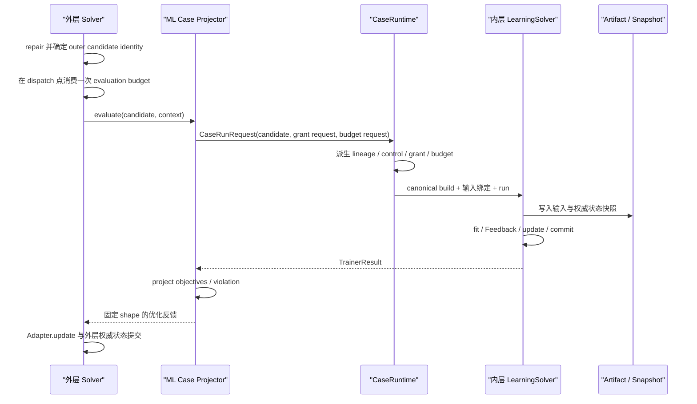

# 第五卷·第二章　外层优化、内层 ML：搜索怎样消费训练语义

本卷第一章把组合的最小单位固定为 Case，并说明了为什么“能够 import 并调用”远远弱于“能够组合”。现在可以进入第一个真正的跨语义方向：外层优化反复提出候选，每一个候选都触发一次机器学习任务，学习结果再变成外层搜索的反馈。

这类结构很容易被一句话概括成“用 Solver 调 Trainer”，也很容易因此被低估。最简陋的实现似乎只需要三行：把候选写进训练参数，调用 `fit()`，把验证损失返回给 Solver。可是一旦问题从教学数据走向真实工程，几乎所有关键问题都会从这三行里冒出来。不同候选是否用了同一份数据切分？失败 trial 是不可行候选还是基础设施故障？一个外层 evaluation 到底消耗一次预算、二十个 epoch，还是三百 GPU 秒？缓存命中能否和真正训练混在一起比较？warm start 是否给某些候选额外优势？并行 trial 能否共享 GPU？最终只保留分数，还是还要保留获胜模型、训练报告与血缘？

这些问题说明，外层优化消费的并不是一个孤立 loss，而是一次完整训练运行经过受控投影后的结果。训练内部仍然拥有自己的数据、状态、反馈、生命周期和 Artifact；优化层只接收与搜索语义有关的那一部分。二者的关系可以先写成一条不含具体框架类名的因果链：

```text
搜索候选
→ 解释为一次训练试验的声明
→ 在固定数据与资源合同下执行学习闭包
→ 得到训练终态、指标、约束、成本与 Artifact
→ 投影成外层 objectives / violations
→ 更新外层搜索状态
```

本章要建立的命题是：

> **[I] 外层 Solver 只能优化“试验声明到结构化反馈”的公开映射；它不拥有内层 Trainer 的组件装配、模型状态、数据切分、backend session 和恢复逻辑。内层 Trainer 必须保持学习闭包，Bridge 只负责候选解释、资源派生与结果投影。**

这个命题一旦成立，超参数搜索、神经结构搜索、特征选择、Head 选择和训练预算搜索就不再是五套互不相干的胶水代码，而是同一组合协议对不同 `TrialSpec` 的实例化。

---

## 2.1 “把训练当作评估”并不等于“把训练压成一个 loss”

在普通黑盒优化中，Problem 接收候选 `x`，返回目标值与约束违反。于是，当一个训练任务位于内层时，最自然的抽象是：

```text
f(x) = validation_loss(train(x))
```

这条公式没有错，却省略了决定结果是否可比较的全部条件。`train(x)` 实际上还依赖数据版本、训练/验证划分、随机种子、最大训练预算、数值精度、设备类型、初始 checkpoint、停止策略和代码版本。更完整的写法应是：

```text
TrialResult =
    Train(
        TrialSpec(x),
        DataProtocol,
        Fidelity,
        SeedPolicy,
        ResourceGrant,
        WarmStartRef?,
        CodeAndConfigFingerprint
    )

OptimizationFeedback =
    Project(TrialResult)
```

这里第一次出现 `TrialSpec`，不是为了再造一个配置类，而是因为外层候选与内层训练参数并不是同一种对象。外层候选首先是搜索空间中的编码：一个连续向量、离散序列、图结构或混合状态。内层训练需要的却是有类型、有约束、有条件依赖的声明，例如学习率为 `3e-4`、隐藏宽度为 `128`、激活函数为 `gelu`、当且仅当使用卷积 Head 时 kernel size 才生效。把候选直接当成 Trainer kwargs，会让表示语义、修复规则与组件装配纠缠在一起。

`DataProtocol` 也不只是一个 ndarray。它至少固定数据 Artifact identity、schema、训练与验证边界、时间截止点、fold 集合、预处理拟合范围以及目标泄漏规则。`Fidelity` 说明这次试验训练到什么精度：epoch 数、样本比例、图像分辨率、fold 数或仿真长度。`SeedPolicy` 决定随机性怎样进入比较。`ResourceGrant` 则约束 trial 实际能使用的线程、设备和 backend。

因此，内层训练不是外层目标函数的实现细节，而是一种昂贵、带状态、可能失败的评估语义。外层 Solver 可以决定下一个 `x`，可以基于 objectives 和 violations 更新 Adapter，也可以根据全局预算停止；它不能越过 Bridge 修改 Trainer 的 population、直接关闭 backend session、从私有 history 猜测最佳指标，或者因为某个候选看起来简单就私自换数据 split。

这一区分还避免了一个常见误解：外层优化不必知道内层使用梯度下降、闭式解、树模型还是另一个优化器。外层只要求同一 `TrialSpec` 在同一评估合同下产生可解释的 `TrialResult`。内层方法变化是 ML Case 的装配变化，应该进入配置指纹和 Artifact lineage；除非这种方法本身就是外层未知量，否则不应成为外层 core 的条件分支。

可以用一次时间序列结构搜索说明边界。外层候选决定窗口长度、隐藏宽度、dropout 和学习率；内层 Trainer 根据固定的训练截止日和验证区间拟合预测模型；外层同时最小化验证 RMSE 与推理延迟，并约束峰值显存。这里外层未知量确实是模型结构与训练声明，但“怎样从时间序列构造无泄漏 DataView”“怎样拟合模型参数”“怎样测量延迟和显存”仍属于内层学习任务。Solver 最终只应看到：

```text
objectives = [valid_rmse, p95_latency_ms]
violation = max(0, peak_memory_mb - 2048)
```

即便如此，这三个数也必须带着 Trial identity、数据版本、fidelity、seed 和测量环境才能成为可信反馈。外层 Adapter 不需要读取全部证据，但 Result、Event 或 Artifact 必须能够追溯它们。

---

## 2.2 候选必须先变成 TrialSpec，不能直接穿透成 Trainer 内部字段

假设外层候选是四维向量：

```text
x = [log10_learning_rate, hidden_code, dropout, window_code]
```

第二维和第四维其实是离散选择，第一维使用对数尺度，dropout 才是真正的连续值。若直接写成：

```python
trainer.learning_rate = x[0]
trainer.hidden_size = int(x[1])
trainer.dropout = x[2]
trainer.window = int(x[3])
```

至少有四个问题。学习率的尺度解释错了；离散编码可能落在无效索引；条件参数无法表达；父层开始依赖 Trainer 的字段名和赋值时机。更严重的是，如果 Trainer 在构造时已经创建优化器或 backend session，事后修改字段并不会改变真实运行对象，审计看到的声明与实际执行会再次分叉。

正确路径是在跨框架 Case 中定义一个稳定的搜索空间 codec，把外层表示解码为不可变、可序列化的试验声明：

```python
from dataclasses import dataclass


@dataclass(frozen=True)
class ForecastTrialSpec:
    learning_rate: float
    hidden_size: int
    dropout: float
    window: int
    schema_version: str = "forecast_trial.v1"

    def component_overrides(self):
        return {
            "optimizer": {
                "learning_rate": self.learning_rate,
            },
            "model": {
                "hidden_size": self.hidden_size,
                "dropout": self.dropout,
                "window": self.window,
            },
        }


def decode_trial(x):
    hidden_options = (32, 64, 128, 256)
    window_options = (12, 24, 48, 96)
    hidden_index = min(len(hidden_options) - 1, max(0, round(float(x[1]))))
    window_index = min(len(window_options) - 1, max(0, round(float(x[3]))))
    return ForecastTrialSpec(
        learning_rate=10.0 ** float(x[0]),
        hidden_size=hidden_options[hidden_index],
        dropout=min(0.8, max(0.0, float(x[2]))),
        window=window_options[window_index],
    )
```

codec 的职责不是训练，也不是决定什么指标最好。它只完成表示语义：离散值怎样映射、连续值怎样裁剪、条件字段何时有效、Trial identity 怎样计算。相同语义的候选应得到相同 Trial fingerprint；无效候选应在进入昂贵训练前被 repair 或明确判为不可行，而不是等到深层库抛出难以解释的 shape error。

解码后的 overrides 再交给内层 Case 的 canonical builder。外层不 import 内层 Problem、AlgorithmAdapter 或 Provider 私有类，只依赖正式 builder surface：

```python
from cases.forecast_trial.build_solver import build_solver as build_trial


def trainer_factory(candidate, context):
    trial = decode_trial(candidate.values)
    return build_trial(
        resource_context=context["resource_context"],
        component_overrides=trial.component_overrides(),
    )
```

这段代码应该位于 Project 的跨框架 integration/Case 层，而不是写进 nsgablack core。`nsgablack` 负责外层候选、目标、约束和 Adapter 更新；`mlblack` 负责 DataView、模型表示、LearningProblem、Trainer、Feedback 与 Artifact；“这四维向量在本项目中分别表示什么”属于具体跨框架 Case。换一个业务任务，codec 可以完全不同，两个框架的核心合同不需要改变。

当前 `NsgablackLearningCaseEvaluator` 把 `UnknownState`、步数和 overrides 写入标准 `CaseRunRequest`，由内层 canonical builder 装配 LearningSolver，而不让 nsgablack 知道 mlblack 私有组件。[S] Bridge 不再接收 factory、私建 Trainer 或自行派生资源；内层 Case 通过正式输入绑定将候选设为 Representation 的初始状态，并进入唯一 Solver 生命周期。[S]

因此，当前 Bridge 对以下场景最自然：外层候选本身就是内层 Trainer 的合法 `UnknownState`，例如候选直接编码一个可被 mlblack Representation 解码的模型结构、符号表达式或参数状态。此时候选既决定装配的一部分，也确实可以成为内层起始状态。

但纯超参数搜索不一定满足这个条件。外层 `x` 可能只表示学习率和 batch size，内层 Trainer 的权威状态却是模型权重、矩阵因子或另一种结构编码。把超参数向量作为内层 population，会把两个不同状态空间错误地重叠。通用 Bridge 因而需要进一步分开：

```text
outer candidate
  ├─ decode_trial_spec() → component_overrides
  └─ build_initial_inner_state() → UnknownState | None
```

若内层状态应由 Trainer 自己初始化，第二条路径就返回 `None`，Bridge 只启动 `fit()`；若外层候选确实就是内层状态，再显式映射为 seed state。[D] 在这项协议完成前，不能仅凭类名“TrainerEvaluator”就宣称当前实现覆盖了所有 AutoML 与超参数优化形态。

候选 identity 也必须覆盖语义而不只覆盖浮点字节。`mlblack` 的 `unknown_state_fingerprint()` 当前会对数值、dtype、shape 以及全部 metadata 做规范化 SHA-256，[S] 这为内层状态对齐提供了可靠默认值。跨框架 Trial fingerprint 还应纳入 codec schema version 和规范化 TrialSpec；否则两个版本的 codec 可能把相同向量解释成不同模型，却错误命中同一个缓存。

---

## 2.3 公平比较首先由数据、fidelity 与随机性决定

优化算法默认相信每个 objective 都来自同一个问题。若候选 A 在验证集一上得到 0.10，候选 B 在验证集二上得到 0.09，Adapter 会把 B 当成更优，却无法知道差异来自模型还是样本。外层优化因此会放大任何评估协议中的不一致：偶然拿到容易 split、更多 epoch 或更快 GPU 的候选会被系统性偏爱。

最基础的规则是先固定 DataProtocol，再开始搜索。对普通监督学习，这意味着训练集、验证集、特征 schema、target 定义和预处理拟合范围具有稳定 identity。当前 `NumericDataView` 会验证训练/验证数组行数、特征名数量以及成对提供验证数据；`train_valid_split()` 使用显式 seed，并把随机 split、比例和 seed 写进 metadata。[S] 这些能力能防止形状错误，也能提供基本描述，但 DataView 自身并没有自动生成完整数据内容 checksum。正式试验仍应由上游数据 Artifact 提供 dataset version、checksum 与 split identity。

时间序列更不能把随机 split 当成默认公平。所有候选必须使用相同的时间截止点、验证窗口和滚动 fold；任何标准化、特征选择或缺失值填补都只能在对应训练窗口拟合。若候选改变 window length，它可以改变模型看到的历史长度，却不能改变验证终点或偷看未来数据。若搜索目标本身包含 split 策略，那就等于改变了被优化问题，必须把稳健性或外部 holdout 另设为上层判断，不能仍把不同 split 下的单个 loss 当成同质 objective。

fidelity 决定比较做到什么程度。固定二十个 epoch、固定三个 fold、固定百分之二十五训练数据，都是 fidelity。它和普通超参数不同，因为 fidelity 同时改变成本与估计偏差。若候选 A 训练五个 epoch、候选 B 训练五十个 epoch，然后只比较最终 loss，外层实际上同时比较模型与投入资源。除非“在给定成本下达到最好效果”就是正式目标，否则这种比较不公平。

多保真搜索可以成立，但必须把 fidelity 变成显式协议。常见做法是先让大量候选在低 fidelity 下筛选，再给少量候选增加预算；每次晋级都保留 trial lineage，结果标明是在什么 fidelity 下获得，Adapter 或专门调度策略不能把低保真分数当成高保真真值。若 objective 同时包含训练成本，则成本的定义和计量点也必须固定。

当前 `NsgablackLearningCaseEvaluator` 把固定 `max_steps` 作为每次子 Case 的正式输入。[S] 这为“所有候选使用相同内层步数”的最小公平路径提供了基础，却没有原生表达候选特定 fidelity、晋级 lineage 或 successive-halving 计划。[D] 训练预算搜索应扩展 Case 请求中的正式输入和预算合同，而不是在 component override 里悄悄写入一个可能不生效的字段。

随机性同样需要政策，而不是随手调用 `np.random.seed`。对于高噪声训练，可以采用相同种子比较所有候选，以减少由随机初始化带来的方差；也可以让每个候选在一组固定 seeds 上重复，并把均值与方差作为目标或风险指标。无论哪种方式，seed 集合都应由 trial protocol 派生，不能用 wall-clock 或并发完成顺序。重试同一个 trial 时应保持 seed 不变，否则“重试”其实产生了新实验。

一个足够完整的试验身份至少应包含：

```text
trial_fingerprint = hash(
    trial_spec_schema,
    canonical_trial_spec,
    dataset_artifact_checksum,
    split_protocol_id,
    fidelity,
    seed_policy,
    code_and_config_fingerprint,
    precision_and_backend_semantics,
    warm_start_parent?
)
```

设备型号是否进入 identity 取决于 objective。若只比较验证误差，且数值后端被证明等价，设备可以只进入审计；若 objective 包含 latency、吞吐、能耗或显存，测量设备与精度就是问题定义的一部分，必须进入 fingerprint 与结果。否则在 A100 上测出的延迟和在 CPU 上测出的延迟会被外层当成同一目标空间中的数值。

这里最重要的不是把 key 做得越长越好，而是明确哪些变化会改变试验含义。公平不是“每个 trial 都运行了”，而是“外层观察到的差异主要来自候选，而不是未被控制的协议漂移”。

---

## 2.4 TrainerResult 必须经过语义投影，不能把内部 loss 随手拿出来

内层 Trainer 完成以后会产生比外层需要更多的信息。当前共享 `TrainerResult` 可以携带最佳模型、最佳状态、最佳 objectives、最佳 Feedback、history、population、report 与 metadata。[S] 这些对象服务于 ML 闭包：模型怎样恢复、哪一个状态被选择、训练过程发生了什么、哪些指标与约束支撑这个选择。外层 Solver 不应读取 Trainer 私有字段，而应通过一个显式 Result projector 把这些信息转换成固定形状的 optimization feedback。

当前默认 `project_learning_result()` 的语义很清楚：优先读取 `TrainerResult.best_objectives`，若为空则读取 `best_feedback.objectives`；约束从 `best_feedback.constraints` 取得，并把所有正值部分求和为单个 violation。[S] 这遵循 `g(x) <= 0` 为满足约束的约定。没有 objectives 或目标数组为空时会明确报错，而不是返回零。

默认投影适合内层 LearningProblem 已经按照外层目标定义 Feedback 的情形。例如 ML Problem 的 objectives 本来就是 `[valid_rmse, latency_ms]`，constraints 本来就是 `[peak_memory_mb - limit]`，Bridge 只需保持它们。若内层 Feedback 主要为 Trainer 自己的优化服务，而外层要使用 report 中的其他指标，就应提供自定义 projector：

```python
import numpy as np


def project_forecast_trial(result, candidate, context):
    feedback = result.best_feedback
    if feedback is None:
        raise ValueError("forecast trial produced no best feedback")

    metrics = dict(feedback.metrics)
    required = ("valid_rmse", "p95_latency_ms", "peak_memory_mb")
    missing = [name for name in required if name not in metrics]
    if missing:
        raise ValueError(f"forecast trial missing metrics: {missing}")

    objectives = np.asarray(
        [
            float(metrics["valid_rmse"]),
            float(metrics["p95_latency_ms"]),
        ],
        dtype=float,
    )
    violation = max(0.0, float(metrics["peak_memory_mb"]) - 2048.0)
    return objectives, violation
```

projector 是语义边界，不是随意的数据清洗函数。它必须固定 objective 顺序、方向、单位与 shape；同一个 Case 不能有时返回 `[rmse, latency]`，有时因为某项缺失就返回 `[rmse]`。若某指标要最大化，应在 Problem 合同中统一转换为最小化方向或由支持方向元数据的正式协议处理，不能让 Adapter 猜测。约束也要保持物理含义：峰值显存超出 100 MB 与公平性阈值超出 0.02 是否可以直接求和，需要 Problem 明确尺度或分别保留向量，而不是默认认为数值可加。

还要区分“约束不满足”和“试验没有产生可用结果”。候选结构超过显存上限，若这是可预测、可重复的候选属性，可以在训练前作为外层约束判定；某个模型训练后稳定出现业务约束超限，可以进入 Feedback.constraints。GPU 驱动崩溃、数据服务超时、Artifact 写失败或代码异常不是候选约束，不能投影为一个大 violation 后继续假装评估成功。否则优化器会学习基础设施噪声，而运行记录失去错误真相。

TrainerResult 中的 `best_model` 和 history 通常很大，也可能无法跨进程序列化。Bridge 返回给外层 evaluation 的应该是小而稳定的 objectives/violation；获胜模型、checkpoint 和详细报告通过 Artifact ref 保存。外层搜索可以在当前迭代只保留 trial summary，在 Pareto front 或最终选择发生变化时更新保留策略，但不能让 Adapter population 直接持有模型对象。

这也解释了为什么“只返回验证 loss”有时正确、有时错误。若问题正式定义就是固定数据、固定成本下最小化一个验证指标，单目标返回完全合理；若部署还受延迟、内存、稳定性或公平性约束，只返回 loss 就不是简化，而是改变了问题。Projector 必须来自任务语义，而不是由当前算法“只支持一个分数”倒推。

当前 nsgablack 的个体评估 helper 会对内层返回的 objective 维度和 violation 做验证，并把内层 violation 与外层 Problem 自己的约束违反取较大值；整个调用发生在统一评估计数与 Plugin hook 边界内。[S] 这意味着 ML Bridge 不必绕过 Solver 评估链。但它也意味着 inner projector 的 shape 必须在第一次调用前就与外层 `num_objectives` 一致，否则错误应在边界被拒绝，而不是交给 Adapter 以后才发现。

---

## 2.5 预算、设备和并行必须联合设计，否则试验越多越不可信

外层优化最直观的预算是“最多评估多少个候选”。nsgablack 当前为名为 `evaluations` 的预算构造 `BudgetAccount`，在真实评估 dispatch 前消费额度，并能从 Project `ResourceContext` 中重建共享 Budget Authority。[S] 共享底座的 SQLite/Redis authority 支持带 lease fence 的 reserve、consume、complete 与 cancel，已经消耗的单位不会因为后续异常而被退还。[S] 这解决了外层候选计数的硬边界。

但一次候选评估可能包含一百个 epoch、五个 folds 和三次随机种子。只控制外层 evaluation count，并不能控制真实训练成本。一个统一跨框架 Project 至少要区分三类预算：

```text
外层搜索预算：
  候选评估次数、代数、可接受失败 trial 数

内层学习预算：
  epoch / step、样本量、fold、重复 seed、checkpoint 数

全局运行预算：
  wall time、CPU/GPU time、远程调用成本、存储量
```

这三者不能各自复制一份计数器。外层 evaluation 在 dispatch 时应消费一次搜索额度；内层每个真实训练 step 或 fold 应在其 charging point 消费共享训练额度；Project deadline 和资源计费则由更高层 authority 管理。若 trial 在第七个 epoch 失败，已经执行的七个 epoch 仍然是已消耗成本，只有尚未开始的额度可以释放。

当前共享 Budget Authority 能够通过标准子 Case 请求委托预算，LearningSolver 又直接复用 Solver 的 checkpoint/cancellation 边界。[S] 但“一个外层 Project 硬限制所有嵌套训练总步数”仍要求内层 Adapter 在统一 BudgetHandle 上正式消费 `training_steps`；仅传递 `max_steps` 或写入 component override 都不能替代预算结算。[D]

资源方面，Bridge 不再自行派生 Context；父 CaseRuntime 根据 L0 grant 为子 Case 生成有界 `ResourceContext`。[S] `LearningSolver.set_resource_context()` 会在同一 Solver 控制面内重建 compute backend session并关闭旧 session，所以资源声明不会只停留在审计字段中。[S] 候选并行仍由 nsgablack Solver 按有效授权与组件线程安全合同决定，不存在 ML 私有 Pool。

这些机制解决了“单个 trial 不应忽略父 grant”和“内层不能因为有线程就默认线程安全”，却没有自动解决并行 trial 的设备排他性。当前 Bridge 的 child namespace 只附加 `individual_id`，而 individual id 通常会在每一代重新从零开始；虽然 `UnknownState.metadata` 还记录 generation，namespace 本身没有 generation、candidate fingerprint 或唯一 invocation token。[S] 多代运行可能复用相同子 namespace。若多个外层候选并行执行，`derive_child()` 也会继承同一个父 device，它不会单独为每个 trial 重新租一块 GPU。[S/D]

因此，外层 trial 并行与内层 batch 并行必须一起规划。一个可靠策略通常只在一个维度展开并行：GPU 较少时，让多个 trial 由 Project/L0 按设备 lane 调度，每个 trial 内部避免再开大规模线程池；单个 trial 能充分占用 GPU 时，外层 fanout 应受设备数限制；CPU 小模型则可以给每个 trial 派生少量线程，再由共享 Pool 控制总并发。无论哪种策略，子 namespace 都应包含 run、generation、trial fingerprint 与 attempt identity，防止失败或超时的旧 trial 晚到写入新 trial 的状态空间。

资源公平还影响 objective。若 latency 是优化目标，每个候选必须在相同设备类别、相同 batch size、相同预热与测量协议下评估；调度拥塞时间不应混入模型推理延迟。若训练时间是目标，则排队时间、数据加载时间和设备执行时间应分别记录，明确究竟优化哪一个。否则调度器偶然把某个 trial 放在空闲 GPU 上，它就会被误认为模型更快。

---

## 2.6 缓存与 warm start 的价值来自血缘，不来自“少跑了一次”

训练是昂贵评估，缓存几乎不可避免。同一个 TrialSpec 可能因 Adapter 重复候选、恢复重放、并行竞争或用户重启再次出现。若数据、代码、fidelity、seed 和资源语义完全相同，重复训练通常没有价值；缓存命中可以直接返回先前 TrialResult，并复用 Artifact ref。

但缓存 key 若只使用候选向量，就会产生比重复计算更危险的错误。数据更新、split 修正、训练步数变化、指标 schema 变化、混合精度变化或代码 bug 修复以后，相同向量不再代表同一次试验。一个合格 cache record 至少应包含第 2.3 节定义的 trial fingerprint、Result schema、状态 `completed`、Artifact checksum 和产生它的 run lineage。只有完整成功并完成提交的记录才能命中；`running`、`failed` 或 Artifact 缺失的记录不能被当成结果。

缓存也分不同层。结果缓存保存 objectives、constraints、成本与摘要，适合外层直接复用；模型 Artifact 缓存保存可部署或可继续训练的模型；checkpoint 缓存保存中间状态，用于恢复或 warm start。三者不能混为一个布尔 `cached=True`。一次结果缓存命中可以不启动 Trainer；一次 checkpoint 命中只改变初始状态，仍然需要执行后续训练和重新评估，不能直接沿用旧分数。

warm start 更容易破坏公平。候选 B 若从候选 A 的优质 checkpoint 开始，而候选 C 从随机初始化开始，在相同新增 epoch 下得到的分数并不只反映 B 与 C 的结构差异。warm start 可以是一项正式搜索策略，但必须记录：

```text
warm_start_parent
parent_checkpoint_checksum
compatibility_rule
inherited_training_cost
newly_consumed_budget
state_mapping_version
```

只有模型结构兼容、数据与 split 相容、状态映射规则明确时，checkpoint 才能作为初始状态。修改了 Head、特征 schema 或归一化统计后强行载入权重，即使底层库允许 `strict=False`，也不表示语义相容。若 warm start 是为了加速所有候选，应给候选使用同等规则；若它只用于局部搜索，外层结果必须标明 lineage，并决定比较的是总成本还是新增成本。

当前 mlblack 已经有规范化 Trainer state 签名，`UnknownState` 也有覆盖 values 与 metadata 的 fingerprint；Snapshot/Artifact 能保存状态引用。[S] `NsgablackLearningCaseEvaluator` 通过完整 Case 信封保留 lineage 与 Artifact，但 cache lookup、trial fingerprint、checkpoint mapper 和 Artifact retention policy 仍需由具体 Case 合同声明。[S/D] 因此跨框架缓存不能在 Solver 的 `problem.evaluate()` 里放一个按 `tuple(x)` 索引的全局字典后就称为可恢复缓存。

Artifact 保留策略也要独立于缓存策略。保存每个大型 trial 模型可能耗尽存储，只保存最终最佳模型又会让 Pareto front 变化、恢复与审计失去依据。可采用“所有 trial 保存小型 Result record；成功 trial 保存可恢复 checkpoint 到短期层；当前 Pareto/frontier 与最终选择保存长期模型 Artifact；淘汰由有 lineage 的 retention policy 执行”的分层方式。删除大型 Artifact 时，Result 中仍要保留 tombstone、checksum 和删除原因，不能让旧记录悄悄指向不存在的 URI。

缓存的正确目标不是让 dashboard 上的命中率更高，而是保持一个更强的不变量：相同试验事实不重复付费，不同试验事实绝不共享结果；任何复用都能解释复用了谁、复用了什么、为什么仍然等价。

---

## 2.7 从一个时间序列搜索 Case 看完整反馈闭环与失败语义

现在把前面的协议收束为一条最小但完整的运行路径。外层 `forecast_search` Case 使用 nsgablack 搜索窗口、隐藏宽度、dropout 和学习率；内层 `forecast_trial` Case 使用 mlblack 在固定时间切分上训练模型。训练数据由上游 Artifact `traffic_data.prepared_timeseries` 提供，验证区间固定为最后四周，所有候选使用二十个 step 和同一组 seeds。外层最小化验证 RMSE 与 p95 推理延迟，峰值显存超过 2048 MB 记为约束违反。

这两个 Case 各自仍可独立运行。`forecast_trial` 独立运行时接收一个明确 TrialSpec fixture 与相同数据 Artifact，使用自己的 canonical builder 和 Trainer 生命周期；被外层调用时，TrialSpec 来自候选 codec，资源来自父 grant 派生，结果通过 projector 返回。外层不构造 mlblack Problem，不访问 Trainer history，也不持有模型对象。

跨框架装配的核心形状可以表达为：

```python
from mlblack.integrations import NsgablackLearningCaseEvaluator

from .trial_codec import decode_trial
from .trial_projection import project_forecast_trial


def build_trial_overrides(candidate, context):
    del context
    trial = decode_trial(candidate.values)
    return {
        **trial.component_overrides(),
        "data": {
            "artifact_key": "traffic_data.prepared_timeseries",
            "split_protocol": "last_4_weeks.v1",
        },
        "runtime": {"seed_set": [17, 23, 41]},
    }


inner_evaluator = NsgablackLearningCaseEvaluator(
    "forecast_trial",
    max_steps=20,
    resource_request={"workers": 1, "threads": 1, "memory_mb": 2048},
    component_overrides=build_trial_overrides,
    result_projector=project_forecast_trial,
)
```

随后，外层 Problem 通过正式 `inner_runtime_evaluator` surface 持有这个 Case projector。nsgablack 的统一评估 helper 调用它，对返回 shape 做验证，再与外层 Problem 的显式约束合并。[S] 它不是通用 `EvaluationProvider`，而是 Problem 的 inner runtime surface；实际执行权仍在注入的 `case_runtime.invoke()`。[S]

一次成功候选的因果链应当能够还原为：



成功路径之外，至少要定义四种失败。

第一种是候选编码无效，例如离散索引越界或条件参数冲突。能 repair 的应在外层 Representation 中确定性修复；不可修复但属于搜索空间语义的，应在开始昂贵训练前形成明确 violation。它仍然可能消耗一次外层候选额度，具体取决于 charging point 是否已经 dispatch；不能通过异常重试无限免费探测无效候选。

第二种是可重复的训练不可行，例如模型在给定显存约束下必然无法装载，或者数值结构根据正式规则被判为无效。若这种失败被合同定义为候选属性，可转换为约束违反，并在 Result 中保留原因与测量证据。不能只返回 `1e12` 且 violation 为零。

第三种是随机数值失败，例如某个 seed 发散。它究竟代表候选不稳定，还是单次偶然，需要在 SeedPolicy 中预先定义。可以规定三次 seed 中任一次发散即形成稳定性约束，也可以按成功率与均值形成目标；不能看到结果后临时决定是否重试。

第四种是系统失败，例如数据 Artifact 不可读、GPU lease 失效、远程 Provider 超时或 checkpoint 写入失败。这类异常应携带 trial identity 向正式 error owner 传播，按照 Project/Bridge retry policy 处理；重试必须保持原 TrialSpec、split 与 seed，并对已发生的训练成本正确计费。最终失败不能进入 Adapter 的普通 objective 排名，除非外层算法有显式 missing/failed evaluation 协议。

验证这条 Case 不应首先跑大规模 benchmark，而应建立一组聚焦合同。用两个语义等价编码验证 codec fingerprint 一致；改变 split id 验证缓存 key 改变；让 projector 少返回一个 objective，验证边界立即拒绝；让 inner constraints 为负、零、正，验证 violation 聚合；给父 context 一个线程、Bridge 请求四个，验证 child threads 不超过一；让两个候选并行，验证 Trainer 实例、namespace、Snapshot key 和 backend session 不共享；在第七个 step 注入异常，验证外层 evaluation 与内层训练成本都不被错误退还；最后比较独立 `forecast_trial` 与嵌套 trial 在相同有效请求下的指标、Artifact schema 和生命周期 trace。

这些测试证明的是组合合同，不是模型精度。模型 benchmark 应在合同稳定以后单独进行，否则一次“RMSE 很好”的运行可能只是数据泄漏、更多训练预算或缓存串用的结果。

---

## 2.8 当前 Bridge 已经连接了两种语义，但还没有替项目做完所有决定

回到源码，可以把现状分成已经存在的路径与仍需补齐的合同。

已经存在的部分很明确。`mlblack.integrations.nsgablack_learning_case` 提供正式的外层优化到内层 ML Case projector；它为每个调用创建带外层 individual/generation metadata 的 `UnknownState`，构造 `CaseRunRequest`，并要求注入的 CaseRuntime 派生资源、预算、控制和 lineage。[S] 内层输出必须通过版本化 `TrainerResult` codec；默认 projector 产生 objectives 数组与基于正约束部分求和的 violation。[S]

内层 canonical builder 构造 LearningSolver，Case 输入绑定把候选设为 Representation 初始状态并设置完成策略；随后标准 Solver 生命周期负责 setup、Plugin、协作式完成条件、step 循环、异常分发、teardown 与最终 TrainerResult 投影。[S] 资源改变时 compute backend session 会重建；nsgablack 的评估 helper 则把 inner runtime 调用纳入统一预算 dispatch、shape 验证、Plugin hook 与外层 constraint 合并。[S]

同时，以下边界尚不能写成“框架已完整支持”。

当前 projector 把候选作为 `UnknownState` 输入；纯超参数搜索仍需要 Case 的 codec/override builder 明确区分 outer TrialSpec 与 inner seed state。[D]

Bridge 的 `max_steps` 对所有 trial 固定，尚无正式多 fidelity、candidate-specific budget、晋级与继承成本协议；mlblack 也没有自动消费共享 `training_steps` BudgetAccount。[D]

子 namespace、attempt、run token 与父子 lineage 已由 CaseRuntime 生成；candidate fingerprint 与业务 trial identity 仍需具体 Case codec 写入 metadata。[S/D]

通用 projector 不内建数据 Artifact/split identity、trial fingerprint、结果缓存、warm-start lineage 或模型 Artifact retention。这些应由跨框架 Case 声明，不能由 nsgablack core 硬编码 mlblack 数据与学习细节。[D]

默认 projector 只消费 `best_objectives/best_feedback`，但完整 `CaseRunResult` 仍由父 runtime audit 保留，命名模型 Artifact 也进入公共 registry；父 Problem 是否把这些引用继续投影到自己的输出，是业务采用策略而不是执行信封缺失。[S/I]

当前仓库已有 `NsgablackLearningCaseEvaluator` 的完整父子 Case 回归，覆盖候选输入、父子 lineage、有界 memory grant、版本化 TrainerResult、JSON 模型 Artifact 与命名 Artifact ref。[T] 缓存/warm-start identity、多 fidelity、真实 GPU 与 failure retry 仍需要独立集成证据。[D/R]

这些边界说明 projector 的职责已经可辨认：它不是另一个 Trainer，也不是外层 Problem 的业务代码仓库；它把一个有身份的搜索候选解释成标准子 Case 请求，再把 TrainerResult 投影成优化反馈。授权派生、预算与错误信封属于 CaseRuntime；数据公平、缓存和 Artifact 保留策略属于具体 Case。

至此，组合方向只完成了一半：优化已经能够把学习任务视为昂贵评估。但统一框架不能假定所有组合都是“优化 Case 在外、学习 Case 在内”。下一章会把方向反过来：当学习任务为了生成标签、计算决策损失、执行结构化预测或获得物理反馈而调用一个内层优化问题时，LearningSolver 应怎样消费 Solver 结果语义，又为什么不能在自己的 `step()` 中私建资源池和第二个 Project。
