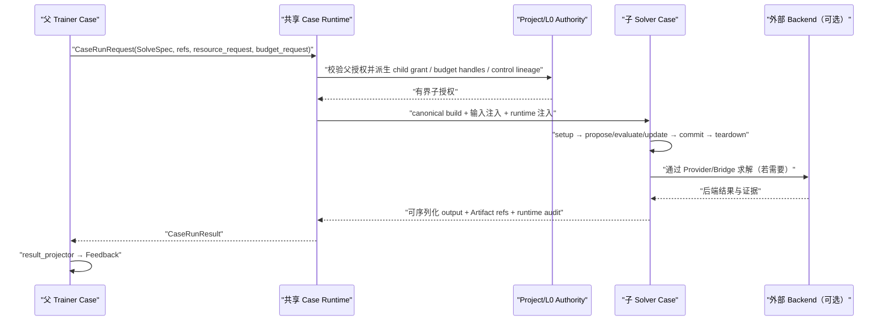

# 第五卷·第三章　外层 ML、内层优化：学习怎样消费求解语义

本卷第二章讨论的是一种已经很熟悉的组合方向：优化算法提出试验声明，完整训练任务执行这些声明，训练结果再被投影成搜索反馈。那条路径可以概括成“用优化选择怎样学习”。但学习与优化的关系并不只沿这个方向存在。许多学习任务并不是预测一个可以直接比较的标签，而是先产生需求、成本、风险、结构或物理参数，再由一个求解过程把这些预测转化成真正的行动。此时，模型好不好，不能只看预测误差，还要看预测进入约束系统以后导致了怎样的决策。

例如，一个负荷预测模型把明天每小时的需求预测得很准，却可能恰好在最昂贵的峰值时段低估需求，导致调度系统启用高成本备用机组；另一个模型的平均误差略大，却保住了峰值与爬坡边界，最终运行成本反而更低。又如，在结构化预测中，模型输出的往往只是边、标签或匹配的局部分数，真正合法的输出需要经过一次满足互斥、容量或连通约束的组合求解。若训练只对局部分数计算损失，就可能学到一个逐点看来合理、整体上却无法执行的系统。

所以，这一章不能把本卷第二章中的 Solver 与 Trainer 简单交换位置。两个方向的因果结构并不对称。本卷第二章里，训练本身是被优化的昂贵对象；本章里，求解通常位于模型输出与学习反馈之间，是模型所处环境的一部分。更准确的关系是：

```text
模型状态 θ
→ 对样本或场景 x 产生参数预测 ĉθ(x)
→ 将预测解释成一个有约束的求解实例 P(ĉθ(x))
→ 求得决策 ẑ
→ 用真实结果 y 评价 ẑ 的代价、后悔或可行性
→ 形成关于 θ 的学习 Feedback
```

若写成公式，它通常具有下面的形态：

```text
ẑ(θ, x) ∈ Solve(P(ĉθ(x)))

LearningRisk(θ)
    = Aggregate_x LossDecision(ẑ(θ, x), y)
```

这里的 `Solve` 可能是线性规划、混合整数规划、图搜索、多目标搜索、数值方程求解，也可能是由 nsgablack 运行的完整 Solver Case。它甚至不一定可微，也不一定返回唯一解。正因为如此，Trainer 不能把它当成一行普通的 `loss_fn(prediction, target)`；但 Trainer 同样不能因此接管求解器的 Adapter、population、线程池和 checkpoint。学习层需要的是求解语义，不是求解器内部所有权。

本章建立的中心命题是：

> **[I] 外层 Trainer 只能消费“模型输出所声明的求解实例”及其公开结果；它不拥有内层 Solver 的搜索状态、算法装配、资源租约和恢复过程。内层求解若具有独立生命周期，就必须作为完整子 Case 运行；若只是无独立状态的数值算子，则应通过受控 Provider/Bridge 暴露。两条路径都必须把结果显式投影成学习 Feedback。**

这个命题解释了为什么统一框架的组合方向不能局限为“Solver 包住 Trainer”，也解释了为什么任何看似方便的 `trainer.step()` 内部私建 Solver、私建线程池或第二个 Project，都会破坏已经建立的运行闭包。

---

## 3.1 学习为什么会调用求解，而不是只调用一个损失函数

把优化放进学习链条，并不只对应“决策聚焦学习”这一种算法。真正决定组合方式的，不是论文给任务起了什么名字，而是求解结果在学习因果链中处于什么位置。至少有四种常见关系需要分开。

第一种关系是**用求解生成监督材料**。例如，为一批道路网络生成最短路径标签，为一组调度实例生成近似最优排程，为结构设计样本生成物理可行解，或者为强化学习环境预计算专家轨迹。这里的求解通常发生在训练之前，结果会被很多 epoch 重复使用。它更像 Project 中的上游数据生产 Case：Solver 生成带版本的标签 Artifact，Trainer 读取这些 Artifact。若每个 epoch 都重新调用一次内层求解器，不仅浪费资源，还会让训练数据随运行时噪声漂移。

第二种关系是**用求解完成结构化解码**。模型只产生局部分数，求解器把它们变成合法结构。二分图匹配、序列标签约束、车辆路径、集合选择和带容量的推荐都属于这一类。若解码器是确定性的、无持久状态的，而且每个样本只进行一次短小求解，它可以是 LearningProblem 内部通过正式 Provider 调用的算子；如果解码需要迭代搜索、并行评估、checkpoint、外部 backend 或独立预算，它就不再只是一个函数，而更接近完整子 Case。

第三种关系是**用求解定义训练目标**。模型预测成本、需求或约束参数，求解器据此产生决策，Trainer 再用真实场景评价这项决策。这里常用的量不是预测误差，而是决策后悔：

```text
regret(θ; x, y)
    = RealizedCost(ẑ(θ, x), y)
      - RealizedCost(z*(y), y)
```

`z*(y)` 是知道真实参数时的参考决策，`ẑ(θ, x)` 是根据模型预测作出的决策。注意，一次样本反馈可能需要两次求解：一次求预测决策，一次求 oracle 基线。如果 oracle 已经离线生成，可以通过 Artifact 复用；如果它在训练时临时求得，就必须在预算中如实计量。把两次求解都藏在一个 `loss()` 调用里，会让训练步骤数与真实计算成本完全脱钩。

第四种关系是**学习帮助求解，而求解反过来评价学习**。模型可能预测 warm start、分支顺序、启发式评分、邻域选择或求解器配置；内层 Solver 使用这些提示运行，再把最优性差距、求解时间、节点数、失败率和最终可行性返回给 Trainer。此时模型学习的不是问题答案，而是怎样让求解过程更有效。它仍然是外层 ML、内层优化，只是 Feedback 必须包含运行成本和解质量，而不能只看最终 objective。

还有第五种更复杂的关系：模型与求解器交替更新，上一轮模型改变下一轮问题，下一轮求解结果又改变模型数据或目标。它已经不再是单次嵌套，而是显式循环系统。本章只建立一次父子调用怎样闭合；交替、双层和固定点的时间语义留到本卷第四章处理。

这几种关系之所以需要在开头区分，是因为它们不会落到同一个万能 Case 中。标签生成适合 Project 阶段，短小结构化解码适合 Provider，决策损失可能在一次 Trainer evaluation 中发起子 Case，学习型启发式则往往需要完整 Solver Result 和运行报告。框架统一的是边界与控制语义，不是强迫不同问题使用同一种执行粒度。

可以据此得到第一个判断规则：

> **先问“这次求解是否需要成为独立运行事实”，再问“应该调用哪个类”。**

若答案包含独立身份、完整 lifecycle、资源子授权、预算、取消、重试、Snapshot、Artifact 或可恢复状态中的任何一项，就应优先把它表达成子 Case。只有当它是短小、无状态、可在父生命周期内原子完成的能力时，才适合保留为组件级调用。

---

## 3.2 模型输出不是 Solver 输入：中间必须有求解声明

外层模型常常输出一个数值张量。最危险的做法，是直接把这个张量写进一个已有 Solver 对象，再调用 `run()`：

```python
# 错误示意：模型语义、问题语义和运行状态被揉在一起
solver.problem.cost = model(batch)
solver.population = cached_population
solver.max_generations = 20
result = solver.run()
```

这段代码的问题并不止是“耦合较高”。`model(batch)` 究竟表示成本、需求、边权、约束右端还是概率？它使用什么单位和顺序？`cached_population` 来源于哪个实例，是否仍然可行？二十代是算法参数还是本次 fidelity？同一个 Solver 是否已经被前一个 batch 修改？如果两个样本并行执行，它们是否同时改写 `problem.cost`？即便代码暂时给出数值结果，也无法稳定回答这些问题。

模型输出与内层求解之间需要一个语义明确的声明。这里把它记作 `SolveSpec`。它不必立刻成为共享核心中的庞大基类；它首先是一份由具体跨框架 Case 定义、能够序列化和做指纹的合同。一个足够严谨的 `SolveSpec` 通常需要表达：

- 问题族与 schema 版本，例如 `unit_commitment.v2` 或 `bipartite_matching.v1`；
- 实例数据的 `DataRef`，而不是把大型矩阵塞进 Context；
- 模型产生的参数，以及这些参数的名称、单位、shape 和有效域；
- 目标与约束的语义，尤其是哪些值由模型预测、哪些来自不可变实例；
- 求解 fidelity，例如最大 evaluations、时间上限、容差、允许的最优性 gap；
- 随机性与确定性策略；
- 多解或 Pareto 结果的选择政策；
- 可选 warm-start Artifact 引用及其兼容条件；
- 用于缓存、审计与结果对齐的规范化指纹。

例如，模型为仓储配送问题预测下一时段需求时，传给内层 Solver 的不应是一个匿名数组，而可以是下列声明：

```python
solve_spec = {
    "schema": "warehouse_dispatch.v1",
    "instance_ref": instance_ref.as_dict(),
    "parameters": {
        "predicted_demand": prediction.tolist(),
        "demand_unit": "case/hour",
    },
    "objective_contract": ["realized_cost", "late_units"],
    "constraint_policy": "hard_capacity",
    "solution_policy": "minimum_cost_feasible",
    "fidelity": {
        "max_evaluations": 128,
        "optimality_gap": 0.01,
    },
    "seed": sample_seed,
}
```

这份声明有两个作用。向下，它告诉子 Solver Case 应怎样构造 Problem、Representation、Adapter 与停止条件；向上，它让 Trainer 知道自己消费的是什么求解语义。模型只拥有 `predicted_demand` 的产生过程，并不拥有仓储约束的实现；子 Solver 只拥有在声明下求解的过程，并不决定 Trainer 最终怎样计算学习风险。

候选身份也必须在这里被固定。若两个模型输出数值相同，但所对应的实例版本、单位、选择政策或容差不同，它们不是同一次求解。相反，若两个张量只是内存布局不同，而规范化数值、实例引用和合同完全相同，它们可以共享缓存。一个可靠的求解指纹至少应覆盖：

```text
solve_fingerprint = H(
    problem_schema,
    instance_ref.digest,
    canonical_parameters,
    objective_and_constraint_contract,
    solver_assembly_fingerprint,
    fidelity,
    seed_policy,
    solution_policy
)
```

这里特意包含 `solution_policy`。多目标 Solver 返回的可能是一组 Pareto 解，而 Trainer 最终通常需要一个行动或一个可聚合的风险。选择“最低成本可行解”“膝点”“按业务权重标量化”或“保留整条前沿做集合损失”，会产生不同的学习语义。这个选择不能由 Bridge 在看到结果后临时决定，更不能默认为“取数组第一个”。

因此，本章的第二条不变量是：

> **[I] 模型输出先被解释为版本化 SolveSpec，Solver 的公开结果再被解释为 Learning Feedback；两次解释是两个独立的语义映射，不能通过共享可变对象省略。**

前一个映射可以叫 `problem_mapper`，后一个映射可以叫 `result_projector`。把二者分开很重要：同一预测可能进入不同求解问题，同一求解结果也可能用于监督损失、决策后悔、稳定性约束或运行成本学习。若只提供一个无边界的回调，长期演化后它往往会同时修改 Trainer、Problem、Solver 和缓存，重新变成无法审计的胶水层。

---

## 3.3 组件调用、子 Case 与 Project 阶段是三种不同的执行尺度

有了 `SolveSpec`，下一步不是立刻决定“所有求解都必须启动完整 Case”。完整生命周期有价值，也有成本。正确的选择取决于求解是否形成独立运行事实。

最轻的一层是**组件级求解能力**。它接收一份小而稳定的请求，在父 Case 当前生命周期内完成，既不保留跨调用的权威状态，也不自己申请资源。一个确定性的 Hungarian matching、一个闭式投影、一个受 Provider 管理的短小线性系统求解，都可能属于这一层。若它调用外部数值库，外部库仍应通过正式 Provider/Bridge 接入，并遵守父 `ResourceContext`；“组件级”不等于“可以在函数里随便创建线程池”。

中间一层是**完整子 Solver Case**。只要一次求解需要自己的 Adapter 状态、迭代 lifecycle、evaluation budget、checkpoint、Artifact、失败记录或恢复语义，它就应由父 Case 通过共享运行时发起。父 Trainer 不构造 Solver，也不传递已经授权好的 `resource_context`；它只声明子 Case 名称、输入、资源需求和预算需求。共享层根据父授权派生子身份、子 grant、预算 handle、deadline 和 cancellation lineage，再运行子 Case 的 canonical builder 与 canonical entry。

最外一层是**Project 阶段**。如果某批求解结果会被许多训练步骤共同消费，或者它们本身就是数据集、基线库、专家轨迹或可复用索引，就不应把它们隐藏在单个 Trainer step 中。Project 先运行求解 Case，提交 Artifact；后续 Trainer Case 通过引用读取。此时两者仍然可以形成父子 lineage 或 stage dependency，但不会为每个候选重复创建同一事实。

三种尺度可以用一条判断链表示：

```text
求解是否产生可复用的上游数据？
├─ 是 → Project 上游阶段，结果作为 Artifact 交付
└─ 否
   └─ 是否需要独立 lifecycle / 状态 / 预算 / 恢复 / Artifact？
      ├─ 是 → 完整子 Solver Case
      └─ 否 → 父 Case 内的受控 Provider/Bridge 调用
```

在当前统一栈中，完整父子调用已经有一个与 Solver/Trainer 无关的共享执行面。[S] 父 Case 获得的 `case_runtime` 暴露 `invoke()`；调用方发送 `CaseRunRequest`，共享层返回 `CaseRunResult`。请求携带 Case 身份声明、控制条件、资源需求、预算需求、组件覆盖、小型输入与输入 Artifact 引用；结果信封携带状态、结构化 output、Artifact 引用、资源与预算使用、时间、退出码和结构化 failure。[S]

其运行时序不是“Trainer 直接调用另一个对象”，而是：



下面的代码展示的是这个边界的最小形态，而不是要求每个 LearningProblem 都复制一遍。长期实现应把它收进正式的反向 integration Bridge；代码之所以展开，是为了看清哪些字段属于父 Case，哪些字段只能由共享层生成：

```python
from blackbase.project import CaseRunRequest, ExecutionControl


def invoke_solver_case(trainer, *, case_name, solve_spec, instance_binding):
    runtime = trainer.case_runtime
    if runtime is None or not callable(getattr(runtime, "invoke", None)):
        raise RuntimeError("complete inner solve requires an injected case_runtime")

    parent_request = runtime.request
    result = runtime.invoke(
        CaseRunRequest(
            project_name=parent_request.project_name,
            stage_name="decision_solve",
            case_name=case_name,
            case_kind="solver",
            control=ExecutionControl.with_timeout(30.0),
            resource_request={
                "workers": 1,
                "threads": 1,
                "memory_mb": 512,
            },
            budget_request={"evaluations": 128},
            inputs={"solve_spec": solve_spec},
            input_artifact_bindings={"instance": instance_binding},
            metadata={
                "bridge": "mlblack->nsgablack.complete_case",
                "sample_id": solve_spec["sample_id"],
            },
        )
    )

    if not result.ok:
        raise InnerSolveExecutionError(result.failure)
    return result
```

调用方没有填写 `resource_context`、`child_grant`、`budget_handles`、父 cancellation chain 或最终 child identity，这是刻意的。当前共享 `CaseInvoker` 会拒绝子请求自行提供这些字段，因为有效授权、预算委托和父子 lineage 必须由调用父级派生，而不能由业务 Bridge 伪造。[S] 同一个 request 对象即使被重复提交，每次实际调用也会得到新的 invocation 与 Case-run namespace；重试 attempt 则保留逻辑 invocation，同时派生新的具体执行身份。[S]

完整 Case 也并不等于跨框架 import。父 Trainer 只知道 `case_name="dispatch_solver"`、输入合同和结果合同；`dispatch_solver` 的 canonical builder 决定它使用 EvolutionSolver、ComposableSolver、某个 Adapter，还是通过 Provider 接入外部 MIP 后端。由此，求解算法可以变化，Trainer 的学习语义不需要跟着读取 nsgablack 私有字段。

---

## 3.4 Solver Result 怎样变成学习 Feedback

一次子 Case 成功结束，只说明运行闭包完成了；它并不自动说明 Trainer 已经获得正确的学习信号。共享 `CaseRunResult` 是稳定的执行信封，却故意不替所有领域规定同一种 Solver output。一个单目标连续优化、一个多目标调度、一个可满足性问题和一个最短路问题，不可能天然共享完全相同的“最佳解”语义。具体跨框架 Case 仍需定义自己的小型 `SolveResult` 合同，并由 projector 把它变成 `Feedback`。

这一步至少要区分四类信息。

第一类是**决策本身**，例如排程、路径、匹配、控制轨迹或参数向量。大型决策集、Pareto front、搜索树和证明材料应进入 Artifact/Snapshot，Result 中保留稳定引用；小型最终决策可以直接放在 transport-safe output 中。

第二类是**解质量**，例如 objective 向量、约束违反、最优性 gap、上下界、残差、可行性证书和停止原因。`status="succeeded"` 只表示 Case 成功运行，不表示一定找到了可行最优解。一个在时间上限内返回 gap 为 8% 的可行解，与一个证明无可行解的运行、一个由于 Provider 超时而失败的运行，必须是三种不同结果。

第三类是**运行成本**，例如 evaluations、节点数、迭代数、wall time、GPU 秒、外部 API 调用数和许可证占用。这些量在“学习求解策略”任务中可能直接成为目标，在普通决策聚焦学习中也至少属于审计指标。

第四类是**因果证据**，包括 SolveSpec fingerprint、Solver assembly fingerprint、输入 Artifact identity、seed、fidelity、warm-start lineage、父子 Case identity 和 backend 版本。没有这些信息，即使 loss 数值正确，也无法判断缓存是否误命中、近似条件是否一致、结果是否绑定到当前样本。

投影函数的职责，是在这些信息之上做一次明确的学习解释。例如，对库存决策可以这样投影：

```python
def project_inventory_solve(case_result, *, realized_demand, oracle_cost):
    payload = require_solve_payload(case_result.output)

    if payload["solve_status"] == "infeasible":
        return Feedback(
            objectives=[payload["fallback_cost"]],
            constraints=[payload["unserved_units"]],
            metrics={"optimality_gap": payload.get("optimality_gap")},
            info={"solve_fingerprint": payload["fingerprint"]},
        )

    decision = payload["decision"]
    realized_cost = evaluate_inventory_decision(decision, realized_demand)
    regret = realized_cost - oracle_cost

    return Feedback(
        objectives=[regret],
        constraints=[max(0.0, payload["violation"])],
        metrics={
            "realized_cost": realized_cost,
            "oracle_cost": oracle_cost,
            "optimality_gap": payload.get("optimality_gap"),
        },
        signals={"decision_ref": payload.get("decision_ref")},
        info={"solve_fingerprint": payload["fingerprint"]},
    )
```

这个例子中，内层 objective 并没有被原样当作训练 loss。内层 Solver 可能使用预测需求最小化计划成本，而 Trainer 要评价的是该计划在真实需求下的后悔；二者所用参数不同。若直接把 `payload["objective"]` 返回给 Trainer，模型只会学会让“基于自己预测构造的问题”看起来便宜，而不一定学会在真实世界中作出好决策。

约束与失败也不能混在一起。一个稳健的 projector 应先做如下分类：

```text
Case execution failed / cancelled / timed out
→ 运行失败；交给 error owner、retry policy 或缺失反馈协议

Case succeeded，SolveSpec 本身无效
→ 若无效性是模型输出的可学习属性，可形成明确 constraint

Case succeeded，问题被证明 infeasible
→ 根据任务定义形成 feasibility constraint、abstention 或结构化标签

Case succeeded，得到近似可行解
→ 返回解质量，同时携带 gap / bound / tolerance

Case succeeded，得到多个有效解
→ 按预先声明的 solution policy 选取或做集合级反馈
```

系统故障默认不应伪装成一个巨大 loss。否则 Trainer 会把“某块 GPU 当时掉线”误学成“这一类模型状态很差”。同样，内层问题不可行也不应一律抛异常；如果不可行性是模型预测导致的，例如预测参数破坏了守恒条件，它可能正是 Trainer 应学习避免的信号。判断标准不是异常类型，而是失败是否属于候选或样本的确定性语义。

当前共享 `Feedback` 已经能够表达 objectives、constraints、gradients、loss、metrics、residuals、signals 与 info，并提供版本化、transport-safe 的 codec。[S] 这意味着 projector 无须把所有信息压成一个标量；但字段丰富也不代表可以随意填充。`objectives` 是 Trainer/Adapter 实际优化的量，`constraints` 表达违反语义，`metrics` 用于观测，`signals` 用于后续组件，`info` 保存解释和血缘。若同一个量在不同项目里被随机塞进不同字段，统一类型也会退化成无语义字典。

---

## 3.5 近似求解与梯度传播必须被显式选择

内层优化进入训练后，最容易出现的理论错觉是：既然 `Feedback` 有 `gradients` 字段，Solver Result 就可以自动产生梯度。事实上，能返回一个最优或近似最优决策，与能对模型参数求导，是两件完全不同的事。

设模型输出问题参数 `c = hθ(x)`，内层问题为：

```text
z*(c) ∈ argmin_z f(z, c)
         s.t. g(z, c) ≤ 0
```

Trainer 优化的是真实决策损失 `L(z*(hθ(x)), y)`。若要对 θ 求导，需要处理：

```text
dL/dθ = (∂L/∂z*) · (dz*/dc) · (∂hθ/∂θ)
```

其中最困难的是 `dz*/dc`。当问题是光滑凸优化、解唯一、活跃约束满足正则条件时，可以通过 KKT 系统做隐式微分；当求解过程由可微算子展开时，可以对有限步迭代反向传播；当问题包含离散决策、多个最优解或不连续选择时，经典导数可能根本不存在。此时可以使用结构化 surrogate、扰动法、策略梯度、黑盒优化或停止梯度，但不能把零向量伪装成“精确梯度”。

因此，跨框架合同至少应声明下列梯度模式之一：

```text
gradient_mode = "none"
    内层只提供决策和数值反馈；Trainer/Adapter 不期待解析梯度。

gradient_mode = "implicit"
    结果携带可验证的最优性条件、活跃集和线性系统信息。

gradient_mode = "unrolled"
    训练图拥有固定求解步骤；近似程度与内存成本进入合同。

gradient_mode = "estimator"
    使用扰动、采样或 surrogate 梯度，并记录估计器与方差信息。
```

若 `Feedback.gradients` 非空，还应在 `info` 中记录 `gradient_provenance`：梯度针对哪个 state、哪份 SolveSpec、哪个近似解、什么容差、哪种 active-set 或估计器产生。本卷第二章要求 TrainerResult 与外层 candidate 对齐，本章同样要求求解梯度与当前模型状态、当前样本和当前求解 attempt 对齐。

近似求解本身也会改变学习目标。假设早期训练为了节省成本只运行十次 evaluations，后期运行两百次；若 loss 下降，可能是模型变好了，也可能只是内层解更接近最优。多 fidelity 不是不能使用，但 fidelity 必须进入 SolveSpec、结果与聚合政策。常见做法包括：

- 在同一训练阶段固定容差和预算，保证 batch 内可比；
- 将 gap 或残差作为 constraint/metric，同时对过粗结果降权；
- 用上下界构造风险区间，而不是把近似 objective 当真值；
- 只在阶段边界提升 fidelity，并使阶段变化进入 checkpoint 与 manifest；
- 对 oracle 基线和预测决策使用兼容的解精度，避免后悔值被两侧误差污染。

尤其需要避免“超时即最差 loss”的简单处理。超时可能意味着问题困难，也可能意味着资源拥塞。如果任务本来就在学习哪类实例难以求解，运行时间可以是目标；但这必须在合同中预先声明，并使用受控、可比较的执行环境。否则，系统负载噪声会被模型当成监督信号。

外部数值求解器的边界也由此清楚起来。Gurobi、CP-SAT、PETSc、仿真器或专用物理代码负责领域求解能力，它们不是因为被 Trainer 调用就变成 mlblack core，也不是因为返回 objective 就自动变成 nsgablack Adapter。若它们只是内层 Solver Case 的执行后端，应通过正式 Provider/Bridge 接入，由 Solver Case 负责问题语义、结果规范化与 lifecycle；若学习任务只需要一个短小、无状态的数值算子，它也可以直接作为 mlblack 侧受控 Provider。选择依据仍是运行闭包，而不是库名。

---

## 3.6 嵌套预算与资源：一个 Trainer step 可能比表面大几个数量级

在普通训练日志里，一次 `step` 看起来是一个基本成本单位。但只要 step 内含求解，这个单位就失去足够的解释力。假设一个 batch 有 64 个样本，每个样本需要一次内层求解，每次求解评估 128 个候选；一次 Trainer step 实际可能触发 8192 次 evaluation。若为了计算 oracle regret 再求一次真实参数下的最优解，成本又翻倍。若 Trainer 同时评估四个模型候选，嵌套展开就变成：

```text
真实工作量
    = trainer_candidates
      × batch_samples
      × solves_per_sample
      × evaluations_per_solve
```

这正是“只给 Trainer 一个 max_steps”不够的原因。至少要区分：

```text
training_steps      外层学习状态更新次数
inner_solves        发起了多少个逻辑求解实例
evaluations         所有子 Solver 实际消耗的候选评估次数
backend_calls       外部求解/仿真调用次数
wall/device usage   时间、GPU 秒、线程与内存占用
```

这些预算不能各自复制一个计数器。复制意味着父 Case 认为自己还剩 100，两个并行子 Case 也都认为自己各有 100，最终消费 200。正确语义是父级持有 authority，子 Case 请求额度，运行时委托带身份的 BudgetHandle；子执行完成后，实际使用回到同一权威账本。当前共享请求已经区分 `budget_request` 与运行时注入的 `budget_handles`，并禁止子请求自行携带后者。[S] `CaseInvoker` 会检查父 Case 是否拥有相应预算、预留子额度，并在子执行结束或失败时统一结算。[S]

资源同样必须单调收窄。父 Trainer 获得四个 worker、八个线程和一块 GPU，并不意味着每个并行样本都可以再创建一个八线程 Solver。当前共享 child grant pool 会在父授权内原子分配 workers、threads、GPU、内存、GPU 内存和 device tokens，并校验 backend、compute backend、device 与 capability 请求没有越过父级。[S] 资源不足时，子调用应排队、被取消或明确失败，而不是降级为私建 `ThreadPoolExecutor()` 绕过授权。

一个合理的 batch 策略通常不是“对每个样本立即并行开一个完整 Case”。可以按求解特性选择：

1. 对相同问题结构、不同参数的样本使用支持 batch 的 Provider，但仍由一个子 Case 计量与提交；
2. 限定 active child Case 数，由父 grant 的 worker 数形成自然背压；
3. 将 oracle 结果预计算成 Artifact，训练时只求预测决策；
4. 对重复 SolveSpec 使用身份安全的缓存；
5. 采用分层 fidelity，先用便宜近似筛选，再对少量样本求高质量解；
6. 若求解占训练主成本，把它提升为 Project 阶段或独立数据服务，而不是继续隐藏在 step 中。

取消和 deadline 也必须沿父子链传播。父 Trainer 被停止时，尚在等待资源的子调用应立即退出，正在运行的子 Solver 应在 generation、evaluation 和 Provider boundary 检查取消；子 Case 自己设置的 deadline 只能比父级更早，不能延长祖先 deadline。当前 `ExecutionControl` 会把父 cancellation 放入祖先链，并取各级有效 deadline 的最小值；`CaseRuntimeContext.invoke()` 会在调用前后 checkpoint。[S] nsgablack 的运行循环和评估入口、mlblack 的训练循环也已经在关键边界调用共享 runtime checkpoint。[S]

这并不意味着所有 Python 线程都能被强制杀死。协作式取消要求组件主动到达检查点；对不能协作、可能永久阻塞或必须保证超时后不再晚到写入的后端，应使用受监督的隔离执行和 fencing token。父子协议解决的是控制权和因果链，不会把线程运行时的物理限制变没。

---

## 3.7 Snapshot、缓存和 warm start 必须服从实例血缘

内层求解往往比模型前向昂贵，因此缓存与 warm start 很有诱惑力。问题不在于能不能复用，而在于复用的究竟是不是同一个语义事实。

先看缓存。一个安全的命中条件不能只比较模型输出数组。除了第 3.2 节列出的 SolveSpec 字段，还应覆盖子 Solver 的有效装配、外部 backend 版本、容差、seed、solution policy 与重要 Provider 配置。若模型输出成本向量不变，但约束实例从仓库 A 换成仓库 B，缓存当然不能命中；若求解器从允许 5% gap 改为要求 0.1%，旧结果最多只能作为 warm start，不能冒充新的完成结果。

再看 warm start。上一样本的 population、可行基、对偶变量或搜索树可能显著加速下一次求解，但它们属于子 Solver 的运行状态，不应被塞入父 Trainer 的 Context。正确路径是：子 Case 把可复用状态提交为命名 Artifact 或受控 Snapshot，Result 返回引用；下一次 SolveSpec 显式携带 `warm_start_ref`，子 Case 验证问题 schema、维度、变量顺序、约束版本和 backend codec 后再决定是否接收。

warm start 还会改变公平性。在“只关心最终精确解”的任务中，只要所有调用都达到同一容差，warm start 主要影响成本；在固定时间或固定 evaluation 预算的任务中，warm start 可能直接改善最终解质量，因此它已经成为学习实验条件。若某些样本从相邻实例获得高质量 warm start，另一些没有，Trainer 看到的 loss 分布会混入额外优势。可以使用 warm start，但必须在 seed/fidelity policy 中声明并进入 lineage。

跨 batch 的状态污染尤其隐蔽。一个可变 Solver 对象在上一个样本结束后保留 Adapter population，下一个样本只是替换 Problem 参数继续运行，看起来像高效复用，实际上会产生三个问题：

- 第二个样本的初始分布依赖样本顺序，数据 shuffle 改变训练目标；
- 并行样本可能同时修改同一 Adapter 和 Snapshot key；
- resume 时无法确定 checkpoint 属于哪个实例和哪次模型状态。

因此，默认语义应是每次完整子 Case 拥有独立 Case-run namespace 和权威状态。需要复用时，通过显式 ArtifactRef 建立有方向的 lineage，而不是共享对象引用。当前共享运行时为每次实际 child invocation 派生新的 identity 与 namespace，并在 Result 中保留原始 request、资源使用和 Artifact refs。[S] transport-safe 边界会拒绝无法编码的裸 Python 对象，要求大型或不透明对象先发布，再传 `DataRef`。[S]

可以把缓存命中与 warm start 的差别写得很简洁：

```text
缓存命中：旧 Result 已满足当前 SolveSpec 的完整完成合同，直接复用结果。

warm start：旧 Artifact 只提供新运行的初始信息，新 Case 仍须执行并产生新 Result。
```

二者不能共用一个模糊的 `cached=True`。缓存命中需要记录命中来源和原 invocation；warm start 需要记录父 Artifact、兼容检查、被接收或拒绝的原因。只有这样，模型性能、求解性能和复用收益才能被分别分析。

---

## 3.8 不用一个案例解释所有组合：四种任务应落在不同位置

前面的原则如果只用一个调度案例贯穿，很容易让人误以为这套架构只是为 decision-focused scheduling 设计的。更好的验证方式，是拿几种因果位置不同的任务，看同一边界规则怎样给出不同装配。

### 结构化匹配：求解是解码器

一个模型为两组对象预测配对分数，最终输出必须是一一匹配。若规模小、算法确定、没有 checkpoint 与独立 budget，matching 可以是 mlblack Problem 中的受控 Provider：模型输出 score matrix，Provider 返回匹配，Problem 计算结构化损失。这里启动完整 Solver Case 反而会增加不必要的生命周期成本。

但如果匹配还包含容量、时间窗、多目标公平性和外部 MIP backend，并且训练需要观测 gap、超时率与不可行证书，它就跨过了组件边界。此时应把每个求解实例交给完整 Solver Case，Result projector 再决定是使用最终匹配、最优性界还是 infeasibility signal。任务名字没变，执行尺度却因运行语义而变。

### 专家标签生成：求解是上游数据生产者

一个模型要学习车辆路径启发式，专家路线由高预算 Solver 产生。这些路线不会因为当前 Trainer step 改变，且会被多次 epoch 重用。最自然的结构不是 Trainer 每看一个样本就嵌套求解，而是 Project 先运行 `expert_route_generation` Solver Case，生成带 problem fingerprint、求解 gap 和失败样本说明的数据 Artifact；Trainer Case 再消费它。这里 Case 组合发生在 stage 之间，学习循环内没有子调用。

如果后来要做在线难例补充，Trainer 可以只对缺失或高不确定样本发起子 Case，并把新标签写入新的 Artifact 版本。原始数据集不被就地修改，新增标签通过 lineage 合并。这说明“离线阶段”和“在线子调用”可以共存，但它们必须产生不同身份的事实。

### 能源调度：求解定义决策后悔

负荷预测模型输出未来 24 小时需求，内层调度 Solver 根据预测安排机组。Trainer 的一次候选评估可以沿下面的路径运行：

```text
model state
→ decode/fit 得到预测模型
→ 对 validation window 预测 24h demand
→ 为每个 window 构造 dispatch SolveSpec
→ 调用 dispatch_solver 子 Case
→ 获得 schedule、predicted-cost、gap、violation 与 decision Artifact
→ 用真实 demand 重放 schedule，计算 realized cost
→ 与 oracle Artifact 对比得到 regret
→ 聚合多个 window 的均值、尾部风险和不可行率
→ 形成 Feedback
```

这里至少有三个容易被错误压扁的量。预测误差可以留在 metrics，决策后悔可以是 objective，违反供需平衡或备用容量可以是 constraint；子 Solver 的最优性 gap 则说明该 feedback 的近似质量。若项目是多目标学习，也可以同时优化 regret 与预测误差，但必须由 Trainer/Adapter 明确消费两个 objectives，而不是默认求平均。

完整结果还应保留两类 Artifact：获胜模型由 Trainer Case 发布，代表性调度或 Pareto front 由子 Solver Case 发布。父 Trainer Result 可以引用前者，并在 report 中收集后者的 DataRef；它不应把所有 24 小时 population 和每次搜索 history 塞进自己的 Context。

### 学习 warm start：求解是评价环境

模型根据问题特征预测初始 population 或启发式参数，内层 Solver 在固定预算下运行。此时 Feedback 可能是：

```text
objectives = [final_optimality_gap, elapsed_seconds]
constraints = [max(0, infeasible_rate - threshold)]
metrics = {
    evaluations,
    first_feasible_at,
    warm_start_accepted,
    backend_nodes,
}
```

为了公平比较不同模型状态，子 Solver 的问题集、随机性、预算和 backend 必须固定。模型生成的 warm start 是 SolveSpec 的一部分，Solver 的最终 population 仍归子 Case。若训练需要梯度，通常不能从离散搜索自动反传，只能选择 estimator、surrogate 或外层无梯度 Adapter。这个案例进一步说明：外层是 Trainer，并不保证训练算法一定依赖解析梯度。

四个案例没有共享同一套业务类，却共享了同一推导顺序：先定位求解在因果链中的位置，再定义 SolveSpec 与 Result projection，随后选择 Provider、子 Case 或 Project 阶段，最后让资源、预算、身份和 Artifact 服从共享运行协议。这正是框架统一性的意义。

---

## 3.9 当前实现已经给出通用调用底座，反向语义 Bridge 仍需正式收口

回到当前三个仓库，可以较为准确地标出哪些已经是源码事实，哪些仍是设计要求。

共享执行底座已经不再只支持顶层 Project 顺序运行。`blackbase.project` 中的 `CaseRunRequest/CaseRunResult` 是带 schema version 的通用序列化信封；`CaseRunIdentity` 记录 project run、root run、case run、parent case run、invocation、attempt 和 depth；`ExecutionControl` 传递 cancellation lineage、绝对 deadline 与终止政策；`ChildResourceGrant` 记录父 lease、父 Case、namespace 与 fencing token。[S] `CaseRuntimeContext.invoke()` 允许一个已经构建的 Case 发起另一个完整 Case，`CaseInvoker` 负责拒绝伪造授权、派生 child grant、委托共享预算、执行子 Case并记录结果。[S]

这意味着“任意父 Case 调用完整子 Case”的运行骨架已经成立，方向并不限定为 nsgablack 调 mlblack。父对象只要获得注入的 `case_runtime`，就可以请求 `case_kind="solver"` 或 `case_kind="trainer"`；共享层仍然使用同一个 canonical builder、输入 Artifact 注入、runtime 注入、输出序列化和 failure 信封。[S]

nsgablack 与 mlblack 也都已经能够接收这条控制链。LearningSolver 继承 SolverBase 的 `set_case_runtime()`，并在运行循环和关键 evaluation/step 边界调用 checkpoint；父级取消或 deadline 因而不只停在 Project Runner 外面。[S] mlblack 的 `NsgablackLearningCaseEvaluator` 给出了正向完整子 Case Bridge：它不私建控制器，而是构造 `CaseRunRequest`，由 runtime 派生资源、预算与 lineage，再用版本化 `TrainerResult` codec 做语义投影。[S] 这为反向 Bridge 提供了结构参照，但不是可以直接交换类名使用的实现。

反向方向目前仍有三个需要明确收口的点。

反向方向已经由 `NsgablackSolverCaseInvoker` 提供正式入口：LearningSolver 可通过完整 `CaseRunRequest` 调用 Solver Case，并用显式 projector/mapper 消费版本化 SolverResult；请求构造、结果合同校验与 failure 分类不再由每个 LearningProblem 自行拼装。[S] 业务特定的 SolveSpec mapper 与 projector 仍由 Case 注入。

第二，通用 `CaseRunResult` 已经稳定，但 nsgablack 当前普通 run result 仍主要是字典形态，典型字段包括 status、generation、evaluation_count、best_solution、best_objective，以及 EvolutionSolver 的 Pareto 数据。[S] 共享层会把 ndarray 转成 transport-safe 数据，也会收集 Artifact refs，却不会自动证明某个字段就是跨任务通用的“决策”“约束证书”或“最优性 gap”。因此，反向 Bridge 需要一个版本化 `SolveResult` 小合同，或者至少要求每个被调用 Solver Case 返回带 `protocol_type/schema_version` 的领域 payload。[D] 稳定执行信封与稳定求解语义信封是两层不同问题，前者已经闭合，后者应由语义 Case 收口。

第三，nsgablack 现有 `core/nested_solver.py` 提供了问题级 inner runtime evaluator，可以通过 factory 构造内层 Solver、执行 `run()` 并把结果投影成 objectives/violation。[S] 这条路径适合 nsgablack 内部的轻量或兼容性嵌套，不能被误写成通用父子 Case 协议：它直接持有 inner solver 对象，内部 timeout 路径还会创建单 worker `ThreadPoolExecutor`，没有天然获得完整 Case lineage、共享 BudgetHandle、Project Artifact authority 与隔离监督。[S] 对“外层 Trainer 调完整 Solver Case”，应走 `case_runtime.invoke()`；若保留旧路径，则必须在文档与 API 中明确它只是组件级执行尺度。[D]

本章没有把测试目录中存在的合同用例标成 [T]，因为本次工作只进行源码核对与文档写作，没有执行测试或 benchmark。当前可以由源码确认的是协议形态和调用路径；要把反向方向提升为经过验证的框架能力，还需要一组聚焦用例：

- 独立运行 Solver Case 与被 Trainer 嵌套调用时，给定同一有效 SolveSpec，结果 payload 与 Artifact schema 一致；
- 父 Trainer 取消后，等待中的子调用和运行中的子 Solver 都观察到同一 cancellation lineage；
- 子 Case 请求超过父 threads、device token、memory 或 evaluations 时被共享层拒绝；
- batch 并行调用不共享 Solver、Adapter、population、ContextStore 或 Snapshot namespace；
- infeasible、approximate、timed_out、cancelled、provider failure 分别进入正确的 Feedback 或 error 路径；
- 改变实例 Artifact、容差、solution policy 或 solver assembly 后缓存 key 必然变化；
- 同一个 child request 重复提交产生不同 invocation，重试则保留逻辑 invocation 并增加 attempt；
- 大型决策、Pareto front 和外部模型对象只通过 DataRef/ArtifactRef 交付，安全序列化不会把对象静默变成字符串。

完成这些收口以后，统一框架就获得了真正的双向组合：Solver 可以把完整训练任务当成昂贵评估，Trainer 也可以把完整求解任务当成决策、结构或物理反馈来源。双方共享的是 Case 运行协议、L0 授权、身份、预算、取消与 Artifact，而不是彼此的内部类。

但双向调用仍然只描述了一次嵌套。如果模型输出改变求解问题，求解结果又更新模型，随后新模型再次改变下一轮求解，系统就出现了时间上的循环。这个循环不能藏在递归调用或一个无限 `while` 里。本卷第四章将继续讨论交替、双层与固定点系统：每一轮状态怎样提交，近似误差怎样传递，谁判断收敛，以及什么时候循环应留在单 Case 内部，什么时候必须由 Project 显式展开。
