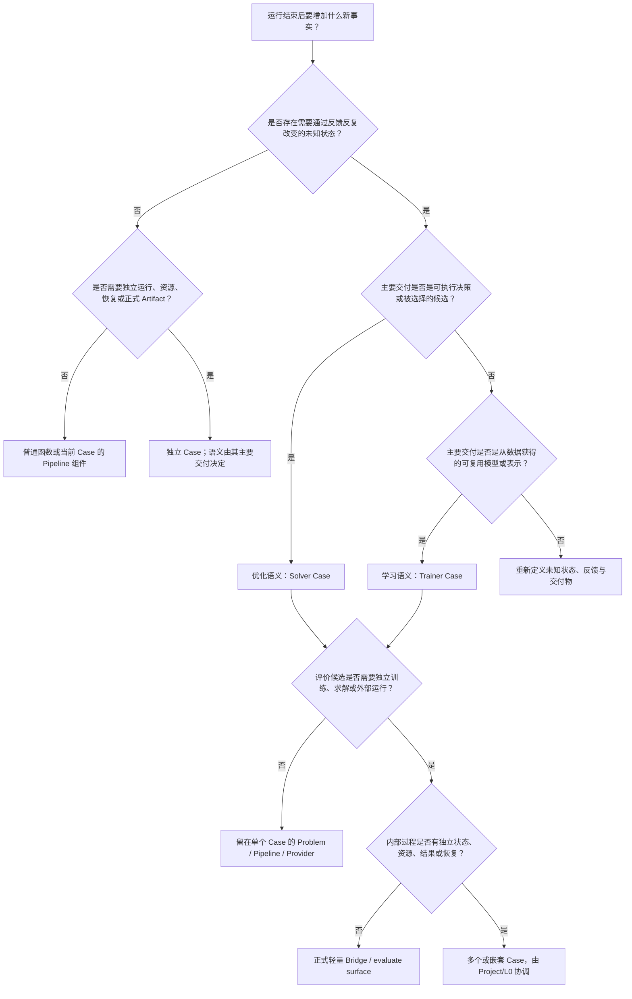

# 第七卷·第一章　任务分类：先判断问题属于哪一种语义

人们第一次面对一个计算任务时，通常会从手边最显眼的东西开始描述：“我有一份 CSV”“我想用遗传算法”“我有一块 GPU”“这是一个时间序列”“最后想做一个 Dashboard”。这些信息当然有用，却不足以决定框架入口。CSV 可以承载生产排程的订单，也可以承载监督学习样本，还可以只是一次统计报告的输入；遗传算法既能搜索工程设计，也能搜索模型结构；GPU 说明潜在执行资源，不说明任务究竟在学习、搜索还是仅做矩阵计算；时间序列既可以被预测，也可以进入库存优化、异常诊断或确定性分解。

如果根据文件格式、算法名称或硬件选择入口，架构很快就会倒置。先看到标签列便创建 Trainer，后来才发现真正要交付的是满足产能约束的排程；先看到“最小化损失”便创建 Solver，后来才发现损失只是训练模型的反馈；先看到三个步骤便创建 Project，后来才发现它们只是一个不可分割的数据变换；先看到外部仿真器便把它塞进 Problem，后来才发现它有独立连接、超时、预算、重试和结果版本。错误入口不会立刻使代码无法运行，却会让资源、状态、Artifact 和错误所有权逐渐落到错误层次。

因此，任务分类的起点不能是“使用什么组件”，而要回到问题本身：**运行开始时，究竟什么还不知道；运行通过什么反馈减少这种未知；哪个对象会在过程中反复变化；最终要把什么结果交给谁。** 当这四个问题回答清楚以后，优化、学习、确定性计算、外部服务和多阶段组合才会自然显现。Solver、Trainer、Project、Case、Provider 与 Bridge 都是这些事实推导出的工程角色，不是让用户在空白页面上凭偏好挑选的产品菜单。

本章不会给出一张“输入某个关键词便返回某个组件”的速查表。它要建立一种可以反复使用的判断方法：先写清任务事实，再确定主导语义，随后选择最小运行边界，最后才装配具体组件。这个方法既适用于一个几十行的小实验，也适用于外层优化包住内层训练、跨进程调用仿真器、多个 Case 共享预算的复杂 Project。

---

## 1.1 不要先问它像什么，要先问完成以后多了什么

任务最可靠的分类线索，是它完成以后为世界增加了哪一种新事实。

有些任务完成以后只是多了一份确定性计算结果。例如读取一组已经确定的销售记录，计算缺失率、分位数和重复行；或者把经纬度转换成投影坐标；或者按照固定公式从订单生成税额。输入给定、规则给定、结果唯一，过程中没有需要通过反馈逐步改进的未知状态。这类工作首先是函数、Pipeline operator 或数据处理 Stage，而不是优化或学习。它是否值得成为独立 Case，要等到后面根据可恢复性、资源和交付边界再判断。

有些任务完成以后多了一个被选择出来的决策。生产排程要决定每个订单在哪台机器、什么时段加工；投资组合要决定每项资产的权重；路径规划要决定经过哪些节点；结构设计要决定尺寸与材料。运行前未知的是 decision，运行中通过目标、约束或仿真反馈比较候选，运行后交付的是一个或一组可执行方案。这是优化语义，即使输入也是一张表、即使评估中调用了预测模型、即使没有任何名为 `target` 的列。

另一些任务完成以后多了一个从观测中获得的可复用模型状态。需求预测要从历史特征和未来已知信息中学习映射；图像分类要学习参数；聚类要获得中心、分配或潜在结构；降维要获得嵌入或变换；符号回归要获得表达式及其参数。运行前未知的是 model state 或 representation，运行中由数据与 LearningProblem 产生 Feedback，运行后交付的是模型、编码器、表达式、指标和报告。这是机器学习语义。监督学习通常有 target，但“有没有 target 列”不是 ML 的定义：无监督学习没有标签，仍然在从数据中建立可复用结构；纯数据 profiling 即使读了 target 列，也未必学习任何状态。

还有一类任务完成以后多了多个相互依赖的结果。先训练需求预测模型，再把预测分布交给库存优化；外层搜索网络结构，每个候选都启动一次内层训练；先用仿真器评估设计，再用多目标 Solver 选择 Pareto front；多个独立模型并行训练，最后由另一个阶段聚合。这时不能只问“整体属于优化还是 ML”，而要找出每个独立运行单位分别增加了什么事实，以及它们之间怎样传递 Artifact、预算和错误。组合关系会推导出多个 Case 和 Project，而不是推导出一个无所不包的超级 Solver 或超级 Trainer。

这个判断看似简单，实际比算法分类更深。两个任务都使用梯度下降，一个可能在学习神经网络参数，另一个可能在求一个没有数据语义的连续工程最优解；两个任务都使用随机搜索，一个可能是直接优化配方，另一个可能是为模型选超参数。算法只描述“怎样更新未知状态”，任务语义还要说明“未知状态是什么、反馈来自哪里、最终结果如何被解释”。框架入口由后者决定。

因此，面对任何新需求，都可以先写一句不带组件名的完成定义：

```text
本次运行将依据 ______，
反复改变或计算 ______，
通过 ______ 判断当前结果，
最终交付 ______ 给 ______。
```

“依据历史订单，反复改变模型参数，通过验证集预测误差判断，最终交付需求预测模型给库存系统”，主导语义是学习。“依据订单、设备与预测需求，反复改变排程方案，通过延期、成本与产能约束判断，最终交付排程给生产系统”，主导语义是优化。“依据原始订单，按固定规则计算质量报告，最终交付数据诊断给分析人员”，首先是确定性处理。组件名称直到这里仍然没有出现，但架构方向已经开始分化。

---

## 1.2 用一张任务事实卡固定未知量、反馈和运行边界

自然语言需求经常把目标、手段与实现混在一句话里。为了防止装配阶段不断改变问题定义，最好在选择框架入口前填写一张“任务事实卡”。它不是又一种配置文件，也不要求立即写成 YAML；它只是迫使设计者在仍然能够低成本修正时回答几个彼此关联的问题。

第一项是交付物。最终消费者需要的是决策、模型、变换后的数据、指标报告、可调用服务、Pareto 解集，还是一个供下游继续运行的 Artifact？“把误差降下来”不是交付物；训练好的模型连同输入 schema、Head 和评估报告才是。“找到更好的方案”也不完整；可执行的排程、目标向量、约束状态和选择依据才是。

第二项是未知对象。它可能是连续向量、排列、图、规则集合、模型参数、模型结构、聚类中心、符号表达式、数据 schema 异常，或者根本没有需要迭代的未知状态。未知对象不仅要写类型，还要写语义身份：同一个数值向量究竟代表资产权重、神经网络参数还是表达式常数，会决定 Representation、Feedback 和 Artifact 完全不同。

第三项是反馈来源。候选由显式目标函数评分，还是由训练/验证数据产生 loss 与 metric？反馈来自确定性公式、昂贵仿真、人工评价、远程 Provider，还是另一个完整 Case？它是单目标、多目标、约束违反、梯度、残差、概率分布，还是只有成功/失败？反馈来源决定运行成本、预算 charging point、可并行性和错误边界，不能等选完算法再补。

第四项是状态怎样变化。系统是否反复 propose—evaluate—update；是否拟合模型参数；是否只执行固定变换；是否需要跨步骤保存权威状态；失败后能否从 Snapshot 恢复；重试会不会改变随机语义？这项把“看起来都是循环”的任务分开：遍历文件行不是搜索，训练 epoch 也不是因为有循环就自动成为 Project。

第五项是执行边界。任务是否需要独立资源 grant、预算、deadline、取消、重试、凭据、Session 或外部 Worker？一个数据库查询和一个 Python 纯函数即使都返回数组，运行风险并不相同。外部仿真器若每次调用收费并可能运行十分钟，它必须拥有正式 Provider/Bridge 合同；不能像 `np.sum` 一样被当作无副作用 helper。

第六项是复用与组合。结果只在当前函数下一行使用，还是要跨 Stage、Case、Project 或未来运行继续消费？任务能否独立运行和测试？它是否有自己的输入、终态、Artifact 与错误语义？这些答案决定它只是一个组件、一个 Case，还是 Project 中的多个 Case。

一张填写完整的任务事实卡可以长成这样：

```text
任务名称：次日门店补货

最终交付：
  每个门店、每个商品的订货量；成本、缺货风险和约束报告

未知对象：
  离散订货量与仓库分配决策

反馈来源：
  采购成本 + 缺货损失 + 配送成本
  库容、最小订购量、线路能力等约束
  需求分布来自一个已发布的预测 Artifact

状态变化：
  搜索候选订货方案，评估后更新候选分布或种群

执行边界：
  每日预算固定；允许并行评估；必须在下单截止时间前完成

复用与组合：
  预测模型由上游训练 Case 产生
  补货结果由下游 ERP 消费
```

这张卡没有因为使用预测模型就把整个任务判成 Trainer。最终未知对象仍然是订货决策，主循环仍然比较候选方案，因而补货本身属于优化；预测模型是它消费的上游 Artifact。如果预测模型需要在同一 Project 中每日重训，那么“训练需求模型”和“生成补货决策”是两个可独立闭合的运行单位。

再看一个没有标签的例子：

```text
任务名称：客户行为表征

最终交付：
  可复用的低维编码器、客户 embedding、稳定性报告

未知对象：
  编码器参数与潜在表示

反馈来源：
  重构误差、对比目标、聚类稳定性或邻域保持

状态变化：
  根据数据批次更新模型状态

执行边界：
  使用 GPU；需要 checkpoint；训练可恢复

复用与组合：
  embedding 将被推荐和异常检测任务消费
```

它没有 supervised target，却显然不是普通 profiling。运行产生了从数据学习到的模型状态，并要把编码器作为 Artifact 交付，因此属于 ML 语义。任务事实卡避免了“无标签便不是 ML”的误判。

任务事实卡的价值不在于把每个需求永久钉死。需求变化时，它提供可见的重新分类依据：如果原本固定的预测 Artifact 改成每个候选都要重新训练，反馈来源和执行边界改变，架构就可能从两个顺序 Case 变成外层优化反复调用内层训练；如果业务后来只需要一次静态数据质量报告，原本计划的 Trainer 就应被删除。正确架构不是永不变化，而是每次变化都有事实原因。

---

## 1.3 先判断是否需要运行框架：不是每个计算都应该成为 Case

框架提供生命周期、状态、资源、预算、恢复、Artifact 和审计。这些能力有成本：需要身份、配置、装配入口、结果合同和测试。如果一项工作没有这些需求，把它包装成完整 Case 不会自动变得专业，反而会隐藏一个本来清楚的函数。

最小情形是一段确定性、无状态、低成本、无外部副作用的计算。输入对象已经在内存中，函数返回值只被当前调用者立即使用，不需要独立资源、不需要恢复、不需要跨运行保存，也没有自己的用户可见终态。这样的工作首先应是普通函数或 Pipeline operator。例如对已经规范化的数值列做固定 log transform，按已知 schema 选择字段，计算一组不会单独发布的中间统计。它们应留在拥有这些语义的 Case 内，由该 Case 的生命周期管理。

数据 profiling 位于一个容易误判的位置。计算缺失率、类型分布、分位数和重复键通常是确定性的，不需要 Trainer 或 Solver。若它只是训练前的一次内部检查，可以作为 data pipeline 的验证组件；若它要独立读取数据源、申请凭据、生成长期 DataQualityReport、被多个下游依赖，并拥有失败与重跑语义，那么它值得成为独立 Case。成为 Case 的原因不是“profiling 是一种 AI”，而是它已经形成独立运行和交付边界。

判断是否需要 Case，可以用一个比文件大小更可靠的问题：**这项工作失败以后，调用者是否需要独立回答它有没有开始、完成到哪里、消耗了什么、留下了什么，以及能否单独重跑？** 如果答案是否定的，它多半仍是组件；如果答案是肯定的，Case 才开始变得合理。

还可以从所有权反向判断。一个内部标准化步骤不拥有最终 Result，不拥有 Project lease，也不应自行写 Manifest；它把变换后的 DataView 交回当前 Trainer。一个独立的数据准备 Case 则拥有输入 DataRef、输出 Dataset Artifact、资源需求、schema 校验、终态与错误。两者可能调用完全相同的 Pandas 或 NumPy 代码，工程位置却不同，因为它们拥有的运行责任不同。

多步骤也不自动意味着多 Case。假设训练前依次执行缺失值填充、类别编码、标准化和特征选择，只要这些步骤共同服务于一个模型合同、由同一份训练数据与 split policy 约束、失败后一起重跑，并且中间结果没有独立交付意义，它们应构成一个 Data Pipeline。反之，若“生成受监管特征快照”要独立审核和版本化，随后多个模型训练都消费同一 Artifact，它便应从 Trainer 内部拆成上游 Case。

同样，使用外部库不自动需要 Bridge。一次纯函数式、无 Session、无远程副作用的库调用可以由领域组件直接封装；需要连接管理、凭据、capability 探测、远程 timeout、批处理、幂等、付费预算和结果解码时，才需要正式 Provider 或 Bridge。Bridge 不是给 import 换一个名字，而是为跨越框架无法拥有的外部边界建立合同。

因此，在进入优化和 ML 分类前，应该允许一个重要答案：“这件事不需要完整框架。”成熟框架的价值不在于吞下所有计算，而在于准确识别哪些计算已经需要独立运行闭包。本卷第二章会从最小可审计 Project 开始，但那个“最小”并不意味着所有 helper 都被升级为 Case；它只保留真正拥有生命周期的单位。

---

## 1.4 当未知的是可执行决策时，问题首先属于优化

现在假设任务确实需要迭代运行。第一种主导语义是：系统要在一个可行集合中找到更好的决策。这里的“决策”不要求是人类最终手工执行的方案，也可以是算法配置、模型结构、特征子集、表达式拓扑或控制序列；关键在于它作为候选被提出，通过目标和约束被比较，最终以选择结果结束。

优化任务至少要能回答三件事。第一，决策变量是什么以及怎样表示；第二，目标是什么，是否存在多个不可简单合并的目标；第三，什么条件使候选不可行或代价更高。若这三件事无法描述，直接问“用 NSGA-II 还是 DE”没有意义。算法只能探索已经定义的候选空间，不能替业务决定究竟在优化什么。

生产排程是典型例子。数据可能包含订单、设备、工时和交期，但不存在一个必须预测的 target。未知对象是订单到设备和时段的分配；Feedback 包含延期、换线成本、能耗和产能违反；最终交付是可执行 schedule 与权衡依据。因此它属于优化。是否使用 Pareto、约束优先、Repair、局部搜索或混合整数后端，是在问题语义明确以后才决定的策略。

投资组合也如此。历史收益数据可能被用于估计期望与风险，但本次运行未知的是权重；预算和持仓规则形成约束；收益、波动、回撤或交易成本形成目标。如果估计收益所需的预测模型已存在，Solver 可以把它当输入 Artifact；若预测模型也要在同一运行中训练，则需要组合两个语义单位，不能因为最终有权重决策就把训练过程硬写进目标函数。

路径、图着色、装箱和配方设计显示了 Representation 的意义。它们都属于优化，却不能共享一个未经解释的浮点向量。路径是排列或图上的序列，着色是节点到颜色的映射，配方是受和约束的连续比例。只有在问题已经被判定为优化以后，才需要引入表示候选、生成候选和更新搜索策略的角色。

到这里，Solver 才自然出现。它不是“优化算法本身”，而是拥有一次搜索运行的控制平面：建立生命周期，通过统一入口评估候选，维护当前状态，调度 Plugin 与 Controller，并把候选生成和更新策略委托给 Adapter。nsgablack 当前的 `ComposableSolver.step()` 会先让 Adapter propose，按预算裁剪并经 Representation repair，然后评估候选，再以更新后的 Context 交给 Adapter update；`SolverBase.run()` 负责进入统一运行循环 **S**。这项源码事实说明框架为优化语义提供了正式表面，但某个具体 Case 是否正确表达业务目标和约束，仍需 Case 级验证 **T/R**。

有 target 列也不排除优化。比如数据中有“期望交付日”或“目标库存”，它们可能只是目标函数的参照，而不是要从样本中学习的监督标签。反过来，模型训练也常最小化 loss，却不应因此一律叫优化 Case。区分依据仍然是最终权威状态：若运行交付的是业务决策或搜索结果，Solver 是主控制面；若运行交付的是从数据学习的模型状态，Trainer 是主控制面。数学上都可写成最小化，不等于工程语义相同。

也不是所有 OR 工作都必须使用通用搜索 Solver。线性规划、整数规划、约束规划或专用图算法可能由成熟外部求解器更可靠地完成。此时问题仍属于优化语义，但具体计算可以通过正式 Provider/Bridge 交给外部 backend；nsgablack 不应把商业求解器内部实现复制进核心。若只是单次调用求解器并交付一个解，Case 可以围绕该 Provider 建立输入、资源、错误与 Result；若还要在外层搜索求解器参数、场景或多目标方案，则由 Solver 组织更高层候选。

因此，“属于优化”只确定语义 owner，不预先承诺算法。第八卷才会按连续黑盒、多目标、强约束、排列/图、动态问题和昂贵仿真分别选择 Representation、Adapter、evaluation path 与 Controller。本章只要求在入口处确认：未知的是候选决策，反馈用于比较候选，最终交付的是被选择的方案。

---

## 1.5 当未知的是从数据获得的可复用状态时，问题首先属于学习

机器学习任务的核心不是“输入是一张数据表”，也不是“代码调用了 PyTorch”。它的核心是运行要从观测中建立一个以后仍可使用的状态，并用明确的数据与输出语义评价这个状态。这个状态可以是模型参数、树结构、聚类中心、表示空间、概率分布、符号表达式或校准器；它通过训练或估计得到，而不是由固定规则一次计算出来。

监督回归最容易识别。训练数据给出特征和 target，未知对象是预测模型，Feedback 来自训练/验证误差及其他指标，最终交付 fitted model、输入 schema、预测 Head 和报告。这属于 Trainer Case。Trainer 拥有模型状态与学习生命周期，Representation/Codec 解释状态怎样变成模型，Head 解释模型输出，LearningProblem 使用 DataView 产生 Feedback，Provider/Backend 执行具体计算。

但 target 不是学习语义的充分条件。一个报表任务也可能读取“销售额”列，却只计算分组均值；它没有通过反馈更新可复用状态，不需要 Trainer。target 也不是必要条件。聚类从数据中获得中心与分配规则，降维获得嵌入或变换，异常检测可能学习数据分布，自监督模型从构造出的训练信号获得表示。它们仍然需要稳定的 DataView、模型状态身份、评估标准和 Artifact。

无监督任务尤其需要先说清交付物。若需求只是“画一张二维散点图看看”，一次 t-SNE 调用可能只是探索性函数；若需求是构建可复用客户编码器、比较不同随机种子的稳定性、保存训练状态并为下游提供 embedding Artifact，它已经形成 ML Case。相同算法在不同交付承诺下，可以属于不同工程尺度。

时间序列也不能靠文件形状分类。预测未来需求是学习问题；对序列做固定 STL 分解可能只是 Pipeline 组件；选择 ARIMA 阶数可能是模型内部策略，也可能形成外层结构搜索；依据预测分布决定库存是优化。时间边界、walk-forward split 和未来信息泄漏属于 DataView/Problem 合同，而不是看到 timestamp 后自动得到的框架类型。

符号学习进一步说明“模型”和“决策”的边界可以嵌套。固定表达式结构下拟合常数，是一次模型参数学习；在巨大表达式空间中搜索结构，候选则具有优化语义；每个结构可能需要内层 Trainer 拟合参数并返回误差、复杂度和稳定性。整体不能被压扁成一个“symbolic algorithm”标签。外层未知结构与内层未知参数分别拥有自己的状态和反馈。

Trainer 也不是 sklearn `fit()` 的薄包装。它成为运行控制平面，是因为学习过程需要 setup、step/fit、Plugin、ResourceContext、Snapshot、错误和 TrainerResult。mlblack 当前 `build_trainer()` 从 TrainerAssemblySpec 与 DataView 装配一个 Trainer，不负责多 Case 编排；`BlankTrainer.fit()` 管理 setup、step、错误、teardown 与最终 TrainerResult，`run()` 动态转发到 `fit()` **S**。这表明“单个 ML 运行”与“多个运行怎样组合”已经在公共表面上分离。当前具体模型族和 Provider 能力是否满足某一业务数据，需要相应合同测试和真实后端证据，不能只凭 README 的 implemented list 断言 **T/R**。

选择 Trainer 以前还应问：最终是否真的需要保留学习状态？如果只是利用现成模型进行一次推理，且模型生命周期由外部服务拥有，本地任务可能只是 Provider 调用或一个消费 ModelArtifact 的 Case，而不是重新训练。如果需要微调、校准、更新、比较或发布新模型，本地 Trainer 才拥有新的权威状态。

因此，学习入口的判断句可以写成：**运行从数据与反馈中改变一个具有可复用身份的模型状态，并以模型、表示或预测能力作为主要交付物。** 第九卷将继续按回归、分类、区间/概率、时序、无监督、树模型、神经图和符号学习展开；本章不在这里提前罗列 Adapter，而是先固定学习为何成立。

---

## 1.6 同时包含搜索和学习时，先找最外层未知，再划分独立闭包

现实任务往往同时出现决策、模型和数据，真正困难的不是判断“有没有 ML”，而是确定哪一个未知对象控制整个运行，以及其他未知是否形成独立闭包。一个好用的方法是从最终交付向前追问：为了产生这个交付，最后一次必须作出的选择是什么；评价这次选择时，是否需要启动另一个拥有自己状态和结果的过程？

超参数搜索的最终交付通常是选定配置及其训练结果。外层未知是学习率、正则、模型族或数据配置；每个候选的反馈必须通过一次训练与验证得到。外层因此是优化 Case，内层是 Trainer Case。Solver 不需要知道反向传播或模型对象内部细节，只消费 TrainerResult 投影出的 objectives、violations、metrics 与 Artifact refs；Trainer 不负责在全局候选空间中调度多个 trial，也不自行扩张 Project 资源。

预测辅助优化的方向不同。先训练需求模型，再用固定 ModelArtifact 生成场景并求补货方案时，两个 Case 可以顺序执行：Trainer Case 产生模型 Artifact，Solver Case 消费它。若每个优化候选都会改变训练数据、特征或模型结构，内层训练便进入候选评估路径，形成嵌套运行。是否嵌套由依赖的逻辑时间决定，不由“两个框架都出现了”决定。

决策聚焦学习又可能以训练为外层。最终交付是模型，但它的 Feedback 需要调用内层优化器，衡量预测误差对真实决策质量的影响。此时外层仍是 Trainer，内层 Solver 或外部 optimization Provider 为 LearningProblem 提供决策损失。组合方向不是固定的“nsgablack 包住 mlblack”；谁拥有最终被更新的状态，谁就是外层控制面。

外部仿真优化展示了第三种边界。未知设计由 Solver 提出，反馈由 CFD、有限元、离散事件仿真或真实实验设备返回。仿真器不是 Trainer，也不应被塞进 nsgablack 核心；它通过 Provider/Bridge 暴露 request/result、资源、Session、timeout、取消、重试和版本。若一次仿真本身需要多个可恢复阶段并产生正式 Artifact，它甚至可以是独立 Case；Solver 的评估只消费其标准结果。

多模型 ensemble 也不能一概而论。若几个模型在同一 Trainer 内共享数据、损失和权威状态，并由一个联合更新过程训练，它们可以属于一个模型组合；若每个模型可以独立训练、失败、重跑和交付 Artifact，最后再由聚合阶段选择或融合，它们更适合作为多个 Trainer Case。并行只描述执行方式，独立性才决定边界。

这时 Project 才自然出现。Project 不表示“代码比较大”，而表示存在多个独立 Case，它们之间有顺序、并行、Artifact 依赖、资源竞争或失败传播。blackbase 当前的 `CaseRunRequest` 携带 case identity、kind、ResourceContext、component overrides、input artifacts 与 argv；`CaseRunResult` 返回状态、输出、Artifact refs 与错误；`ProjectRunResult` 汇总各 Case 和 Artifact registry。`execute_project()` 在 Case 前申请 L0 lease、构造有效 request，再通过 canonical builder 执行，并记录结构化结果 **S**。这些公共对象说明 Project 的组合单位是 Case，而不是任意函数列表。

Project 中的 `kind=solver|trainer` 只表达语义与默认运行选择，不改变 Case 目录形状和规范 builder。共享 runtime 对 Trainer 优先调用 `fit`，对 Solver 优先调用 `run`，两者都从 `build_solver.py::build_solver` 装配 **S**。这个看似反直觉的命名规则有一个重要目的：共享底座不需要根据语义复制两套装配协议。用户在任务分类阶段选择的是运行语义，不是在目录层制造两个不兼容世界。

因此，混合任务的划分顺序应当是：

```text
先确定最终交付及其权威状态
  → 找到更新该状态的外层控制面
  → 列出每次反馈需要调用的内部过程
  → 判断内部过程是否拥有独立生命周期、资源、状态和结果
  → 独立则成为 Case，通过 Project 或正式嵌套 surface 组合
  → 不独立则保留为当前 Case 的组件、Pipeline operator 或 Provider 调用
```

这条路径避免了两个极端：既不会把所有内容塞进一个万能 Case，也不会为了目录整齐把每个函数拆成一个 Stage。第十卷会把这些关系扩展成模式库，本章只建立组合发生以前的判断依据。

---

## 1.7 Case、Pipeline、Project 与 Bridge 的边界由独立运行责任决定

到目前为止，我们已经从任务语义推导出优化或学习，但还没有完全决定工程尺度。同一个优化问题可以是一个 Solver Case，也可能只是某个更大 Trainer 的内层调用；同一段数据处理可以是 Pipeline operator，也可以是多个模型共同依赖的上游 Case。最后的尺度选择，要看对象承担多少独立运行责任。

Pipeline 表达一个 Case 内部的有序变换。它的组件共享当前 Case 的生命周期、资源上下文和终态；中间值通常不被 Project 当作独立 Result。数据标准化、候选 repair、encode/decode、模型条件特征与一组可组合 operator 都适合这一层。Pipeline 可以有并行 slot 和局部错误策略，但不因此取得跨 Case 调度权。

Case 是最小的独立可运行单位。它应能单独装配、运行、测试和审计，有明确输入、权威状态、Result 与清理语义。它可以是 Solver，也可以是 Trainer；必要时也可以围绕一个正式外部 Provider 构成完整执行，但仍需落在现有 solver/trainer 语义合同或明确扩展协议中，不能私造第三套隐式入口。一个 Case 可以被 Project 当作外层单位，也可以通过标准 surface 被另一个 Case 作为内层调用；嵌套不会取消它原有的资源和错误边界。

Project 负责多个 Case 的依赖、并行、资源和运行终态。一个任务只有在存在多个独立 Case 时才需要 Project 编排。Project 不应深入 Adapter 内部决定下一代候选，也不应读取 Trainer 私有模型对象；它传递的是 component overrides、ResourceContext、Artifact/DataRef 与结构化 Result。若所谓“Stage B”无法脱离 Stage A 的内存对象独立解释、没有自己的 Result，也不可能单独重跑，它很可能只是 A 的 Pipeline 一部分。

Provider 或 Bridge 处理框架边界之外的能力。Provider 让 Problem/Trainer/Solver 通过正式请求调用数据库、仿真器、远程模型、数值求解器或对象存储；Bridge 还要处理两个语义系统之间的投影，例如把 TrainerResult 映射为外层 Solver 所需的 objectives 与 violation。Provider 不拥有 Project，Bridge 也不应复制两侧完整实现。只有外部过程本身形成独立恢复与交付单位时，才进一步提升为 Case。

可以通过五个连续问题判断尺度，而不必机械打分：

1. 它能否在没有调用者私有内存状态的情况下独立解释输入？
2. 它是否拥有自己的权威状态、完成条件和失败终态？
3. 它是否需要独立 ResourceContext、预算、deadline、取消或重试？
4. 它的输出是否会作为 Artifact 被多个下游或未来运行消费？
5. 失败以后是否需要单独恢复、跳过或重跑？

多数答案为否时，它通常是函数或 Pipeline 组件；答案逐渐变成是时，Case 边界开始成立；存在两个以上这样的单位及依赖关系时，Project 成立；调用外部所有权系统时，再增加 Provider/Bridge。这里没有“文件超过多少行就拆 Case”的规则，因为运行责任不能用代码行数衡量。

嵌套是尺度判断中风险最高的一种形式。外层每评估一个候选就调用内层过程，看起来把函数放进 `evaluate()` 即可；但如果内层拥有训练 state、checkpoint、GPU grant、预算、Artifact 和错误恢复，它不是普通函数。正确做法是调用内层标准 Case surface，派生 ResourceContext，并保留 parent/child identity 与 Result lineage。只有纯函数、无独立状态且副作用边界完全属于外层时，才适合轻量短路。

这也是“所有标准 Case 都可以作为外层或内层”的真正含义。它不表示可以忽略 Project 和生命周期，恰恰表示 Case 的合同足够完整，即使被嵌套也不必发明私有运行方式。边界的组合保持，是框架复杂运行仍然可信的前提。

---

## 1.8 从真实描述走到入口：一棵需要解释理由的决策树

前面的原则可以收束成一棵决策树，但使用它时必须保留每次选择的理由。决策树不是替代思考，而是防止问题在“有数据”“用哪个算法”这些表面特征上提前分叉。



把几类真实描述放进这棵树，可以看到它不会依赖单一业务案例。

“根据订单、工时和交期生成排程”最终增加的是决策；未知状态是订单分配与顺序；反馈是成本和约束。入口是 Solver Case。订单以 CSV 输入不改变这个结论。

“根据过去两年销量预测未来七天需求并发布模型”最终增加的是模型；未知状态从数据中学习；反馈来自 walk-forward 验证。入口是 Trainer Case。若只需要每天输出预测而模型由远程服务拥有，本地可能只是消费 Provider 的推理 Case。

“检查客户表缺失值、异常类型和重复主键”没有需要反馈更新的未知状态。若报告只供当前训练内部使用，它是 Pipeline validation；若报告需要独立发布、版本化并阻断多个下游，它可以成为独立数据诊断 Case，但不应伪装成 Trainer。

“自动选择神经网络结构”最终选择的是结构候选；每个候选的 Feedback 来自训练。入口是外层 Solver Case与内层 Trainer Case。把结构编码和反向传播全部塞进一个 Adapter 会混淆搜索策略与学习语义。

“用预测需求生成库存策略”需要继续追问模型是否已经存在。如果 ModelArtifact 是固定输入，库存优化是一个 Solver Case；如果同一 Project 先训练再优化，则是顺序 Trainer→Solver；如果每个策略候选都重新决定模型或数据，则可能是嵌套或双层系统。

“运行有限元仿真寻找轻量且低应力的结构”最终增加设计决策，属于优化；仿真器通过外部 Provider/Bridge 提供 Feedback。若仿真自身是长任务、可恢复并产生网格与场文件 Artifact，它可以成为被 Solver 调用的内层 Case。

“对客户做聚类”还不够完整。如果只画一次探索图，普通库调用可能足够；如果要发布可复用分群模型、稳定性报告和客户 assignment Artifact，则是无监督 Trainer Case；如果还要搜索群数并同时权衡紧致度、稳定性和业务约束，可能增加外层优化。

“比较五种现成算法哪个最好”也需要重写。若五个模型各自独立训练并产生 Artifact，随后统一比较，它是多个 Trainer Case 加一个汇总阶段；若只是同一 Trainer 内的小型策略分支且没有独立结果，则可以留在一个 Case。算法数量从来不是 Project 数量。

这些例子还揭示了几种应被主动拒绝的分类捷径：

- 有表格不等于 ML；表格也可以描述决策空间、约束或静态报告。
- 没有 target 不等于不是 ML；无监督、自监督和表示学习仍产生模型状态。
- 有 loss 不等于使用 Solver；学习反馈通常也以 loss 表达。
- 使用进化算法不等于整个任务属于优化；它可能只是 Trainer 的参数更新策略。
- 使用 GPU 不等于 Trainer；外部仿真、数值优化和数据处理同样可能用 GPU。
- 有多个步骤不等于 Project；只有多个独立运行闭包才需要 Project。
- 调用外部库不等于 Bridge；只有跨越独立所有权、资源或副作用边界时才需要正式 Bridge。
- 想要 Dashboard 不会创造运行语义；Dashboard 只能投影 Result、Manifest、Event 和 Artifact。

当分类仍然摇摆时，不应立即创建更多组件，而应回到任务事实卡，尤其检查“最终交付”和“权威未知状态”。如果同一段描述同时声称最终交付决策、模型、报告和服务，通常意味着里面藏着多个 Case，或者需求还没有区分主要结果与中间产物。

任务分类完成以后，输出不应只是“使用 nsgablack”或“使用 mlblack”，而应是一张最小架构草图：

```text
主导语义：
  optimization | learning | deterministic | composite

运行单位：
  一个 Case，或若干具有名称和依赖的 Case

每个 Case：
  主要未知状态
  Feedback 来源
  canonical builder
  ResourceRequirement
  输入/输出 Artifact
  Result 类型与失败边界

外部边界：
  Provider / Bridge / Backend 及其 capability

暂不需要：
  被明确排除的 Project、并行、Redis、外部 Worker 或复杂 Adapter
```

“暂不需要”非常重要。它使架构从最低复杂度开始，并为未来升级保留事实条件，而不是第一天就把所有能力都打开。一个单 Trainer 能解决的问题不必为了展示统一框架而增加外层 Solver；一个确定性函数能解决的问题也不必包装成 AI Case。统一不是强迫所有任务走同一条路径，而是让不同路径在需要组合时共享 Case、资源、状态和结果合同。

本章建立的任务分类属于架构不变量与构建方法 **I**。当前三仓已经提供共享 Case request/result、Project runner、统一 canonical builder、Solver运行面、Trainer fit/run 与 ResourceContext 等源码表面 **S**；由于示例脚手架正在迁移，具体示例能否 build-check、运行或覆盖某一部署组合，必须分别取得测试与运行证据 **T/R**，不能由目录存在或 README 声明代替。未来新增任务类型时，也不应先扩充 Catalog 标签，而应先证明它有不同于现有优化、学习、确定性组件或外部 Bridge 的权威状态和生命周期 **D**。

经过这一章，读者已经能够从“我有什么数据和目标”走到“我需要哪一种运行语义以及几个独立 Case”。下一章将把其中最简单但完整的一条路径真正落到目录中：从空目录建立一个最小可审计 Project。它不会一次展示所有 Adapter、Plugin 和后端，而会让每个出现的文件都回答一个已经在本章提出的问题，并让 check、build-check、正式 run、Result、Manifest 与一次故意制造的错误共同证明这不是一组只能阅读的示例代码。
